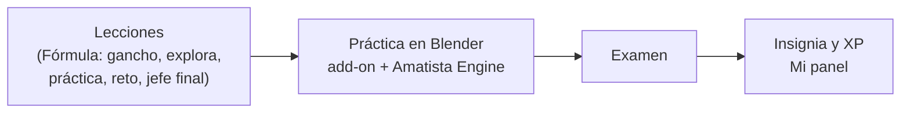

# Amatista 💎

**Plataforma educativa para aprender creación 3D con Blender y llevarla a la web (GLB, A-Frame, WebXR), que sigue funcionando sin conexión.**

El alumno avanza por cursos y módulos en una PWA. Cada módulo termina con una **práctica en Blender** que el motor **Amatista Engine** revisa y acompaña paso a paso dentro de Blender mediante un add-on. El progreso se guarda primero en el dispositivo y se sincroniza con el servidor (FastAPI + Oracle) cuando hay Internet.

> **Local primero, servicios externos después.** El backend, el add-on y el tutor IA amplían la experiencia; ninguno es requisito para estudiar lo que ya se descargó.

**Todo el proyecto en un vistazo:** [índice de la documentación](docs/README.md) · [cronología](docs/historia/01_cronologia.md) · [manual del código](docs/manual-del-codigo/README.md) · [manual del desarrollador](docs/desarrollador/README.md) · [esquema SQL](docs/base-de-datos/README.md) · [tablero](KANBAN.md) · [dirección](PROYECTO.md) · [versiones](CHANGELOG.md)

---

## Contenido

1. [Estado actual](#1-estado-actual)
2. [Cómo llegamos hasta aquí](#2-cómo-llegamos-hasta-aquí)
3. [Qué hace la plataforma](#3-qué-hace-la-plataforma)
4. [Arquitectura](#4-arquitectura)
5. [Estructura del repositorio](#5-estructura-del-repositorio)
6. [Base de datos](#6-base-de-datos)
7. [Tecnologías](#7-tecnologías)
8. [Ejecutar en local](#8-ejecutar-en-local)
9. [Herramientas del desarrollador](#9-herramientas-del-desarrollador)
10. [Cómo se trabaja](#10-cómo-se-trabaja)
11. [Versiones](#11-versiones)
12. [Qué sigue](#12-qué-sigue)
13. [Documentación](#13-documentación)

---

## 1. Estado actual

Al 5 de octubre de 2026 (`main` en `2402549`, con el PR #20 fusionado):

| Frente | Dónde está |
|---|---|
| **Plataforma v2.2** («Plataforma unificada») | En producción con Oracle. El **piloto del 8 de octubre** se hace con ella y **no se toca la VM antes**. |
| **Lo nuevo en `main` (v3, sin desplegar)** | Cursos de Blender por niveles, temáticas por módulo, Motor 3.3, seguridad y rendimiento. Se sube a producción **después del piloto** siguiendo el [plan de despliegue](docs/despliegue/2026-10-05_plan_de_despliegue.md) (fase 1, T-078). |
| **Amatista Engine** | **Motor 3.3** y add-on **Amatista Motor 3.3**: cada práctica trae su modelo de referencia (imagen y plano, «Así se debe ver») y el motor califica que la figura tenga sentido con medidas aproximadas (±35 %); 38 validadores. Etapas 1 a 3 y [modelo de referencia](docs/motor/referencia/10_modelo_de_referencia.md). |
| **Cursos de Blender** | Una tarjeta «Blender» con su árbol de niveles: **Principiante**, **Principiante-Intermedio** e **Intermedio** publicados (3 módulos cada uno, 18 prácticas en Blender) y **Avanzado** bloqueado. Teoría y Blender intercalados; cada módulo cierra con su práctica y un jefe final. [Ruta de aprendizaje](docs/cursos/03_ruta_de_aprendizaje_blender.md). |
| **Temáticas por módulo** | Cada módulo es un mundo (escenario, partículas, colores) con un **personaje original** que camina, sigue el cursor con la mirada, reacciona al tocarlo y acompaña toda la lección. [Herramientas gráficas](docs/plataforma/07_herramientas_graficas.md). |
| **Seguridad y rendimiento** | Auditoría automática (1,449 ataques, 0 hallazgos), informe de rendimiento antes y después, add-on con integridad y marca de agua, PWA sin mapas de fuente. [Auditoría](docs/seguridad/01_auditoria_2026-10-05.md) · [informe](docs/rendimiento/2026-10-05_informe.md) · [protección del código](docs/seguridad/02_proteccion_del_codigo.md). |
| **Dominio** | `amatista-3d.me`. Plan con Cloudflare: PWA en `amatista-3d.me` y API en `api.amatista-3d.me` (T-065), en la fase 2 del plan de despliegue. |
| **Plataforma por módulos** | Estructura fija **Cursos · Mi panel · Admin**. [Documentación](docs/plataforma/README.md). |

Contenido: Blender Principiante, Principiante-Intermedio e Intermedio (9 módulos) y Módulo 1 de A-Frame publicados. Los módulos de Blender de la v2 están en `frontend/src/data/modulos/archivo/`.

## 2. Cómo llegamos hasta aquí

Amatista nació el **27 de septiembre de 2026** y en ocho días pasó de una pantalla de prueba a una plataforma con cuentas, Oracle, panel de administración y un motor de prácticas dentro de Blender.

| Fecha | Etapa | Qué se logró | Tag |
|---|---|---|---|
| 27 sep | Prototipo | Monorepo, App Shell en React + Tailwind y visor A-Frame | `v0.1.0` |
| 27–28 sep | Integración | La PWA habla con FastAPI y Oracle Autonomous; ORA-01400 y CORS resueltos | `v1.0.0` |
| 28–29 sep | Plataforma educativa | Identidad low poly, «Elige tu curso», Módulo 1, lecciones, progreso offline, backend en el repo | `v2.0.0` |
| 1 oct | Repositorio oficial | `Maximiliano-cabello-mata/amatista`, commits firmados con SSH, tablero Kanban | `v2.0.1` |
| 1–2 oct | Plataforma unificada | Cuentas y roles, Oracle para 20 GB, lecciones interactivas, panel del alumno, panel de administración, CI | `v2.2.0-alpha.1`, `alpha.2` |
| 2–3 oct | Producción | Oracle 23ai en la VM: 002, 003, 005 y 006 aplicados (14 tablas) | — |
| 3 oct | Reestructuración v3 | Niveles, habilidades, versiones de Blender, herramientas de autor en Oracle | `v3.0.0-alpha.1` |
| 3 oct | Amatista Engine | Motor de prácticas, add-on de Blender, instalador por sistema, Oracle 007, la práctica de la mesa | `v3.0.0-alpha.2` |
| 3 oct | Motor etapa 2 | Guía paso a paso, acompañante, «Hazlo conmigo», práctica al cierre de cada módulo | `v3.0.0-alpha.3` |
| 4 oct | Documentación completa | Historia, manuales, esquema SQL, este README | `v3.0.0-alpha.4` |
| 4 oct | Motor v3 y plan de estudios | Add-on 3.0 como aula, 2 cursos y 6 prácticas, herramientas de autor, Oracle 008/009, migración portable y dominio `amatista-3d.me` | `v3.0.0-alpha.5` |
| 4 oct | Curso de Blender unificado | Una tarjeta por curso con niveles, Intermedio publicado, jefes finales, medallas y modo claro | `v3.0.0-alpha.6` |
| 4 oct | Temáticas y Motor 3.2 | Un mundo por módulo con su mascota y jefe; las prácticas se registran solas al arrancar | `v3.0.0-alpha.7` |
| 5 oct | Seguridad, rendimiento y Motor 3.3 | Auditoría y rendimiento automáticos, modelo de referencia y figuras con sentido, personajes interactivos, plan de despliegue | `v3.0.0-alpha.8` |

Detalle con hora y commit: [cronología exacta](docs/historia/01_cronologia.md). Cómo se veía la plataforma en cada versión: [la plataforma en cada versión](docs/historia/03_la_plataforma_en_cada_version.md). De dónde salió cada idea: [ideas y cómo se implementaron](docs/historia/02_ideas_y_como_se_implementaron.md).

## 3. Qué hace la plataforma

### Para cada persona

| Rol | Qué hace en Amatista |
|---|---|
| **Alumno** | Elige un curso, recorre la ruta de cada módulo (lecciones interactivas, práctica en Blender, examen) y ve su nivel, racha e insignias en **Mi panel**. Puede estudiar sin cuenta y sin conexión; al crear su cuenta, su progreso local se une a ella. La práctica descarga el add-on, revisa su versión de Blender y vincula su cuenta. |
| **Profesor** | Ve el panel de administración completo en solo lectura: módulos, prácticas, herramientas de enseñanza y alumnos. |
| **Administrador** | Crea módulos con la Fórmula Amatista, edita lecciones con 20 herramientas de enseñanza, publica prácticas de Blender, gestiona usuarios y revisa el estado del sistema y el diagnóstico técnico. |

Detalle por pantalla: [mapa de la plataforma](docs/plataforma/01_mapa_de_la_plataforma.md).

### El recorrido de un módulo



- **20 herramientas de enseñanza** en cuatro categorías: explicar (texto, imagen, video, aviso, código), visualizar (paso a paso, atajos, comparar, tarjetas, línea de tiempo, pipeline, capas), practicar en el navegador (pregunta rápida, ordenar, emparejar, completar, puntos en imagen, explorador 3D, reto de código) y practicar en Blender. [Detalle](docs/plataforma/04_herramientas_de_ensenanza.md).
- **Amatista Engine** lee prácticas declarativas (`amatista.practice/1` y `/2`), comprueba la escena de Blender con 38 validadores, compara la figura con un modelo de referencia (medidas aproximadas, figura con sentido), da pistas, en la etapa 2 guía paso a paso, felicita, avisa y ofrece «Hazlo conmigo», y en la etapa 3 enseña teoría en píldoras con repaso espaciado y pausa el progreso cuando algo se rompe. [Detalle](docs/motor/README.md).

## 4. Arquitectura

```text
            Alumno / Profesor / Admin
                       │
              ┌────────▼────────┐        ┌──────────────────────┐
              │   PWA (React)   │        │ Blender + add-on     │
              │ IndexedDB local │        │ Amatista Engine      │
              └────────┬────────┘        └──────────┬───────────┘
                       │  /api                      │  /api/addon/v1
                       └─────────────┬──────────────┘
                              ┌──────▼──────┐
                              │    Caddy    │  HTTPS
                              └──────┬──────┘
                              ┌──────▼──────┐
                              │   FastAPI   │  systemd en una VM de Oracle Cloud
                              └──────┬──────┘
                              ┌──────▼──────┐
                              │   Oracle    │  Autonomous 23ai (SQLite en desarrollo y pruebas)
                              └─────────────┘
```

Las piezas y cómo se conectan, archivo por archivo: [mapa del repositorio](docs/manual-del-codigo/01_mapa_del_repositorio.md).

## 5. Estructura del repositorio

```text
amatista/
├── frontend/      PWA React 19 + Vite 8 + Tailwind 4 → docs/manual-del-codigo/02_frontend.md
│   └── src/       páginas, lecciones, panel, admin, progreso offline, data/modulos/*.json
├── backend/       API FastAPI → docs/manual-del-codigo/03_backend.md
│   ├── api/       auth, sesiones, progreso, eventos, admin, contenido, niveles, blender, addon
│   ├── database/  conexión y modelos SQLAlchemy
│   ├── sql/       scripts de Oracle 001–009 (orden en sql/LEEME.txt)
│   └── herramientas/  contenido.py, crear_admin.py, migrar.py, auditoria_seguridad.py, rendimiento.py, verificar_licencia.py
├── engine/        Amatista Engine, Python puro → docs/manual-del-codigo/04_motor_addon_y_practicas.md
├── addon/         add-on de Blender, constructor del .zip e instaladores por sistema
├── practices/     18 prácticas de Blender con su modelo de referencia, temas.json (mundos y personajes)
├── despliegue/    unidad systemd, Caddyfile y actualizar.sh
├── herramientas/  crear-tags.sh
├── tablero/       generador del Kanban (tareas.yml → KANBAN.md) e histórico de la v2
├── ai_tutor/      prompts del tutor IA (reservado)
├── docs/          documentación por secciones → docs/README.md
├── PROYECTO.md    centro de dirección: qué sigue y por qué
├── KANBAN.md      tablero generado (no se edita a mano)
└── CHANGELOG.md   qué trajo cada versión
```

## 6. Base de datos

Oracle Autonomous Database 23ai en producción (esquema `ADMIN`); SQLite en desarrollo y en todas las pruebas. Los scripts de `backend/sql/` son aditivos y se ejecutan a mano en Database Actions en el orden de [`backend/sql/LEEME.txt`](backend/sql/LEEME.txt). Nunca se ejecuta `001` sobre una base con datos (borra las tablas).

| Script | Qué agrega |
|---|---|
| `001` | Esquema inicial (instalación desde cero) |
| `002` | Autenticación, contenido y eventos |
| `003` | Mantenimiento (purga) |
| `004` | Usuario de aplicación `AMATISTA_APP` (opcional) |
| `005` | Niveles, habilidades, rúbrica y versiones de Blender |
| `006` | Vistas y paquete `AMATISTA_AUTOR` para autores |
| `007` | Motor de prácticas: con él son **18 tablas** |
| `008` | Cursos por ruta: `CURSOS.RUTA` y `CURSOS.REQUISITO_ID` |
| `009` | Archiva el curso `blender` de la v2 (no borra el progreso) |

Producción: 002, 003, 005 y 006 aplicados (14 tablas); 007, 008 y 009 después del piloto (T-055, T-064). Para cambiar de base algún día, `backend/herramientas/migrar.py` exporta e importa en JSONL y genera el esquema para PostgreSQL ([migración](docs/base-de-datos/03_migracion.md)). `backend/diagnostico_oracle.py` compara las tablas reales con las que espera el backend. Diagrama entidad-relación y cada columna: [esquema SQL](docs/base-de-datos/esquema.md).

## 7. Tecnologías

| Capa | Herramientas |
|---|---|
| PWA | React 19, Vite 8, Tailwind CSS 4, vite-plugin-pwa, IndexedDB, A-Frame 1.8, Vitest, ESLint |
| API | FastAPI, Uvicorn, SQLAlchemy 2, python-oracledb, PBKDF2, SMTP, pytest |
| Datos | Oracle Autonomous Database 23ai, SQLite, PL/SQL (`AMATISTA_AUTOR`) |
| Blender | Blender 4.2+ (extensión, probada en 4.2 y 5.0), add-on Amatista Motor 3.3.0, Amatista Engine (Python puro); `bpy` para generar las imágenes de referencia |
| Servidor | VM de Oracle Cloud, systemd, Caddy y Cloudflare (HTTPS con certificado de origen) |
| Proceso | GitHub, GitHub Actions (CI y tablero), commits firmados con SSH |

Para qué sirve cada una y dónde está: [herramientas que usa la plataforma](docs/herramientas-de-la-plataforma.md).

## 8. Ejecutar en local

Requisitos: Node.js 22, npm, Python 3.12 y Git.

```bash
git clone https://github.com/Maximiliano-cabello-mata/amatista.git
cd amatista

# Backend con SQLite (sin Oracle)
cd backend
python3 -m venv venv && source venv/bin/activate
pip install -r requirements-dev.txt
DATABASE_URL=sqlite:///./amatista_local.db AMATISTA_MOSTRAR_CODIGOS=1 uvicorn main:app --reload

# Frontend, en otra terminal
cd frontend
cp .env.example .env        # VITE_API_URL=http://localhost:8000
npm install
npm run dev
```

> Con `frontend/.env` (`VITE_API_URL=http://localhost:8000`) la PWA usa tu backend local. Sin él, usa el servidor de producción escrito en `frontend/src/services/api.js`, también en `localhost`.

Para tener un administrador: desde `backend/`, `DATABASE_URL=sqlite:///./amatista_local.db python herramientas/crear_admin.py tu-correo@ejemplo.com --crear` (crea la cuenta y pide la contraseña), o pon `AMATISTA_ADMINS=tu-correo@ejemplo.com` antes de registrarte. Variables de entorno: `backend/.env.example`, `frontend/.env.example` y `.env.example`. Nunca se suben contraseñas, wallets, tokens ni archivos `.env` reales.

Comprobaciones (las mismas que corre CI):

```bash
cd backend && python -m pytest -q && python herramientas/contenido.py validar && cd ..
cd frontend && npm run lint && npm test && npm run build && cd ..
python -m pytest -q tablero engine/tests addon/tests
```

Paso a paso: [entorno local](docs/desarrollador/01_entorno_local.md). Servidor: [plan de despliegue](docs/despliegue/2026-10-05_plan_de_despliegue.md).

## 9. Herramientas del desarrollador

| Herramienta | Para qué |
|---|---|
| `backend/herramientas/contenido.py` | Validar, importar, exportar y crear módulos y lecciones; niveles; publicar prácticas |
| `backend/herramientas/crear_admin.py` | Dar el rol de administrador a una cuenta |
| `backend/diagnostico_oracle.py` | Comparar las tablas de Oracle con el backend |
| `engine/herramientas/practicas.py` | Crear, revisar, probar y simular prácticas sin Blender; mapa del plan de estudios |
| `engine/demo.py` | Probar el motor sin Blender |
| `engine/herramientas/referencias.py` | Construir en Blender (bpy) el modelo de referencia de cada práctica y generar su imagen y su plano |
| `backend/herramientas/auditoria_seguridad.py` | Atacar todas las rutas de la API (inyección SQL, XSS, permisos, fuerza bruta) y reportar hallazgos |
| `backend/herramientas/rendimiento.py` y `frontend/scripts/rendimiento.mjs` | Medir el backend con alumnos simultáneos y la web en computadora y teléfono |
| `backend/herramientas/verificar_licencia.py` | Saber de qué cuenta salió una copia del add-on |
| `backend/herramientas/migrar.py` | Respaldo JSONL, carga en otra base y esquema para PostgreSQL |
| `addon/herramientas/construir.py` | Construir el `.zip` del add-on y los paquetes por sistema |
| `tablero/actualizar.py` | Regenerar `KANBAN.md` |
| `herramientas/crear-tags.sh` | Crear los tags de versión |
| `despliegue/actualizar.sh` | Actualizar la API en la VM con prueba de salud y reversión |
| Admin › Estado › Diagnóstico técnico | Revisar backend, base de datos y visor 3D desde la PWA |
| Modo Desarrollador del add-on (Amatista Author) | Crear y probar prácticas dentro de Blender |

Todas, con cada opción y ejemplos: [manual del desarrollador](docs/desarrollador/README.md).

## 10. Cómo se trabaja

- **Ramas**: `main` más una sola rama de trabajo a la vez; todo entra por PR y Maximiliano decide cada fusión.
- **Commits**: `type(scope): descripción` ([convención](docs/guias/2026-09-27_convencion_commits.txt)), firmados con SSH.
- **Tareas**: [`tablero/tareas.yml`](tablero/tareas.yml); las tarjetas se mueven con los commits (`T-xxx`, `cierra T-xxx`) y [KANBAN.md](KANBAN.md) se regenera solo.
- **Bitácora**: cada sesión deja su registro en [`docs/bitacora/`](docs/bitacora/); las fallas, en el [registro de incidencias](docs/incidencias/README.md).
- **Base de datos**: cambios de esquema solo con scripts nuevos y aditivos (`010` en adelante), ejecutados antes del código que los necesita.

Flujo completo y checklist antes de un PR: [flujo de trabajo](docs/desarrollador/05_flujo_de_trabajo.md).

## 11. Versiones

Tags `v*` con `bash herramientas/crear-tags.sh` desde la computadora de Maximiliano (la nube no puede publicar tags). Publicados: `v0.1.0`, `v1.0.0`, `v2.0.0`, `v2.0.1`, `v2.2.0-alpha.1`. Preparados en el script: `v2.2.0-alpha.2` y `v3.0.0-alpha.1` a `v3.0.0-alpha.8` (este último, `main` al 5 de octubre). Qué trajo cada una: [CHANGELOG.md](CHANGELOG.md).

## 12. Qué sigue

1. **Piloto del 8 de octubre** con la v2.2, sin tocar la VM antes. Antes solo lo que no toca el servidor: Cloudflare, PWA en Cloudflare Pages, secreto de firma, tags ([plan, fase 0](docs/despliegue/2026-10-05_plan_de_despliegue.md#fase-0-preparar-sin-tocar-la-vm-hasta-el-7-de-octubre)).
2. **Después del piloto**: subir `main` y el Motor 3.3 a Oracle (T-078), HTTPS con el dominio (T-065), SMTP (T-032), proteger producción y hacer privado el repositorio (T-079), instalador en Windows y Mac reales (T-056) y el add-on con alumnos (T-066).
3. **Siguiente versión**: examen final calificado por el servidor (T-083), portada más ligera en teléfono (T-080), varias aulas a la vez (T-081), curso Avanzado (T-067).
4. **Más adelante**: «Mi primer espacio 3D», laboratorio GLB, especialidades y un tutor IA local (Ollama) como capa opcional.

Las ideas grandes entran primero como propuesta fechada en [`docs/propuestas/`](docs/propuestas/). Orden vigente y razones: [PROYECTO.md](PROYECTO.md).

## 13. Documentación

| Sección | Qué encuentras |
|---|---|
| [Historia](docs/historia/README.md) | Cronología exacta, ideas y cómo se implementaron, la plataforma en cada versión |
| [Plataforma](docs/plataforma/README.md) | Qué ve cada rol, módulos con práctica, etiquetas, herramientas de enseñanza, panel |
| [Amatista Engine](docs/motor/README.md) | Etapas del motor y referencia técnica del add-on |
| [Manual del código](docs/manual-del-codigo/README.md) | Frontend, backend, motor y add-on explicados con recetas |
| [Manual del desarrollador](docs/desarrollador/README.md) | Entorno, herramientas, pruebas, CI y flujo de trabajo |
| [Base de datos](docs/base-de-datos/README.md) | Esquema SQL completo y diagrama entidad-relación |
| [Herramientas de la plataforma](docs/herramientas-de-la-plataforma.md) | Tecnologías y servicios |
| [Despliegue](docs/despliegue/2026-10-05_plan_de_despliegue.md) | Plan por fases, servidor, HTTPS y actualizaciones |
| [Seguridad](docs/seguridad/01_auditoria_2026-10-05.md) y [rendimiento](docs/rendimiento/2026-10-05_informe.md) | Auditoría, protección del código e informe de rendimiento |
| [Dirección](docs/reestructuracion/00_plan_maestro.md) | Plan maestro, arquitectura, propuestas, lanzamiento |
| [Registros](docs/bitacora/) | Bitácora de cada sesión e incidencias |

## Licencia

La plataforma todavía no tiene licencia definida (decisión pendiente de Maximiliano); cuando se elija, se agrega como `LICENSE` en la raíz. El add-on de Blender (`addon/`) se declara GPL-3.0-or-later en su manifiesto porque usa `bpy`.
