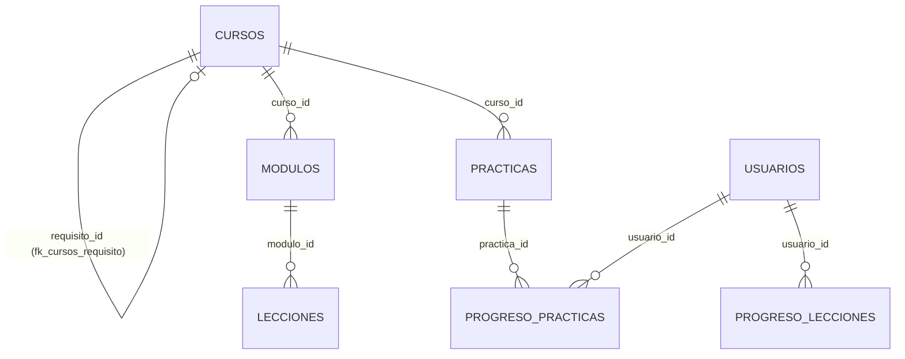

# Base de datos en el motor v3: rediseño y optimización

Qué cambia en la base con el motor v3 y el plan de estudios por cursos, qué se revisó para optimizarla y qué reglas la dejan lista para cambiar de motor. Para quien mantiene el backend o aplica scripts en Oracle.

Actualizado: 4 de octubre de 2026 (rama `claude/motor-v3-plan-estudios-ankwl7`)

## Índice

1. [En una frase](#1-en-una-frase)
2. [El modelo de cursos del plan v3](#2-el-modelo-de-cursos-del-plan-v3)
3. [Scripts nuevos: 008 y 009](#3-scripts-nuevos-008-y-009)
4. [Qué se revisó y qué se decidió no hacer](#4-qué-se-revisó-y-qué-se-decidió-no-hacer)
5. [Optimización: índices, espacio y consultas](#5-optimización-índices-espacio-y-consultas)
6. [Reglas de portabilidad (pensada para migrar)](#6-reglas-de-portabilidad-pensada-para-migrar)
7. [Dónde sigue](#7-dónde-sigue)

---

## 1. En una frase

El esquema de 18 tablas se queda: el plan v3 cabe en él con **dos columnas nuevas en CURSOS** (008) y **un cambio de estado** del curso viejo (009). Lo nuevo de verdad es la herramienta para migrar a otra base sin depender de Oracle ([03_migracion.md](03_migracion.md)).

## 2. El modelo de cursos del plan v3

El plan de estudios de Blender ([`plan_de_estudios_blender.txt`](../cursos/plan_de_estudios_blender.txt)) se reparte en cuatro cursos seguidos. Cada curso tiene 3 módulos, y cada módulo tiene teoría en la plataforma y termina con una práctica guiada dentro de Blender.

| Curso (CURSOS.ID) | Ruta | Requisito | Estado | Módulos |
|---|---|---|---|---|
| `blender_principiante` | `blender` | — | publicado | 3 (tren, espada, nave) |
| `blender_principiante_intermedio` | `blender` | `blender_principiante` | publicado | 3 (pinta la nave, tres puntos, pelota) |
| `blender_intermedio` | `blender` | `blender_principiante_intermedio` (en `cursos.json`) | próximamente (solo en la PWA y el add-on, sin fila en la base) | — |
| `blender_avanzado` | `blender` | `blender_intermedio` (en `cursos.json`) | próximamente (solo en la PWA y el add-on, sin fila en la base) | — |
| `blender` (v2) | `blender` | — | **archivado** (009) | 3 (los de la v2) |
| `aframe` | `aframe` | — | publicado | — |

- **RUTA** agrupa los cursos de un mismo tema. La PWA ya tiene el mismo campo (`ruta: 'blender'` en `frontend/src/data/cursos.js`).
- **REQUISITO_ID** dice qué curso conviene terminar antes. El backend lo informa en el catálogo (`"requisito"`) y en el panel de admin, pero no impide abrir un curso: el orden lo sugieren el mapa de cursos del add-on (`practices/blender/cursos.json` › `requires`) y la PWA.
- Cada práctica ya sabe a qué curso y módulo pertenece (`practice.json` › `course`), y `PRACTICAS.CURSO_ID` / `LECCION_ID` la enlazan con la lección `bpN_practica`. Eso no cambia.

## 3. Scripts nuevos: 008 y 009

| Script | Qué hace | Cuándo | ¿Borra algo? |
|---|---|---|---|
| [`008_cursos_por_ruta.sql`](../../backend/sql/008_cursos_por_ruta.sql) | `CURSOS.RUTA` y `CURSOS.REQUISITO_ID` (llave foránea a CURSOS, CHECK para que un curso no se pida a sí mismo), llena RUTA en los cursos existentes y trae la verificación vigente de las 18 tablas (CURSOS pasa de 12 a 14 columnas). | Después del piloto, junto con 007. El backend anterior ignora las columnas, así que el orden con el código no importa. | No |
| [`009_archivar_blender_v2.sql`](../../backend/sql/009_archivar_blender_v2.sql) | Pasa a `archivado` el curso `blender` de la v2, sus niveles y módulos, y las prácticas `blender.n1.*` (mesa, podio). Se detiene si `blender_principiante` no está publicado todavía. Trae comentados los UPDATE para deshacerlo. | Después de importar los cursos nuevos (`herramientas/contenido.py importar`). | No: progreso, insignias y eventos quedan intactos |

Lo mismo está en los tres lugares que exige `sql/LEEME.txt` (regla 6): `database/modelos.py` (`Curso.ruta`, `Curso.requisito_id`), el script y `ESPERADO` de `diagnostico_oracle.py`. `diagnostico_oracle.py` ya sabe recomendar 008 cuando solo faltan esas columnas, y «007 y luego 008» en el estado actual de producción (14 tablas). `tests/test_esquema.py` revisa que la verificación de 008 cuente bien las columnas.

El paso a paso para aplicarlos está en [02_manual_008_009.md](02_manual_008_009.md).

## 4. Qué se revisó y qué se decidió no hacer

| Idea | Decisión | Por qué |
|---|---|---|
| Tabla `RUTAS` (id, título, portada) | **No por ahora.** RUTA es una columna. | Hoy hay dos rutas y nada más que decir de ellas: una tabla sería un JOIN más en el catálogo sin dato nuevo. Si algún día una ruta necesita título o portada, `CURSOS.RUTA` ya es su id: se crea la tabla y se agrega la llave foránea sin mover datos. |
| Tabla `INSCRIPCIONES` (alumno ↔ curso) | **No.** | En Amatista uno no se inscribe: abre el curso. El avance ya dice en qué curso está cada alumno (`PROGRESO_LECCIONES.CURSO_ID`, `PROGRESO_PRACTICAS`). |
| Repaso espaciado en el servidor (`REPASOS_PILDORAS`) | **Futuro** (tarea en el tablero). | El add-on 3.0 guarda el repaso en `avance.json` de la computadora del alumno. Llevarlo a la base solo tiene sentido cuando un alumno use dos computadoras; antes sería una tabla sin lector. La forma propuesta: (usuario_id, item, caja, vence_en), PK (usuario_id, item), 1 fila por píldora con pregunta (~40 por curso, ~60 bytes cada una). |
| Columna `DIFICULTAD` en CURSOS | **No.** | `CURSOS.NIVEL` ya guarda «Principiante», «Principiante-Intermedio»… y el orden lo da `ORDEN`. |
| Borrar el curso v2 | **No: se archiva** (009). | La regla 2 de `LEEME.txt` prohíbe borrar datos de alumnos, y quien avanzó en la v2 conserva su progreso e insignias. |

## 5. Optimización: índices, espacio y consultas

Se revisaron las consultas reales del backend (`api/*.py`). Para cada filtro frecuente se comprobó que exista un índice que lo cubra:

| Filtro (veces en `api/`) | Índice que lo cubre |
|---|---|
| `ProgresoLeccion.usuario_id` (5) | PK `(usuario_id, curso_id, leccion_id)`: prefijo |
| `Logro.usuario_id` (5) | PK `(usuario_id, insignia_id)`: prefijo |
| `ProgresoPractica.usuario_id` (4) | PK `(usuario_id, practica_id)`: prefijo |
| `Nivel.curso_id` (4) | `uq_niveles_curso_numero_rama`: prefijo |
| `Curso.estado` (4) | Ninguno, y no hace falta: CURSOS tiene menos de 10 filas y cabe en un bloque |
| `Leccion.modulo_id` / `curso_id` (3 + 3) | `ix_lecciones_modulo (modulo_id, orden)` y la PK |
| `EventoAprendizaje.usuario_id` (3) | `ix_eventos_usuario_fecha` |
| `Sesion.usuario_id` (2) | `ix_sesiones_usuario` |
| `AddonVinculo.codigo` (2) | `uq_vinculos_codigo` |
| `ProgresoPractica.practica_id` (1) | `ix_prog_practicas_practica` |

Conclusión: **no falta ningún índice** y no se agrega ninguno (la regla 8 de `LEEME.txt` pide índices solo para consultas reales). 008 suma dos columnas cortas a una tabla de menos de 10 filas, así que el espacio no cambia: siguen ~32 KB permanentes por alumno, y los 20 GB alcanzan para más de 150,000 alumnos (cálculo en el encabezado de 007).

## 6. Reglas de portabilidad (pensada para migrar)

El esquema ya se diseñó para no casarse con Oracle. Estas reglas lo mantienen así (se suman a las de `sql/LEEME.txt`):

1. **Ids de texto, nunca secuencias.** Todas las llaves son VARCHAR2 generadas por la aplicación (UUID, `alumno-<uuid>`, `blender.bp.m1.tren`). No hay `SEQUENCE`, `IDENTITY` ni triggers que generen valores: un respaldo se puede cargar en cualquier motor sin reajustar contadores.
2. **Tipos ANSI.** Solo VARCHAR2 (varchar), NUMBER entero (integer), TIMESTAMP sin zona en UTC y CLOB (text). Nada de `DATE` con hora escondida, `RAW`, `XMLTYPE` ni objetos.
3. **JSON como texto.** Las columnas JSON son texto con `CHECK (... IS JSON)`. En otro motor son `text` (o `jsonb` en PostgreSQL), y `TextoJSON` en `modelos.py` hace que el código vea siempre el mismo texto.
4. **La lógica vive en Python.** El backend solo usa SQLAlchemy (el único SQL de texto es el `ALTER SESSION` de `conexion.py`, que corre solo en Oracle). Lo que existe en PL/SQL es opcional y tiene su equivalente:

   | Objeto de Oracle | Para qué | Equivalente fuera de Oracle |
   |---|---|---|
   | Partición mensual de `EVENTOS_APRENDIZAJE` | Purgar meses completos | Partición declarativa de PostgreSQL, o un `DELETE` por fecha |
   | Job `AMATISTA_PURGA_DIARIA` y `AMATISTA_PURGAR` | Retención de sesiones y eventos | `pg_cron` o un timer de systemd con un `DELETE` |
   | Paquete `AMATISTA_AUTOR` (006) | Crear contenido desde Database Actions | `herramientas/contenido.py` (ya hace lo mismo desde la terminal) |
   | Vistas `V_AMATISTA_*` | Revisar desde Database Actions | Mismas consultas; el panel de admin ya da casi todo |

5. **`modelos.py` es la fuente de verdad.** De él salen el diagnóstico, las pruebas de esquema y el DDL para otros motores (`herramientas/migrar.py ddl`). El archivo [`esquema_postgresql.sql`](esquema_postgresql.sql) se genera de ahí, y una prueba (`tests/test_migrar.py`) falla si queda atrasado.
6. **Los valores permitidos son constantes de Python** (`ROLES`, `ESTADOS_CONTENIDO`…). Los CHECK de Oracle y los del DDL generado salen de las mismas listas.

## 7. Dónde sigue

- Aplicar 008 y 009 en producción, paso a paso: [02_manual_008_009.md](02_manual_008_009.md).
- Cambiar de base de datos: [03_migracion.md](03_migracion.md).
- El esquema completo, tabla por tabla: [esquema.md](esquema.md).
