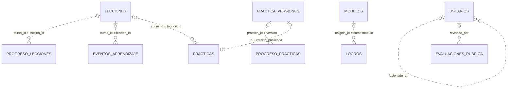

# Esquema de la base de datos de Amatista

Referencia completa del esquema Oracle de Amatista tras aplicar los scripts 001→007: tablas, columnas, llaves, índices, restricciones, vistas, PL/SQL, usuario de aplicación y columnas JSON, con el modelo SQLAlchemy que mapea cada tabla. Para quien programa el backend o administra la base.

Actualizado: 4 de octubre de 2026 (main en c730c0e)

Todo sale de [`backend/sql/`](../../backend/sql/) (001 a 007) y de [`backend/database/modelos.py`](../../backend/database/modelos.py). El resumen, el orden de los scripts y el estado en producción están en el [README de esta carpeta](README.md). La versión en un solo archivo SQL (solo para leer) está en [`esquema_completo.sql`](esquema_completo.sql).

## Índice

1. [Diagrama entidad-relación](#1-diagrama-entidad-relación)
2. [Convenciones del esquema](#2-convenciones-del-esquema)
3. [Diferencias generales entre el SQL y los modelos](#3-diferencias-generales-entre-el-sql-y-los-modelos)
4. [Tablas](#4-tablas)
   - Identidad: [USUARIOS](#41-usuarios) · [SESIONES](#42-sesiones)
   - Progreso: [PROGRESO_LECCIONES](#43-progreso_lecciones) · [LOGROS](#44-logros) · [EVENTOS_APRENDIZAJE](#45-eventos_aprendizaje)
   - Contenido: [CURSOS](#46-cursos) · [NIVELES](#47-niveles) · [MODULOS](#48-modulos) · [LECCIONES](#49-lecciones)
   - Reestructuración v3: [HABILIDADES](#410-habilidades) · [HABILIDADES_ALUMNO](#411-habilidades_alumno) · [EVALUACIONES_RUBRICA](#412-evaluaciones_rubrica) · [VERSIONES_BLENDER](#413-versiones_blender) · [VERIFICACIONES_BLENDER](#414-verificaciones_blender)
   - Motor de prácticas: [ADDON_VINCULOS](#415-addon_vinculos) · [PRACTICAS](#416-practicas) · [PRACTICA_VERSIONES](#417-practica_versiones) · [PROGRESO_PRACTICAS](#418-progreso_practicas)
5. [Índices y restricciones: resumen](#5-índices-y-restricciones-resumen)
6. [Vistas](#6-vistas)
7. [Paquete AMATISTA_AUTOR](#7-paquete-amatista_autor)
8. [Mantenimiento: AMATISTA_PURGAR y el job diario](#8-mantenimiento-amatista_purgar-y-el-job-diario)
9. [Usuario de aplicación AMATISTA_APP](#9-usuario-de-aplicación-amatista_app)
10. [Secuencias, triggers y otros objetos](#10-secuencias-triggers-y-otros-objetos)
11. [Columnas JSON](#11-columnas-json)

---

## 1. Diagrama entidad-relación

Las 18 tablas y las **24 llaves foráneas declaradas** en los scripts. Los tipos se escriben sin largo porque Mermaid no admite paréntesis (los largos están en cada tabla, sección 4). `PK` = llave primaria, `FK` = llave foránea, `UK` = UNIQUE.

```mermaid
erDiagram
    USUARIOS ||--o{ SESIONES : "fk_sesiones_usuario"
    USUARIOS ||--o{ PROGRESO_LECCIONES : "fk_progreso_usuario"
    USUARIOS ||--o{ LOGROS : "fk_logros_usuario"
    USUARIOS ||--o{ EVENTOS_APRENDIZAJE : "fk_eventos_usuario"
    CURSOS ||--o{ MODULOS : "fk_modulos_curso"
    NIVELES |o--o{ MODULOS : "fk_modulos_nivel"
    CURSOS ||--o{ LECCIONES : "fk_lecciones_curso"
    MODULOS ||--o{ LECCIONES : "fk_lecciones_modulo"
    CURSOS ||--o{ NIVELES : "fk_niveles_curso"
    CURSOS ||--o{ HABILIDADES : "fk_habilidades_curso"
    NIVELES |o--o{ HABILIDADES : "fk_habilidades_nivel"
    USUARIOS ||--o{ HABILIDADES_ALUMNO : "fk_hab_alumno_usuario"
    HABILIDADES ||--o{ HABILIDADES_ALUMNO : "fk_hab_alumno_habilidad"
    USUARIOS ||--o{ EVALUACIONES_RUBRICA : "fk_rubrica_usuario"
    NIVELES ||--o{ EVALUACIONES_RUBRICA : "fk_rubrica_nivel"
    LECCIONES ||--o{ VERIFICACIONES_BLENDER : "fk_verificaciones_leccion"
    VERSIONES_BLENDER ||--o{ VERIFICACIONES_BLENDER : "fk_verificaciones_version"
    USUARIOS |o--o{ ADDON_VINCULOS : "fk_vinculos_usuario"
    CURSOS |o--o{ PRACTICAS : "fk_practicas_curso"
    USUARIOS |o--o{ PRACTICAS : "fk_practicas_autor"
    PRACTICAS ||--o{ PRACTICA_VERSIONES : "fk_prac_versiones_practica"
    USUARIOS |o--o{ PRACTICA_VERSIONES : "fk_prac_versiones_autor"
    USUARIOS ||--o{ PROGRESO_PRACTICAS : "fk_prog_practicas_usuario"
    PRACTICAS ||--o{ PROGRESO_PRACTICAS : "fk_prog_practicas_practica"

    USUARIOS {
        VARCHAR2 id PK
        VARCHAR2 nombre
        VARCHAR2 email UK
        VARCHAR2 telefono
        VARCHAR2 rol
        VARCHAR2 password_hash
        NUMBER correo_confirmado
        VARCHAR2 codigo_verificacion
        VARCHAR2 codigo_proposito
        TIMESTAMP codigo_expira
        NUMBER codigo_intentos
        NUMBER intentos_fallidos
        TIMESTAMP bloqueado_hasta
        NUMBER es_prueba
        VARCHAR2 fusionado_en
        TIMESTAMP creado_en
        TIMESTAMP ultimo_acceso
    }
    SESIONES {
        VARCHAR2 id PK "hash SHA-256 del token"
        VARCHAR2 usuario_id FK
        VARCHAR2 dispositivo
        NUMBER activa
        TIMESTAMP creado_en
        TIMESTAMP ultimo_acceso
        TIMESTAMP expira_en
    }
    PROGRESO_LECCIONES {
        VARCHAR2 usuario_id PK, FK
        VARCHAR2 curso_id PK
        VARCHAR2 leccion_id PK
        NUMBER completada
        NUMBER puntaje
        NUMBER intentos
        VARCHAR2 datos_ligeros "IS JSON"
        TIMESTAMP completada_en
        TIMESTAMP actualizado_en
    }
    LOGROS {
        VARCHAR2 usuario_id PK, FK
        VARCHAR2 insignia_id PK
        TIMESTAMP obtenido_en
    }
    EVENTOS_APRENDIZAJE {
        VARCHAR2 id PK
        VARCHAR2 usuario_id FK
        VARCHAR2 tipo
        VARCHAR2 curso_id
        VARCHAR2 leccion_id
        VARCHAR2 sesion_aprendizaje
        TIMESTAMP ocurrido_en "llave de particion"
        TIMESTAMP recibido_en
        VARCHAR2 version_app
        NUMBER es_prueba
        VARCHAR2 datos
    }
    CURSOS {
        VARCHAR2 id PK
        VARCHAR2 numero
        VARCHAR2 titulo
        VARCHAR2 subtitulo
        VARCHAR2 descripcion
        VARCHAR2 nivel
        VARCHAR2 acento
        VARCHAR2 recurso_texto
        VARCHAR2 recurso_url
        NUMBER orden
        VARCHAR2 estado
        TIMESTAMP actualizado_en
    }
    NIVELES {
        VARCHAR2 id PK
        VARCHAR2 curso_id FK, UK
        NUMBER numero UK
        VARCHAR2 rama UK
        VARCHAR2 titulo
        VARCHAR2 perfil
        VARCHAR2 proyecto
        VARCHAR2 criterio_salida
        VARCHAR2 estado
        TIMESTAMP actualizado_en
    }
    MODULOS {
        VARCHAR2 id PK
        VARCHAR2 curso_id FK
        NUMBER numero
        VARCHAR2 titulo
        VARCHAR2 descripcion
        VARCHAR2 insignia
        NUMBER minutos
        VARCHAR2 estado
        NUMBER version
        TIMESTAMP actualizado_en
        TIMESTAMP publicado_en
        VARCHAR2 nivel_id FK
    }
    LECCIONES {
        VARCHAR2 curso_id PK, FK
        VARCHAR2 id PK
        VARCHAR2 modulo_id FK
        NUMBER orden
        VARCHAR2 titulo
        VARCHAR2 tipo
        NUMBER duracion_segundos
        NUMBER bloqueada
        CLOB contenido "IS JSON"
        VARCHAR2 reemplaza
        VARCHAR2 estado
        NUMBER version
        TIMESTAMP actualizado_en
        TIMESTAMP publicado_en
    }
    HABILIDADES {
        VARCHAR2 id PK
        VARCHAR2 curso_id FK
        VARCHAR2 nivel_id FK
        VARCHAR2 nombre
        VARCHAR2 descripcion
        NUMBER orden
        TIMESTAMP actualizado_en
    }
    HABILIDADES_ALUMNO {
        VARCHAR2 usuario_id PK, FK
        VARCHAR2 habilidad_id PK, FK
        VARCHAR2 estado
        VARCHAR2 evidencia
        TIMESTAMP actualizado_en
    }
    EVALUACIONES_RUBRICA {
        VARCHAR2 usuario_id PK, FK
        VARCHAR2 nivel_id PK, FK
        VARCHAR2 criterio PK
        VARCHAR2 logro
        VARCHAR2 evidencia
        VARCHAR2 comentario
        VARCHAR2 revisado_por
        TIMESTAMP actualizado_en
    }
    VERSIONES_BLENDER {
        VARCHAR2 version PK
        VARCHAR2 categoria
        NUMBER es_lts
        TIMESTAMP soporte_hasta
        VARCHAR2 notas
        TIMESTAMP actualizado_en
    }
    VERIFICACIONES_BLENDER {
        VARCHAR2 id PK
        VARCHAR2 curso_id FK
        VARCHAR2 leccion_id FK
        VARCHAR2 version_blender FK
        VARCHAR2 sistema
        NUMBER version_leccion
        VARCHAR2 version_addon
        VARCHAR2 resultado
        VARCHAR2 diferencias
        VARCHAR2 evidencia
        VARCHAR2 responsable
        TIMESTAMP verificado_en
    }
    ADDON_VINCULOS {
        VARCHAR2 id PK
        VARCHAR2 codigo UK
        VARCHAR2 secreto_hash
        VARCHAR2 usuario_id FK
        VARCHAR2 dispositivo
        VARCHAR2 estado
        TIMESTAMP creado_en
        TIMESTAMP expira_en
    }
    PRACTICAS {
        VARCHAR2 id PK
        VARCHAR2 curso_id FK
        VARCHAR2 leccion_id
        VARCHAR2 titulo
        NUMBER nivel
        NUMBER version
        NUMBER version_publicada
        CLOB definicion "IS JSON"
        VARCHAR2 estado
        VARCHAR2 origen
        VARCHAR2 autor_id FK
        TIMESTAMP actualizado_en
        TIMESTAMP publicado_en
    }
    PRACTICA_VERSIONES {
        VARCHAR2 practica_id PK, FK
        NUMBER version PK
        CLOB definicion "IS JSON"
        VARCHAR2 huella
        VARCHAR2 nota
        VARCHAR2 autor_id FK
        VARCHAR2 version_addon
        VARCHAR2 version_blender
        TIMESTAMP creado_en
    }
    PROGRESO_PRACTICAS {
        VARCHAR2 usuario_id PK, FK
        VARCHAR2 practica_id PK, FK
        NUMBER version
        NUMBER progreso
        NUMBER completada
        VARCHAR2 autonomia
        NUMBER pistas
        NUMBER correcciones
        NUMBER intentos
        VARCHAR2 paso_actual
        VARCHAR2 objetivos "IS JSON"
        VARCHAR2 version_blender
        VARCHAR2 version_addon
        TIMESTAMP abierta_en
        TIMESTAMP completada_en
        TIMESTAMP actualizado_en
    }
```



`|o--o{` marca una FK sobre una columna anulable (la fila hija puede no tener padre). `FK_VERIFICACIONES_LECCION` es compuesta: `(curso_id, leccion_id)` → `LECCIONES (curso_id, id)`.

### Referencias lógicas sin llave foránea

Estas columnas apuntan a otra tabla por convención, pero **ningún script declara la FK** (a propósito, para no bloquear borrados o porque el dato puede venir de un dispositivo antes que el contenido):



## 2. Convenciones del esquema

Reglas que los scripts declaran en sus encabezados y en [`backend/sql/LEEME.txt`](../../backend/sql/LEEME.txt):

- **Ids de texto.** Todos los identificadores son `VARCHAR2`: caben correos y UUID y las FK tienen el mismo tipo en ambos lados (evita ORA-01722 y ORA-02267). Ids de usuario: `VARCHAR2(100)`; de curso, módulo, lección, nivel y habilidad: `VARCHAR2(50)`; de práctica: `VARCHAR2(80)`; UUID: `VARCHAR2(36)`.
- **Nombres sin comillas**: Oracle los guarda en mayúsculas.
- **Textos para personas en `CHAR`** (`VARCHAR2(n CHAR)`): los acentos no restan espacio al límite. Ids, códigos y hashes van en `BYTE` (el valor por omisión).
- **Booleanos** como `NUMBER(1)` con `CHECK (col IN (0, 1))`.
- **Fechas** como `TIMESTAMP` sin zona, en UTC. El backend siempre envía el valor (`ahora()` en `modelos.py`, `datetime.now(timezone.utc)` sin `tzinfo`) y el paquete `AMATISTA_AUTOR` usa `SYS_EXTRACT_UTC(SYSTIMESTAMP)`. El `DEFAULT SYSTIMESTAMP` de las tablas solo actúa en inserciones que omiten la columna (por ejemplo el `MERGE` de habilidades de 007) y usa la zona del servidor.
- **Estados con CHECK** de lista cerrada; las mismas listas son constantes en `modelos.py` (`ROLES`, `ESTADOS_CONTENIDO`, `TIPOS_EVENTO`, `NUMEROS_NIVEL`, `ESTADOS_HABILIDAD`, `CRITERIOS_RUBRICA`, `LOGROS_RUBRICA`, `CATEGORIAS_BLENDER`, `RESULTADOS_VERIFICACION`, `ESTADOS_VINCULO`, `ORIGENES_PRACTICA`) y `backend/tests/test_esquema.py` comprueba que coincidan.
- **Índices** solo si una consulta los necesita y nunca sobre columnas que ya son PRIMARY KEY o UNIQUE («regla 2»).
- **Nada binario** en la base: solo texto y JSON compacto.
- **Restricciones con nombre** (`PK_`, `FK_`, `UQ_`, `CK_`), salvo los NOT NULL, que Oracle nombra `SYS_C…`.

## 3. Diferencias generales entre el SQL y los modelos

En Oracle las tablas las crean los scripts; los modelos SQLAlchemy solo se usan para consultar y, en SQLite, para crear las tablas con `create_all`. Por eso hay diferencias que no afectan a Oracle pero conviene conocer:

| Aspecto | SQL (Oracle) | Modelo (`modelos.py`) |
|---|---|---|
| Números | `NUMBER(1)`, `NUMBER(3)`, `NUMBER(5)`, `NUMBER(10)`… | `Integer` sin precisión. |
| Texto | `VARCHAR2(n)` o `VARCHAR2(n CHAR)` | `String(n)`; no distingue `CHAR` de `BYTE`. |
| CLOB con JSON | `CLOB` + `CHECK (col IS JSON)` | `TextoJSON()` (`impl = Text`). |
| VARCHAR2 con JSON | `VARCHAR2(n CHAR)` + `CHECK (col IS JSON)` | `TextoJSONCorto(n)` (`impl = String`). |
| Valores por omisión | `DEFAULT SYSTIMESTAMP`, `DEFAULT 'borrador'`, `DEFAULT 0`… en la tabla | `default=` del lado de Python (`ahora`, `"borrador"`, `0`); ningún `server_default`. |
| Nulos | `NOT NULL` explícito | Se deduce del tipo: `Mapped[str]` es NOT NULL, `Mapped[Optional[str]]` es anulable. Coincide en las 18 tablas. |
| CHECK | Todos con nombre | **Ninguno** en los modelos; en SQLite no hay CHECK. Las listas viven como constantes y la API valida. |
| IOT, particionado, índices LOCAL | Sí (`LOGROS`, `HABILIDADES_ALUMNO`; `EVENTOS_APRENDIZAJE`) | No se expresan. |
| Nombres de restricciones | `PK_…`, `FK_…`, `UQ_…` | Sin nombre (los genera SQLAlchemy) salvo `uq_niveles_curso_numero_rama` y los índices `ix_…` declarados con `Index(...)`. |

Las diferencias propias de cada tabla se anotan en su sección.

---

## 4. Tablas

Columnas en el orden en que quedan en Oracle (`COLUMN_ID`): primero las del `CREATE TABLE` y después las que agregan los `ALTER TABLE ... ADD` de scripts posteriores. «No» en *Nulo* significa `NOT NULL`.

### 4.1 USUARIOS

- **Scripts:** creada por 001 (3 columnas); 002 agrega 14 columnas, `UQ_USUARIOS_EMAIL` y 3 CHECK.
- **Propósito:** alumnos, profesores y administradores. Una fila sin `password_hash` es un alumno anónimo (el id local `alumno-<uuid>` que genera la PWA); al registrarse, esa misma fila recibe correo y contraseña y conserva su progreso. Si se fusiona con otra cuenta, queda marcada en `fusionado_en`.
- **Modelo:** `Usuario` (`modelos.py:80`).

| Columna | Tipo Oracle | Nulo | Default | Restricción / índice | Descripción |
|---|---|---|---|---|---|
| `ID` | `VARCHAR2(100)` | No | — | `PK_USUARIOS` | Id de texto (`alumno-<uuid>`, `usr-<uuid>`…). |
| `NOMBRE` | `VARCHAR2(150 CHAR)` | Sí | — | — | Nombre visible. |
| `CREADO_EN` | `TIMESTAMP` | No | `SYSTIMESTAMP` | — | Alta de la fila (UTC). |
| `EMAIL` | `VARCHAR2(100 CHAR)` | Sí | — | `UQ_USUARIOS_EMAIL` (UNIQUE, crea su índice) | Siempre en minúsculas. Varios NULL permitidos (anónimos). |
| `TELEFONO` | `VARCHAR2(25 CHAR)` | Sí | — | — | Teléfono opcional. |
| `ROL` | `VARCHAR2(20)` | No | `'alumno'` | `CK_USUARIOS_ROL`: `alumno`, `profesor`, `admin` | Rol. |
| `PASSWORD_HASH` | `VARCHAR2(255)` | Sí | — | — | `pbkdf2_sha256$<iteraciones>$<sal>$<hash>`; NULL = anónimo. |
| `CORREO_CONFIRMADO` | `NUMBER(1)` | No | `0` | `CK_USUARIOS_CORREO_CONFIRMADO`: 0, 1 | Correo verificado. |
| `CODIGO_VERIFICACION` | `VARCHAR2(64)` | Sí | — | — | Hash SHA-256 del código de 6 dígitos (nunca en claro). |
| `CODIGO_PROPOSITO` | `VARCHAR2(12)` | Sí | — | — | `correo` o `password` (sin CHECK). |
| `CODIGO_EXPIRA` | `TIMESTAMP` | Sí | — | — | Vencimiento del código. |
| `CODIGO_INTENTOS` | `NUMBER(5)` | No | `0` | — | Intentos con el código actual. |
| `INTENTOS_FALLIDOS` | `NUMBER(10)` | No | `0` | — | Inicios de sesión fallidos seguidos. |
| `BLOQUEADO_HASTA` | `TIMESTAMP` | Sí | — | — | Bloqueo temporal por intentos fallidos. |
| `ES_PRUEBA` | `NUMBER(1)` | No | `0` | `CK_USUARIOS_ES_PRUEBA`: 0, 1 | 1 = cuenta de prueba o del equipo; no cuenta en métricas. |
| `FUSIONADO_EN` | `VARCHAR2(100)` | Sí | — | — (sin FK) | Id de la cuenta con la que se fusionó este anónimo. |
| `ULTIMO_ACCESO` | `TIMESTAMP` | Sí | — | — | Último acceso. |

**Total:** 17 columnas. **Diferencias con el modelo:** en el modelo `creado_en` es la columna 15 (en Oracle es la 3; el orden no importa al ORM). `email` lleva `unique=True` sin nombre de restricción. El resto, solo las diferencias generales.

### 4.2 SESIONES

- **Scripts:** creada por 001; 002 amplía `ID` a `VARCHAR2(64)` (con `ALTER TABLE ... MODIFY`, solo si era más corta), agrega `CREADO_EN` y `EXPIRA_EN` y cierra las sesiones antiguas (`UPDATE sesiones SET activa = 0 WHERE activa = 1 AND LENGTH(id) <> 64`).
- **Propósito:** sesiones iniciadas con correo y contraseña. `ID` guarda el hash SHA-256 (64 hex) del token del navegador: quien lea la tabla no puede usar las sesiones. Los canjes de vínculos del add-on (007) también crean filas aquí.
- **Modelo:** `Sesion` (`modelos.py:117`).

| Columna | Tipo Oracle | Nulo | Default | Restricción / índice | Descripción |
|---|---|---|---|---|---|
| `ID` | `VARCHAR2(64)` | No | — | `PK_SESIONES` | Hash SHA-256 del token. (001 la creó como `VARCHAR2(36)`.) |
| `USUARIO_ID` | `VARCHAR2(100)` | No | — | `FK_SESIONES_USUARIO` → `USUARIOS(ID)`; índice `IX_SESIONES_USUARIO` | Dueño de la sesión. |
| `DISPOSITIVO` | `VARCHAR2(200 CHAR)` | Sí | — | — | Descripción del dispositivo. |
| `ACTIVA` | `NUMBER(1)` | No | `1` | `CK_SESIONES_ACTIVA`: 0, 1 | 0 = cerrada. |
| `ULTIMO_ACCESO` | `TIMESTAMP` | No | `SYSTIMESTAMP` | — | Último uso; la purga borra las que llevan 90 días sin acceso. |
| `CREADO_EN` | `TIMESTAMP` | **Sí** | `SYSTIMESTAMP` | — | Inicio de la sesión (anulable porque se agregó sobre filas existentes). |
| `EXPIRA_EN` | `TIMESTAMP` | Sí | — | — | Vencimiento. |

**Total:** 7. **Diferencias con el modelo:** el modelo declara `index=True` en `usuario_id`, así que en SQLite el índice se llama `ix_sesiones_usuario_id` (en Oracle, `IX_SESIONES_USUARIO`). `creado_en` es `Optional` en ambos.

### 4.3 PROGRESO_LECCIONES

- **Scripts:** creada por 001; 002 agrega `DATOS_LIGEROS` (con `CK_PROGRESO_DATOS_JSON`) y `COMPLETADA_EN` (rellena con `actualizado_en` las filas ya completadas).
- **Propósito:** estado consolidado del alumno en cada lección, una sola fila por alumno y lección (upsert). `completada` nunca vuelve de 1 a 0 y `puntaje` guarda el máximo.
- **Modelo:** `ProgresoLeccion` (`modelos.py:138`).

| Columna | Tipo Oracle | Nulo | Default | Restricción / índice | Descripción |
|---|---|---|---|---|---|
| `USUARIO_ID` | `VARCHAR2(100)` | No | — | `PK_PROGRESO_LECCIONES` (1.ª col.); `FK_PROGRESO_USUARIO` → `USUARIOS(ID)` | Alumno. |
| `CURSO_ID` | `VARCHAR2(50)` | No | — | PK (2.ª col.); sin FK | Curso de la lección. |
| `LECCION_ID` | `VARCHAR2(50)` | No | — | PK (3.ª col.); sin FK | Lección. |
| `COMPLETADA` | `NUMBER(1)` | No | `0` | `CK_PROGRESO_COMPLETADA`: 0, 1 | Lección terminada. |
| `PUNTAJE` | `NUMBER(3)` | Sí | — | `CK_PROGRESO_PUNTAJE`: `BETWEEN 0 AND 100` | Mejor puntaje. |
| `INTENTOS` | `NUMBER(5)` | No | `0` | — | Intentos. |
| `ACTUALIZADO_EN` | `TIMESTAMP` | No | `SYSTIMESTAMP` | — | Última actualización. |
| `DATOS_LIGEROS` | `VARCHAR2(250 CHAR)` | Sí | — | `CK_PROGRESO_DATOS_JSON`: `IS JSON` | JSON plano compacto con llaves cortas, p. ej. `{"a":3,"p":2,"t":240}`. |
| `COMPLETADA_EN` | `TIMESTAMP` | Sí | — | — | Primera vez que se completó (activación en el panel). |

**Total:** 9. **Diferencias con el modelo:** `datos_ligeros` es `TextoJSONCorto(250)`. No hay FK a `LECCIONES` ni a `CURSOS` en ninguno de los dos.

### 4.4 LOGROS

- **Script:** 002. **Organización:** `ORGANIZATION INDEX` (IOT): la fila vive dentro del índice de la llave primaria y se ahorra el segmento de tabla.
- **Propósito:** insignias ganadas; nunca se retiran.
- **Modelo:** `Logro` (`modelos.py:155`).

| Columna | Tipo Oracle | Nulo | Default | Restricción / índice | Descripción |
|---|---|---|---|---|---|
| `USUARIO_ID` | `VARCHAR2(100)` | No | — | `PK_LOGROS` (1.ª col.); `FK_LOGROS_USUARIO` → `USUARIOS(ID)` | Alumno. |
| `INSIGNIA_ID` | `VARCHAR2(100)` | No | — | PK (2.ª col.) | `<curso_id>:<modulo_id>`, p. ej. `blender:mod_teoria_001`. |
| `OBTENIDO_EN` | `TIMESTAMP` | No | `SYSTIMESTAMP` | — | Cuándo se ganó. |

**Total:** 3. **Diferencias con el modelo:** el modelo no expresa la IOT.

### 4.5 EVENTOS_APRENDIZAJE

- **Script:** 002.
- **Particionado:** `PARTITION BY RANGE (ocurrido_en) INTERVAL (NUMTOYMINTERVAL(1, 'MONTH')) (PARTITION p_inicial VALUES LESS THAN (TIMESTAMP '2026-01-01 00:00:00'))`. Oracle crea una partición por mes al llegar el primer evento de ese mes. `P_INICIAL` queda vacía: Oracle no deja quitar la última partición de rango (ORA-14758). Si la base no admite particionado (ORA-00439), 002 crea la tabla sin particiones y la purga usa `DELETE`.
- **Propósito:** eventos mínimos para medir alumnos activos. El id lo genera el dispositivo, así un evento reenviado no se cuenta dos veces. Es la única tabla que crece con el tiempo (~29 KB por alumno activo al mes); la purga diaria conserva 400 días (sección 8).
- **Modelo:** `EventoAprendizaje` (`modelos.py:166`).

| Columna | Tipo Oracle | Nulo | Default | Restricción / índice | Descripción |
|---|---|---|---|---|---|
| `ID` | `VARCHAR2(36)` | No | — | `PK_EVENTOS_APRENDIZAJE` (índice global) | UUID del dispositivo. |
| `USUARIO_ID` | `VARCHAR2(100)` | No | — | `FK_EVENTOS_USUARIO` → `USUARIOS(ID)`; `IX_EVENTOS_USUARIO_FECHA` | Alumno. |
| `TIPO` | `VARCHAR2(30)` | No | — | `CK_EVENTOS_TIPO`: `account_created`, `learning_session_started`, `lesson_completed`, `activity_submitted`, `sync_succeeded` | Tipo de evento. |
| `CURSO_ID` | `VARCHAR2(50)` | Sí | — | — | Curso (sin FK). |
| `LECCION_ID` | `VARCHAR2(50)` | Sí | — | — | Lección (sin FK). |
| `SESION_APRENDIZAJE` | `VARCHAR2(36)` | Sí | — | — | Id de la sesión de estudio del dispositivo. |
| `OCURRIDO_EN` | `TIMESTAMP` | No | — | Llave de partición; `IX_EVENTOS_USUARIO_FECHA` (2.ª col.), `IX_EVENTOS_FECHA` | Cuándo pasó (en el dispositivo). |
| `RECIBIDO_EN` | `TIMESTAMP` | No | `SYSTIMESTAMP` | — | Cuándo llegó al servidor. |
| `VERSION_APP` | `VARCHAR2(20)` | Sí | — | — | Versión de la PWA. |
| `ES_PRUEBA` | `NUMBER(1)` | No | `0` | `CK_EVENTOS_ES_PRUEBA`: 0, 1 | Evento de prueba. |
| `DATOS` | `VARCHAR2(250 CHAR)` | Sí | — | **Sin** `IS JSON` | Datos extra, normalmente JSON compacto. |

**Índices:** `IX_EVENTOS_USUARIO_FECHA (usuario_id, ocurrido_en)` y `IX_EVENTOS_FECHA (ocurrido_en)`, ambos **LOCAL** si la tabla está particionada (se van con la partición purgada). La PK es un índice global; por eso la purga usa `DROP PARTITION ... UPDATE GLOBAL INDEXES`.

**Total:** 11. **Diferencias con el modelo:** `datos` es `String(250)` (no `TextoJSONCorto`) porque la columna no tiene `IS JSON`; la API la escribe con `serializar_datos` (`backend/api/eventos.py`), que acepta un objeto (lo compacta) o un texto tal cual. El particionado y los índices LOCAL no se expresan en el modelo; los dos índices sí se declaran con `Index(...)` con el mismo nombre.

### 4.6 CURSOS

- **Script:** 002.
- **Propósito:** cursos del catálogo (`blender`, `aframe`…), administrados desde el panel.
- **Modelo:** `Curso` (`modelos.py:195`).

| Columna | Tipo Oracle | Nulo | Default | Restricción / índice | Descripción |
|---|---|---|---|---|---|
| `ID` | `VARCHAR2(50)` | No | — | `PK_CURSOS` | Id legible (`blender`). |
| `NUMERO` | `VARCHAR2(5)` | Sí | — | — | Número visible (`01`). |
| `TITULO` | `VARCHAR2(100 CHAR)` | No | — | — | Título. |
| `SUBTITULO` | `VARCHAR2(150 CHAR)` | Sí | — | — | Subtítulo. |
| `DESCRIPCION` | `VARCHAR2(1000 CHAR)` | Sí | — | — | Descripción. |
| `NIVEL` | `VARCHAR2(30 CHAR)` | Sí | — | — | Texto de nivel del curso (no confundir con la tabla `NIVELES`). |
| `ACENTO` | `VARCHAR2(20)` | Sí | — | — | Color de acento de la tarjeta. |
| `RECURSO_TEXTO` | `VARCHAR2(100 CHAR)` | Sí | — | — | Texto del enlace de recurso. |
| `RECURSO_URL` | `VARCHAR2(300 CHAR)` | Sí | — | — | URL del recurso. |
| `ORDEN` | `NUMBER(5)` | No | `0` | — | Orden en el catálogo. |
| `ESTADO` | `VARCHAR2(12)` | No | `'publicado'` | `CK_CURSOS_ESTADO`: `borrador`, `publicado`, `archivado` | Estado. |
| `ACTUALIZADO_EN` | `TIMESTAMP` | No | `SYSTIMESTAMP` | — | Última modificación. |

**Total:** 12. **Diferencias con el modelo:** solo las generales (`default="publicado"` del lado de Python).

### 4.7 NIVELES

- **Script:** 005.
- **Propósito:** los cinco niveles de cada curso en la ruta curso > nivel > módulo > lección. El nivel 5 tiene una fila por rama (`web`, `animacion`, `producto`…). Ids `<curso>-n<numero>[-<rama>]` (p. ej. `blender-n1`, `blender-n5-web`). Un nivel en borrador no aparece en el catálogo.
- **Modelo:** `Nivel` (`modelos.py:212`).

| Columna | Tipo Oracle | Nulo | Default | Restricción / índice | Descripción |
|---|---|---|---|---|---|
| `ID` | `VARCHAR2(50)` | No | — | `PK_NIVELES` | `blender-n1`, `blender-n5-web`. |
| `CURSO_ID` | `VARCHAR2(50)` | No | — | `FK_NIVELES_CURSO` → `CURSOS(ID)`; `UQ_NIVELES_CURSO_NUMERO_RAMA` (1.ª col.) | Curso. |
| `NUMERO` | `NUMBER(1)` | No | — | `CK_NIVELES_NUMERO`: 1-5; UQ (2.ª col.) | Número de nivel. |
| `RAMA` | `VARCHAR2(50)` | Sí | — | `CK_NIVELES_RAMA`: `numero = 5 OR rama IS NULL`; UQ (3.ª col.) | Rama del nivel 5. |
| `TITULO` | `VARCHAR2(100 CHAR)` | No | — | — | Título. |
| `PERFIL` | `VARCHAR2(500 CHAR)` | Sí | — | — | Perfil del alumno al terminar. |
| `PROYECTO` | `VARCHAR2(300 CHAR)` | Sí | — | — | Proyecto del nivel. |
| `CRITERIO_SALIDA` | `VARCHAR2(500 CHAR)` | Sí | — | — | Criterio para pasar de nivel. |
| `ESTADO` | `VARCHAR2(12)` | No | `'borrador'` | `CK_NIVELES_ESTADO`: `borrador`, `publicado`, `archivado` | Estado. |
| `ACTUALIZADO_EN` | `TIMESTAMP` | No | `SYSTIMESTAMP` | — | Última modificación. |

**UNIQUE `(curso_id, numero, rama)`:** su índice cubre el mapa del curso ordenado por número. Oracle no considera iguales dos filas cuyas columnas UNIQUE son todas NULL, pero aquí `curso_id` y `numero` nunca lo son, así que rechaza dos «nivel 1» del mismo curso aunque `rama` sea NULL.

**Total:** 10. **Diferencias con el modelo:** el modelo declara la misma `UniqueConstraint` con el mismo nombre; no tiene los tres CHECK.

### 4.8 MODULOS

- **Scripts:** creada por 002 (11 columnas); 005 agrega `NIVEL_ID` y `FK_MODULOS_NIVEL`.
- **Propósito:** módulos de un curso (`mod_teoria_001`). `NIVEL_ID` NULL = módulo anterior a los niveles (sigue visible). `VERSION` sube cuando cambia el módulo, lo que cambia la huella del catálogo y avisa a la PWA.
- **Modelo:** `Modulo` (`modelos.py:237`).

| Columna | Tipo Oracle | Nulo | Default | Restricción / índice | Descripción |
|---|---|---|---|---|---|
| `ID` | `VARCHAR2(50)` | No | — | `PK_MODULOS` | Id legible. |
| `CURSO_ID` | `VARCHAR2(50)` | No | — | `FK_MODULOS_CURSO` → `CURSOS(ID)`; `IX_MODULOS_CURSO` (1.ª col.) | Curso. |
| `NUMERO` | `NUMBER(5)` | No | — | `IX_MODULOS_CURSO` (2.ª col.) | Posición dentro del curso. |
| `TITULO` | `VARCHAR2(200 CHAR)` | No | — | — | Título. |
| `DESCRIPCION` | `VARCHAR2(1000 CHAR)` | Sí | — | — | Descripción. |
| `INSIGNIA` | `VARCHAR2(80 CHAR)` | Sí | — | — | Nombre de la insignia del módulo. |
| `MINUTOS` | `NUMBER(5)` | Sí | — | — | Duración estimada. |
| `ESTADO` | `VARCHAR2(12)` | No | `'borrador'` | `CK_MODULOS_ESTADO`: `borrador`, `publicado`, `archivado` | Estado. |
| `VERSION` | `NUMBER(10)` | No | `1` | — | Versión del módulo. |
| `ACTUALIZADO_EN` | `TIMESTAMP` | No | `SYSTIMESTAMP` | — | Última modificación. |
| `PUBLICADO_EN` | `TIMESTAMP` | Sí | — | — | Última publicación. |
| `NIVEL_ID` | `VARCHAR2(50)` | Sí | — | `FK_MODULOS_NIVEL` → `NIVELES(ID)` (sin índice propio) | Nivel al que pertenece. |

**Total:** 12. **Diferencias con el modelo:** en el modelo `nivel_id` es la tercera columna (en Oracle la última, por venir de un `ALTER`). Ni el SQL ni el modelo indexan `NIVEL_ID`.

### 4.9 LECCIONES

- **Script:** 002.
- **Propósito:** cada lección con su JSON completo en `CONTENIDO` (mismo formato que `frontend/src/data/modulos/*.json`: `contentBlocks`, `quizData`, `cover`, `ficha`…). El id nunca cambia una vez publicada (el progreso se guarda con él); para sustituirla se crea otra con `replaces` y su lista va en `REEMPLAZA`.
- **Modelo:** `Leccion` (`modelos.py:256`).

| Columna | Tipo Oracle | Nulo | Default | Restricción / índice | Descripción |
|---|---|---|---|---|---|
| `CURSO_ID` | `VARCHAR2(50)` | No | — | `PK_LECCIONES` (1.ª col.); `FK_LECCIONES_CURSO` → `CURSOS(ID)` | Curso. La PK cubre la FK. |
| `ID` | `VARCHAR2(50)` | No | — | PK (2.ª col.) | Id de la lección (único dentro del curso). |
| `MODULO_ID` | `VARCHAR2(50)` | No | — | `FK_LECCIONES_MODULO` → `MODULOS(ID)`; `IX_LECCIONES_MODULO` (1.ª col.) | Módulo. |
| `ORDEN` | `NUMBER(5)` | No | — | `IX_LECCIONES_MODULO` (2.ª col.) | Posición en el módulo. |
| `TITULO` | `VARCHAR2(200 CHAR)` | No | — | — | Título. |
| `TIPO` | `VARCHAR2(30)` | No | — | — (sin CHECK) | `theory_reading`, etc. |
| `DURACION_SEGUNDOS` | `NUMBER(7)` | Sí | — | — | Duración estimada. |
| `BLOQUEADA` | `NUMBER(1)` | No | `1` | `CK_LECCIONES_BLOQUEADA`: 0, 1 | Bloqueada hasta completar la anterior. |
| `CONTENIDO` | `CLOB` | No | — | `CK_LECCIONES_CONTENIDO`: `IS JSON` | JSON completo de la lección. |
| `REEMPLAZA` | `VARCHAR2(250)` | Sí | — | — | Ids viejos separados por comas. |
| `ESTADO` | `VARCHAR2(12)` | No | `'borrador'` | `CK_LECCIONES_ESTADO`: `borrador`, `publicado`, `archivado` | Estado. |
| `VERSION` | `NUMBER(10)` | No | `1` | — | Versión; `V_AMATISTA_COMPATIBILIDAD` la compara con la de cada prueba. |
| `ACTUALIZADO_EN` | `TIMESTAMP` | No | `SYSTIMESTAMP` | — | Última modificación. |
| `PUBLICADO_EN` | `TIMESTAMP` | Sí | — | — | Última publicación. |

**Total:** 14. **Diferencias con el modelo:** `contenido` es `TextoJSON()` (en SQLite, `TEXT`). La FK a `CURSOS` se declara con `ForeignKeyConstraint(["curso_id"], ["cursos.id"])` en `__table_args__`.

### 4.10 HABILIDADES

- **Scripts:** 005; 007 inserta 4 filas si existe el nivel `blender-n1` (sección 10).
- **Propósito:** habilidades observables del curso (`bl-navegar-vista`), citadas por las lecciones en `ficha.habilidades`.
- **Modelo:** `Habilidad` (`modelos.py:289`).

| Columna | Tipo Oracle | Nulo | Default | Restricción / índice | Descripción |
|---|---|---|---|---|---|
| `ID` | `VARCHAR2(50)` | No | — | `PK_HABILIDADES` | Id legible. |
| `CURSO_ID` | `VARCHAR2(50)` | No | — | `FK_HABILIDADES_CURSO` → `CURSOS(ID)`; `IX_HABILIDADES_CURSO` (1.ª col.) | Curso. |
| `NIVEL_ID` | `VARCHAR2(50)` | Sí | — | `FK_HABILIDADES_NIVEL` → `NIVELES(ID)` | Nivel donde se introduce. |
| `NOMBRE` | `VARCHAR2(150 CHAR)` | No | — | — | Nombre. |
| `DESCRIPCION` | `VARCHAR2(500 CHAR)` | Sí | — | — | Descripción. |
| `ORDEN` | `NUMBER(5)` | No | `0` | `IX_HABILIDADES_CURSO` (2.ª col.) | Orden en el curso. |
| `ACTUALIZADO_EN` | `TIMESTAMP` | No | `SYSTIMESTAMP` | — | Última modificación. |

**Total:** 7. **Diferencias con el modelo:** solo las generales.

### 4.11 HABILIDADES_ALUMNO

- **Script:** 005. **Organización:** IOT (`ORGANIZATION INDEX`), como `LOGROS`.
- **Propósito:** estado de cada habilidad por alumno, una fila por par (upsert): sin practicar → con guía → con pistas → autónoma.
- **Modelo:** `HabilidadAlumno` (`modelos.py:305`).

| Columna | Tipo Oracle | Nulo | Default | Restricción / índice | Descripción |
|---|---|---|---|---|---|
| `USUARIO_ID` | `VARCHAR2(100)` | No | — | `PK_HABILIDADES_ALUMNO` (1.ª col.); `FK_HAB_ALUMNO_USUARIO` → `USUARIOS(ID)` | Alumno. |
| `HABILIDAD_ID` | `VARCHAR2(50)` | No | — | PK (2.ª col.); `FK_HAB_ALUMNO_HABILIDAD` → `HABILIDADES(ID)` | Habilidad. |
| `ESTADO` | `VARCHAR2(14)` | No | `'sin_practicar'` | `CK_HAB_ALUMNO_ESTADO`: `sin_practicar`, `con_guia`, `con_pistas`, `autonoma` | Estado. |
| `EVIDENCIA` | `VARCHAR2(300 CHAR)` | Sí | — | — | Enlace o nota (nunca un binario). |
| `ACTUALIZADO_EN` | `TIMESTAMP` | No | `SYSTIMESTAMP` | — | Última modificación. |

**Total:** 5. **Diferencias con el modelo:** el modelo no expresa la IOT.

### 4.12 EVALUACIONES_RUBRICA

- **Script:** 005. Tabla normal (no IOT): `evidencia` y `comentario` podrían pasar del límite de fila de una IOT sin segmento de desbordamiento (ORA-01429).
- **Propósito:** rúbrica común del proyecto de cada nivel: criterio A-E por alumno. Guarda la evaluación más reciente; el historial va a `EVENTOS_APRENDIZAJE` (`activity_submitted`).
- **Modelo:** `EvaluacionRubrica` (`modelos.py:317`).

| Columna | Tipo Oracle | Nulo | Default | Restricción / índice | Descripción |
|---|---|---|---|---|---|
| `USUARIO_ID` | `VARCHAR2(100)` | No | — | `PK_EVALUACIONES_RUBRICA` (1.ª col.); `FK_RUBRICA_USUARIO` → `USUARIOS(ID)` | Alumno. |
| `NIVEL_ID` | `VARCHAR2(50)` | No | — | PK (2.ª col.); `FK_RUBRICA_NIVEL` → `NIVELES(ID)` | Nivel. |
| `CRITERIO` | `VARCHAR2(1)` | No | — | PK (3.ª col.); `CK_RUBRICA_CRITERIO`: `A`-`E` | Criterio. |
| `LOGRO` | `VARCHAR2(12)` | No | `'pendiente'` | `CK_RUBRICA_LOGRO`: `pendiente`, `con_ayuda`, `autonomo` | Logro. |
| `EVIDENCIA` | `VARCHAR2(300 CHAR)` | Sí | — | — | Enlace o nota. |
| `COMENTARIO` | `VARCHAR2(500 CHAR)` | Sí | — | — | Comentario del revisor. |
| `REVISADO_POR` | `VARCHAR2(100)` | Sí | — | — (sin FK) | Id del usuario que revisó. |
| `ACTUALIZADO_EN` | `TIMESTAMP` | No | `SYSTIMESTAMP` | — | Última modificación. |

**Total:** 8. **Diferencias con el modelo:** solo las generales.

### 4.13 VERSIONES_BLENDER

- **Script:** 005. Nace vacía: la versión principal (LTS) es una decisión pendiente.
- **Propósito:** versiones de Blender y su categoría en el curso. Solo una debería ser `principal`; lo asegura `AMATISTA_AUTOR.guardar_version_blender` (no hay restricción en la tabla).
- **Modelo:** `VersionBlender` (`modelos.py:336`).

| Columna | Tipo Oracle | Nulo | Default | Restricción / índice | Descripción |
|---|---|---|---|---|---|
| `VERSION` | `VARCHAR2(20)` | No | — | `PK_VERSIONES_BLENDER` | `4.2`, `4.2.3`. |
| `CATEGORIA` | `VARCHAR2(14)` | No | `'sin_verificar'` | `CK_VERSIONES_CATEGORIA`: `principal`, `compatible`, `sin_verificar`, `retirada` | Categoría. |
| `ES_LTS` | `NUMBER(1)` | No | `0` | `CK_VERSIONES_ES_LTS`: 0, 1 | Es LTS. |
| `SOPORTE_HASTA` | `TIMESTAMP` | Sí | — | — | Fin de soporte. |
| `NOTAS` | `VARCHAR2(500 CHAR)` | Sí | — | — | Notas. |
| `ACTUALIZADO_EN` | `TIMESTAMP` | No | `SYSTIMESTAMP` | — | Última modificación. |

**Total:** 6. **Diferencias con el modelo:** solo las generales.

### 4.14 VERIFICACIONES_BLENDER

- **Script:** 005.
- **Propósito:** matriz de compatibilidad: una prueba de una lección en una versión de Blender y un sistema operativo (quién, cuándo, con qué versión de la lección y qué cambió).
- **Modelo:** `VerificacionBlender` (`modelos.py:353`).

| Columna | Tipo Oracle | Nulo | Default | Restricción / índice | Descripción |
|---|---|---|---|---|---|
| `ID` | `VARCHAR2(36)` | No | — | `PK_VERIFICACIONES_BLENDER` | UUID en minúsculas con guiones. |
| `CURSO_ID` | `VARCHAR2(50)` | No | — | `FK_VERIFICACIONES_LECCION` (1.ª col.); `IX_VERIFICACIONES_LECCION` (1.ª col.) | Curso. |
| `LECCION_ID` | `VARCHAR2(50)` | No | — | `FK_VERIFICACIONES_LECCION` (2.ª col.) → `LECCIONES(CURSO_ID, ID)`; índice (2.ª col.) | Lección. |
| `VERSION_BLENDER` | `VARCHAR2(20)` | No | — | `FK_VERIFICACIONES_VERSION` → `VERSIONES_BLENDER(VERSION)` (sin índice) | Versión probada. |
| `SISTEMA` | `VARCHAR2(60 CHAR)` | No | — | — | `Windows 11`, `Ubuntu 24.04`. |
| `VERSION_LECCION` | `NUMBER(10)` | No | — | — | `LECCIONES.VERSION` probada. |
| `VERSION_ADDON` | `VARCHAR2(20)` | Sí | — | — | Versión del add-on. |
| `RESULTADO` | `VARCHAR2(16)` | No | — | `CK_VERIFICACIONES_RESULTADO`: `verificada`, `con_diferencias`, `falla` | Resultado. |
| `DIFERENCIAS` | `VARCHAR2(1000 CHAR)` | Sí | — | — | Qué cambió. |
| `EVIDENCIA` | `VARCHAR2(300 CHAR)` | Sí | — | — | Enlace o nota. |
| `RESPONSABLE` | `VARCHAR2(100 CHAR)` | Sí | — | — | Quién probó (texto libre). |
| `VERIFICADO_EN` | `TIMESTAMP` | No | `SYSTIMESTAMP` | — | Cuándo. |

**Total:** 12. **Diferencias con el modelo:** la FK compuesta se declara con `ForeignKeyConstraint(["curso_id", "leccion_id"], ["lecciones.curso_id", "lecciones.id"])`.

### 4.15 ADDON_VINCULOS

- **Script:** 007.
- **Propósito:** vincular un Blender con una cuenta por código de dispositivo. El add-on pide un vínculo y muestra un código (`ABCD-2345`); el alumno lo escribe en la plataforma (estado `listo`) y el add-on lo canjea una sola vez por una sesión propia en `SESIONES` (`canjeado`). Solo se guarda el hash del secreto. La API borra las filas vencidas al crear vínculos nuevos, así que la tabla queda pequeña (no la toca la purga de 003).
- **Modelo:** `AddonVinculo` (`modelos.py:380`).

| Columna | Tipo Oracle | Nulo | Default | Restricción / índice | Descripción |
|---|---|---|---|---|---|
| `ID` | `VARCHAR2(36)` | No | — | `PK_ADDON_VINCULOS` | UUID. |
| `CODIGO` | `VARCHAR2(9)` | No | — | `UQ_VINCULOS_CODIGO` (UNIQUE, crea su índice) | Código que ve el alumno (`ABCD-2345`). |
| `SECRETO_HASH` | `VARCHAR2(64)` | No | — | — | Hash del secreto del add-on. |
| `USUARIO_ID` | `VARCHAR2(100)` | Sí | — | `FK_VINCULOS_USUARIO` → `USUARIOS(ID)` | Cuenta que aprobó el vínculo (NULL mientras está pendiente). |
| `DISPOSITIVO` | `VARCHAR2(200 CHAR)` | Sí | — | — | Descripción del equipo. |
| `ESTADO` | `VARCHAR2(10)` | No | `'pendiente'` | `CK_VINCULOS_ESTADO`: `pendiente`, `listo`, `canjeado` | Estado. |
| `CREADO_EN` | `TIMESTAMP` | No | `SYSTIMESTAMP` | — | Creación. |
| `EXPIRA_EN` | `TIMESTAMP` | No | — | — | Vencimiento (minutos). |

**Total:** 8. **Diferencias con el modelo:** `codigo` lleva `unique=True` sin nombre.

### 4.16 PRACTICAS

- **Script:** 007.
- **Propósito:** cada práctica del motor (`practice.json`, formato `amatista.practice/1`). `DEFINICION` guarda la última versión subida; `VERSION_PUBLICADA` es la que reciben los alumnos (su texto está en `PRACTICA_VERSIONES`). Subir nunca publica; publicar es un paso del administrador.
- **Modelo:** `Practica` (`modelos.py:401`).

| Columna | Tipo Oracle | Nulo | Default | Restricción / índice | Descripción |
|---|---|---|---|---|---|
| `ID` | `VARCHAR2(80)` | No | — | `PK_PRACTICAS` | `blender.n1.mesa`. |
| `CURSO_ID` | `VARCHAR2(50)` | Sí | — | `FK_PRACTICAS_CURSO` → `CURSOS(ID)`; `IX_PRACTICAS_LECCION` (1.ª col.) | Curso. |
| `LECCION_ID` | `VARCHAR2(50)` | Sí | — | `IX_PRACTICAS_LECCION` (2.ª col.); sin FK | Lección donde vive. |
| `TITULO` | `VARCHAR2(200 CHAR)` | No | — | — | Título. |
| `NIVEL` | `NUMBER(1)` | No | `1` | `CK_PRACTICAS_NIVEL`: 1-5 | Nivel (número, no FK a `NIVELES`). |
| `VERSION` | `NUMBER(10)` | No | `1` | — | Última versión subida. |
| `VERSION_PUBLICADA` | `NUMBER(10)` | Sí | — | `CK_PRACTICAS_PUBLICADA`: `version_publicada IS NULL OR version_publicada <= version` | Versión que ven los alumnos. |
| `DEFINICION` | `CLOB` | No | — | `CK_PRACTICAS_DEFINICION`: `IS JSON` | JSON de la última versión. |
| `ESTADO` | `VARCHAR2(12)` | No | `'borrador'` | `CK_PRACTICAS_ESTADO`: `borrador`, `publicado`, `archivado` | Estado. |
| `ORIGEN` | `VARCHAR2(12)` | No | `'addon'` | `CK_PRACTICAS_ORIGEN`: `repositorio`, `addon`, `panel` | Quién subió la versión vigente. |
| `AUTOR_ID` | `VARCHAR2(100)` | Sí | — | `FK_PRACTICAS_AUTOR` → `USUARIOS(ID)` | Autor. |
| `ACTUALIZADO_EN` | `TIMESTAMP` | No | `SYSTIMESTAMP` | — | Última modificación. |
| `PUBLICADO_EN` | `TIMESTAMP` | Sí | — | — | Última publicación. |

**Total:** 13. **Diferencias con el modelo:** `definicion` es `TextoJSON()`. Ninguno de los dos tiene CHECK de nivel o de versión publicada en SQLite.

### 4.17 PRACTICA_VERSIONES

- **Script:** 007.
- **Propósito:** historial: una fila por versión subida de una práctica (nunca se reescribe), con quién y desde dónde.
- **Modelo:** `PracticaVersion` (`modelos.py:427`).

| Columna | Tipo Oracle | Nulo | Default | Restricción / índice | Descripción |
|---|---|---|---|---|---|
| `PRACTICA_ID` | `VARCHAR2(80)` | No | — | `PK_PRACTICA_VERSIONES` (1.ª col.); `FK_PRAC_VERSIONES_PRACTICA` → `PRACTICAS(ID)` | Práctica. |
| `VERSION` | `NUMBER(10)` | No | — | PK (2.ª col.) | Número de versión. |
| `DEFINICION` | `CLOB` | No | — | `CK_PRAC_VERSIONES_DEFINICION`: `IS JSON` | JSON de esa versión. |
| `HUELLA` | `VARCHAR2(64)` | No | — | — | SHA-256 del JSON canónico. |
| `NOTA` | `VARCHAR2(500 CHAR)` | Sí | — | — | Nota de la versión. |
| `AUTOR_ID` | `VARCHAR2(100)` | Sí | — | `FK_PRAC_VERSIONES_AUTOR` → `USUARIOS(ID)` | Quién la subió. |
| `VERSION_ADDON` | `VARCHAR2(20)` | Sí | — | — | Versión del add-on. |
| `VERSION_BLENDER` | `VARCHAR2(20)` | Sí | — | — (sin FK a `VERSIONES_BLENDER`) | Versión de Blender. |
| `CREADO_EN` | `TIMESTAMP` | No | `SYSTIMESTAMP` | — | Cuándo se subió. |

**Total:** 9. **Diferencias con el modelo:** `definicion` es `TextoJSON()`.

### 4.18 PROGRESO_PRACTICAS

- **Script:** 007.
- **Propósito:** avance de un alumno en una práctica, una fila por par (upsert). El servidor vuelve a evaluar la escena con el motor; `PROGRESO` guarda el mejor resultado y `COMPLETADA` nunca vuelve de 1 a 0. El detalle de cada envío va a `EVENTOS_APRENDIZAJE` (`activity_submitted`).
- **Modelo:** `ProgresoPractica` (`modelos.py:443`).

| Columna | Tipo Oracle | Nulo | Default | Restricción / índice | Descripción |
|---|---|---|---|---|---|
| `USUARIO_ID` | `VARCHAR2(100)` | No | — | `PK_PROGRESO_PRACTICAS` (1.ª col.); `FK_PROG_PRACTICAS_USUARIO` → `USUARIOS(ID)` | Alumno. |
| `PRACTICA_ID` | `VARCHAR2(80)` | No | — | PK (2.ª col.); `FK_PROG_PRACTICAS_PRACTICA` → `PRACTICAS(ID)`; `IX_PROG_PRACTICAS_PRACTICA` | Práctica. |
| `VERSION` | `NUMBER(10)` | No | `1` | — | Versión de la práctica evaluada. |
| `PROGRESO` | `NUMBER(3)` | No | `0` | `CK_PROG_PRACTICAS_PROGRESO`: `BETWEEN 0 AND 100` | Mejor progreso. |
| `COMPLETADA` | `NUMBER(1)` | No | `0` | `CK_PROG_PRACTICAS_COMPLETADA`: 0, 1 | Completada. |
| `AUTONOMIA` | `VARCHAR2(14)` | Sí | — | `CK_PROG_PRACTICAS_AUTONOMIA`: `con_guia`, `con_pistas`, `autonoma` | Autonomía demostrada. |
| `PISTAS` | `NUMBER(5)` | No | `0` | — | Pistas usadas. |
| `CORRECCIONES` | `NUMBER(5)` | No | `0` | — | Correcciones. |
| `INTENTOS` | `NUMBER(10)` | No | `0` | — | Envíos. |
| `PASO_ACTUAL` | `VARCHAR2(80)` | Sí | — | — | Paso en el que va. |
| `OBJETIVOS` | `VARCHAR2(1000 CHAR)` | Sí | — | `CK_PROG_PRACTICAS_OBJETIVOS`: `IS JSON` | Ids de objetivos cumplidos: `["cubierta","patas"]`. |
| `VERSION_BLENDER` | `VARCHAR2(20)` | Sí | — | — | Versión de Blender del envío. |
| `VERSION_ADDON` | `VARCHAR2(20)` | Sí | — | — | Versión del add-on. |
| `ABIERTA_EN` | `TIMESTAMP` | Sí | — | — | Primera apertura. |
| `COMPLETADA_EN` | `TIMESTAMP` | Sí | — | — | Cuándo se completó. |
| `ACTUALIZADO_EN` | `TIMESTAMP` | No | `SYSTIMESTAMP` | — | Última modificación. |

**Total:** 16. **Diferencias con el modelo:** `objetivos` es `TextoJSONCorto(1000)`.

---

## 5. Índices y restricciones: resumen

### Índices creados explícitamente

| Índice | Tabla (columnas) | Script | Para qué |
|---|---|---|---|
| `IX_SESIONES_USUARIO` | `SESIONES (usuario_id)` | 001 | Sesiones de un usuario y FK. |
| `IX_EVENTOS_USUARIO_FECHA` | `EVENTOS_APRENDIZAJE (usuario_id, ocurrido_en)` — LOCAL | 002 | Días activos de un alumno, fusión de cuentas y FK. |
| `IX_EVENTOS_FECHA` | `EVENTOS_APRENDIZAJE (ocurrido_en)` — LOCAL | 002 | Métricas del panel por periodo. |
| `IX_MODULOS_CURSO` | `MODULOS (curso_id, numero)` | 002 | Catálogo ordenado y FK. |
| `IX_LECCIONES_MODULO` | `LECCIONES (modulo_id, orden)` | 002 | Lecciones de un módulo en orden y FK. |
| `IX_HABILIDADES_CURSO` | `HABILIDADES (curso_id, orden)` | 005 | Habilidades de un curso en orden. |
| `IX_VERIFICACIONES_LECCION` | `VERIFICACIONES_BLENDER (curso_id, leccion_id)` | 005 | Matriz por lección y FK compuesta. |
| `IX_PRACTICAS_LECCION` | `PRACTICAS (curso_id, leccion_id)` | 007 | Práctica de una lección. |
| `IX_PROG_PRACTICAS_PRACTICA` | `PROGRESO_PRACTICAS (practica_id)` | 007 | Alumnos de una práctica y FK. |

Además, Oracle crea un índice por cada PRIMARY KEY (18) y por cada UNIQUE: `UQ_USUARIOS_EMAIL`, `UQ_NIVELES_CURSO_NUMERO_RAMA`, `UQ_VINCULOS_CODIGO`. Si al crear un índice ya existe otro sobre las mismas columnas con otro nombre (ORA-01408), los scripts conservan el existente.

**FK sin índice que empiece por sus columnas** (ningún script lo crea; los encabezados solo justifican los índices que sí existen): `FK_MODULOS_NIVEL`, `FK_HABILIDADES_NIVEL`, `FK_HAB_ALUMNO_HABILIDAD`, `FK_RUBRICA_NIVEL`, `FK_VERIFICACIONES_VERSION`, `FK_VINCULOS_USUARIO`, `FK_PRACTICAS_AUTOR`, `FK_PRAC_VERSIONES_AUTOR`. El encabezado de 002 nombra como siguiente índice candidato `PROGRESO_LECCIONES (completada_en)`, que no existe.

### Restricciones CHECK (34)

| Tabla | CHECK |
|---|---|
| USUARIOS | `CK_USUARIOS_ROL`, `CK_USUARIOS_CORREO_CONFIRMADO`, `CK_USUARIOS_ES_PRUEBA` |
| SESIONES | `CK_SESIONES_ACTIVA` |
| PROGRESO_LECCIONES | `CK_PROGRESO_COMPLETADA`, `CK_PROGRESO_PUNTAJE`, `CK_PROGRESO_DATOS_JSON` |
| EVENTOS_APRENDIZAJE | `CK_EVENTOS_TIPO`, `CK_EVENTOS_ES_PRUEBA` |
| CURSOS | `CK_CURSOS_ESTADO` |
| MODULOS | `CK_MODULOS_ESTADO` |
| LECCIONES | `CK_LECCIONES_CONTENIDO`, `CK_LECCIONES_BLOQUEADA`, `CK_LECCIONES_ESTADO` |
| NIVELES | `CK_NIVELES_NUMERO`, `CK_NIVELES_RAMA`, `CK_NIVELES_ESTADO` |
| HABILIDADES_ALUMNO | `CK_HAB_ALUMNO_ESTADO` |
| EVALUACIONES_RUBRICA | `CK_RUBRICA_CRITERIO`, `CK_RUBRICA_LOGRO` |
| VERSIONES_BLENDER | `CK_VERSIONES_CATEGORIA`, `CK_VERSIONES_ES_LTS` |
| VERIFICACIONES_BLENDER | `CK_VERIFICACIONES_RESULTADO` |
| ADDON_VINCULOS | `CK_VINCULOS_ESTADO` |
| PRACTICAS | `CK_PRACTICAS_DEFINICION`, `CK_PRACTICAS_NIVEL`, `CK_PRACTICAS_ESTADO`, `CK_PRACTICAS_ORIGEN`, `CK_PRACTICAS_PUBLICADA` |
| PRACTICA_VERSIONES | `CK_PRAC_VERSIONES_DEFINICION` |
| PROGRESO_PRACTICAS | `CK_PROG_PRACTICAS_PROGRESO`, `CK_PROG_PRACTICAS_COMPLETADA`, `CK_PROG_PRACTICAS_AUTONOMIA`, `CK_PROG_PRACTICAS_OBJETIVOS` |

`HABILIDADES` no tiene CHECK. Cambiar la lista de un CHECK (p. ej. un tipo de evento nuevo) se hace en un script nuevo con `DROP CONSTRAINT` y `ADD CONSTRAINT` del mismo nombre (`LEEME.txt`, regla 5).

---

## 6. Vistas

Todas con `CREATE OR REPLACE VIEW`; son de solo lectura y solo existen en Oracle (en SQLite no hay equivalente; ver [`02_manual_oracle.md`](../reestructuracion/02_manual_oracle.md), sección 6).

### V_AMATISTA_ESPACIO (003)

Espacio por segmento del esquema. Cada índice y cada LOB se atribuye a su tabla; las particiones de un mismo segmento se suman. Fuente: `USER_SEGMENTS` con `LEFT JOIN` a `USER_INDEXES` y `USER_LOBS`.

| Columna | Contenido |
|---|---|
| `TABLA` | Tabla dueña (`NVL(i.table_name, NVL(l.table_name, s.segment_name))`). |
| `SEGMENTO` | Nombre del segmento. |
| `TIPO` | `SEGMENT_TYPE` (TABLE, TABLE PARTITION, INDEX, LOBSEGMENT…). |
| `MB` | `ROUND(SUM(bytes) / 1048576, 2)`. |
| `PORCENTAJE_20GB` | `ROUND(SUM(bytes) * 100 / 21474836480, 3)`. |

Segmentos `BIN$…` son tablas en la papelera; `PURGE RECYCLEBIN;` los libera.

### V_AMATISTA_MAPA (006)

Una fila por lección (o por módulo sin lecciones): `MODULOS m LEFT JOIN NIVELES n ON n.id = m.nivel_id LEFT JOIN LECCIONES l ON l.modulo_id = m.id AND l.curso_id = m.curso_id`.

Columnas: `CURSO_ID`, `NIVEL_NUMERO`, `NIVEL_RAMA`, `NIVEL_ID`, `NIVEL_TITULO`, `MODULO_NUMERO`, `MODULO_ID`, `MODULO_TITULO`, `MODULO_ESTADO`, `LECCION_ORDEN`, `LECCION_ID`, `LECCION_TITULO`, `LECCION_TIPO`, `LECCION_ESTADO`, `LECCION_VERSION`, y del JSON de la lección:

| Columna | Expresión |
|---|---|
| `OBJETIVO` | `JSON_VALUE(contenido, '$.ficha.objetivo' RETURNING VARCHAR2(300))` |
| `HABILIDADES` | `JSON_QUERY(contenido, '$.ficha.habilidades' RETURNING VARCHAR2(400))` |
| `BLENDER_VERIFICADA` | `JSON_VALUE(contenido, '$.ficha.blender.verificadaEn' RETURNING VARCHAR2(20))` |
| `ES_OFFLINE` | `JSON_VALUE(contenido, '$.ficha.offline' RETURNING VARCHAR2(5))` |
| `PENDIENTES` | `'el módulo no tiene lecciones'`, `'ficha'` si no hay `$.ficha`, o la lista (separada por comas) de lo que falta: `objetivo`, `habilidades`, `versión de Blender verificada` (solo curso `blender`), `criterios de comprobación`. NULL si la ficha está completa. |

### V_AMATISTA_FICHAS_INCOMPLETAS (006)

`SELECT curso_id, nivel_numero, nivel_rama, modulo_numero, modulo_id, leccion_orden, leccion_id, leccion_titulo, leccion_estado, pendientes FROM v_amatista_mapa WHERE pendientes IS NOT NULL AND modulo_estado <> 'archivado' AND NVL(leccion_estado, 'borrador') <> 'archivado'`.

### V_AMATISTA_COMPATIBILIDAD (006)

Cada lección no archivada contra cada versión de Blender no retirada (`LECCIONES CROSS JOIN VERSIONES_BLENDER`), con la prueba más reciente de cada par (`ROW_NUMBER() OVER (PARTITION BY curso_id, leccion_id, version_blender ORDER BY verificado_en DESC, id)` = 1).

Columnas: `CURSO_ID`, `LECCION_ID`, `LECCION_TITULO`, `LECCION_VERSION`, `VERSION_BLENDER`, `CATEGORIA`, `RESULTADO`, `SISTEMA`, `VERSION_LECCION`, `VERSION_ADDON`, `DIFERENCIAS`, `RESPONSABLE`, `VERIFICADO_EN`, `ESTADO_PRUEBA` (`'sin verificar'` si no hay prueba, `'repetir: la lección cambió'` si `version_leccion < lecciones.version`, si no `'vigente'`).

### V_AMATISTA_PRACTICAS (007)

Una fila por práctica: `PRACTICAS p LEFT JOIN USUARIOS u ON u.id = p.autor_id`.

Columnas: `ID`, `TITULO`, `NIVEL`, `ESTADO`, `VERSION`, `VERSION_PUBLICADA`, `ORIGEN`, `CURSO_ID`, `LECCION_ID`, `AUTOR` (`u.email`), `ACTUALIZADO_EN`, `PUBLICADO_EN`, `ALUMNOS` (filas en `PROGRESO_PRACTICAS`), `COMPLETADAS` (con `completada = 1`), `PROGRESO_PROMEDIO` (`ROUND(AVG(progreso))`).

---

## 7. Paquete AMATISTA_AUTOR

Creado por 006 (`CREATE OR REPLACE PACKAGE` y `PACKAGE BODY`). Sirve para crear y revisar contenido desde Database Actions sin escribir JSON a mano. **Cada procedimiento valida y hace `COMMIT`.** A propósito **no publica lecciones**: publicar pasa por la validación de `backend/contenido/validacion.py` (panel o `python herramientas/contenido.py importar`). Ejemplos de uso: [`02_manual_oracle.md`](../reestructuracion/02_manual_oracle.md), sección 5.

### Especificación pública

| Subprograma | Parámetros (todos `IN`) | Qué hace | Errores propios |
|---|---|---|---|
| `FUNCTION ahora RETURN TIMESTAMP` | — | `SYS_EXTRACT_UTC(SYSTIMESTAMP)`: hora UTC sin zona, como la guarda el backend. Es pública porque las sentencias SQL del paquete la usan. | — |
| `guardar_nivel` | `p_curso_id VARCHAR2`, `p_numero PLS_INTEGER`, `p_titulo VARCHAR2`, `p_rama VARCHAR2 DEFAULT NULL`, `p_perfil VARCHAR2 DEFAULT NULL`, `p_proyecto VARCHAR2 DEFAULT NULL`, `p_criterio_salida VARCHAR2 DEFAULT NULL` | Crea o actualiza (`MERGE`) el nivel `<curso>-n<numero>[-<rama>]`. Nace en `borrador`. Al actualizar solo cambia lo que no es NULL. | -20011 número fuera de 1-5; -20012 rama en nivel ≠ 5; -20013 curso inexistente; -20010 id inválido. |
| `publicar_nivel` | `p_nivel_id VARCHAR2` | `estado = 'publicado'`. Si no cambia nada, lo avisa. Los módulos se publican aparte. | — |
| `asignar_nivel` | `p_modulo_id VARCHAR2`, `p_nivel_id VARCHAR2` | Pone el módulo en el nivel (NULL lo saca). Sube `MODULOS.VERSION` y la fecha para que la PWA note el cambio. | -20014 módulo inexistente; -20015 nivel inexistente; -20016 nivel de otro curso. |
| `guardar_habilidad` | `p_id VARCHAR2`, `p_curso_id VARCHAR2`, `p_nombre VARCHAR2`, `p_nivel_id VARCHAR2 DEFAULT NULL`, `p_descripcion VARCHAR2 DEFAULT NULL`, `p_orden PLS_INTEGER DEFAULT NULL` | Crea o actualiza una habilidad. Sin `p_orden`, la pone al final del curso. | -20010 id inválido. |
| `nueva_leccion` | `p_modulo_id VARCHAR2`, `p_leccion_id VARCHAR2`, `p_titulo VARCHAR2`, `p_objetivo VARCHAR2 DEFAULT NULL`, `p_habilidades VARCHAR2 DEFAULT NULL` (ids separados por comas) | Inserta una lección `borrador` al final del módulo, tipo `theory_reading`, 900 s, con los 10 pasos de la estructura mínima (mismos títulos que `ESTRUCTURA_LECCION` de `backend/contenido/plantillas.py`) y una `ficha` vacía. | -20010, -20014, -20017 título vacío o > 200; -20018 módulo archivado; -20019 id ya usado. |
| `duplicar_leccion` | `p_curso_id VARCHAR2`, `p_origen_id VARCHAR2`, `p_nuevo_id VARCHAR2`, `p_modulo_id VARCHAR2 DEFAULT NULL`, `p_titulo VARCHAR2 DEFAULT NULL` | Copia una lección como borrador nuevo (título por omisión «… (copia)»), quitando `replaces` del JSON. | -20010, -20014, -20016, -20019, -20020 origen inexistente. |
| `guardar_ficha` | `p_curso_id VARCHAR2`, `p_leccion_id VARCHAR2`, `p_objetivo VARCHAR2 DEFAULT NULL`, `p_habilidades VARCHAR2 DEFAULT NULL` (comas), `p_blender VARCHAR2 DEFAULT NULL`, `p_notas_blender VARCHAR2 DEFAULT NULL`, `p_comprobacion VARCHAR2 DEFAULT NULL` (criterios separados por `|`), `p_offline VARCHAR2 DEFAULT NULL` (`si`/`no`) | Actualiza `contenido.ficha` (solo lo que no es NULL), sube `VERSION`. Bloquea la fila con `FOR UPDATE`. | -20020, -20021 objetivo > 300; -20022 versión con formato distinto de `4.2`/`4.2.3`; -20023 `p_offline` inválido. |
| `guardar_version_blender` | `p_version VARCHAR2`, `p_categoria VARCHAR2 DEFAULT 'sin_verificar'`, `p_es_lts PLS_INTEGER DEFAULT 0`, `p_soporte_hasta DATE DEFAULT NULL`, `p_notas VARCHAR2 DEFAULT NULL` | Crea o actualiza una versión. Si es `principal`, la principal anterior pasa a `compatible`. | -20022 formato; -20024 categoría inválida. |
| `registrar_verificacion` | `p_curso_id VARCHAR2`, `p_leccion_id VARCHAR2`, `p_version_blender VARCHAR2`, `p_sistema VARCHAR2`, `p_resultado VARCHAR2`, `p_diferencias VARCHAR2 DEFAULT NULL`, `p_evidencia VARCHAR2 DEFAULT NULL`, `p_responsable VARCHAR2 DEFAULT NULL`, `p_version_addon VARCHAR2 DEFAULT NULL` | Inserta una fila en `VERIFICACIONES_BLENDER` con la versión actual de la lección y un UUID generado de `SYS_GUID()`. Recorta los textos al largo de la columna. | -20025 resultado inválido; -20026 sin sistema; -20020; -20027 versión no registrada. |

### Subprogramas privados del cuerpo

`exigir_id(p_id, p_que)` (patrón `^[A-Za-z0-9][A-Za-z0-9_-]*$`, máximo 50; error -20010), `lista(p_texto, p_separador) RETURN JSON_ARRAY_T`, `revisar_habilidades(p_habilidades)` (avisa sin detenerse si una habilidad no existe), `paso(p_bloques IN OUT NOCOPY JSON_ARRAY_T, p_tipo, p_titulo, p_guia, p_texto)` y `siguiente_orden(p_modulo_id) RETURN PLS_INTEGER`. Constantes: `c_reemplaza = 'Reemplaza este contenido'`, `c_patron_id`.

## 8. Mantenimiento: AMATISTA_PURGAR y el job diario

Creados por 003 (idempotente: `CREATE OR REPLACE` y el job se borra y se vuelve a crear). Requiere 002.

### Procedimiento `AMATISTA_PURGAR`

```sql
PROCEDURE amatista_purgar (
  p_dias_sesiones IN NUMBER DEFAULT 90,
  p_dias_eventos  IN NUMBER DEFAULT 400
)
```

- Error -20010 si algún parámetro es NULL o menor que 1. El corte se calcula con `SYS_EXTRACT_UTC(SYSTIMESTAMP)`.
- **SESIONES:** borra por lotes de 10 000 (con `COMMIT` por lote) las cerradas (`activa = 0`), las vencidas (`expira_en < ahora`) y las que llevan `p_dias_sesiones` días sin acceso.
- **EVENTOS_APRENDIZAJE, paso 1:** recorre `USER_TAB_PARTITIONS` (desde la posición 2; la 1 es `P_INICIAL` y Oracle no deja quitarla), evalúa `HIGH_VALUE` con SQL dinámico y quita con `ALTER TABLE ... DROP PARTITION ... UPDATE GLOBAL INDEXES` los meses completos anteriores al corte. Si una partición no se puede quitar, sus filas caen en el paso 2.
- **Paso 2:** `DELETE` por lotes de 10 000 de lo que quede con `ocurrido_en` anterior al corte (meses parciales o tabla sin particiones).
- Nunca toca `USUARIOS`, `PROGRESO_LECCIONES`, `LOGROS` ni el contenido. Tampoco `ADDON_VINCULOS` ni las tablas de 005/007.
- Imprime con `DBMS_OUTPUT` cuántas sesiones, eventos y meses borró.

La API ofrece lo mismo en `POST /api/admin/mantenimiento/purgar`, pero solo con `DELETE` (sin quitar particiones).

### Job `AMATISTA_PURGA_DIARIA`

| Atributo | Valor |
|---|---|
| `job_type` | `PLSQL_BLOCK` |
| `job_action` | `BEGIN amatista_purgar; END;` (valores por omisión: 90 y 400 días) |
| `start_date` | `SYSTIMESTAMP AT TIME ZONE 'UTC'` |
| `repeat_interval` | `FREQ=DAILY;BYHOUR=9;BYMINUTE=15;BYSECOND=0` (09:15 UTC = 03:15 en UTC-6) |
| `enabled` | `TRUE` |

Para otra retención diaria se cambia `job_action` en 003 (p. ej. `BEGIN amatista_purgar(90, 180); END;`) y se vuelve a ejecutar 003 (`LEEME.txt`, sección 7).

## 9. Usuario de aplicación AMATISTA_APP

Script 004, opcional (T-004; hoy no aplicado en producción).

- Crea `AMATISTA_APP` con la contraseña escrita en `v_password` (solo en la hoja de Database Actions, nunca en el repositorio). Si ya existe, solo vuelve a dar permisos.
- Permisos: `CREATE SESSION` y `SELECT, INSERT, UPDATE, DELETE` sobre las 18 tablas (72 permisos de objeto). Sin permisos sobre vistas, paquete ni procedimiento: la purga con particiones la ejecuta el job como dueño.
- Las tablas siguen siendo de `ADMIN`. En `backend/.env`: `DB_USER=AMATISTA_APP`, `DB_PASSWORD=…`, `DB_ESQUEMA=ADMIN`. `conexion.py` ejecuta `ALTER SESSION SET CURRENT_SCHEMA = ADMIN` en cada conexión nueva.
- Errores propios: -20001 falta una de las 18 tablas; -20002 contraseña sin escribir; -20003 contraseña con comillas dobles.
- 005 y 007 dan permisos sobre sus tablas nuevas si `AMATISTA_APP` ya existe.
- Volver atrás: `DB_USER=ADMIN` en `.env` y `DROP USER amatista_app;` (no tiene tablas propias).

## 10. Secuencias, triggers y otros objetos

- **Secuencias:** ninguna. **Triggers:** ninguno. **Columnas identidad:** ninguna. Los ids los genera la aplicación: `uuid.uuid4()` en Python (`backend/api/auth.py`, `api/addon.py`, `api/blender.py`…), el dispositivo (eventos, `alumno-<uuid>`), ids legibles escritos por el autor (cursos, módulos, lecciones, habilidades, prácticas) o `SYS_GUID()` en `registrar_verificacion`.
- **Sinónimos:** ninguno (el usuario de aplicación usa `CURRENT_SCHEMA`).
- **Datos que insertan los scripts:** solo 007, con `MERGE ... WHEN NOT MATCHED THEN INSERT` en `HABILIDADES` y solo si existe `NIVELES.id = 'blender-n1'` del curso `blender`:

| `ID` | `NOMBRE` | `ORDEN` |
|---|---|---|
| `bl-transformar` | Mover, rotar y escalar objetos | 10 |
| `bl-duplicar` | Duplicar objetos y conservar su forma | 20 |
| `bl-proporciones` | Medir y ajustar proporciones con Dimensiones | 30 |
| `bl-guardar-archivo` | Guardar el archivo .blend | 40 |

  (`curso_id = 'blender'`, `nivel_id = 'blender-n1'`; `actualizado_en` toma el `DEFAULT SYSTIMESTAMP`.)
- **Actualizaciones de datos en 002:** cierra sesiones con id de longitud distinta de 64 y rellena `PROGRESO_LECCIONES.COMPLETADA_EN`.

## 11. Columnas JSON

### Dónde hay JSON

| Tabla.columna | Tipo Oracle | CHECK | Tipo en el modelo | Contenido |
|---|---|---|---|---|
| `PROGRESO_LECCIONES.DATOS_LIGEROS` | `VARCHAR2(250 CHAR)` | `CK_PROGRESO_DATOS_JSON` (`IS JSON`) | `TextoJSONCorto(250)` | Objeto plano compacto (`{"a":3,"p":2,"t":240}`). |
| `LECCIONES.CONTENIDO` | `CLOB` | `CK_LECCIONES_CONTENIDO` (`IS JSON`) | `TextoJSON()` | La lección completa (`contentBlocks`, `quizData`, `cover`, `ficha`…). |
| `PRACTICAS.DEFINICION` | `CLOB` | `CK_PRACTICAS_DEFINICION` (`IS JSON`) | `TextoJSON()` | `practice.json` vigente. |
| `PRACTICA_VERSIONES.DEFINICION` | `CLOB` | `CK_PRAC_VERSIONES_DEFINICION` (`IS JSON`) | `TextoJSON()` | `practice.json` de esa versión. |
| `PROGRESO_PRACTICAS.OBJETIVOS` | `VARCHAR2(1000 CHAR)` | `CK_PROG_PRACTICAS_OBJETIVOS` (`IS JSON`) | `TextoJSONCorto(1000)` | Arreglo de ids de objetivos cumplidos. |
| `EVENTOS_APRENDIZAJE.DATOS` | `VARCHAR2(250 CHAR)` | **ninguno** | `String(250)` | Normalmente JSON compacto, pero la base no lo exige. |

`IS JSON` rechaza texto mal formado (y NaN o infinito). Por eso el backend serializa siempre con `allow_nan=False` (`backend/api/progreso.py`, `api/contenido.py`, `api/addon.py`, `contenido/validacion.py`). No hay columnas de tipo nativo `JSON` de Oracle: todas son `VARCHAR2` o `CLOB` con CHECK.

### Cómo las lee el backend: `TextoJSON`

`python-oracledb` entrega **ya convertidas a `dict` o `list`** las columnas que tienen `CHECK (... IS JSON)`; SQLite entrega el texto. Para que el resto del código vea siempre lo mismo, `modelos.py` define:

```python
class TextoJSON(TypeDecorator):
    impl = Text
    cache_ok = True

    def process_result_value(self, valor, dialect):
        if valor is None or isinstance(valor, str):
            return valor
        return json.dumps(valor, ensure_ascii=False, separators=(",", ":"))


class TextoJSONCorto(TextoJSON):
    impl = String
    cache_ok = True
```

- Al **leer**, si el valor llega como `dict`/`list` lo vuelve a convertir a texto JSON compacto; si llega como texto o NULL, lo deja igual. El código siempre recibe `str` o `None`.
- Al **escribir** no transforma nada: el código guarda texto ya serializado (`compactar(...)` con `separators=(",", ":")`).
- Después, cada módulo lo convierte a objeto cuando lo necesita: `leer_json` en `backend/api/contenido.py`, `leer` en `backend/api/addon.py`, `leer_objeto` en `backend/api/progreso.py`. Todos devuelven `None` si el texto no es JSON válido.
- `EVENTOS_APRENDIZAJE.DATOS` usa `String(250)` simple porque, al no tener `IS JSON`, el controlador la entrega como texto.
- `backend/tests/test_contenido.py` comprueba que `TextoJSON` convierte a texto un `dict` como el que entrega `python-oracledb`; `backend/tests/test_esquema.py` comprueba que las cinco columnas JSON tengan su CHECK `IS JSON`.

### Lectura de JSON dentro de Oracle

Las vistas de 006 leen `LECCIONES.CONTENIDO` con `JSON_VALUE`, `JSON_QUERY` y `JSON_EXISTS`, y el paquete `AMATISTA_AUTOR` lo modifica con `JSON_OBJECT_T` / `JSON_ARRAY_T` (`parse`, `put`, `remove`, `to_clob`). Los métodos de estos tipos no se pueden usar dentro de SQL (ORA-40573), por eso el paquete los llama en PL/SQL antes de cada sentencia.
