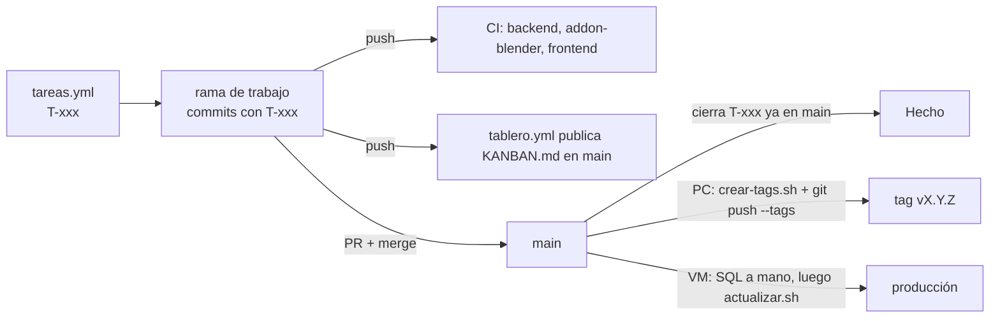

# 05 · Flujo de trabajo

Cómo se trabaja en el repositorio de Amatista: ramas, commits, tablero Kanban, tags y versiones, bitácora e incidencias, despliegue en la VM y lo que hay que revisar antes de abrir un PR. Para todo el que hace cambios.

Actualizado: 4 de octubre de 2026 (main en c730c0e)

1. [Ramas](#1-ramas)
2. [Commits](#2-commits)
3. [Tablero Kanban](#3-tablero-kanban)
4. [Tags y versiones](#4-tags-y-versiones)
5. [Bitácora, incidencias y CHANGELOG](#5-bitácora-incidencias-y-changelog)
6. [Despliegue en la VM](#6-despliegue-en-la-vm)
7. [Checklist antes de abrir un PR](#7-checklist-antes-de-abrir-un-pr)



---

## 1. Ramas

- **`main`** es la rama principal y la única que se despliega.
- Se trabaja en **una sola rama de trabajo a la vez** sobre `main` (por ejemplo, las ramas `claude/<tema>` de cada sesión) y **todo entra por pull request** ([README raíz](../../README.md)).
- Historia: cada hilo de trabajo abría su propia rama y se acumularon varias; el 2 de octubre se unificaron en una ([bitácora de ramas](../bitacora/2026-10-02_ramas_y_cronologia.txt)). La sesión en la nube no puede borrar ramas ni publicar tags (HTTP 403): se hace desde la computadora del usuario, por ejemplo `git push origin --delete <rama>`.

## 2. Commits

Convención completa: [docs/guias/2026-09-27_convencion_commits.txt](../guias/2026-09-27_convencion_commits.txt).

```text
type(scope): descripción en imperativo, minúsculas y sin punto final

cierra T-0xx
```

| `type` | Uso |
|---|---|
| `feat` | Funcionalidad nueva |
| `fix` | Corrección de un error |
| `docs` | Solo documentación |
| `refactor` | Reorganizar sin cambiar comportamiento |
| `chore` | Mantenimiento, dependencias, configuración |

Scopes de la guía: `pwa`, `api`, `db`, `ia`, `repo`. En el historial también aparecen otros (por ejemplo `lecciones`); úsalos con criterio y prefiere los de la guía.

## 3. Tablero Kanban

Guía completa: [tablero/README.md](../../tablero/README.md). Archivos: [`tablero/tareas.yml`](../../tablero/tareas.yml) (lo editan las personas), [`tablero/actualizar.py`](../../tablero/actualizar.py) (calcula), [`KANBAN.md`](../../KANBAN.md) (generado; **no se edita a mano ni se hace commit en ramas**) y [`tablero/historico/`](../../tablero/historico/) (tablero de la v2).

**Crear una tarea**: agrégala en `tareas.yml` con el siguiente id libre (hoy el último es `T-060`, así que la siguiente es `T-061`), `titulo`, `version` (del `roadmap`) y `area`.

| Campo | Obligatorio | Efecto |
|---|---|---|
| `id`, `titulo`, `version`, `area` | Sí | Identifican la tarea y su columna en el roadmap |
| `estado` | No | Estado mínimo puesto a mano (`pendiente`, `en-progreso`, `revision`, `hecho`) para lo que pasa fuera de git (un script en Oracle). Los commits solo pueden hacer **avanzar** desde ahí |
| `depende_de` | No | Lista de ids |
| `aceptacion` | No | Criterio de «listo»; sale como «🎯 Listo cuando» |
| `evidencia` | No | Prueba de lo hecho; sale como «🔎 Evidencia» |
| `bloqueo` | No | Lo que falta y quién/qué lo bloquea; sale como «⏸️ Espera» |
| `resultado` | No | Nota de resultado (se lee en el YAML) |

**Mover tarjetas con commits** (`tablero/actualizar.py`, mayúsculas o minúsculas, `T-11` = `T-011`, en el título o el cuerpo):

| En el commit | Resultado |
|---|---|
| `T-011` | 🔨 En progreso |
| `revision T-011` / `revisión` / `review` | 👀 Revisión |
| `cierra T-011` / `cerrar` / `closes` / `closed` / `fix` / `fixes` / `fixed` / `resuelve` / `hecho` | ✅ Hecho si el commit ya está en `main`; 👀 Revisión mientras esté solo en tu rama |
| `reabre T-011` / `reopen` | 📋 Pendiente (lo único que hace retroceder) |

Usa `cierra T-xxx` solo cuando se cumple la `aceptacion`. Si el cambio deja pendiente una acción humana (ejecutar un SQL en Oracle, configurar el servidor), menciona el id sin `cierra` y anota el `bloqueo` en `tareas.yml`. Un id que no está en `tareas.yml` (ni en `etapa.archivadas`) aparece como «tarea desconocida».

Cuidado: `fix T-011` en cualquier parte del mensaje cierra la tarea; no escribas «fix» delante de un id si no quieres cerrarla.

**Cambio de etapa**: se copia `tareas.yml` y el `KANBAN.md` de `main` a `historico/` con fecha y se reescribe `tareas.yml` con el bloque `etapa` ([tablero/README.md, «Etapas e histórico»](../../tablero/README.md#etapas-e-histórico)).

## 4. Tags y versiones

Guía: [docs/guias/2026-10-01_versiones-y-tablero.txt](../guias/2026-10-01_versiones-y-tablero.txt). Notas de cada versión: [CHANGELOG.md](../../CHANGELOG.md).

- **Regla**: MAYOR = cambio de fase del producto (v3 «Reestructuración»), MENOR = una meta del roadmap terminada, PARCHE = solo correcciones. Pre-lanzamientos con `-alpha.N`.
- **Los tags se crean y publican desde la PC del usuario**, nunca desde la sesión en la nube: allí `git push` de un tag responde 403 y además los tags se firman con la llave SSH personal (INC-009).
- **Herramienta**: [`herramientas/crear-tags.sh`](02_herramientas_de_linea_de_comandos.md#5-herramientascrear-tagssh). Para una versión nueva se agrega una línea `tag|commit|título` a `VERSIONES` en el script y luego:
  ```bash
  bash herramientas/crear-tags.sh
  git push origin --tags
  ```
  o, para una sola versión: `git tag -s vX.Y.Z -m "vX.Y.Z — título"` y `git push origin vX.Y.Z`.
- **Al cerrar una versión**: pasar las notas de «Sin publicar» del CHANGELOG a una sección nueva, crear el tag, publicarlo y (opcional) crear el Release en GitHub con esa sección.
- **Estado al 4 de octubre**: publicados `v0.1.0`, `v1.0.0`, `v2.0.0`, `v2.0.1` y `v2.2.0-alpha.1`. Pendientes de publicar desde la PC: `v2.2.0-alpha.2`, `v3.0.0-alpha.1` y `v3.0.0-alpha.2` (ya están en el script). En `main` (c730c0e) el script todavía no tiene línea para el cierre del PR #14; esta rama de documentación agrega `v3.0.0-alpha.3` → `d004071`, que también habrá que publicar desde la PC.

## 5. Bitácora, incidencias y CHANGELOG

| Dónde | Qué se escribe | Formato |
|---|---|---|
| [`docs/bitacora/`](../bitacora/) | Qué pasó en cada sesión de trabajo y qué sigue | Un archivo por sesión: `AAAA-MM-DD_tema.md` (antes `.txt`). Es historia: no se corrige después |
| [`docs/incidencias/`](../incidencias/README.md) | Cada falla diagnosticada: síntoma, causa, solución, estado | Un documento fechado y una fila nueva `INC-0xx` en la tabla del README (hoy la última es INC-012). Estados: ✅ resuelta · 🟠 acción pendiente · 🔵 mitigada · 🔴 abierta |
| [`CHANGELOG.md`](../../CHANGELOG.md) | Cambios visibles, sección «Sin publicar» hasta el próximo tag | [Keep a Changelog](https://keepachangelog.com/es-ES/1.1.0/) |
| [`docs/README.md`](../README.md) | Índice y estado (vigente / historia) de cada documento | Actualizar al agregar o reemplazar documentos |

Todos los documentos llevan la fecha al inicio del nombre. Cuando cambia una decisión se escribe un documento nuevo o se actualiza el vigente, sin reescribir la historia.

## 6. Despliegue en la VM

Producción: una VM ARM de OCI con la API (FastAPI + uvicorn) y Oracle Autonomous Database (que solo acepta conexiones desde la IP de la VM).

| Dato | Valor real hoy | Lo que asumen los archivos de `despliegue/` |
|---|---|---|
| Repositorio | `/home/opc/amatista` (usuario `opc`) | `/opt/amatista` y usuario de sistema `amatista` |
| Unidad systemd | **`amatista-backend`** (la que ya estaba instalada) | **`amatista-api`** (`despliegue/amatista-api.service`) |
| Variables | `backend/.env` | `/etc/amatista/amatista-api.env` (`EnvironmentFile`) |
| HTTPS | Pendiente (T-005) | `despliegue/Caddyfile` |

**Por qué hay dos nombres** (según el encabezado de [`despliegue/actualizar.sh`](../../despliegue/actualizar.sh), INC-012 y la [bitácora técnica del 3 de octubre, §20 y §23.1](../bitacora/2026-10-03_bitacora_tecnica_v3_servidor.md)): el archivo del repositorio se llama `amatista-api.service` y define la unidad `amatista-api`, pensada para `/opt/amatista` con un usuario sin privilegios y endurecimiento de systemd. La VM ya corría la API con una unidad instalada antes, `amatista-backend`, sobre `/home/opc/amatista`, y nunca se instaló la del repositorio. Por eso `actualizar.sh` usa `amatista-api` por defecto, pero **si `amatista-api` no existe y `amatista-backend` sí, usa `amatista-backend`** (o la que digas en `AMATISTA_SERVICIO`). Unificar el nombre (instalar la unidad del repo o adoptar `amatista-backend`) es la tarea **T-003**, en progreso.

En la práctica, en la VM:

```bash
journalctl -u amatista-backend -f                      # registros
sudo systemctl restart amatista-backend                # reinicio manual
bash /home/opc/amatista/despliegue/actualizar.sh       # actualizar main con pruebas y vuelta atrás
```

**Orden de un despliegue con cambios de base**:

1. Respaldar (OCI) y ejecutar `python diagnostico_oracle.py` en la VM.
2. Ejecutar a mano los scripts nuevos de `backend/sql/` en **Database Actions** (F5), en el orden de [`LEEME.txt`](../../backend/sql/LEEME.txt). **Nunca `001` en producción** (borra las tablas). Al 4 de octubre producción tiene `002`, `003`, `005` y `006`; `007` queda para después del piloto (T-055).
3. `bash despliegue/actualizar.sh` (pull, dependencias, pytest, validar, reinicio, `/api/salud`).
4. `python diagnostico_oracle.py` → «✓ Las tablas coinciden…»; `curl http://127.0.0.1:8000/api/salud` → `"motor": "oracle"`.
5. Si hay contenido o prácticas nuevas: `python herramientas/contenido.py importar` y `practicas [--publicar]`.

Guías: [backend/README.md](../../backend/README.md#dejar-oracle-funcionando-en-el-servidor-arm), [Oracle paso a paso](../despliegue/2026-10-02_oracle_paso_a_paso.md) (002–004) y [manual de Oracle v3](../reestructuracion/02_manual_oracle.md) (005–007). Despliegue completo de la VM: [despliegue en OCI](../despliegue/2026-10-04_despliegue_oci.md).

El frontend no se despliega en la VM: es una PWA estática (`npm run build` → `dist/`) pensada para Cloudflare Pages (ver `CORS_ORIGINS` y `VITE_API_URL`).

## 7. Checklist antes de abrir un PR

- [ ] Estás en tu rama de trabajo, al día con `main`, y el PR apunta a `main`.
- [ ] Commits con `type(scope): descripción` y los `T-xxx` correctos; `cierra T-xxx` solo si se cumple la `aceptacion`.
- [ ] Tarea nueva o cambios de alcance anotados en `tablero/tareas.yml` (`estado`, `evidencia`, `bloqueo` si aplica). **No** incluiste `KANBAN.md`.
- [ ] Pasan las comprobaciones de CI localmente ([README, paso 6](README.md#6-correr-todas-las-comprobaciones-de-ci)): `pytest` del backend, `contenido.py validar`, `pytest tablero engine/tests addon/tests`, `npm run lint`, `npm test`, `npm run build` (y `en_blender.py` si tocaste el add-on o el motor).
- [ ] Si cambiaste el esquema: `database/modelos.py` + **script SQL nuevo** numerado (mejor que cambiar uno ya aplicado en producción) + `ESPERADO` de `diagnostico_oracle.py` + `backend/sql/LEEME.txt`; y en el PR, el aviso de que el SQL se ejecuta en Oracle **antes** de desplegar el código.
- [ ] Si cambiaste un módulo de contenido: `estado` correcto y la práctica en Blender al final del módulo.
- [ ] Si cambiaste una práctica publicada: subiste su `version`.
- [ ] Sin secretos: ningún `.env`, contraseña, wallet ni token.
- [ ] Documentación al día (README de la carpeta, `docs/`, CHANGELOG «Sin publicar»); bitácora de la sesión o incidencia nueva si corresponde.
