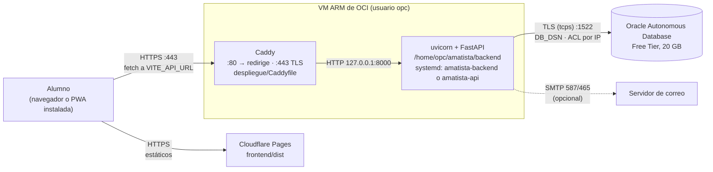

# Despliegue del backend en Oracle Cloud (OCI)

Guía para dejar la API de Amatista (FastAPI) funcionando en la VM ARM de OCI, con HTTPS, conectada a Oracle Autonomous Database y consumida por la PWA publicada en Cloudflare Pages. Es para quien administra el servidor. Cierra la parte de despliegue de la tarea T-031.

Actualizado: 4 de octubre de 2026 (main en c730c0e)

> **Nombre de este archivo.** Antes del 4 de octubre, el `Caddyfile`, la unidad `amatista-api.service`, la tarea T-031 y la incidencia INC-007 citaban `docs/despliegue/2026-10-02_despliegue_oci.txt`, que nunca existió. Esta guía es ese documento; las referencias del `Caddyfile`, la unidad y el tablero ya apuntan aquí (INC-007 es historia y no se corrige).

## Índice

1. [Qué está comprobado y qué no](#1-qué-está-comprobado-y-qué-no)
2. [Arquitectura](#2-arquitectura)
3. [Requisitos](#3-requisitos)
4. [Preparar la VM](#4-preparar-la-vm)
5. [Variables de producción (`backend/.env`)](#5-variables-de-producción-backendenv)
6. [Base de datos](#6-base-de-datos)
7. [Servicio systemd: dos opciones](#7-servicio-systemd-dos-opciones)
8. [HTTPS con Caddy](#8-https-con-caddy)
9. [PWA en Cloudflare Pages](#9-pwa-en-cloudflare-pages)
10. [Correo (SMTP)](#10-correo-smtp)
11. [Actualizar a una versión nueva y revertir](#11-actualizar-a-una-versión-nueva-y-revertir)
12. [Verificación final](#12-verificación-final)
13. [Problemas frecuentes](#13-problemas-frecuentes)
14. [Qué falta para el piloto](#14-qué-falta-para-el-piloto)

---

## 1. Qué está comprobado y qué no

En esta guía cada paso lleva una de dos marcas:

- **[Comprobado]**: ya se hizo en la VM real y está registrado en la [bitácora técnica del 3 de octubre](../bitacora/2026-10-03_bitacora_tecnica_v3_servidor.md) o en la incidencia [INC-010](../incidencias/2026-10-02_despliegue-sql-v2.2-en-produccion.txt) (2 de octubre).
- **[Sin ejecutar]**: procedimiento escrito a partir de los archivos de [`despliegue/`](../../despliegue/) y del código; nadie lo ha corrido todavía en producción.

| Pieza | Estado | Fuente |
|---|---|---|
| VM ARM con usuario `opc` (prompt `[opc@max ~]$`), repositorio en `/home/opc/amatista` | **[Comprobado]** | INC-010; bitácora §11 |
| Remoto `origin` apuntando a `Maximiliano-cabello-mata/amatista` | **[Comprobado]** (corregido el 2/10) | INC-010, incidencia C |
| venv en `backend/venv`, `pip check` → `No broken requirements found.` | **[Comprobado]** | bitácora §12 |
| Conexión a Oracle 23.26.3.3.0 como `ADMIN` con `backend/.env` (cadena TLS) | **[Comprobado]** | bitácora §13; INC-010 §3 |
| Scripts 002, 003, 005 y 006 aplicados; 14 tablas; datos conservados | **[Comprobado]** | bitácora §14–§16 y §22 |
| Catálogo importado; 8 niveles de Blender en borrador | **[Comprobado]** | INC-010 §3; bitácora §18 |
| API como servicio systemd con la unidad **`amatista-backend`** (no `amatista-api`) | **[Comprobado]** | bitácora §20 y §23.1 (INC-012) |
| `GET /api/salud` → `{"estado":"ok","motor":"oracle"}`, catálogo HTTP 200, `/api/blender/versiones` | **[Comprobado]** | INC-010 §3; bitácora §21 |
| Contenido de la unidad `amatista-backend` (usuario, `ExecStart`, interfaz y puerto, si arranca sola al reiniciar la VM) | **No documentado** | T-003 pide comprobarlo |
| Unidad del repositorio `amatista-api.service` | **[Sin ejecutar]** | T-003 |
| Caddy y HTTPS | **[Sin ejecutar]** | T-005; INC-010 §4 lo deja pendiente |
| `/etc/amatista/amatista-api.env` | **[Sin ejecutar]** | solo lo usa la opción B |
| Usuario `AMATISTA_APP` (004) | **[Sin ejecutar]**: producción sigue con `ADMIN` | T-004 |
| SMTP y primer administrador | **[Sin ejecutar]** | T-032; INC-010 §4 |
| PWA en Cloudflare Pages | **[Sin ejecutar]** | T-024 (depende de T-005) |
| Script 007 (motor de prácticas) | **[Sin ejecutar]**: después del piloto | T-055 |
| `despliegue/actualizar.sh` en la VM | **[Sin ejecutar]** (no hay registro de que se haya usado) | — |

Otro dato que conviene saber antes de empezar: el 3 de octubre la VM trabajaba en una rama **local** llamada `despliegue/v3-2026-10-03` (bitácora §11). Revisa en qué rama está con `git -C ~/amatista status` antes de seguir (ver [§11](#11-actualizar-a-una-versión-nueva-y-revertir)).

## 2. Arquitectura



Ideas clave:

- **El navegador nunca habla con Oracle.** Solo la VM puede: la base tiene una ACL que admite únicamente la IP de la VM (INC-008; [`backend/README.md`](../../backend/README.md), «Errores de Oracle frecuentes», ORA-12506).
- **La PWA funciona aunque la API esté caída.** El progreso se guarda en IndexedDB y se sincroniza cuando el servidor responde ([`frontend/README.md`](../../frontend/README.md), «Progreso»).
- **Una página `https://` no puede llamar a una API `http://`** (contenido mixto). Por eso Caddy/HTTPS (T-005) es requisito para publicar la PWA (T-024). `frontend/src/services/api.js:9-11` ni siquiera intenta sincronizar en ese caso.
- **uvicorn solo debería escuchar en `127.0.0.1`**: el único acceso público es Caddy. Así lo hace `amatista-api.service` (línea 35). Si la unidad `amatista-backend` escucha en `0.0.0.0`, ver [§7.1](#71-opción-a-adoptar-amatista-backend-la-que-ya-corre).

## 3. Requisitos

| Requisito | Detalle | Estado |
|---|---|---|
| VM de OCI | La VM ARM existente (Always Free según el [plan de lanzamiento](../planeacion/2026-10-01_plan_lanzamiento.txt), §5, opción A). Acceso SSH como `opc` con `sudo`. | **[Comprobado]** que existe y corre la API |
| Autonomous Database | Free Tier, 20 GB, Oracle 23.26 (la documentación la llama 23ai/26ai). | **[Comprobado]** |
| Conexión TLS sin wallet | La base se configuró con ACL por IP y **mTLS no obligatorio**, para conectar con TLS normal sin descargar el wallet ([`docs/arquitectura/2026-09-27_backend_y_base_de_datos.txt`](../arquitectura/2026-09-27_backend_y_base_de_datos.txt), fase 1). El backend no usa wallet: `database/conexion.py` solo pasa `user`, `password` y `dsn`. Si alguien vuelve a exigir mTLS, el diagnóstico muestra `ORA-28759` y recomienda desactivarlo o usar el wallet (`diagnostico_oracle.py:291`). | **[Comprobado]** (la conexión funciona) |
| Cadena de conexión | La cadena **TLS** de nivel *high* de la consola (*Autonomous Database › Conexión a la base de datos › TLS*) en `DB_DSN`, o `DB_HOST` + `DB_PORT` (1522) + `DB_SERVICE`, con los que el backend arma `tcps://host:1522/servicio` (`database/conexion.py:27-45`). | **[Comprobado]** |
| Puertos 80 y 443 abiertos en OCI | *Networking › Virtual Cloud Networks › tu VCN › Security Lists* (o el NSG de la VM): reglas de entrada TCP 80 y 443 desde `0.0.0.0/0`. El 80 solo sirve para emitir el certificado y redirigir (comentario del `Caddyfile`, líneas 9-12). | **[Sin ejecutar]** |
| Puertos 80 y 443 en `firewalld` | La VM tiene su propio cortafuegos además de la lista de seguridad (ver [§4](#4-preparar-la-vm)). | **[Sin ejecutar]** |
| Puerto 8000 cerrado al público | Mientras se usó `http://158.101.118.222:8000` desde la PWA local ([INC-002](../incidencias/2026-09-27_puerto-ocupado-y-cors.txt)) el 8000 estuvo expuesto. Con Caddy delante hay que quitar esa regla de la lista de seguridad y de `firewalld`. | **[Sin ejecutar]** |
| Nombre DNS para la API | Dominio propio con un registro A a la IP pública, o `sslip.io` sin dominio: `<ip-con-guiones>.sslip.io` (p. ej. `158-101-118-222.sslip.io`). | **[Sin ejecutar]** |
| Cuenta de Cloudflare Pages | Para la PWA (`*.pages.dev` sirve sin comprar dominio, según el plan §5). | **[Sin ejecutar]** |

## 4. Preparar la VM

**[Comprobado]** para lo que ya existe (repositorio, venv, dependencias); **[Sin ejecutar]** para el cortafuegos. Si montas una VM nueva, estos son los pasos:

```bash
# 1. Python 3 y git (CI usa Python 3.12; ver .github/workflows/ci.yml)
python3 --version
git --version

# 2. Clonar en /home/opc/amatista (la ruta que usa la VM actual)
cd /home/opc
git clone https://github.com/Maximiliano-cabello-mata/amatista.git
cd amatista
git remote -v          # debe ser Maximiliano-cabello-mata/amatista (INC-010, incidencia C)

# 3. Entorno virtual en backend/venv (la ruta que espera actualizar.sh)
cd backend
python3 -m venv venv
source venv/bin/activate
pip install -r requirements.txt      # producción: fastapi, uvicorn, sqlalchemy, oracledb, python-dotenv
pip check                            # "No broken requirements found." (bitácora §12)
```

`actualizar.sh` instala además `requirements-dev.txt` (incluye pytest) porque corre las pruebas antes de reiniciar.

Cortafuegos de la VM (`firewalld`, el de la imagen de Oracle Linux):

```bash
sudo firewall-cmd --permanent --add-service=http
sudo firewall-cmd --permanent --add-service=https
sudo firewall-cmd --list-ports                      # si aparece 8000/tcp:
sudo firewall-cmd --permanent --remove-port=8000/tcp
sudo firewall-cmd --reload
sudo firewall-cmd --list-all
```

Las dos capas (lista de seguridad de OCI y `firewalld`) tienen que permitir el puerto: si falta una, Let's Encrypt no puede validar el dominio y Caddy no obtiene el certificado.

## 5. Variables de producción (`backend/.env`)

El backend lee las variables del entorno; `database/conexion.py:20` llama a `load_dotenv()`, que busca `backend/.env` y **no sobrescribe** variables que ya vengan del entorno (por ejemplo, de un `EnvironmentFile` de systemd). La lista completa con sus valores por defecto está en [`backend/.env.example`](../../backend/.env.example) y en el [manual del backend, §1.2](../manual-del-codigo/03_backend.md#12-variables-de-entorno-backendenv).

Dónde viven en producción:

- **Opción A** (unidad `amatista-backend`, la actual): en `/home/opc/amatista/backend/.env`. **[Comprobado]**: ese archivo existe y tiene la cadena TLS (INC-010, incidencia B).
- **Opción B** (unidad `amatista-api`): en `/etc/amatista/amatista-api.env`, `root:root` y modo `600` (`amatista-api.service:26-28`). **[Sin ejecutar]**.

| Variable | Valor en producción | Por qué |
|---|---|---|
| `DB_USER` / `DB_PASSWORD` | Hoy `ADMIN`. Tras T-004: `AMATISTA_APP` y su contraseña | Con `AMATISTA_APP` un `.env` filtrado solo da acceso a filas, no a la estructura ([Oracle paso a paso, paso 5](2026-10-02_oracle_paso_a_paso.md#paso-5--ejecutar-004-usuario-de-la-aplicación)) |
| `DB_DSN` | Cadena TLS *high* de la consola | Opción recomendada en `.env.example`; con `DB_DSN` vacío se usa `DB_HOST`/`DB_PORT`/`DB_SERVICE` |
| `DB_ESQUEMA` | Vacío con `ADMIN`; `ADMIN` con `AMATISTA_APP` | Sin él, `AMATISTA_APP` busca sus propias tablas y falla con `ORA-00942` |
| `DB_POOL` / `DB_POOL_EXTRA` | Por defecto 5 + 5 | El Free Tier admite pocas sesiones; procesos × (pool + extra) debe dejar margen para Database Actions y la purga |
| `DATABASE_URL` | **No definir** | Si existe, se ignora Oracle y se usa SQLite (`conexion.py:93-96`); `/api/salud` diría `"motor":"sqlite"` |
| `AMATISTA_ADMINS` | Tu correo | Quien se registre o entre con ese correo queda como admin (`api/auth.py:224`). Pendiente desde INC-010 §4 |
| `AMATISTA_MOSTRAR_CODIGOS` | `0` o sin definir | Con `1` los códigos de confirmación salen en la respuesta y en el registro: cualquiera confirmaría correos ajenos |
| `AMATISTA_REQUIERE_CONFIRMACION` | `0` hasta que funcione SMTP; `1` después (T-032) | Con `1` no se puede entrar sin confirmar el correo (403) |
| `AMATISTA_SIN_LIMITES` | Sin definir | Solo para pruebas automáticas: desactiva los 429 por IP |
| `AMATISTA_PROXY_CONFIABLE` | `1` **solo** cuando Caddy esté delante y el 8000 no sea público | Toma la IP del alumno de la última entrada de `X-Forwarded-For` (`api/limites.py:75-83`). Si el 8000 queda abierto, cualquiera falsearía su IP para saltarse los límites |
| `SMTP_HOST`, `SMTP_PORT`, `SMTP_USER`, `SMTP_PASSWORD`, `SMTP_FROM` | Los de tu proveedor | Ver [§10](#10-correo-smtp) |
| `CORS_ORIGINS` | `https://<tu-proyecto>.pages.dev` (y tu dominio de la PWA si tienes) | `localhost` en cualquier puerto ya está permitido (`main.py:44`); el origen de Pages no |
| `AMATISTA_URL_API` / `AMATISTA_URL_PWA` | `https://<tu API>` y `https://<tu PWA>` | Las escribe el instalador del add-on; detrás de Caddy la URL de la petición sería la interna. Se necesitan con 007 ([manual de Oracle §10](../reestructuracion/02_manual_oracle.md#10-motor-de-prácticas-de-blender-007-4-de-octubre-de-2026), paso 3) |

Cuidados al editar ([INC-010](../incidencias/2026-10-02_despliegue-sql-v2.2-en-produccion.txt), incidencia B): las variables se escriben **dentro del archivo** con un editor (`nano ~/amatista/backend/.env`), nunca pegadas en la terminal. Los marcadores `<...>` de los ejemplos son para reemplazar: en Bash `<` y `>` son redirecciones y dejan la consola en el prompt `>` (sal con `Ctrl+C`). El archivo no se sube al repositorio (`.gitignore`) y debería tener permisos `600`.

## 6. Base de datos

Los scripts de [`backend/sql/`](../../backend/sql/) se ejecutan **a mano** en *Database Actions › SQL*, como `ADMIN`, pegando el archivo completo y pulsando **Ejecutar script (F5)**. Ni el backend ni `actualizar.sh` los aplican. El detalle está en:

- [`backend/sql/LEEME.txt`](../../backend/sql/LEEME.txt): qué hace cada script y el orden.
- [Oracle paso a paso](2026-10-02_oracle_paso_a_paso.md): 002, 003 y 004, `.env`, importar el contenido y crear el primer admin.
- [Manual de Oracle v3](../reestructuracion/02_manual_oracle.md): 005, 006 y 007, y las herramientas de autor.

Orden de scripts (de `LEEME.txt`, sección 2):

| Caso | Orden |
|---|---|
| Base nueva o prototipo sin alumnos | `001 → 002 → 003 → 005 → 006 → 007 → 004` (opcional) |
| Base con datos (producción) | `002 → 003 → 005 → 006 → 007 → 004` (opcional). **Nunca 001**: borra las tablas |

Estado de producción: **[Comprobado]** 002, 003, 005 y 006 (14 tablas, bitácora §14–§22). **[Sin ejecutar]** 007 (después del piloto y **antes** de actualizar el backend al código del motor de prácticas, T-055) y 004 (T-004).

Después de cualquier script, desde la VM (la ACL no deja hacerlo desde otra máquina):

```bash
cd ~/amatista/backend && source venv/bin/activate
python diagnostico_oracle.py      # debe terminar en "✓ Las tablas coinciden con lo que espera el backend."
python herramientas/contenido.py validar
python herramientas/contenido.py importar     # solo si cambió el contenido; repetirlo dice "sin cambios"
```

## 7. Servicio systemd: dos opciones

El servicio evita el error del puerto ocupado ([INC-002](../incidencias/2026-09-27_puerto-ocupado-y-cors.txt), `Errno 98`): un solo uvicorn, que systemd reinicia si se cae. Elegir entre las dos opciones es justo el bloqueo de **T-003**. Nunca dejes las dos habilitadas a la vez: compiten por el puerto 8000.

| | Opción A: adoptar `amatista-backend` | Opción B: instalar `amatista-api.service` |
|---|---|---|
| Estado | **[Comprobado]** que corre y responde | **[Sin ejecutar]** |
| Archivo | El que ya está instalado en la VM (contenido no documentado en el repositorio) | [`despliegue/amatista-api.service`](../../despliegue/amatista-api.service) |
| Variables | `backend/.env` | `/etc/amatista/amatista-api.env` (root, 600) |
| Escucha | Desconocido: comprobar | `127.0.0.1:8000`, 1 proceso, `--proxy-headers` solo para `127.0.0.1` |
| Endurecimiento | Desconocido | `ProtectSystem=strict`, `NoNewPrivileges`, `PrivateTmp`, etc. |
| `actualizar.sh` | La usa sola si `amatista-api` no existe (`actualizar.sh:25-29`) | La usa por defecto |

### 7.1 Opción A: adoptar `amatista-backend` (la que ya corre)

Lo mínimo para el piloto. Primero hay que saber qué hace la unidad (T-003):

```bash
systemctl cat amatista-backend          # usuario, WorkingDirectory, ExecStart, EnvironmentFile
systemctl is-enabled amatista-backend   # "enabled" = arranca sola al reiniciar la VM
sudo ss -ltnp | grep 8000               # 127.0.0.1:8000 o 0.0.0.0:8000
```

- Si no está `enabled`: `sudo systemctl enable amatista-backend`. La prueba que pide T-003 es reiniciar la VM (`sudo reboot`) y comprobar `/api/salud` sin tocar nada.
- Si escucha en `0.0.0.0`, la API también queda en `http://<ip>:8000` sin TLS y sin las cabeceras de Caddy. Hay dos salidas: cerrar el 8000 en la lista de seguridad y en `firewalld` ([§3](#3-requisitos), [§4](#4-preparar-la-vm)), o cambiar el `ExecStart` con un *drop-in* (`sudo systemctl edit amatista-backend`) para usar `--host 127.0.0.1 --port 8000 --proxy-headers --forwarded-allow-ips 127.0.0.1`, igual que en `amatista-api.service`. **[Sin ejecutar]**
- No actives `AMATISTA_PROXY_CONFIABLE=1` mientras el 8000 sea público.

Con esta opción, `actualizar.sh` detecta sola la unidad: si `systemctl cat amatista-api` falla y `systemctl cat amatista-backend` funciona, reinicia `amatista-backend`. También puedes forzarlo con `AMATISTA_SERVICIO=amatista-backend`.

### 7.2 Opción B: instalar `amatista-api.service` (la del repositorio)

**[Sin ejecutar].** Desde el motor v3 la unidad ya trae las rutas de la VM real (`/home/opc/amatista`, usuario `opc`, `ProtectHome=read-only`) y su `EnvironmentFile` es opcional (si `/etc/amatista/amatista-api.env` no existe, se usa `backend/.env`), así que se puede copiar tal cual. Antes de eso estaba escrita para `/opt/amatista` con `ProtectHome=true`. Los dos caminos posibles:

1. **Mover el despliegue a `/opt/amatista`** con un usuario `amatista` sin shell (cambia `User`, `Group`, rutas y `ProtectHome=true` en la unidad). Es lo más aislado, pero cambia rutas que hoy funcionan y que citan la bitácora y `LEEME.txt` (`~/amatista/backend`).
2. **Quedarse en `/home/opc/amatista`** (lo que trae la unidad hoy). Estas son las líneas que lo definen:

   ```ini
   User=opc
   Group=opc
   WorkingDirectory=/home/opc/amatista/backend
   ExecStart=/home/opc/amatista/backend/venv/bin/uvicorn main:app --host 127.0.0.1 --port 8000 --workers 1 --proxy-headers --forwarded-allow-ips 127.0.0.1 --no-server-header
   ProtectHome=read-only
   ```

Instalación (sea cual sea el camino):

```bash
# Variables: pasar el contenido de backend/.env a /etc/amatista/amatista-api.env
sudo install -d -m 700 /etc/amatista
sudo install -m 600 -o root -g root ~/amatista/backend/.env /etc/amatista/amatista-api.env
sudo nano /etc/amatista/amatista-api.env      # revisar; formato KEY=valor sin "export"

# Unidad
sudo cp ~/amatista/despliegue/amatista-api.service /etc/systemd/system/   # con las rutas ya ajustadas
sudo systemctl daemon-reload

# Cambio de unidad sin dos uvicorn a la vez
sudo systemctl disable --now amatista-backend
sudo systemctl enable --now amatista-api
journalctl -u amatista-api -n 30 --no-pager
curl -s http://127.0.0.1:8000/api/salud
```

Si `amatista-api` no arranca, vuelve atrás con `sudo systemctl disable --now amatista-api && sudo systemctl enable --now amatista-backend`.

Consecuencias que hay que tener presentes:

- **`backend/.env` se sigue leyendo.** `load_dotenv()` lo carga aunque la unidad tenga `EnvironmentFile`; solo gana lo que ya está en el entorno. Si conservas los dos archivos, una variable que falte en `/etc/...` se toma del `.env` viejo. `actualizar.sh` avisa si encuentra `backend/.env` (líneas 65-68). Una vez que funcione, borra `backend/.env` o deja en él solo lo que quieras usar en la terminal.
- **Las herramientas de terminal solo leen `backend/.env`.** `diagnostico_oracle.py`, `herramientas/contenido.py` y `herramientas/crear_admin.py` usan `database/conexion.py`, que no conoce `/etc/amatista/amatista-api.env`. Sin `backend/.env`, una forma de correrlas con las mismas variables que el servicio es dejar que systemd lea el archivo:
  ```bash
  sudo systemd-run --pty --wait --collect \
    -p EnvironmentFile=/etc/amatista/amatista-api.env \
    -p WorkingDirectory=/home/opc/amatista/backend -p User=opc \
    /home/opc/amatista/backend/venv/bin/python diagnostico_oracle.py
  ```
  No hagas `source` del archivo en Bash: un valor como `SMTP_FROM=Amatista <no-responder@...>` rompe la línea por los `<` `>` (INC-010, incidencia B).
- `actualizar.sh` reinicia `amatista-api` en cuanto esa unidad existe, aunque `amatista-backend` siga instalada.

## 8. HTTPS con Caddy

**[Sin ejecutar]** (T-005). El archivo es [`despliegue/Caddyfile`](../../despliegue/Caddyfile). Lo que hace:

- Obtiene y renueva solo el certificado de Let's Encrypt para el nombre del bloque del sitio; el puerto 80 queda para la validación y la redirección a `https`.
- Hace de proxy a `127.0.0.1:8000`, con comprobación de salud cada 30 s contra `GET /` (que responde `{"estado": "Backend activo"}` sin tocar la base, `main.py:61-63`).
- Agrega cabeceras de seguridad: HSTS de un año, `nosniff`, `DENY` en marcos, una CSP que no carga nada y quita la cabecera `Server`.
- Responde **404** a `/docs`, `/redoc` y `/openapi.json` (prueba P09 del plan). Para ver la documentación interactiva: `ssh -L 8000:127.0.0.1:8000 opc@<ip>` y abre `http://localhost:8000/docs` en tu computadora.
- Limita el cuerpo de las peticiones a 1 MB y escribe un registro JSON en `/var/log/caddy/amatista-api.log` (10 MiB × 5 archivos).

Pasos:

1. **Instalar Caddy** con el paquete de su documentación oficial para distribuciones tipo RHEL (Oracle Linux), de modo que quede la unidad `caddy` de systemd. El repositorio no documenta este paso.
2. **Elegir el nombre.** Con dominio propio, crea un registro A `api.tudominio` → IP pública de la VM. Sin dominio, usa `sslip.io`: `158-101-118-222.sslip.io` resuelve a `158.101.118.222` sin configurar nada.
3. **Copiar y editar:**
   ```bash
   sudo cp ~/amatista/despliegue/Caddyfile /etc/caddy/Caddyfile
   sudo nano /etc/caddy/Caddyfile
   #  - cambia "api.ejemplo.com" (línea 19) por tu nombre
   #  - opcional: descomenta "email tu-correo@ejemplo.com" (avisos de vencimiento)
   ```
4. **Validar y recargar:**
   ```bash
   sudo caddy validate --config /etc/caddy/Caddyfile
   sudo systemctl enable --now caddy      # la primera vez
   sudo systemctl reload caddy            # después de cada cambio
   journalctl -u caddy -n 50 --no-pager   # "certificate obtained successfully"
   ```
   Si `validate` o el arranque se quejan de `/var/log/caddy/`, crea la carpeta con dueño `caddy` (`sudo install -d -o caddy -g caddy /var/log/caddy`).
5. **Probar desde fuera de la VM:**
   ```bash
   curl -sS https://<tu-nombre>/api/salud          # {"estado":"ok","motor":"oracle"}
   curl -sSI https://<tu-nombre>/docs              # HTTP/2 404
   curl -sSI http://<tu-nombre>/                   # redirección a https
   ```
6. **Activar la IP real del alumno.** Con Caddy funcionando y el 8000 cerrado al público, agrega `AMATISTA_PROXY_CONFIABLE=1` al archivo de variables y reinicia el servicio. Sin esto, todos los alumnos cuentan como `127.0.0.1` para los límites de intentos (`api/limites.py`). La unidad `amatista-backend` necesita además `--proxy-headers --forwarded-allow-ips 127.0.0.1` si quieres que uvicorn también confíe en Caddy ([§7.1](#71-opción-a-adoptar-amatista-backend-la-que-ya-corre)).

## 9. PWA en Cloudflare Pages

**[Sin ejecutar]** (T-024, depende de T-005). Comandos y estructura en [`frontend/README.md`](../../frontend/README.md); plan del despliegue en el [plan de lanzamiento](../planeacion/2026-10-01_plan_lanzamiento.txt), §6, pasos 9 a 12.

Configuración del proyecto en Cloudflare Pages (conectado al repositorio de GitHub):

| Campo | Valor | De dónde sale |
|---|---|---|
| Rama de producción | `main` | Plan §4: `main` = código aprobado |
| Directorio raíz | `frontend` | El `package.json` de la PWA está ahí |
| Comando de compilación | `npm run build` (Pages instala dependencias con el `package-lock.json`) | `frontend/package.json` (`"build": "vite build"`) |
| Directorio de salida | `dist` | Vite; `frontend/README.md` |
| Versión de Node | 22 (variable `NODE_VERSION=22`) | La que usa CI (`.github/workflows/ci.yml`) |
| `VITE_API_URL` | `https://<tu-nombre-de-la-API>`, **sin barra al final** | [`frontend/.env.example`](../../frontend/.env.example) |

Detalles que importan:

- **`VITE_API_URL` se fija al compilar.** Vite la incrusta en el JavaScript, así que si cambias la URL de la API hay que volver a desplegar. No es un secreto: cualquiera la ve en el navegador.
- **Sin `VITE_API_URL`** la PWA usa `http://158.101.118.222:8000` (`frontend/src/services/api.js:4`). Servida por `https`, eso es contenido mixto y la PWA no sincroniza (no da error: simplemente no lo intenta).
- **Vistas previas.** El plan (§6, paso 2) pide que las vistas previas no escriban en producción: en el entorno *Preview* de Pages no pongas la URL de producción.
- **Rutas.** La PWA usa rutas con `#` (`#/curso/...`, `#/admin`), así que Pages no necesita reglas de reescritura. El service worker usa `navigateFallback: '/index.html'` y no guarda nada de `/api/` (`frontend/vite.config.js`).
- **CORS en el backend.** Agrega el origen exacto de Pages a `CORS_ORIGINS` (por ejemplo `CORS_ORIGINS=https://amatista.pages.dev`, separados por comas si hay varios) y reinicia el servicio. El origen no lleva barra final ni ruta. Los orígenes de *Preview* (`https://<hash>.<proyecto>.pages.dev`) no quedan cubiertos: agrégalos solo si de verdad deben hablar con esta API.
- **Commits del tablero.** El plan (§6, paso 12) pide que los commits automáticos del Kanban (`[skip ci]`) no disparen despliegues innecesarios: revisa la configuración de compilación de Pages.

Prueba: abre la PWA en `https://...pages.dev`, entra o regístrate y revisa en *Herramientas de desarrollo › Red* que las peticiones a la API devuelvan 200, sin errores de CORS ni de contenido mixto.

## 10. Correo (SMTP)

**[Sin ejecutar]** (T-032). Sin `SMTP_HOST` el backend no envía nada: registra un aviso **sin el código** y la petición sigue (`api/correo.py:74-81`). Así que, sin SMTP, los alumnos no pueden confirmar el correo ni recuperar la contraseña.

```ini
SMTP_HOST=smtp.tu-proveedor.com
SMTP_PORT=587                 # 587 = STARTTLS; 465 = TLS directo (api/correo.py:94-100)
SMTP_USER=usuario
SMTP_PASSWORD=contraseña-de-aplicación
SMTP_FROM=Amatista <no-responder@tudominio>   # si falta, se usa SMTP_USER
```

- Si el envío falla, el registro dice `No se pudo enviar el código de ... por SMTP (<Tipo>: <mensaje>)`, sin la contraseña ni el código. Míralo con `journalctl -u <servicio> -n 50`.
- Cuando el correo llegue, activa `AMATISTA_REQUIERE_CONFIRMACION=1`. La aceptación de T-032 es: «Registro con `AMATISTA_REQUIERE_CONFIRMACION=1` recibe el código por correo».
- Primer administrador: `AMATISTA_ADMINS=tu-correo` y registrarte con ese correo, o `python herramientas/crear_admin.py tu-correo` en la VM ([Oracle paso a paso, paso 9](2026-10-02_oracle_paso_a_paso.md#paso-9--reiniciar-el-backend-y-crear-el-primer-administrador)).
- Revisa la política del proveedor de la VM sobre el envío de correo saliente: si el puerto elegido está bloqueado, el registro mostrará un error de conexión o de tiempo de espera.

## 11. Actualizar a una versión nueva y revertir

[`despliegue/actualizar.sh`](../../despliegue/actualizar.sh) hace todo en un comando. **[Sin ejecutar]** en la VM.

```bash
bash ~/amatista/despliegue/actualizar.sh          # rama main
bash ~/amatista/despliegue/actualizar.sh dev      # otra rama que exista en origin
```

Qué hace, en orden:

1. **Comprueba**: no hay cambios sin confirmar (`git diff`) y la rama actual es la pedida. Si no, se detiene sin tocar nada.
2. **Guarda** el commit actual (`anterior`).
3. **Descarga**: `git fetch --prune origin` y `git merge --ff-only origin/<rama>` (solo avance rápido; si la rama local divergió, falla).
4. **Dependencias**: crea `backend/venv` si no existe e instala `requirements-dev.txt`.
5. **Pruebas**: `python -m pytest -q` (SQLite temporal, no toca Oracle) y `herramientas/contenido.py validar`.
6. **Reinicia** el servicio: `amatista-api`, o `amatista-backend` si `amatista-api` no existe, o el de `AMATISTA_SERVICIO`.
7. **Prueba** `http://127.0.0.1:8000/api/salud` hasta 30 veces, una por segundo (la espera evita el `curl` vacío de INC-010, incidencia D).

**Reversión automática.** Si fallan las dependencias, las pruebas o la validación del contenido, ejecuta `volver()`: `git reset --keep <anterior>` y reinstala `requirements.txt`. El servicio **no se reinicia** y sigue con la versión anterior. Si `/api/salud` no responde en 30 s, muestra las últimas 40 líneas de `journalctl`, vuelve al commit anterior y reinicia el servicio.

Variables opcionales: `AMATISTA_REPO` (por defecto la carpeta padre del script, o sea `/home/opc/amatista`), `AMATISTA_SERVICIO` y `AMATISTA_URL_SALUD`.

Antes de usarlo en la VM actual:

- **Rama local.** Si la VM sigue en `despliegue/v3-2026-10-03` (bitácora §11), el script (desde el motor v3) se cambia solo a `main` cuando todos los commits de esa rama ya están en `origin/main`. Si la rama tiene commits propios, se detiene y los lista: respáldalos (`git branch respaldo-...`) y decide a mano.
- **No actualices a `main` antes de 007.** El código actual de `main` incluye el motor de prácticas, y `LEEME.txt` (sección 2) y T-055 piden ejecutar 007 en Oracle **antes** de desplegar ese código, después del piloto. Es la regla general del [manual de Oracle §2](../reestructuracion/02_manual_oracle.md#2-el-orden-importa-primero-oracle-después-el-código): primero Oracle, después el código.
- **`sudo`.** El script llama `sudo systemctl restart` y `sudo journalctl`: córrelo como `opc`, que tiene `sudo`.

**Revertir a mano** (por ejemplo, si el problema aparece horas después):

```bash
cd ~/amatista
git log --oneline -10                    # elige el commit bueno
git reset --keep <commit>
backend/venv/bin/pip install -r backend/requirements.txt
sudo systemctl restart amatista-backend  # o amatista-api
sleep 2; curl -s http://127.0.0.1:8000/api/salud
```

Revertir el código **no revierte la base**. Los scripts SQL solo agregan cosas, así que el código anterior sigue funcionando sobre una base más nueva ([manual de Oracle §9](../reestructuracion/02_manual_oracle.md#9-volver-atrás)). Lo inverso no funciona: código v3 sobre una base sin 005 da 503 en el catálogo.

## 12. Verificación final

Marca cada línea solo si la ejecutaste y viste el resultado (regla del plan, §7).

**En la VM:**

- [ ] `systemctl status amatista-backend` (o `amatista-api`) → `active (running)`; `systemctl is-enabled ...` → `enabled`.
- [ ] Solo un servicio de la API habilitado: `systemctl list-unit-files 'amatista-*'`.
- [ ] `journalctl -u amatista-backend -n 50 --no-pager` sin `ORA-` ni tracebacks. Los registros no deben mostrar contraseñas ni tokens.
- [ ] `sudo ss -ltnp | grep -E ':(80|443|8000)\b'` → uvicorn en `127.0.0.1:8000` (o 8000 cerrado por cortafuegos) y Caddy en 80/443.
- [ ] `curl -s http://127.0.0.1:8000/api/salud` → `{"estado":"ok","motor":"oracle"}`.
- [ ] `cd ~/amatista/backend && source venv/bin/activate && python diagnostico_oracle.py` → `✓ Las tablas coinciden con lo que espera el backend.` (14 tablas hoy, 18 con 007).
- [ ] `git -C ~/amatista log -1 --oneline` y `git -C ~/amatista status` → commit esperado, rama `main`, sin cambios locales.
- [ ] `sudo caddy validate --config /etc/caddy/Caddyfile` y `systemctl status caddy`.
- [ ] Tras `sudo reboot`, la API vuelve sola (aceptación de T-003).

**Desde fuera:**

- [ ] `curl -sS https://<api>/api/salud` → `"motor":"oracle"`.
- [ ] `curl -sS https://<api>/api/contenido/catalogo -o /dev/null -w '%{http_code}\n'` → `200`.
- [ ] `curl -sSI https://<api>/docs` → `404`.
- [ ] `curl -sS --max-time 5 http://<ip>:8000/` **falla** (puerto cerrado al público).
- [ ] La PWA en Pages entra, guarda progreso y sincroniza sin errores de CORS ni de contenido mixto.
- [ ] Dos cuentas distintas guardan y recuperan su progreso sin verse entre sí (plan §6, paso 8; prueba P02).
- [ ] En la PWA, `#/admin/sistema` muestra el motor Oracle y las tablas con filas.

## 13. Problemas frecuentes

| Síntoma | Causa | Qué hacer | Referencia |
|---|---|---|---|
| `[Errno 98] ... address already in use` en el 8000 | Otro uvicorn corriendo: uno manual además del servicio, o las dos unidades habilitadas | `sudo ss -ltnp \| grep 8000`; detén el sobrante (`sudo systemctl disable --now <unidad>`). Como último recurso, `sudo fuser -k 8000/tcp` y reinicia el servicio | [INC-002](../incidencias/2026-09-27_puerto-ocupado-y-cors.txt) |
| El navegador bloquea por CORS (`No 'Access-Control-Allow-Origin'`) | Origen de la PWA fuera de `CORS_ORIGINS`, o responde un proceso viejo | Agrega el origen exacto (`https://...pages.dev`) y reinicia. Comprueba qué proceso tiene el puerto | INC-002; `main.py:39-48` |
| La PWA no sincroniza y no hay error | PWA en `https` y `VITE_API_URL` en `http` (o sin definir) | API con HTTPS (§8) y vuelve a compilar con `VITE_API_URL=https://...` | `frontend/src/services/api.js:9-11` |
| `curl` vacío justo después de `systemctl restart` | Uvicorn todavía arranca y abre el pool TLS con Oracle | Espera unos segundos (`sleep 2`); `actualizar.sh` ya reintenta 30 s | [INC-010](../incidencias/2026-10-02_despliegue-sql-v2.2-en-produccion.txt), incidencia D |
| `-bash: syntax error near unexpected token 'newline'` o prompt `>` | Se pegaron líneas `VAR=<valor>` en la terminal | `Ctrl+C`; edita el archivo con un editor | INC-010, incidencia B |
| `git` no encuentra una rama o un archivo nuevo | Remoto antiguo (`MAXIMILIANO1234345/amatista`) | `git remote set-url origin https://github.com/Maximiliano-cabello-mata/amatista.git && git fetch origin --prune` | INC-010, incidencia C |
| Se reinicia una unidad que no es la activa | La documentación hablaba de `amatista-api` y la VM corre `amatista-backend` | `systemctl list-unit-files 'amatista-*'`; ver §7 | INC-012; bitácora §20, §23.1 |
| `/api/salud` → 503 | La base no responde: ACL, credenciales, DSN | `journalctl` y `python diagnostico_oracle.py` en la VM | [`backend/README.md`](../../backend/README.md), «Errores de Oracle frecuentes» |
| `Errno 104 Connection reset` | Conexión sin TLS al 1522 | Usa la cadena TLS en `DB_DSN` o deja que el backend arme `tcps://` | `database/conexion.py:43-45` |
| `ORA-12506` o tiempo de espera | La ACL no incluye la IP desde donde te conectas | Ejecuta en la VM; si cambió la IP pública de la VM, actualiza la ACL | INC-008 |
| `ORA-28759` | La base volvió a exigir mTLS | Desactiva el requisito mTLS (con ACL) o usa el wallet | `diagnostico_oracle.py:291` |
| `ORA-00942` con `AMATISTA_APP` | Falta `DB_ESQUEMA=ADMIN` | Agrégalo | [Oracle paso a paso](2026-10-02_oracle_paso_a_paso.md#problemas-frecuentes) |
| `PLS-00103` al correr un script | Se ejecutó una parte, o con Ctrl+Enter | Pega el archivo completo y usa **F5** | Bitácora §23.2 |
| Catálogo 503 tras actualizar | Código v3 sobre una base sin 005 (o código del motor sin 007) | Ejecuta el script que falta; el diagnóstico dice cuál | [Manual de Oracle §2](../reestructuracion/02_manual_oracle.md#2-el-orden-importa-primero-oracle-después-el-código) |
| Caddy no obtiene el certificado | 80/443 cerrados en la lista de seguridad o en `firewalld`, o el DNS no apunta a la VM | Revisa las dos capas (§3, §4) y `journalctl -u caddy` | — |
| Todos los alumnos chocan con el límite de intentos (429) | Detrás de Caddy sin `AMATISTA_PROXY_CONFIABLE=1`: todos llegan como `127.0.0.1` | Activa la variable (solo con el 8000 cerrado al público) | `api/limites.py:75-83` |
| `amatista-api` no arranca (`status=200/CHDIR` o `203/EXEC`) | Rutas de `/opt/amatista` o `ProtectHome=true` con el repositorio en `/home` | Ajusta la unidad (§7.2) | `amatista-api.service` |
| Segmentos `BIN$...` en el diagnóstico | Papelera de Oracle de pruebas viejas | Inofensivos; opcional `PURGE RECYCLEBIN;` | INC-010, incidencia D |

## 14. Qué falta para el piloto

Piloto por invitación: **8 de octubre, 18:00** (plan §1). Decisión de apertura el 7. Pendientes de despliegue según [`tablero/tareas.yml`](../../tablero/tareas.yml):

| Tarea | Qué falta | Sección |
|---|---|---|
| **T-003** Servicio systemd (*en progreso*) | Comprobar que la API arranca sola tras reiniciar la VM y decidir entre adoptar `amatista-backend` o instalar `amatista-api.service` | §7 |
| **T-005** HTTPS en el backend | Puertos 80/443, nombre DNS o `sslip.io`, Caddy, `AMATISTA_PROXY_CONFIABLE=1`, cerrar el 8000 | §3, §8 |
| **T-032** SMTP y primer admin (depende de T-003) | Variables `SMTP_*`, `AMATISTA_ADMINS` o `crear_admin.py`, probar con `AMATISTA_REQUIERE_CONFIRMACION=1` | §10 |
| **T-029** Prueba de punta a punta en navegador | Recorrido anónimo → cuenta → offline → admin publica → acople, con capturas a 390 px y 1280 px. Depende de T-018 y T-020 | §12 |
| **T-030** Revisión de seguridad e integridad | Permisos, tokens, XSS en contenido, fusión y sincronización; hallazgos en `docs/incidencias/` | — |

También relacionados: **T-024** (PWA en Cloudflare Pages, depende de T-005, [§9](#9-pwa-en-cloudflare-pages)) y **T-004** (usuario `AMATISTA_APP`, opcional, [§5](#5-variables-de-producción-backendenv)). **T-055** (007 y motor de prácticas) queda para después del piloto: hasta entonces no actualices la VM al `main` que trae el motor ([§11](#11-actualizar-a-una-versión-nueva-y-revertir)).
