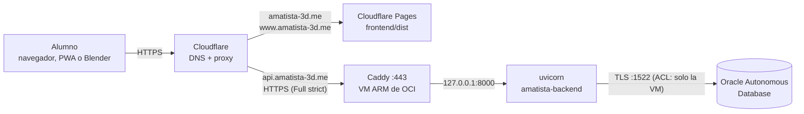

# Dominio amatista-3d.me con Cloudflare: plan de despliegue

Cómo se conecta el dominio oficial `amatista-3d.me` con la PWA, la API y el add-on de Blender, usando Cloudflare delante de la VM de OCI. Centraliza en un solo lugar los nombres, los certificados y el orden de los pasos. Para quien administra el dominio y el servidor.

Actualizado: 4 de octubre de 2026 · Registro de la compra: [2026-10-04_dominio_y_dns-v2.md](2026-10-04_dominio_y_dns-v2.md)

> **Nada de esto se ha ejecutado todavía.** Los pasos 1 a 4 no tocan la VM y se pueden hacer antes del piloto. Los pasos 5 en adelante cambian el servidor y van **después del piloto del 8 de octubre**, que corre sobre la v2.2 en la IP de siempre.

## Índice

1. [Decisión: qué es «Cloud Fly»](#1-decisión-qué-es-cloud-fly)
2. [Arquitectura con el dominio](#2-arquitectura-con-el-dominio)
3. [Los nombres](#3-los-nombres)
4. [Paso a paso](#4-paso-a-paso)
5. [Certificados: Cloudflare, Let's Encrypt y PositiveSSL](#5-certificados-cloudflare-lets-encrypt-y-positivessl)
6. [Correo con el dominio](#6-correo-con-el-dominio)
7. [Verificación final](#7-verificación-final)
8. [Qué cambió en el repositorio para el dominio](#8-qué-cambió-en-el-repositorio-para-el-dominio)
9. [Apéndice: la API en Fly.io](#9-apéndice-la-api-en-flyio)

---

## 1. Decisión: qué es «Cloud Fly»

Se tomó como **Cloudflare**, que ya estaba en el plan de lanzamiento para la PWA (Cloudflare Pages, T-024):

- **DNS** del dominio (gratis): cambia los nameservers de Namecheap a Cloudflare.
- **Proxy y HTTPS de borde** (nube naranja): certificado automático en el borde, protección contra abusos y la IP de la VM escondida.
- **Pages** para la PWA, en `amatista-3d.me`.

La API sigue en la VM ARM de OCI (Caddy + uvicorn), junto a Oracle, que solo acepta la IP de esa VM. Si en realidad se quería **Fly.io** para la API, el [apéndice](#9-apéndice-la-api-en-flyio) dice qué cambia.

## 2. Arquitectura con el dominio



## 3. Los nombres

| Nombre | Apunta a | Proxy | Para qué |
|---|---|---|---|
| `amatista-3d.me` | Cloudflare Pages (dominio personalizado) | Sí | La PWA (lo que abre el alumno) |
| `www.amatista-3d.me` | Cloudflare Pages, con redirección a `amatista-3d.me` | Sí | Quien escribe www |
| `api.amatista-3d.me` | `A 158.101.118.222` (IP pública de la VM) | Sí | La API (PWA, add-on, instalador) |

Variables que usan estos nombres:

| Dónde | Variable | Valor |
|---|---|---|
| Cloudflare Pages (al compilar) | `VITE_API_URL` | `https://api.amatista-3d.me` |
| `backend/.env` de la VM | `CORS_ORIGINS` | `https://amatista-3d.me,https://www.amatista-3d.me` |
| `backend/.env` | `AMATISTA_URL_API` | `https://api.amatista-3d.me` (lo escribe el instalador en el add-on) |
| `backend/.env` | `AMATISTA_URL_PWA` | `https://amatista-3d.me` (el add-on abre la plataforma ahí) |
| `backend/.env` | `AMATISTA_PROXY_CONFIABLE` | `1` (solo cuando el 8000 ya no sea público) |

Sin `VITE_API_URL`, la PWA servida desde `amatista-3d.me` usa sola `https://api.amatista-3d.me` (`frontend/src/services/api.js`, `apiPorDefecto`).

## 4. Paso a paso

### Antes del piloto (no tocan la VM)

**Paso 1. Cloudflare.** Crea una cuenta (plan Free) y agrega el sitio `amatista-3d.me`. Cloudflare copia los registros DNS que ya tiene Namecheap. Revísalos: el asistente de Namecheap que conectó el dominio con GitHub suele crear registros de **GitHub Pages** (`A` a `185.199.108-111.153` o un `CNAME` a `*.github.io`). Si no usas GitHub Pages, bórralos. Anota los **dos nameservers** que te da Cloudflare.

**Paso 2. Namecheap.** *Domain List › amatista-3d.me › Manage › Nameservers › Custom DNS*: pega los dos de Cloudflare y guarda. La propagación tarda de minutos a 24 h. Para comprobarla:

```bash
dig NS amatista-3d.me +short        # los dos *.ns.cloudflare.com
```

Cloudflare manda un correo cuando el sitio queda «Active».

**Paso 3. SSL/TLS en Cloudflare.**

- *SSL/TLS › Overview*: modo **Full (strict)**. No uses «Flexible»: el tramo de Cloudflare a la VM iría sin cifrar.
- *Edge Certificates*: activa **Always Use HTTPS**, TLS mínimo **1.2** y **Automatic HTTPS Rewrites**. HSTS se activa en el paso 9, cuando todo funcione (es difícil de deshacer).
- *Origin Server › Create Certificate*: RSA, nombres `amatista-3d.me` y `*.amatista-3d.me`, **15 años**. Guarda el certificado y la llave privada (la llave se muestra una sola vez). Son para Caddy (paso 6). No los subas al repositorio.

**Paso 4. PWA en Cloudflare Pages** (T-024).

- *Workers & Pages › Create › Pages › Connect to Git*: el repositorio `amatista`, rama de producción `main`.
- Build: directorio raíz `frontend`, comando `npm ci && npm run build`, salida `dist`.
- Variable de entorno de producción: `VITE_API_URL=https://api.amatista-3d.me`.
- *Custom domains*: agrega `amatista-3d.me` y `www.amatista-3d.me`. Como el DNS ya está en Cloudflare, los registros se crean solos.
- Redirección de `www`: *Rules › Redirect Rules* › «www a raíz» (`https://www.amatista-3d.me/*` → `https://amatista-3d.me/${1}`, 301).

Hasta el paso 7, esta PWA no sincroniza (la API todavía no tiene HTTPS con el dominio), pero funciona offline. El piloto sigue usando lo de siempre.

### Después del piloto (cambian la VM)

**Paso 5. Firewall de OCI.** En la lista de seguridad de la VM:

- Entrada **443/TCP** solo desde los rangos de Cloudflare (<https://www.cloudflare.com/ips/>). Así nadie se salta el proxy.
- Quita la regla pública del **8000**. Desde ahí, la API solo se alcanza por Caddy.
- El **80** no hace falta con el certificado de origen.
- En la VM: `sudo firewall-cmd --permanent --add-service=https && sudo firewall-cmd --reload`.

**Paso 6. Caddy con el certificado de origen.**

```bash
sudo install -d -m 750 -o root -g caddy /etc/caddy/certs
sudo nano /etc/caddy/certs/origen.pem      # pega el certificado del paso 3
sudo nano /etc/caddy/certs/origen.key      # pega la llave privada
sudo chown root:caddy /etc/caddy/certs/origen.* && sudo chmod 640 /etc/caddy/certs/origen.*
sudo cp ~/amatista/despliegue/Caddyfile /etc/caddy/Caddyfile
sudo caddy validate --config /etc/caddy/Caddyfile
sudo systemctl enable --now caddy && sudo systemctl reload caddy
```

El [`Caddyfile`](../../despliegue/Caddyfile) ya trae `api.amatista-3d.me`, el certificado de origen, los rangos de Cloudflare como proxies de confianza y `X-Forwarded-For` con la IP real del alumno (de `CF-Connecting-IP`). Se validó con `caddy validate` (v2.8.4) usando un certificado de prueba. La instalación de Caddy y el resto de su configuración están en [Despliegue en OCI §8](2026-10-04_despliegue_oci.md#8-https-con-caddy).

**Paso 7. Variables del backend.** En `backend/.env` (o `/etc/amatista/amatista-api.env`), con los valores de la [sección 3](#3-los-nombres). Después:

```bash
sudo systemctl restart amatista-backend    # o amatista-api
```

**Paso 8. Caché.** *Caching › Cache Rules*: «API sin caché» (hostname igual a `api.amatista-3d.me` → *Bypass cache*). Cloudflare no guarda JSON por defecto, pero así no hay sorpresas con las descargas del instalador.

**Paso 9. Cerrar.**

- Cuando todo responda bien una semana, activa HSTS en Cloudflare (*Edge Certificates › HSTS*, 6 meses, sin `preload` al principio).
- Vuelve a compilar Pages si cambiaste `VITE_API_URL`.
- Reinstala el add-on desde la plataforma: el instalador nuevo ya trae `https://api.amatista-3d.me`.

## 5. Certificados: Cloudflare, Let's Encrypt y PositiveSSL

| Certificado | Dónde vive | Duración | ¿Se usa? |
|---|---|---|---|
| Universal SSL de Cloudflare | Borde de Cloudflare (lo que ve el alumno) | Lo renueva Cloudflare | **Sí**, automático |
| Origin CA de Cloudflare | Caddy en la VM (tramo Cloudflare → VM) | 15 años | **Sí** (paso 3 y 6). Solo lo aceptan los servidores de Cloudflare: por eso el 443 se cierra a todo lo demás. |
| Let's Encrypt (Caddy) | Caddy | 90 días, Caddy lo renueva | Plan B: si un día se quita el proxy (nube gris), se borra la línea `tls` del Caddyfile. |
| **PositiveSSL** (Namecheap Education) | — | 1 año | **No hace falta.** Queda reclamado sin activar. Sirve solo si se quiere un certificado comercial sin Cloudflare, y entonces hay que generar un CSR en la VM, validarlo por DNS y renovarlo a mano cada año. Let's Encrypt hace lo mismo gratis y solo. |

## 6. Correo con el dominio

Hoy los códigos de confirmación esperan SMTP (pendiente de v2.2). Con el dominio:

- **Enviar** como `no-responder@amatista-3d.me`: con el proveedor SMTP que se elija (Brevo, Resend, Zoho…), agrega en Cloudflare DNS sus registros **SPF** (TXT), **DKIM** (TXT o CNAME, nube gris) y un **DMARC** (`_dmarc` TXT `v=DMARC1; p=none; rua=mailto:...`). Luego pon `SMTP_*` en `backend/.env` (`SMTP_FROM=Amatista <no-responder@amatista-3d.me>`).
- **Recibir** en `soporte@amatista-3d.me`: *Email › Email Routing* de Cloudflare reenvía gratis a un correo personal.

## 7. Verificación final

```bash
dig +short api.amatista-3d.me                     # IPs de Cloudflare, no la de la VM
curl -sS https://api.amatista-3d.me/api/salud      # {"estado":"ok","motor":"oracle"}
curl -sSI https://api.amatista-3d.me/docs          # 404
curl -sSI https://www.amatista-3d.me/              # 301 a https://amatista-3d.me/
curl -sS --max-time 5 http://158.101.118.222:8000/ # falla: el 8000 ya no es público
```

En el navegador, en `https://amatista-3d.me`: entra con una cuenta y revisa en *Herramientas de desarrollo › Red* que las llamadas a `api.amatista-3d.me` respondan 200, sin errores de CORS. En Blender, *Mi curso* debe mostrar el progreso del servidor.

## 8. Qué cambió en el repositorio para el dominio

| Archivo | Cambio |
|---|---|
| [`despliegue/Caddyfile`](../../despliegue/Caddyfile) | `api.amatista-3d.me`, certificado de origen, proxies de confianza de Cloudflare, IP real del alumno. |
| [`despliegue/amatista-api.service`](../../despliegue/amatista-api.service) | Rutas de la VM real (`/home/opc/amatista`, usuario `opc`, `ProtectHome=read-only`) y `EnvironmentFile` opcional. |
| [`despliegue/actualizar.sh`](../../despliegue/actualizar.sh) | Si la VM está en una rama local que ya no existe en origin y no tiene commits propios, se cambia sola a `main`. |
| [`frontend/src/services/api.js`](../../frontend/src/services/api.js) | Sin `VITE_API_URL`: en el dominio usa `https://api.amatista-3d.me`; en localhost, el backend local; en otro lado, la IP de siempre (no rompe el piloto). |
| `backend/.env.example`, `frontend/.env.example` | Ejemplos con el dominio oficial. |
| [`backend/sql/004_usuario_aplicacion.sql`](../../backend/sql/004_usuario_aplicacion.sql) | Ya no falla si 007 todavía no se ejecutó: da permisos sobre las tablas que existen. |

## 9. Apéndice: la API en Fly.io

Por si «Cloud Fly» era Fly.io. Lo que cambia:

| Tema | Con Fly.io |
|---|---|
| Código | Falta un `Dockerfile` del backend y un `fly.toml` (no existen todavía). `uvicorn main:app --host 0.0.0.0 --port 8080`. |
| Base de datos | **El bloqueo principal.** Oracle solo acepta la IP de la VM (ACL). Con Fly hay que pedir una IP de salida fija (`fly ips allocate-egress`, de pago) y agregarla a la ACL, o migrar a Fly Postgres / Neon con [la guía de migración](../base-de-datos/03_migracion.md). |
| Dominio | `fly certs add api.amatista-3d.me` y en Cloudflare un `CNAME api → <app>.fly.dev`. Con el proxy de Cloudflare encendido, Fly valida el certificado con el registro `_acme-challenge` que indica `fly certs show`. |
| Variables | `fly secrets set DB_USER=... CORS_ORIGINS=...` en lugar de `backend/.env`. |
| Límites por IP | Fly manda la IP en `Fly-Client-IP`; con Cloudflare delante, en `CF-Connecting-IP`. `api/limites.py` lee hoy `X-Forwarded-For`. |
| Costo | La VM de OCI es gratis (Always Free); Fly cobra por máquina y por IP fija. |

Recomendación: quedarse en OCI mientras Oracle sea la base. Fly.io tiene sentido junto con una migración a PostgreSQL.
