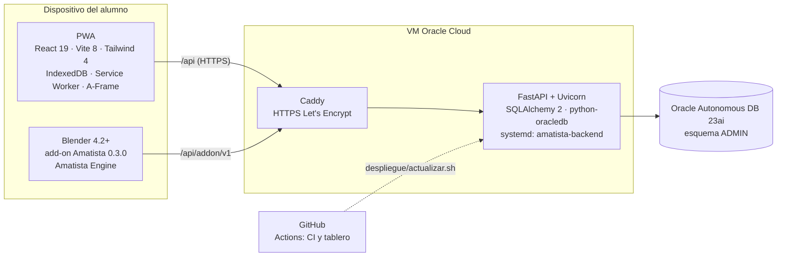

# Herramientas que usa la plataforma

Qué tecnologías, servicios y herramientas forman Amatista, para qué sirve cada una y dónde está en el repositorio. Para quien quiera entender de qué está hecha la plataforma antes de tocarla.

Actualizado: 4 de octubre de 2026 (main en `c730c0e`). Las versiones salen de `frontend/package.json`, `backend/requirements*.txt`, `addon/amatista_blender/blender_manifest.toml` y `.github/workflows/`.

1. [Vista general](#1-vista-general)
2. [PWA (frontend)](#2-pwa-frontend)
3. [API (backend)](#3-api-backend)
4. [Base de datos](#4-base-de-datos)
5. [Blender, motor y add-on](#5-blender-motor-y-add-on)
6. [Servidor y despliegue](#6-servidor-y-despliegue)
7. [Calidad, CI y organización](#7-calidad-ci-y-organización)
8. [Herramientas dentro de la plataforma](#8-herramientas-dentro-de-la-plataforma)
9. [Reservado o planeado](#9-reservado-o-planeado)

---

## 1. Vista general

| Capa | Herramienta | Versión declarada | Dónde |
|---|---|---|---|
| Interfaz | React + React DOM | ^19.2 | `frontend/` |
| Empaquetado | Vite + @vitejs/plugin-react | ^8.3 / ^6.1 | `frontend/vite.config.js` |
| Estilos | Tailwind CSS (vía @tailwindcss/postcss) + PostCSS + Autoprefixer | ^4.3 | `frontend/tailwind.config.js`, `postcss.config.js` |
| Offline | vite-plugin-pwa (Workbox) + IndexedDB | ^1.3 | `frontend/vite.config.js`, `frontend/src/lib/almacen.js` |
| 3D en la web | A-Frame | ^1.8 | `frontend/src/components/leccion/VistaAFrame.jsx` |
| Tipografía | Outfit y JetBrains Mono (@fontsource-variable) | ^5.3 | `frontend/src/main.jsx` |
| API | FastAPI + Uvicorn | ≥0.110 / ≥0.29 | `backend/main.py` |
| ORM | SQLAlchemy | ≥2.0 | `backend/database/` |
| Driver Oracle | python-oracledb (modo thin) | ≥2.0 | `backend/database/` |
| Configuración | python-dotenv | ≥1.0 | `backend/.env.example` |
| Base de datos | Oracle Autonomous Database 23ai (producción) · SQLite (desarrollo y pruebas) | — | `backend/sql/` |
| 3D de escritorio | Blender (extensión con `blender_manifest.toml`) | mínimo 4.2.0 | `addon/` |
| Motor de prácticas | Amatista Engine (Python puro, sin dependencias) | — | `engine/` |
| HTTPS | Caddy | — | `despliegue/Caddyfile` |
| Servicio | systemd | — | `despliegue/amatista-api.service` |
| CI | GitHub Actions | — | `.github/workflows/` |

## 2. PWA (frontend)

| Herramienta | Para qué la usamos |
|---|---|
| **React 19** | Toda la interfaz: cursos, ruta del módulo, lecciones, Mi panel, Admin. Sin router externo: el enrutado es por hash (`#/cursos`, `#/admin/...`) dentro de la propia app. |
| **Vite 8** | Servidor de desarrollo (`npm run dev`) y build de producción (`npm run build`). |
| **Tailwind CSS 4** | Estilos con la paleta Amatista y la identidad low poly ([identidad visual](arquitectura/2026-09-28_identidad_visual_interfaz.txt), [etiquetas y gráficos](plataforma/03_etiquetas_y_graficos.md)). |
| **vite-plugin-pwa** | Manifest, íconos y service worker: la app se instala y abre sin conexión. |
| **IndexedDB** | Progreso, sesión y lecciones guardados en el dispositivo; se sincronizan con `/api` cuando hay red (local primero). |
| **A-Frame** | Escenas 3D dentro de las lecciones (vista 3D en vivo de código, Explorador 3D). Se carga bajo demanda y queda en caché. |
| **SVG propios** | Ilustraciones low poly generadas por `npm run ilustraciones` (`frontend/scripts/ilustraciones.mjs`) y gráficas (`components/graficas/`: anillo de progreso, barras, mapa de calor, medidor) sin librerías externas. |
| **Vitest** | Pruebas unitarias del frontend (`npm test`). |
| **ESLint 10** con `react-hooks` y `react-refresh` | Lint (`npm run lint`). |

Detalle del código: [manual del código › frontend](manual-del-codigo/02_frontend.md).

## 3. API (backend)

| Herramienta | Para qué la usamos |
|---|---|
| **FastAPI** | Rutas de autenticación, progreso, eventos, contenido, administración, niveles, Blender y add-on (`backend/api/`). |
| **Uvicorn** | Servidor ASGI; en la VM corre como servicio systemd detrás de Caddy en `127.0.0.1:8000`. |
| **SQLAlchemy 2** | Modelos y consultas; el mismo código funciona con Oracle y con SQLite. |
| **python-oracledb** | Conexión TLS a Oracle Autonomous (con `DB_DSN` o `DB_HOST/DB_PORT/DB_SERVICE`) y pool de conexiones (`DB_POOL`, `DB_POOL_EXTRA`). |
| **PBKDF2 (biblioteca estándar)** | Hash de contraseñas con 600 000 iteraciones por defecto (`AMATISTA_PBKDF2_ITER`). |
| **SMTP (biblioteca estándar)** | Códigos de confirmación y recuperación por correo (`SMTP_*`); sin `SMTP_HOST` no se envía nada (T-032). |
| **pytest + httpx** | Pruebas del backend con una base SQLite temporal (`backend/tests/`). |

Detalle: [manual del código › backend](manual-del-codigo/03_backend.md) y [backend/README.md](../backend/README.md).

## 4. Base de datos

| Herramienta | Para qué la usamos |
|---|---|
| **Oracle Autonomous Database 23ai** (Oracle Cloud, Free Tier) | Producción: usuarios, sesiones, progreso, eventos, contenido, niveles, versiones de Blender, prácticas. Esquema `ADMIN`. |
| **Scripts `backend/sql/001`–`007`** | Instalación y migraciones aditivas, ejecutadas a mano en Database Actions en el orden de `backend/sql/LEEME.txt`. |
| **Paquete PL/SQL `AMATISTA_AUTOR` y vistas `V_AMATISTA_*`** | Crear niveles y lecciones y revisar el mapa del curso desde Database Actions (006). |
| **Database Actions (SQL Developer Web)** | Donde se ejecutan los scripts y se consulta producción. |
| **`backend/diagnostico_oracle.py`** | Compara las tablas reales con lo que espera el backend. |
| **SQLite** | Desarrollo local (`DATABASE_URL=sqlite:///...`) y todas las pruebas automáticas. |
| **Contenedor `gvenzl/oracle-free`** | Prueba de los scripts contra un Oracle real antes de producción (así se encontraron INC-009 y se probó 007). |

Esquema completo: [base de datos](base-de-datos/README.md).

## 5. Blender, motor y add-on

| Herramienta | Para qué la usamos |
|---|---|
| **Blender 4.2 o posterior** | Donde el alumno hace la práctica de cada módulo. 4.2 es la primera versión con extensiones; la versión principal del curso se decide en T-038. |
| **Add-on «Amatista» 0.3.0** (`addon/amatista_blender/`) | Paneles y tarjetas en Blender: modo Alumno (practicar, pistas, guía y acompañante), Vista previa y modo Desarrollador / Amatista Author. Licencia GPL-3.0-or-later por usar `bpy`. |
| **Amatista Engine** (`engine/amatista_engine/`) | Motor declarativo: lee prácticas `amatista.practice/1`, evalúa objetivos con validadores y, desde la etapa 2, guía paso a paso. Python puro; se prueba sin Blender. |
| **Prácticas JSON** (`practices/`) | Contenido de cada práctica: objetivos, pistas, guía. |
| **Instalador por sistema** (`addon/herramientas/instalador/`) | `.bat` (Windows), `.command` (macOS) y `.sh` (Linux) que buscan Blender, comprueban la versión, instalan el add-on y vinculan la cuenta. |
| **bpy de PyPI (Blender 5.0 como módulo)** | Solo en CI: ejecuta el add-on dentro de un Blender real sin ventana. |

Documentación: [Amatista Engine](motor/README.md) y [manual del código › motor](manual-del-codigo/04_motor_addon_y_practicas.md).

## 6. Servidor y despliegue

| Herramienta | Para qué la usamos |
|---|---|
| **VM de Oracle Cloud (OCI)** | Aloja la API. App en `/home/opc/amatista`. |
| **systemd** | Mantiene la API viva. En la VM la unidad se llama `amatista-backend`; la plantilla del repo es `despliegue/amatista-api.service` y `despliegue/actualizar.sh` detecta cuál existe. |
| **Caddy** | HTTPS automático con Let's Encrypt, cabeceras de seguridad, límite de 1 MB por petición y oculta `/docs` (`despliegue/Caddyfile`, T-005). |
| **`despliegue/actualizar.sh`** | En la VM: `git pull`, dependencias, pytest, reinicio del servicio y prueba de `/api/salud`; si algo falla vuelve al commit anterior. No aplica cambios de esquema. |
| **Cloudflare Pages** (previsto) | Hospedaje de la PWA; ya contemplado en `CORS_ORIGINS` y `frontend/.env.example`. |

Guía completa: [despliegue en OCI](despliegue/2026-10-04_despliegue_oci.md).

## 7. Calidad, CI y organización

| Herramienta | Para qué la usamos |
|---|---|
| **GitHub** | Repositorio oficial `Maximiliano-cabello-mata/amatista`, PR y tags. Commits firmados con SSH. |
| **GitHub Actions · CI** (`.github/workflows/ci.yml`) | En cada push y PR: pytest del backend, validación de módulos, pruebas del tablero, motor y constructor del add-on, add-on dentro de Blender, y lint + vitest + build del frontend. |
| **GitHub Actions · Tablero** (`.github/workflows/tablero.yml`) | Regenera `KANBAN.md` con cada push a partir de `tablero/tareas.yml` y los commits (`T-xxx`, `cierra T-xxx`). |
| **`tablero/actualizar.py`** (PyYAML) | Generador del Kanban. |
| **`herramientas/crear-tags.sh`** | Crea los tags de versión sobre su commit con su fecha. |
| **Claude Code** | Sesiones que trabajan en ramas `claude/*` y entregan por PR; el usuario fusiona. |

Cómo se usan todas: [manual del desarrollador](desarrollador/README.md).

## 8. Herramientas dentro de la plataforma

Lo que alumnos y equipo usan dentro de Amatista.

**Herramientas de enseñanza (20 bloques de lección)**, catálogo en `frontend/src/data/herramientas.js`, detalle en [herramientas de enseñanza](plataforma/04_herramientas_de_ensenanza.md):

Agrupados por las categorías reales del catálogo (`CATEGORIAS`):

| Categoría | Para qué | Bloques |
|---|---|---|
| Explicar | Presentar una idea con texto, imagen o video | Texto, Imagen, Video, Aviso, Código |
| Visualizar | Ordenar la idea en un gráfico | Paso a paso, Atajos de teclado, Comparar, Tarjetas de concepto, Línea de tiempo, Pipeline, Capas |
| Practicar en el navegador | Actividades con respuesta inmediata | Pregunta rápida, Ordenar, Emparejar, Completar, Puntos en imagen, Explorador 3D, Reto de código |
| Practicar en Blender | Llevar lo aprendido a Blender con la guía del motor | Práctica en Blender |

**Herramientas del equipo**: panel de administración (Módulos con la Fórmula Amatista, editor de lecciones con vista previa, Prácticas, Herramientas, Usuarios, Estado con Diagnóstico técnico), modo Desarrollador / Amatista Author del add-on y el paquete `AMATISTA_AUTOR` en Oracle. Cómo usarlas: [manual del desarrollador › herramientas dentro de la plataforma](desarrollador/03_herramientas_dentro_de_la_plataforma.md) y [panel de administración](plataforma/05_panel_de_administracion.md).

## 9. Reservado o planeado

| Herramienta | Estado |
|---|---|
| **Ollama** (tutor IA local) | Reservado: `OLLAMA_URL` en `.env.example` y carpeta `ai_tutor/prompts/` vacía. No hay integración. |
| **Visor y laboratorio GLB** | Fase D de la v3 (T-011). |
| **Motor generativo 3D** | Propuesta ([documento](propuestas/2026-09-27_motor_generativo_3d.txt)). |
| **SMTP real** | Configurable, falta el proveedor (T-032). |
