# La plataforma en cada versión

Recorrido por el código de Amatista en cada versión etiquetada o propuesta: qué pantallas tenía la PWA, qué hacía el backend, qué tablas y qué contenido había, y qué podía hacer un alumno. Es para quien quiera entender cómo llegó la plataforma a su forma actual o necesite revisar una versión vieja.

Actualizado: 4 de octubre de 2026 (main en `c730c0e`). El recorrido llega hasta `v3.0.0-alpha.3`; lo que vino después (alpha.4 a alpha.9 y Motor 3.5.1) está en la [cronología](01_cronologia.md).

- [Cómo se hizo este recorrido](#cómo-se-hizo-este-recorrido)
- [Las dos historias del repositorio](#las-dos-historias-del-repositorio)
- [v0.1.0 · Prototipo (`0772159`, 27 sep)](#v010--prototipo-0772159-27-de-septiembre)
- [v1.0.0 · Integración (`cde262b`, 28 sep)](#v100--integración-cde262b-28-de-septiembre)
- [v2.0.0 · Plataforma educativa (`0ea0e8a`, 29 sep)](#v200--plataforma-educativa-0ea0e8a-29-de-septiembre)
- [v2.0.1 · Repositorio oficial (`573ea89`, 1 oct)](#v201--repositorio-oficial-573ea89-1-de-octubre)
- [v2.2.0-alpha.1 · Plataforma unificada (`f68c704`, 2 oct)](#v220-alpha1--plataforma-unificada-f68c704-2-de-octubre)
- [v2.2.0-alpha.2 · Panel de administración (`88dd539`, 2 oct)](#v220-alpha2--panel-de-administración-88dd539-2-de-octubre)
- [PR #11 · Cierre del 2 de octubre (`ec52200`)](#pr-11--cierre-del-2-de-octubre-ec52200)
- [v3.0.0-alpha.1 · Reestructuración v3 (`2337fd5`, 3 oct)](#v300-alpha1--reestructuración-v3-2337fd5-3-de-octubre)
- [v3.0.0-alpha.2 · Amatista Engine (`ec849d8`, 3 oct)](#v300-alpha2--amatista-engine-ec849d8-3-de-octubre)
- [v3.0.0-alpha.3 · Motor etapa 2 y plataforma por módulos (`d004071`, 3–4 oct)](#v300-alpha3--motor-etapa-2-y-plataforma-por-módulos-d004071-3-y-4-de-octubre)
- [Tabla de evolución: versión × capacidad](#tabla-de-evolución-versión--capacidad)
- [Tabla de crecimiento: archivos y líneas](#tabla-de-crecimiento-archivos-y-líneas)
- [Qué se quitó o cambió de nombre](#qué-se-quitó-o-cambió-de-nombre)
- [Cómo revisar una versión vieja por tu cuenta](#cómo-revisar-una-versión-vieja-por-tu-cuenta)
- [Inconsistencias encontradas](#inconsistencias-encontradas)

La cronología commit por commit está en [01_cronologia.md](01_cronologia.md). Aquí se describe el **resultado** de cada versión, no el camino.

---

## Cómo se hizo este recorrido

1. Cada versión se abrió en un `git worktree` temporal y se leyó su código: `frontend/src/rutas.js` y `App.jsx` (pantallas), `backend/main.py` y `backend/api/*.py` (endpoints, buscando `@router.`), `backend/database/modelos.py` y `backend/sql/*.sql` (tablas), `frontend/src/data/` (contenido) y `CHANGELOG.md`.
2. Los conteos salen de `git ls-tree -r` y `wc -l`. Las líneas **no cuentan** `package-lock.json` ni archivos binarios (PNG). Los números de pruebas se obtuvieron contando `def test_` (Python) y `it(`/`test(` (Vitest) con `git grep`; son aproximados (no cuentan los casos parametrizados).
3. Las capturas se tomaron construyendo el frontend de cuatro versiones (`npm ci` + `vite build`) y abriéndolo con Chromium headless (Playwright) a 1000 px de ancho, **sin backend**: todas las llamadas a la API se bloquearon a propósito para no tocar el servidor de producción (`http://158.101.118.222:8000`, la URL por defecto en `frontend/src/services/api.js`). Lo que depende del backend aparece vacío o como «sin respuesta», y así se indica en cada pie de foto. El service worker se desactivó en las capturas.

## Las dos historias del repositorio

El repositorio guarda **dos historias de git sin un ancestro común**:

| Historia | Repositorio de origen | Autores | Versiones |
|---|---|---|---|
| Original | `MAXIMILIANO1234345/amatista` | Kaneda343, MAXIMILIANO1234345 y Claude | tags `v0.1.0`, `v1.0.0`, `v2.0.0`, `v2.0.1` |
| Actual (`main`) | `Maximiliano-cabello-mata/amatista` | MAXIMILIANO CABELLO MATA, Claude y el bot del tablero | empieza en `71bdbb1` «Add files via upload» (1 oct); tag `v2.2.0-alpha.1` y las versiones propuestas siguientes |

`71bdbb1` no desciende de `v2.0.1`, pero su contenido es **el mismo árbol de `v2.0.1` más 12 archivos** (tablero Kanban, `PROYECTO.md`, `KANBAN.md`, el plan de lanzamiento, `herramientas/crear-tags.sh`, `.github/workflows/tablero.yml` y una nota de versiones). Es decir, el código se subió a mano al repositorio nuevo y la historia vieja quedó solo en los tags. Por eso `git log v2.0.1..main` muestra todo `main` como si fuera nuevo.

Tags publicados al 4 de octubre (`git tag`): `v0.1.0`, `v1.0.0`, `v2.0.0`, `v2.0.1`, `v2.2.0-alpha.1`. Las versiones `v2.2.0-alpha.2`, `v3.0.0-alpha.1`, `v3.0.0-alpha.2` y `v3.0.0-alpha.3` son **propuestas**: las cuatro están en [`herramientas/crear-tags.sh`](../../herramientas/crear-tags.sh) (alpha.3 desde el 4 de octubre) pero no se han publicado.

---

## v0.1.0 · Prototipo (`0772159`, 27 de septiembre)

**Qué era:** la estructura del monorepo y una sola pantalla de muestra, hecha por Kaneda343 en el primer día.

**Cómo se veía y qué podía hacer un usuario:** nada más que mirar. `frontend/src/App.jsx` (50 líneas) dibuja una barra con «AMATISTA.PWA» y una etiqueta fija «Estado: Online» (no consultaba nada), un panel lateral «Tutor IA» con el texto «Esperando conexión con el túnel de Ollama...» y un visor A-Frame con tres figuras (caja morada, esfera cian, cilindro blanco) sobre un plano. No había rutas, ni lecciones, ni botones.

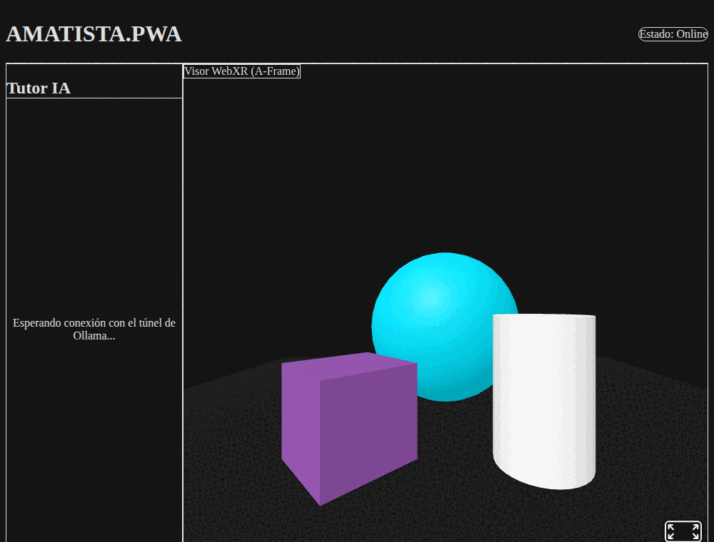

*v0.1.0 tal como se construye hoy. Los estilos casi no se aplican: `src/index.css` usa las directivas de Tailwind v3 (`@tailwind base;`…) con el plugin de PostCSS de Tailwind v4, que no genera las utilidades. Se corrigió en `965f005` (v1.0.0). A-Frame 1.5.0 se cargaba desde el CDN `aframe.io` en `index.html`; para la captura se sirvió la misma versión desde el paquete npm porque la red del entorno bloquea `aframe.io`.*

| Parte | Estado en v0.1.0 |
|---|---|
| PWA | `index.html` registra `/sw.js`, pero `public/sw.js` y `public/manifest.json` están **vacíos** (0 líneas): no funcionaba sin conexión ni era instalable. |
| Dependencias | `react` y `react-dom` 19; desarrollo: Vite 8, Tailwind 4, ESLint 10, PostCSS/autoprefixer. A-Frame por CDN. |
| Backend | Solo carpetas: `backend/main.py` y `backend/requirements.txt` vacíos, `backend/api/.gitkeep`, `backend/database/.gitkeep`. |
| IA | `ai_tutor/prompts/.gitkeep` (vacío; sigue vacío hasta hoy). |
| Configuración | `.env.example` con `DB_USER`, `DB_PASSWORD`, `DB_HOST` y `OLLAMA_URL`. |
| Documentación | `docs/arquitectura.txt` (las 5 secciones planeadas: Dashboard, Ruta de aprendizaje, Aula interactiva, Gestor offline, Perfil), `docs/convencion_commits.txt`, `docs/mit.txt` (en realidad un reporte del app shell) y `docs/mindmap.png`. |
| Tamaño | 33 archivos; 18 en `frontend/` con ~420 líneas sin el lockfile. |

## v1.0.0 · Integración (`cde262b`, 28 de septiembre)

**Qué cambió:** la pantalla se conectó a un backend FastAPI con Oracle Autonomous Database, pero **el código del backend no estaba en el repositorio** (el `CHANGELOG.md` lo dice en «Pendiente conocido»). El backend corría en la VM `158.101.118.222`; su código solo aparece citado dentro de `docs/arquitectura/2026-09-27_backend_y_base_de_datos.txt`.

**Qué podía hacer un usuario:** en la misma pantalla de v0.1.0, el panel lateral pasó a «Gestor de Base de Datos» con un botón **«Crear Nueva Sesión (Prueba)»**. Al pulsarlo, `frontend/src/services/api.js` hacía `POST /api/iniciar-sesion` con el correo fijo `alumno_prueba@amatista.local` y mostraba el ID de usuario y el UUID de sesión que devolvía Oracle. La etiqueta de estado ahora sí consultaba `GET /` y decía «Oracle: Conectado» o «Oracle: Desconectado».

| Parte | Estado en v1.0.0 |
|---|---|
| Pantallas | Una (`App.jsx`, 104 líneas). |
| Endpoints usados | `GET /` y `POST /api/iniciar-sesion` (servidor fuera del repo). |
| Tablas (según la documentación) | `usuarios`, `sesiones`, `progreso_lecciones`. |
| Estilos | Tailwind v4 bien configurado (`@import "tailwindcss"; @config ...`). |
| Se quitó | `App.css`, `assets/hero.png`, `react.svg`, `vite.svg` y el `postcss.config.js` duplicado de la raíz. |
| Documentación | `docs/` se ordena en `arquitectura/`, `bitacora/`, `incidencias/` y `propuestas/` con fecha en el nombre; aparecen `CHANGELOG.md`, las incidencias ORA-01400 y «puerto ocupado y CORS», y las propuestas «Amatista 3D Lab» y «motor generativo 3D». El `README.md` crece a 619 líneas. |
| Tamaño | 38 archivos; `frontend/` ~320 líneas, `docs/` ~1 350. |

## v2.0.0 · Plataforma educativa (`0ea0e8a`, 29 de septiembre)

**Qué cambió:** el salto más grande de la historia original. Amatista deja de ser una pantalla de prueba y se vuelve un sitio de cursos: identidad visual low poly, navegación por rutas, lecciones reales, progreso guardado en el dispositivo y PWA que funciona sin conexión. El backend entra por fin al repositorio.

**Qué podía hacer un alumno:**

- Abrir la portada «Elige tu curso» y ver dos cursos: **Blender** (4 módulos, 1 publicado) y **A-Frame** (4 módulos, 1 publicado).
- Entrar a un curso y ver el mapa del módulo, con lecciones que se **desbloquean en orden**.
- Leer lecciones con línea de tiempo, tarjetas que se voltean, pipeline ilustrado, capas, avisos, código con **vista A-Frame en vivo** y un examen final.
- Ganar XP e insignias («Explorador 3D», «Arquitecto WebXR»), guardadas en IndexedDB; si el backend respondía, el progreso se enviaba a `/api/progreso`.
- Instalar la app y usarla sin Internet.
- Abrir el «Laboratorio técnico» (`#/laboratorio`, enlazado en el pie de la portada) con el estado del backend y de la base, el botón de sesión de prueba heredado de v1.0.0 y el visor A-Frame.

| Pantalla | Ruta (hash) | Archivo |
|---|---|---|
| Elige tu curso | `#/` | `frontend/src/pages/Inicio.jsx` |
| Curso (mapa del módulo) | `#/curso/:curso` | `pages/Curso.jsx` |
| Lección | `#/curso/:curso/leccion/:leccion` | `pages/Leccion.jsx` |
| Laboratorio técnico | `#/laboratorio` | `pages/Laboratorio.jsx` (carga A-Frame bajo demanda) |

<table>
<tr>
<td>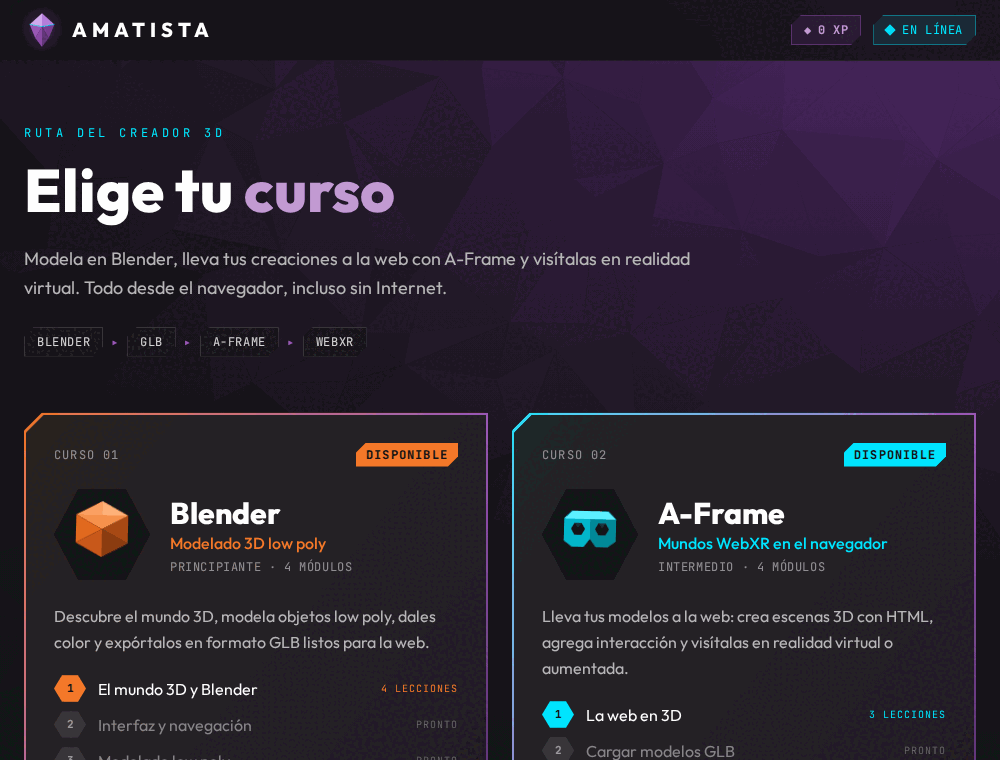</td>
<td>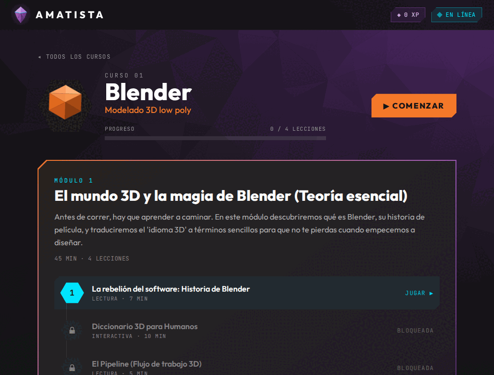</td>
</tr>
<tr>
<td><em>Portada «Elige tu curso». Funciona sin backend: el catálogo viaja dentro de la app.</em></td>
<td><em>Curso Blender: el Módulo 1 con sus 4 lecciones; solo la primera está desbloqueada.</em></td>
</tr>
<tr>
<td>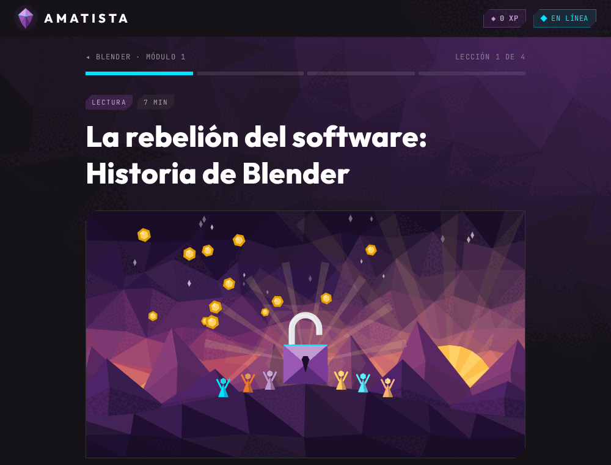</td>
<td>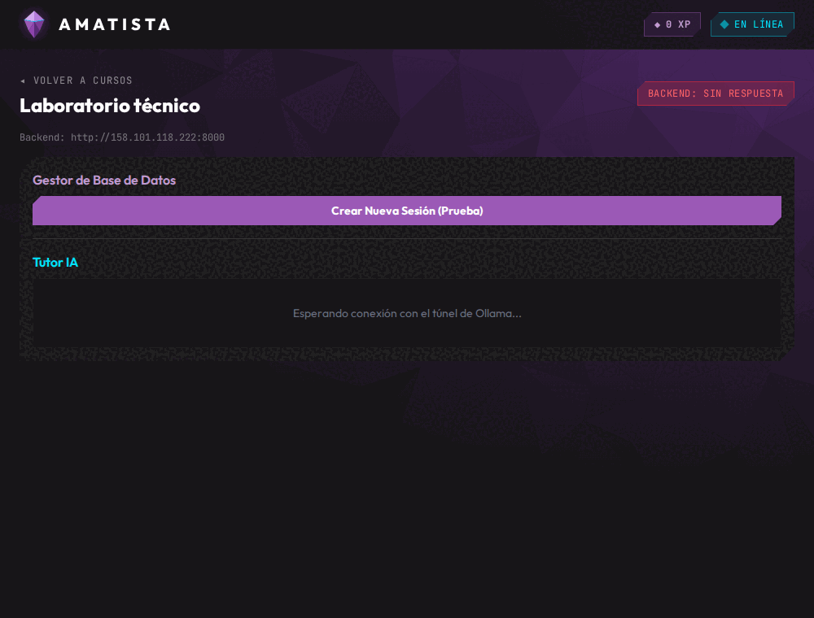</td>
</tr>
<tr>
<td><em>Primera lección del Módulo 1, con su ilustración SVG.</em></td>
<td><em>Laboratorio técnico: sin backend muestra «Backend: sin respuesta»; el botón de sesión de prueba no funciona sin servidor.</em></td>
</tr>
</table>

**Contenido** (`frontend/src/data/cursos.js` y `data/modulos/*.json`):

| Módulo | Lecciones (tipo) |
|---|---|
| Blender · Módulo 1 «El mundo 3D y la magia de Blender» | `les_001` Historia de Blender (lectura), `les_002` Diccionario 3D para humanos (interactiva), `les_003` El pipeline (lectura), `les_004` Examen: fundamentos del 3D |
| A-Frame · Módulo 1 «La web en 3D» | `les_af_001` ¿Qué es A-Frame y WebXR? (lectura), `les_af_002` «Hola mundo» en realidad virtual (código), `les_af_003` Prueba de progreso (examen) |

Bloques de contenido que sabía dibujar `components/leccion/BloqueContenido.jsx`: `markdown_text`, `image`, `concept_cards`, `timeline`, `pipeline`, `layers`, `callout`, `code_snippet`, `video_player`, más el tipo de lección `code_interactive` (con `VistaAFrame.jsx`) y `exam` (`Examen.jsx`).

**Backend** (primera vez en el repo; FastAPI `version="0.2.0"`, Oracle o SQLite):

| Método | Ruta | Archivo |
|---|---|---|
| GET | `/` | `backend/main.py` |
| GET | `/api/salud` | `backend/main.py` |
| POST | `/api/iniciar-sesion` | `backend/api/sesiones.py` |
| POST | `/api/progreso` | `backend/api/progreso.py` |
| GET | `/api/progreso/{usuario_id}` | `backend/api/progreso.py` |

Tablas: `usuarios`, `sesiones`, `progreso_lecciones` (`backend/sql/001_esquema_amatista.sql` y `database/modelos.py`). Herramienta: `backend/diagnostico_oracle.py`. Pruebas: 14 (`backend/tests/`).

**Dependencias nuevas del frontend:** `aframe` 1.8 (por npm, ya no por CDN), `@fontsource-variable/outfit`, `@fontsource-variable/jetbrains-mono` y, en desarrollo, `vite-plugin-pwa` (manifest «Amatista · Aprende 3D para la web», service worker con precache). Script `npm run ilustraciones` (`frontend/scripts/ilustraciones.mjs`) que genera las ilustraciones SVG de `public/ilustraciones/`.

**Componentes (17 `.jsx`):** `BarraSuperior`, `FondoLowPoly`, `TarjetaCurso`, `EstadoGuardado`, `Iconos` y la carpeta `components/leccion/` (`Aviso`, `BloqueCodigo`, `BloqueContenido`, `Capas`, `Examen`, `Figura`, `IconosLeccion`, `LineaTiempo`, `Markdown`, `Pipeline`, `TarjetasConcepto`, `VistaAFrame`). Progreso en `progreso/ProgresoProvider.jsx` y `progreso/reglas.js`; almacenamiento en `lib/almacen.js`.

## v2.0.1 · Repositorio oficial (`573ea89`, 1 de octubre)

**Mismo código que v2.0.0.** Solo cambian `CHANGELOG.md` y `README.md` (3 líneas): los enlaces apuntan al repositorio nuevo `Maximiliano-cabello-mata/amatista` y los commits pasan a firmarse con SSH. El `CHANGELOG.md` de la versión siguiente aclara que este tag reemplaza a un `v0.2.0` que apuntaba a la misma versión.

Para un usuario no hay ninguna diferencia con v2.0.0.

## v2.2.0-alpha.1 · Plataforma unificada (`f68c704`, 2 de octubre)

**Qué cambió:** primera versión de la historia actual. Aparecen las **cuentas** con roles (alumno, profesor, admin), el **panel del alumno**, el **contenido administrable** desde el servidor, **7 bloques interactivos** nuevos, un esquema Oracle pensado para 20 GB, CI y archivos de despliegue. El tag dice explícitamente: «Falta el panel de administración en la PWA».

**Qué podía hacer un alumno:**

- Ver una portada nueva, «Aprende 3D creando, no mirando», con botón «Empezar ahora»/«Continuar» que lleva a la siguiente lección.
- **Crear cuenta, confirmar el correo con un código, entrar, recuperar la contraseña y editar su perfil.** Sin cuenta seguía funcionando como «Creador anónimo»; al entrar, el progreso local se fusionaba con la cuenta (`backend/api/fusion.py`).
- Usar **Mi panel**: nivel y título, XP, racha, «Continúa donde te quedaste», avance por curso, retos, mapa de calor de actividad, exámenes e insignias, y una sección «Próximamente» (Tutor IA, Galería de proyectos, Retos de la comunidad).
- Resolver preguntas rápidas, emparejar, ordenar, completar huecos, explorar escenas A-Frame, puntos sobre imagen y retos de código dentro de las lecciones.
- Un profesor o admin veía en `#/admin` solo un título y tres enlaces: la página era un **marcador** (`pages/admin/Admin.jsx`, 28 líneas, «Versión mínima»).

| Pantalla | Ruta | Archivo |
|---|---|---|
| Portada | `#/` | `pages/Inicio.jsx` |
| Mi panel | `#/panel` | `pages/Panel.jsx` + `components/panel/*` |
| Curso / Lección | `#/curso/:c`, `#/curso/:c/leccion/:l` | `pages/Curso.jsx`, `pages/Leccion.jsx` |
| Laboratorio técnico | `#/laboratorio` (ya en la barra superior) | `pages/Laboratorio.jsx` |
| Entrar, Registro, Confirmar, Recuperar, Perfil | `#/entrar`, `#/registro`, `#/confirmar`, `#/recuperar`, `#/perfil` | `pages/cuenta/*` |
| Administración (marcador) | `#/admin`, `#/admin/usuarios[/:id]`, `#/admin/contenido[/...]` | `pages/admin/Admin.jsx` |

La barra superior pasa a tener **Cursos · Mi panel · Laboratorio** (y Admin para el equipo), contador de XP y botón «Entrar».

<table>
<tr>
<td>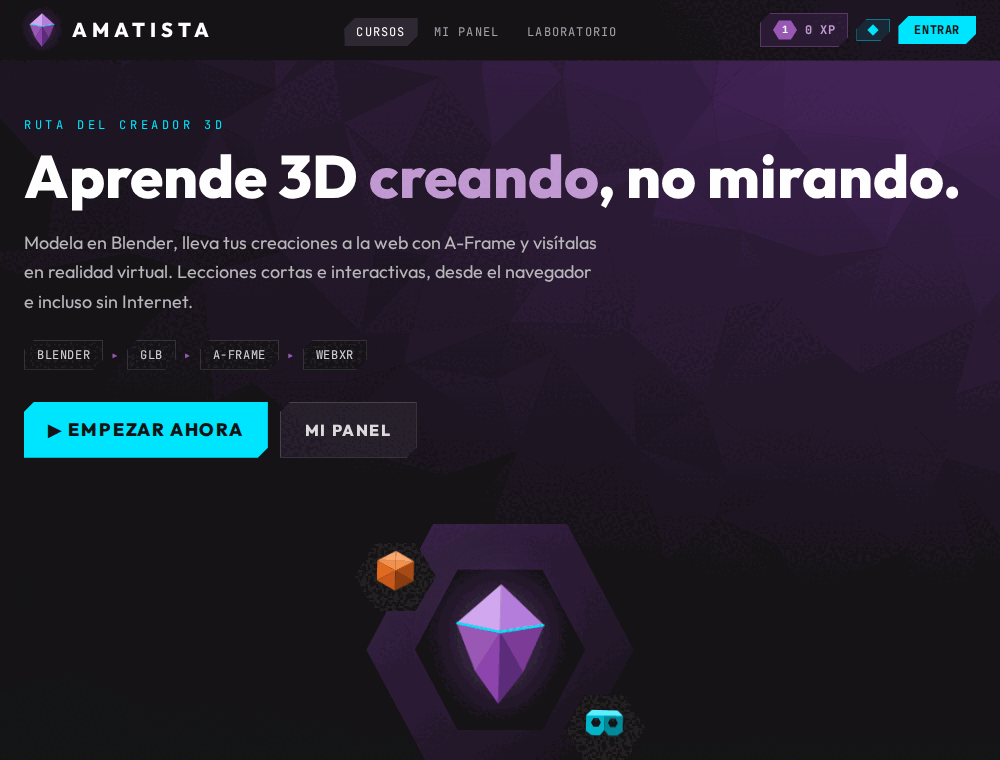</td>
<td>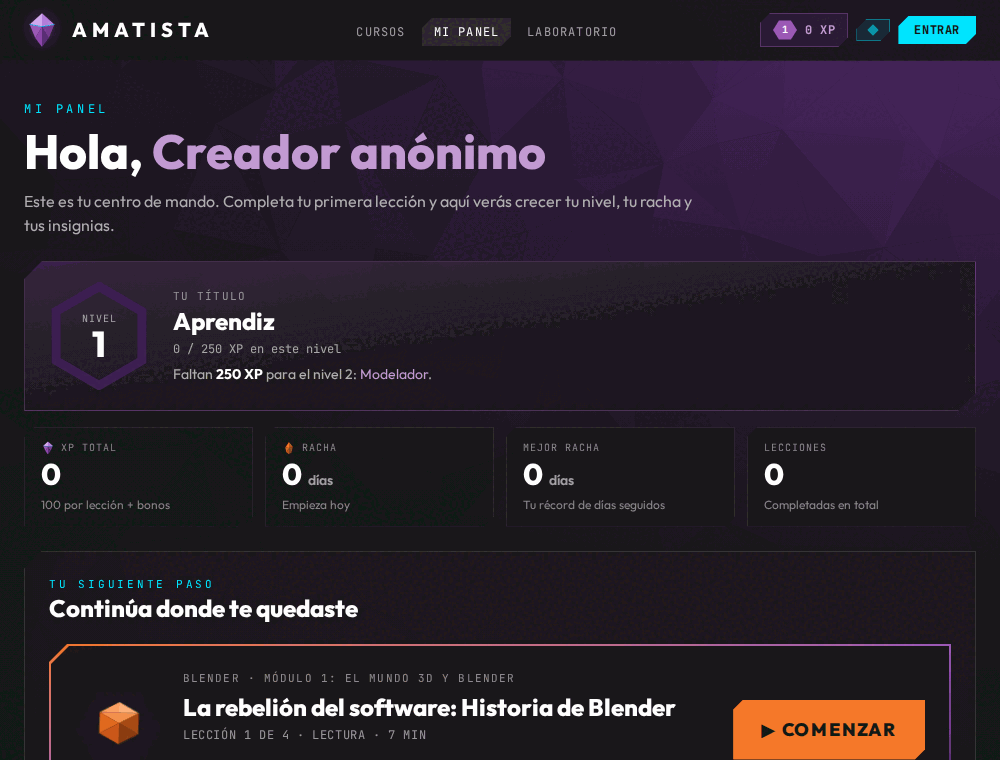</td>
</tr>
<tr>
<td><em>Portada nueva con el emblema low poly y los botones «Empezar ahora» y «Mi panel».</em></td>
<td><em>Mi panel de un alumno sin cuenta y sin avance (todo sale del progreso local).</em></td>
</tr>
<tr>
<td>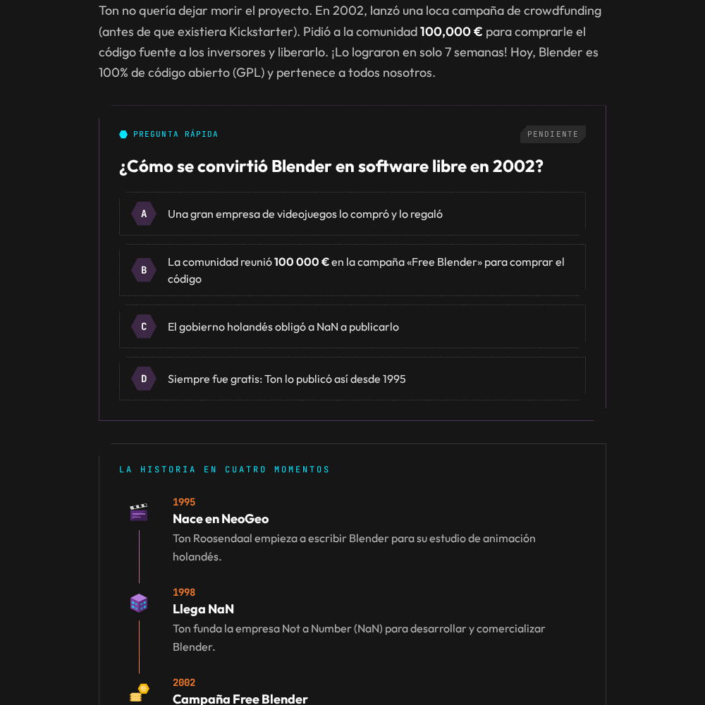</td>
<td>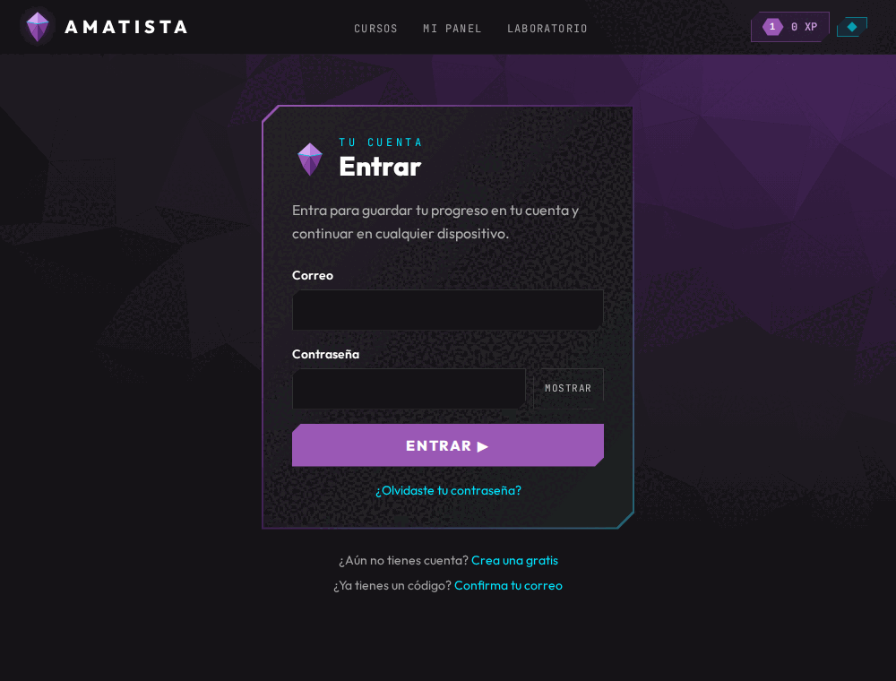</td>
</tr>
<tr>
<td><em>Recorte de la primera lección: el bloque nuevo «Pregunta rápida» (<code>quiz_inline</code>) junto a la línea de tiempo. El fondo se pierde en la captura de página completa.</em></td>
<td><em>Formulario «Entrar». Sin backend no se puede iniciar sesión.</em></td>
</tr>
</table>

**Contenido:** los mismos dos módulos, enriquecidos (el JSON de Blender pasa de 244 a 426 líneas) con los bloques interactivos `quiz_inline`, `matching`, `ordering`, `fill_blanks`, `hotspots`, `scene_explorer` y `code_challenge` (`components/leccion/interactivos/`). El catálogo ahora se combina con el del servidor (`catalogo/CatalogoProvider.jsx`, `catalogo/combinar.js`): un módulo publicado en Oracle reemplaza al marcador «Próximamente».

**Backend** (`backend/main.py` incluye 6 routers):

| Grupo | Rutas |
|---|---|
| `/api/auth` (`api/auth.py`) | `POST registro`, `iniciar-sesion`, `cerrar-sesion`, `cerrar-todas`, `confirmar-correo`, `reenviar-codigo`, `recuperar`, `restablecer`, `cambiar-password`; `GET`/`PATCH yo` |
| `/api` (`sesiones.py`, `progreso.py`, `eventos.py`) | `POST iniciar-sesion` (heredado, anónimo), `POST progreso`, `GET progreso`, `GET progreso/{usuario_id}`, `POST eventos` |
| `/api/admin` (`admin.py`) | `GET resumen`, `GET usuarios`, `GET`/`PATCH usuarios/{id}`, `POST mantenimiento/purgar`, `GET salud-detallada` |
| `/api/contenido` (`contenido.py`) | `GET catalogo`, `admin/arbol`, `plantillas`, `modulos/{id}/exportar`, `lecciones/{c}/{l}`; `POST validar`; crear/editar/publicar/archivar cursos, módulos y lecciones; mover lecciones |
| raíz | `GET /`, `GET /api/salud` |

Tablas (8): `usuarios`, `sesiones`, `progreso_lecciones`, `logros`, `eventos_aprendizaje`, `cursos`, `modulos`, `lecciones`. Scripts `backend/sql/001` a `004` (esquema, autenticación/contenido/eventos, mantenimiento, usuario de aplicación) con `LEEME.txt`. Herramientas: `backend/herramientas/contenido.py` (CLI de contenido) y `crear_admin.py`. Pruebas: ~165 en backend, ~132 en frontend (Vitest, nuevo script `npm test`) y ~6 del tablero.

**Fuera del código de la app:** `despliegue/` (`Caddyfile`, `amatista-api.service`, `actualizar.sh`), `.github/workflows/ci.yml` y `tablero.yml`, `tablero/` (generador del Kanban), `KANBAN.md`, `PROYECTO.md`, `herramientas/crear-tags.sh`.

Dependencias del frontend: iguales a v2.0.0 más `vitest` en desarrollo. `backend/requirements.txt` sin cambios (`fastapi`, `uvicorn`, `sqlalchemy`, `oracledb`, `python-dotenv`).

## v2.2.0-alpha.2 · Panel de administración (`88dd539`, 2 de octubre)

**Qué cambió:** solo el frontend (commit `9171822`). El marcador de `#/admin` se reemplaza por un **panel de administración completo** con navegación lateral (`components/admin/NavAdmin.jsx`):

| Sección | Ruta | Archivo | Qué hace |
|---|---|---|---|
| Resumen | `#/admin` | `pages/admin/Resumen.jsx` | métricas del lanzamiento |
| Usuarios / Usuario | `#/admin/usuarios[/:id]` | `Usuarios.jsx`, `Usuario.jsx` | búsqueda, detalle, rol, cuentas de prueba, confirmar correo |
| Contenido | `#/admin/contenido` | `Contenido.jsx` | crear módulo con la Fórmula, publicar, archivar, reordenar, exportar |
| Editor de lección | `#/admin/contenido/:c/:l`, `.../nueva/:modulo` | `EditorLeccion.jsx` | edición con vista previa |
| Sistema | `#/admin/sistema` (nueva) | `Sistema.jsx` | salud y purga, solo admin |

Un profesor puede consultar todo; solo el administrador modifica («Entraste como profesor: puedes consultar todo…»). El backend y las tablas no cambian. Para un alumno no hay diferencias. Sin backend, el panel solo muestra la pantalla «Área de profesores» que pide entrar.

## PR #11 · Cierre del 2 de octubre (`ec52200`)

Casi todo es documentación y orden. Lo que toca código:

- `backend/database/modelos.py` y `sql/002`: `SESIONES.ID` se amplía y el JSON de Oracle se lee como texto (incidencia documentada en `docs/incidencias/`).
- La documentación se reorganiza: aparecen `docs/README.md`, `docs/guias/` (convención de commits y versiones), `docs/despliegue/2026-10-02_oracle_paso_a_paso.md`, `docs/incidencias/README.md`, la Fórmula Amatista (`docs/arquitectura/2026-10-02_formula_modulos.txt`) y dos bitácoras.
- El tablero suma tareas del piloto y `crear-tags.sh` incluye `v2.2.0-alpha.2`.

La PWA es la misma que en `88dd539`.

## v3.0.0-alpha.1 · Reestructuración v3 (`2337fd5`, 3 de octubre)

**Qué cambió:** el curso se reorganiza **por niveles** y se preparan las versiones de Blender y las herramientas de autor, todo del lado del servidor y la documentación. **La PWA no cambia** salvo una línea: `blender-modulo-1.json` gana `"nivel": "blender-n1"`.

- **Oracle 005** (aditivo): tablas `niveles`, `habilidades`, `habilidades_alumno`, `evaluaciones_rubrica`, `versiones_blender`, `verificaciones_blender` y la columna `MODULOS.NIVEL_ID`. Total: **14 tablas** en `modelos.py`.
- **Oracle 006**: vistas `V_AMATISTA_MAPA`, `V_AMATISTA_FICHAS_INCOMPLETAS`, `V_AMATISTA_COMPATIBILIDAD` y el paquete `AMATISTA_AUTOR` para crear niveles y lecciones desde Database Actions.
- **API nueva:** `/api/contenido/niveles` (GET, POST, PUT `/{id}`, POST `/sembrar`), `GET /api/contenido/mapa/{curso_id}` (`api/niveles.py`) y `/api/blender` (`GET versiones`, `PUT versiones/{version}`, `POST verificaciones`, `GET compatibilidad`; `api/blender.py`).
- **CLI** `backend/herramientas/contenido.py`: subcomandos `validar`, `importar`, `exportar`, `nuevo-modulo`, `nueva-leccion`, `mapa`, `sembrar-niveles`.
- **Documentación:** nace `docs/reestructuracion/` (plan maestro, modelo de contenido, [manual de Oracle](../reestructuracion/02_manual_oracle.md), guía del add-on). El tablero de la v2 se archiva en `tablero/historico/`.

## v3.0.0-alpha.2 · Amatista Engine (`ec849d8`, 3 de octubre)

**Qué cambió:** llega la práctica **dentro de Blender**. Aparecen tres carpetas nuevas en la raíz y la PWA gana las pantallas para conectar Blender.

- **`engine/`** (Amatista Engine 0.2.0, Python puro): lee prácticas `amatista.practice/1`, evalúa una foto de la escena y decide progreso, pistas y autonomía. Paquetes `practice/`, `validators/`, `pedagogy/`, `tools/` y `blender/` (único con `bpy`). Documentación en [docs/motor/](../motor/README.md).
- **`addon/`** (add-on «Amatista» 0.2.0 para Blender 4.2+): modos Alumno y Desarrollador (Amatista Author), paneles, HUD, diálogos, 9 iconos PNG y `herramientas/construir.py`, que arma el `.zip` y un paquete con instalador por sistema.
- **`practices/`**: la primera práctica, `practices/blender/level_1/mesa.json` («Construir una mesa», 7 objetivos) y `practices/sandbox/table.json`.
- **Oracle 007**: tablas `addon_vinculos`, `practicas`, `practica_versiones`, `progreso_practicas` (**18 tablas** en total).
- **API `/api/addon/v1`** (`backend/api/addon.py`, 914 líneas): `estado`, vínculos por código (`vinculos`, `vinculos/confirmar`, `vinculos/{id}/estado`), `yo`, `salir`, `dispositivos`, prácticas (listar, ver, crear, publicar, archivar, versiones, sincronizar, abrir, `practica-actual`), `intentos`, `mi-progreso`, `descargas/{sistema}`, `extension.zip` y `extensiones/index.json`.

**Qué podía hacer un alumno nuevo:**

- Ir a la pestaña **Blender** de la barra superior (`#/blender`, `pages/Blender.jsx`): descargar el paquete para su sistema, ver la compatibilidad y sus Blender conectados.
- Conectar su Blender con un código (`#/vincular`, `pages/Vincular.jsx`).
- Encontrar en las lecciones el bloque `blender_practice` (`interactivos/PracticaBlender.jsx`) y su avance en Blender dentro de Mi panel (`components/panel/BlenderPanel.jsx`).
- Admin gana la sección **Prácticas** (`#/admin/practicas`, `pages/admin/Practicas.jsx`).

**Contenido:** nuevo `blender-modulo-2.json` («Interfaz y navegación»: «Amatista dentro de tu Blender», «Muévete por la vista 3D», «Práctica: construye una mesa») con `"estado": "revision"`. Como no está publicado, **la app sin servidor lo sigue mostrando como «Próximamente»**; solo aparece si Oracle lo publica.

Barra superior: **Cursos · Mi panel · Laboratorio · Blender** (+ Admin).

## v3.0.0-alpha.3 · Motor etapa 2 y plataforma por módulos (`d004071`, 3 y 4 de octubre)

**Qué cambió:** el motor aprende a **guiar paso a paso** y la plataforma adopta una **estructura fija**. En el código y en el `CHANGELOG.md` esta etapa se llama «Plataforma por módulos (v3.1)»; el nombre `v3.0.0-alpha.3` es solo la propuesta de tag. Era el estado de `main` el 4 de octubre (`c730c0e` solo añade una actualización del tablero).

- **Motor 0.3.0:** `engine/amatista_engine/guide/` (`coach.py`, `companion.py`, `models.py`): qué hacer, teclas, resaltados y la acción «Hazlo conmigo»; el acompañante felicita, avisa y ofrece ayuda. **Add-on 0.3.0:** `guia.py`, `interfaz/visor3d.py` (guía dibujada en la vista 3D), `interfaz/estilo.py` y preferencias de acompañamiento. Ver [docs/motor/etapas/](../motor/etapas/).
- **Sin cambios en Oracle** (siguen 7 scripts y 18 tablas). El backend solo valida la nueva regla de práctica al cierre del módulo (`backend/contenido/validacion.py`).

**Cómo se ve para el alumno:**

- La barra superior queda en **Cursos · Mi panel** (+ Admin para el equipo). La pestaña Blender desaparece: la instalación pasa a **«Mi Blender»** en el menú de la cuenta y a la práctica de cada módulo (`blender/PrepararBlender.jsx`).
- El curso muestra la ruta de cada módulo y su **estación de Blender** al cierre (`components/modulo/RutaModulo.jsx`, `EstacionBlender.jsx`, regla en `modulos/practica.js`), con un sistema común de etiquetas (`components/etiquetas/`).
- Tres herramientas de lección nuevas: **Paso a paso** (`step_by_step`), **Atajos de teclado** (`shortcuts`) y **Comparar** (`compare`) (`components/leccion/PasoAPaso.jsx`, `Atajos.jsx`, `Comparar.jsx`, `Tecla.jsx`). El catálogo `frontend/src/data/herramientas.js` reúne **20 herramientas** en cuatro categorías (Explicar, Visualizar, Practicar en el navegador, Practicar en Blender).
- El «Laboratorio técnico» se convierte en **«Diagnóstico técnico»**, solo para profesores y admins, abierto desde Admin › Estado; se quitan el botón «Crear Nueva Sesión (Prueba)» y la caja «Tutor IA» que venían de v1.0.0.
- El panel de administración se agrupa: Resumen · **Enseñanza** (Módulos, Prácticas de Blender, Herramientas) · **Personas** (Usuarios) · **Sistema** (Estado). «Contenido» pasa a llamarse **Módulos** y se agrega `#/admin/herramientas` (`pages/admin/Herramientas.jsx`).

<table>
<tr>
<td>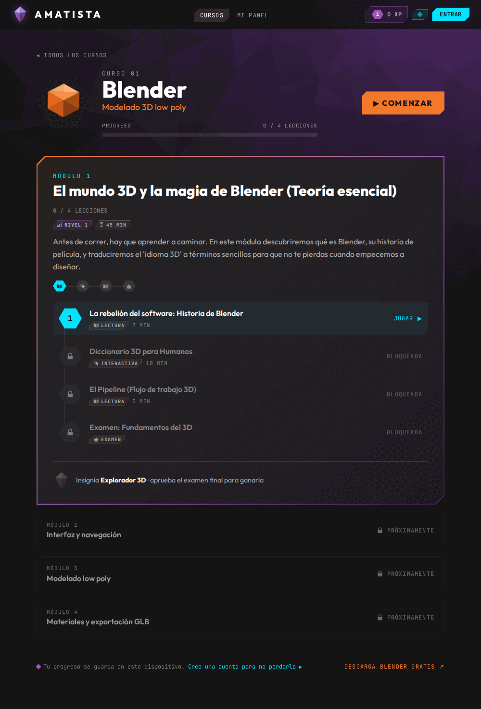</td>
<td>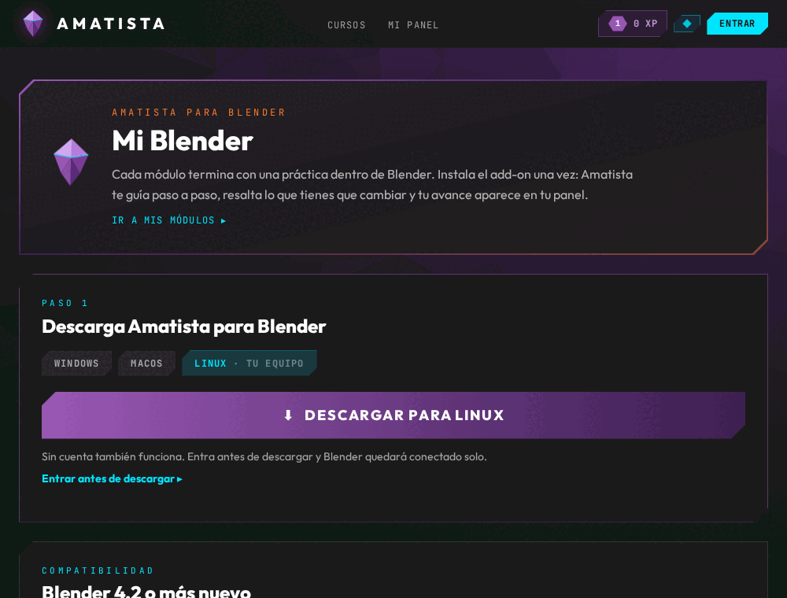</td>
</tr>
<tr>
<td><em>Curso Blender con etiquetas (nivel, duración, tipo de lección) y la insignia del módulo. Sin backend, el Módulo 2 (en revisión) aparece como «Próximamente».</em></td>
<td><em>«Mi Blender»: descarga del paquete por sistema (detecta Linux en la captura). La descarga, la vinculación y la lista de dispositivos necesitan el backend.</em></td>
</tr>
</table>

Para el detalle actual de cada pantalla, ver [docs/plataforma/01_mapa_de_la_plataforma.md](../plataforma/01_mapa_de_la_plataforma.md), [02_modulos_y_practica.md](../plataforma/02_modulos_y_practica.md), [04_herramientas_de_ensenanza.md](../plataforma/04_herramientas_de_ensenanza.md) y [05_panel_de_administracion.md](../plataforma/05_panel_de_administracion.md).

---

## Tabla de evolución: versión × capacidad

✔ = existe y funciona en el código; ◐ = parcial o solo marcador; — = no existe. `alpha.N` abrevia `v2.2.0-alpha.N` o `v3.0.0-alpha.N`.

| Capacidad | v0.1.0 | v1.0.0 | v2.0.0 / v2.0.1 | 2.2 alpha.1 | 2.2 alpha.2 | 3.0 alpha.1 | 3.0 alpha.2 | 3.0 alpha.3 |
|---|---|---|---|---|---|---|---|---|
| Visor A-Frame | ✔ (CDN) | ✔ (CDN) | ✔ (npm) | ✔ | ✔ | ✔ | ✔ | ✔ (solo en Diagnóstico y lecciones) |
| Rutas / varias pantallas | — | — | ✔ 4 | ✔ 12 páginas | ✔ 18 | ✔ 18 | ✔ 21 | ✔ 22 |
| PWA instalable y sin conexión | — (archivos vacíos) | — | ✔ | ✔ | ✔ | ✔ | ✔ | ✔ |
| Cursos y lecciones | — | — | ✔ 2 módulos, 7 lecciones | ✔ (mismas, enriquecidas) | ✔ | ✔ + niveles | ✔ + módulo 2 en revisión | ✔ |
| Bloques interactivos | — | — | — | ✔ 7 nuevos | ✔ | ✔ | ✔ + `blender_practice` | ✔ + 3 nuevos (20 en el catálogo) |
| Progreso, XP e insignias | — | — | ✔ local + envío a API | ✔ adaptable + fusión con cuenta | ✔ | ✔ | ✔ + prácticas | ✔ |
| Cuentas y roles | — | ◐ sesión de prueba | ◐ sesión de prueba | ✔ | ✔ | ✔ | ✔ | ✔ |
| Panel del alumno | — | — | — | ✔ | ✔ | ✔ | ✔ + Blender | ✔ |
| Panel de administración | — | — | — | ◐ marcador | ✔ 5 secciones | ✔ | ✔ + Prácticas | ✔ agrupado + Herramientas |
| Backend en el repositorio | — (vacío) | — (fuera del repo) | ✔ 5 rutas | ✔ ~40 rutas | ✔ | ✔ + niveles y Blender | ✔ + `/api/addon/v1` | ✔ |
| Tablas Oracle | — | 3 (fuera del repo) | 3 | 8 | 8 | 14 | 18 | 18 |
| Scripts SQL | — | — | 001 | 001–004 | 001–004 | 001–006 | 001–007 | 001–007 |
| Motor de prácticas (`engine/`) | — | — | — | — | — | — | ✔ 0.2.0 | ✔ 0.3.0 (guía) |
| Add-on de Blender (`addon/`) | — | — | — | — | — | — | ✔ 0.2.0 | ✔ 0.3.0 |
| Tutor IA (Ollama) | ◐ texto fijo | ◐ texto fijo | ◐ texto fijo en Laboratorio | ◐ «Próximamente» en Mi panel | ◐ | ◐ | ◐ | — (caja quitada; `ai_tutor/` sigue vacío) |
| CI y despliegue | — | — | — | ✔ | ✔ | ✔ | ✔ | ✔ |
| Tablero Kanban | — | — | — | ✔ | ✔ | ✔ (etapa v3) | ✔ | ✔ |

## Tabla de crecimiento: archivos y líneas

Archivos / líneas por carpeta, sin `package-lock.json` ni binarios. La última columna es el total de archivos versionados (con todo).

| Versión | Commit | `frontend/` | `backend/` | `engine/` | `addon/` | `practices/` | `docs/` | `tablero/` | Total archivos |
|---|---|---|---|---|---|---|---|---|---|
| v0.1.0 | `0772159` | 18 / 420 | 4 / 0 | — | — | — | 3 / 129 | — | 33 |
| v1.0.0 | `cde262b` | 16 / 320 | 4 / 0 | — | — | — | 11 / 1 349 | — | 38 |
| v2.0.0 | `0ea0e8a` | 53 / 3 786 | 18 / 855 | — | — | — | 16 / 1 769 | — | 98 |
| v2.0.1 | `573ea89` | 53 / 3 786 | 18 / 855 | — | — | — | 16 / 1 769 | — | 98 |
| v2.2.0-alpha.1 | `f68c704` | 121 / 13 865 | 44 / 9 968 | — | — | — | 21 / 2 828 | 4 / 606 | 209 |
| v2.2.0-alpha.2 | `88dd539` | 127 / 15 776 | 44 / 9 968 | — | — | — | 21 / 2 824 | 4 / 606 | 215 |
| PR #11 | `ec52200` | 127 / 15 799 | 44 / 10 000 | — | — | — | 28 / 3 545 | 4 / 642 | 222 |
| v3.0.0-alpha.1 | `2337fd5` | 127 / 15 800 | 49 / 12 418 | — | — | — | 36 / 4 952 | 6 / 1 103 | 237 |
| v3.0.0-alpha.2 | `ec849d8` | 137 / 17 176 | 53 / 14 349 | 38 / 2 595 | 27 / 4 194 | 3 / 177 | 48 / 9 474 | 6 / 1 115 | 340 |
| v3.0.0-alpha.3 | `d004071` | 154 / 18 499 | 53 / 14 547 | 43 / 3 776 | 29 / 5 236 | 3 / 184 | 63 / 10 657 | 6 / 1 282 | 379 |

Otros indicadores:

| Versión | Páginas `.jsx` | Componentes `.jsx` | Pruebas backend | Pruebas frontend | Pruebas motor/add-on/tablero |
|---|---|---|---|---|---|
| v2.0.0 | 4 | 17 | 14 | 0 | — |
| v2.2.0-alpha.1 | 12 | 43 | ~165 | ~132 | ~6 |
| v2.2.0-alpha.2 | 18 | 43 | ~165 | ~135 | ~6 |
| v3.0.0-alpha.1 | 18 | 43 | ~181 | ~135 | ~7 |
| v3.0.0-alpha.2 | 21 | 45 | ~195 | ~148 | ~30 |
| v3.0.0-alpha.3 | 22 | 53 | ~198 | ~158 | ~45 |

Dependencias de `frontend/package.json`:

| Versión | `dependencies` | `devDependencies` añadidas |
|---|---|---|
| v0.1.0 – v1.0.0 | `react`, `react-dom` | Vite 8, Tailwind 4 (`@tailwindcss/postcss`), ESLint 10, PostCSS, autoprefixer |
| v2.0.0 – v2.0.1 | + `aframe`, `@fontsource-variable/outfit`, `@fontsource-variable/jetbrains-mono` | + `vite-plugin-pwa` |
| v2.2.0-alpha.1 en adelante | sin cambios | + `vitest` (script `test`) |

`backend/requirements.txt` es el mismo desde v2.0.0: `fastapi`, `uvicorn`, `sqlalchemy`, `oracledb`, `python-dotenv`.

## Qué se quitó o cambió de nombre

| Cuándo | Qué | Por qué / a dónde |
|---|---|---|
| v1.0.0 | `App.css`, `hero.png`, `react.svg`, `vite.svg`, `postcss.config.js` de la raíz | restos de la plantilla de Vite y duplicados |
| v1.0.0 | `docs/arquitectura.txt`, `convencion_commits.txt`, `mit.txt`, `mindmap.png` | renombrados con fecha y movidos a `docs/arquitectura/`, `docs/bitacora/` |
| v2.0.0 | `public/manifest.json`, `public/sw.js`, `favicon.svg`, `icons.svg` vacíos | los reemplaza `vite-plugin-pwa` e `icons/amatista.svg` |
| v2.0.0 | Pantalla única de `App.jsx` | el visor y el botón de sesión pasan a `#/laboratorio` |
| `71bdbb1` → `f68c704` | `amatista_plan_lanzamiento_2026-10-01.txt` (raíz) | `docs/planeacion/2026-10-01_plan_lanzamiento.txt` |
| PR #11 | `docs/2026-09-27_convencion_commits.txt`, `docs/2026-10-01_versiones-y-tablero.txt` | `docs/guias/` |
| v3.0.0-alpha.3 | Pestañas «Laboratorio» y «Blender» de la barra | Diagnóstico técnico en Admin › Estado; «Mi Blender» en el menú de cuenta |
| v3.0.0-alpha.3 | Botón «Crear Nueva Sesión (Prueba)» y caja «Tutor IA» | eliminados del Diagnóstico (el endpoint `POST /api/iniciar-sesion` sigue en el backend) |
| v3.0.0-alpha.3 | Admin «Contenido» y «Sistema» | renombrados «Módulos» y «Estado» |
| v3.0.0-alpha.3 | `docs/motor/01_…06_*.md` | `docs/motor/referencia/` |

## Cómo revisar una versión vieja por tu cuenta

```bash
# Abrir una versión en una carpeta aparte, sin tocar tu rama
git worktree add /tmp/amatista-v2.0.0 v2.0.0
cd /tmp/amatista-v2.0.0/frontend
npm ci && npx vite build && npx vite preview   # o: npm run dev

# Ver solo un archivo de una versión
git show v2.0.0:frontend/src/data/cursos.js

# Al terminar
git worktree remove --force /tmp/amatista-v2.0.0 && git worktree prune
```

Las versiones sin tag se abren por su commit (`git worktree add /tmp/x 88dd539`). Si el frontend apunta a la API por defecto, define `VITE_API_URL=http://localhost:8000` (ver `frontend/.env.example`) para no llamar al servidor de producción.

## Inconsistencias encontradas

- **v0.1.0 no se ve como se diseñó:** las directivas `@tailwind` de Tailwind v3 con el plugin de PostCSS de v4 dejan la pantalla casi sin estilos; `manifest.json` y `sw.js` estaban vacíos pese a que `index.html` registraba el service worker.
- **Los tags v1.0.0 y v2.0.0 no tienen su sección en el `CHANGELOG.md` de su propio commit:** en ambos el changelog termina en `[0.1.0]` con lo nuevo bajo «Sin publicar». Las secciones `[1.0.0]` y `[2.0.0]` se escribieron después, en `71bdbb1`.
- **Nombre de la última etapa:** el código y el `CHANGELOG.md` de `d004071` la llaman «v3.1» («Plataforma por módulos (v3.1)», «Estructura fija (v3.1)» en `BarraSuperior.jsx`, «Desde v3.1» en `pages/Blender.jsx`), mientras que la propuesta de tag es `v3.0.0-alpha.3`.
- **Fechas:** el `CHANGELOG.md` fecha el motor y la etapa 2 el «4 oct 2026», pero los commits del motor (`ec849d8`) son del 3 de octubre (hora local) y los de la etapa 2 se hicieron la noche del 3 en hora local (4 de octubre en UTC).
- **`addon/README.md` en `ec849d8`** enlaza a `docs/motor/03_addon.md`, que en `d004071` se movió a `docs/motor/referencia/`; en `d004071` el README del add-on ya se actualizó.
- **El Módulo 2 de Blender** existe desde `ec849d8` pero con `"estado": "revision"`: sin un Oracle que lo publique, la PWA lo muestra como «Próximamente».
- **URL de producción en el código:** `frontend/src/services/api.js` usa `http://158.101.118.222:8000` como valor por defecto en todas las versiones desde v1.0.0 (sin HTTPS), por lo que una compilación sin `VITE_API_URL` llama a ese servidor.
- **`ai_tutor/`** contiene solo `prompts/.gitkeep` en todas las versiones: el Tutor IA nunca pasó de texto fijo o «Próximamente».
