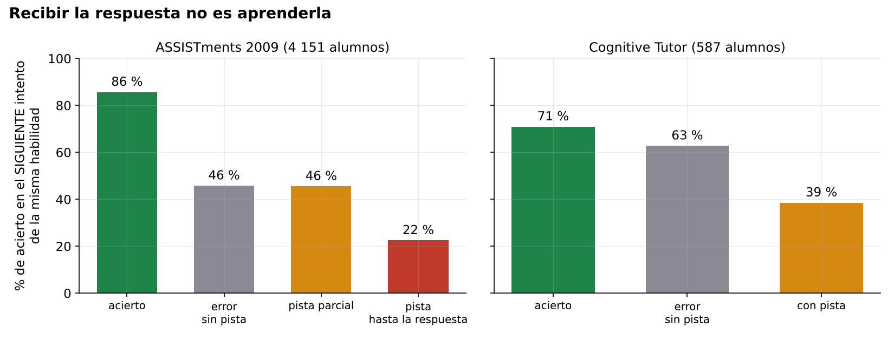
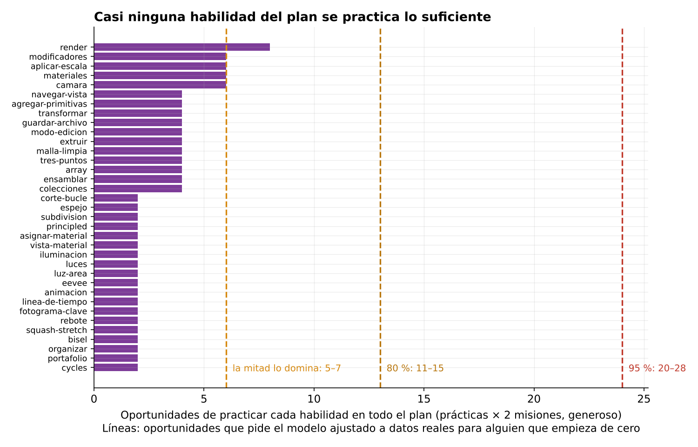
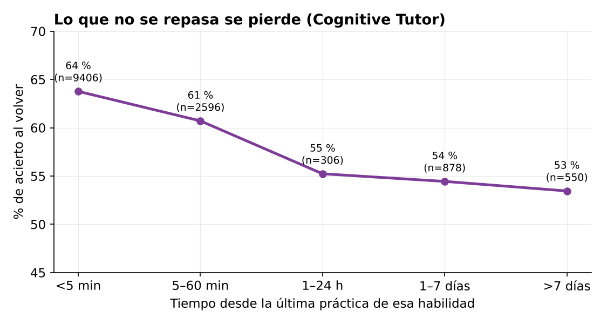
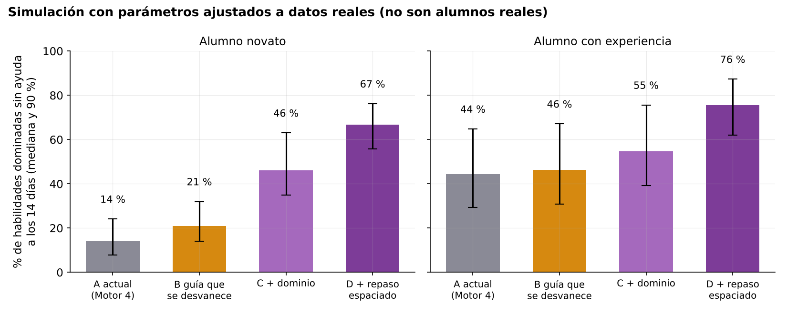
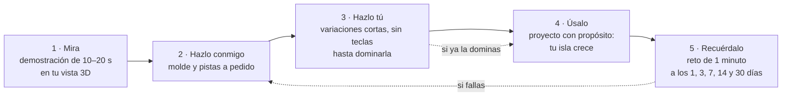
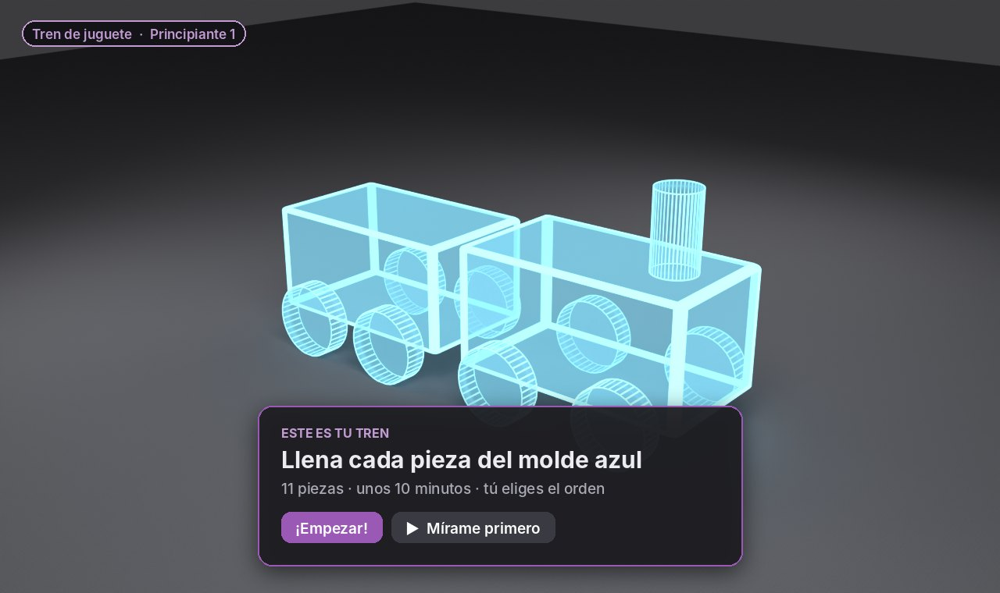
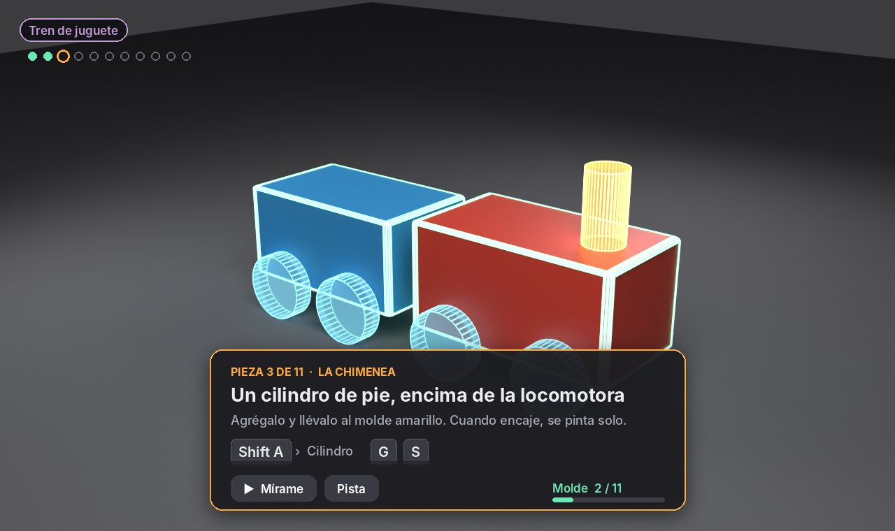
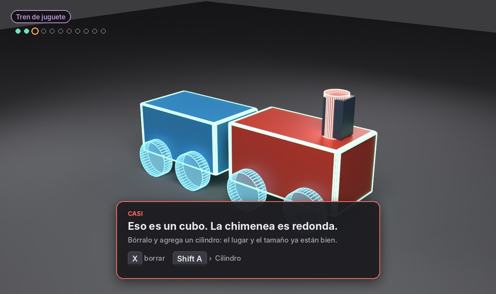
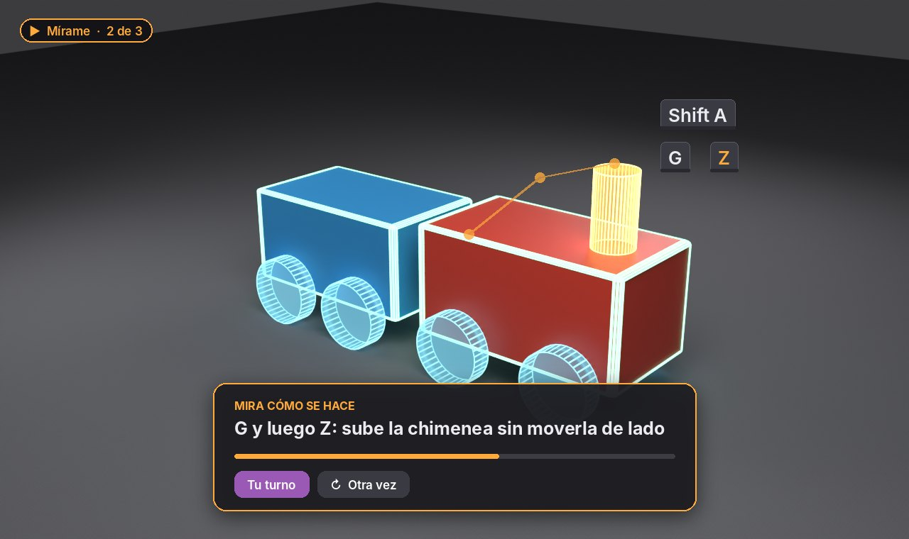
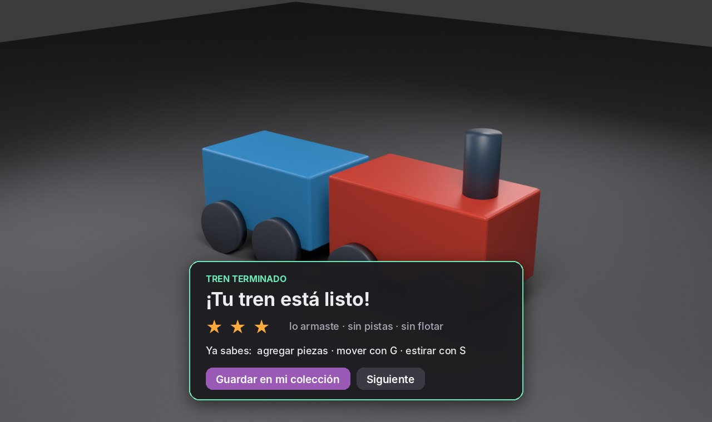

# Cómo se enseña 3D dentro de Blender

**Investigación y propuesta definitiva del add-on Amatista**

| | |
|---|---|
| Fecha | 2026-10-10 |
| Estado | Propuesta aprobada para fusionar en `main`. Todavía no cambia código del add-on ni del motor. |
| Pedido por | Maximiliano. Pidió una investigación seria con números: cómo funcionan los add-ons educativos, qué hacemos mal (también desde la psicología), por qué el add-on no consolida el aprendizaje, todas las prácticas revisadas, y una propuesta que sirva de base al motor para muchas actualizaciones. |
| Análisis reproducibles | [`analisis/`](analisis/) (scripts y resultados en JSON; ver [Anexo A](#anexo-a-cómo-reproducir-los-análisis)) |

---

## 0. Resumen en una página

**La respuesta corta.** El add-on no falla porque revise mal: falla porque **enseña una sola vez, dictando las teclas, y nunca vuelve a pedirle al alumno que lo haga solo.** Eso produce prácticas que se terminan, pero no habilidades que se quedan. La propuesta cambia la unidad del motor: de «práctica con misiones» a **«habilidad que se domina»**, con un ciclo fijo que la investigación respalda y que sirve de base para todas las versiones que vengan:

> **Mira → Hazlo conmigo → Hazlo tú → Úsalo → Recuérdalo**
>
> (demostración, práctica guiada que se desvanece, práctica sin ayuda con variaciones, proyecto con propósito y repaso espaciado), dirigido por un **modelo del alumno** que decide cuánta ayuda dar a cada quien.

**Lo que encontramos, con números:**

| Hallazgo | Número | De dónde sale |
|---|---|---|
| Casi la mitad de las habilidades del plan aparece en **una sola práctica** | 19 de 35 habilidades | Auditoría de las 18 prácticas ([§5.2](#52-las-18-prácticas-una-por-una)) |
| Para que **la mitad** de quienes empiezan de cero domine una habilidad hacen falta **5 a 7 oportunidades**; para el 95 %, **20 a 28** | Tasa de aprendizaje T = 0.10–0.14 por oportunidad | Modelo BKT ajustado a 421 318 respuestas de ASSISTments y 16 851 pasos de Cognitive Tutor ([§4.4](#44-cuántas-repeticiones-hacen-falta)) |
| Nuestro plan da **2 a 8** oportunidades por habilidad | Mediana: 2 | Auditoría ([§5.2](#52-las-18-prácticas-una-por-una)) |
| **13 de 18 prácticas** dictan las teclas exactas en 3 de cada 4 misiones o más | 13/18 | Auditoría |
| Tras recibir la **respuesta completa** de una pista, el siguiente intento acierta **22 %**; tras equivocarse **sin** pista, **46 %** | n = 36 433 y 70 189 | ASSISTments ([§4.2](#42-recibir-la-respuesta-no-es-aprenderla)) |
| Volver a una habilidad **después de un día** baja el acierto de **64 %** a **53–55 %** | n = 13 736 regresos | Cognitive Tutor ([§4.6](#46-lo-que-no-se-repasa-se-olvida)) |
| **18 % de las misiones** (21 de 114) son el motor revisándose a sí mismo («Amatista reconoce tu tren», «Tu práctica coincide con el ejemplo») | 21/114 | Auditoría |
| **5 de 7** prácticas que usan roles todavía obligan al alumno a ponerlos a mano | 5/7 | Auditoría ([§5.3](#53-el-revisor-funciona-casi-siempre)) |
| El revisor de figuras **sí funciona**: rechazó 19 de 20 sinsentidos y aceptó 15 de 20 variantes sensatas (las 5 que rechazó son por roles puestos a mano) | 34/40 | Experimento propio con trenes, puentes y muñecos ([§5.3](#53-el-revisor-funciona-casi-siempre)) |
| En una simulación con parámetros ajustados a datos reales, el diseño propuesto deja **67 %** de las habilidades dominadas a los 14 días contra **14 %** del diseño actual (novatos) | Rango 56–76 % contra 8–24 % | Simulación de alumnos ([§4.7](#47-simulación-cuatro-diseños-del-add-on)). **No son alumnos reales.** |

**Lo que ninguna teoría promete.** No existe un método que «asegure» el aprendizaje. Lo que sí existe son efectos medidos muchas veces: el tutor paso a paso logra casi lo mismo que un tutor humano (0.76 contra 0.79 desviaciones estándar; VanLehn, 2011), el repaso espaciado y la recuperación mejoran mucho la retención a una semana, y dar demasiada ayuda o premios equivocados puede empeorar el resultado. La propuesta junta los efectos más robustos y deja **la medición con alumnos reales como requisito de cada fase** ([§6.12](#612-cómo-sabremos-que-funciona)).

---

## Índice

1. [La pregunta y cómo la investigamos](#1-la-pregunta-y-cómo-la-investigamos)
2. [Cómo funcionan los add-ons y tutoriales educativos reales](#2-cómo-funcionan-los-add-ons-y-tutoriales-educativos-reales)
3. [Lo que dice la investigación sobre aprender](#3-lo-que-dice-la-investigación-sobre-aprender)
4. [Datos: exploración y modelado](#4-datos-exploración-y-modelado)
5. [Auditoría de nuestro add-on y de las 18 prácticas](#5-auditoría-de-nuestro-add-on-y-de-las-18-prácticas)
6. [Propuesta definitiva: Amatista Taller](#6-propuesta-definitiva-amatista-taller)
7. [Fuentes](#7-fuentes)
- [Anexo A. Cómo reproducir los análisis](#anexo-a-cómo-reproducir-los-análisis)

---

## 1. La pregunta y cómo la investigamos

**La pregunta.** ¿Por qué un alumno que termina las prácticas de Amatista no termina de saber Blender, y por qué hasta alguien con experiencia las encuentra tediosas? ¿Cómo debería ser un add-on que enseñe de verdad?

Usamos cuatro fuentes de evidencia, de la más fuerte a la más débil para nuestro caso:

| Fuente | Qué aporta | Límite |
|---|---|---|
| **Investigación publicada** (metaanálisis, experimentos, libros) | Efectos medidos en miles de alumnos | Casi nada es sobre Blender; la mayoría es matemáticas, lectura o software general |
| **Herramientas reales** que enseñan dentro del programa (Godot Tours, Unity, Unreal, Maya, Photoshop, AutoCAD…) | Cómo lo resuelven en la práctica | Pocas publican resultados |
| **Datos públicos de tutores inteligentes** (ASSISTments 2009 y Cognitive Tutor) | Números propios: cuánto se aprende por oportunidad, qué pasa tras una pista, cuánto se olvida | Son alumnos de matemáticas, no de 3D; son datos observacionales (correlación, no causa) |
| **Auditoría y experimentos con nuestro código** (las 18 prácticas, el revisor, el add-on) | Qué hace hoy Amatista, medido | Mide el diseño, no a alumnos reales |
| **Simulación** con un modelo del alumno ajustado a los datos | Comparar diseños antes de construirlos | Depende de supuestos; sirve para ordenar opciones, no para prometer porcentajes |

Lo revisamos desde dos lados, como se pidió: **el del alumno** (qué ve, qué siente, qué aprende) y **el del desarrollador** (cómo está hecho, qué cuesta mantenerlo, qué decisiones técnicas empujan al mal diseño).

---

## 2. Cómo funcionan los add-ons y tutoriales educativos reales

Buscamos add-ons de Blender que enseñen dentro del programa y revisen el trabajo del alumno. **No encontramos ninguno**: lo que existe son cursos en video (Blender Studio, CG Cookie), rúbricas para calificar a mano (CG Cookie Curriculum, Blender Education) y add-ons de productividad. En el extremo de la investigación hay calificadores automáticos de modelos 3D para exámenes (Politécnico de Turín; CADuBoost), pero corren después, no mientras el alumno aprende. **Amatista está intentando algo que nadie ha publicado para Blender**, así que tomamos lo útil de otros programas.

### 2.1 Tabla comparativa

| Herramienta | Cómo funciona | Resultado medido | Qué tomamos |
|---|---|---|---|
| **Godot Tours** (GDQuest, código abierto) | Un «tour» es un script con pasos. Cada paso muestra una burbuja con instrucciones y tareas verificables, ilumina la parte de la interfaz que se usa y bloquea el resto con una capa; la capa deja pasar el ratón solo sobre lo iluminado. El propio tour valida cada paso. | No publicado | La burbuja junto a la acción, la tarea que se verifica sola y el resaltado de la herramienta. |
| **Unity Interactive Tutorials** | Páginas de tutorial con «máscara»: el editor se oscurece y solo queda visible lo necesario. Cada página puede tener criterios de completado y avanzar sola. La máscara es opcional por página. | No publicado | La máscara solo cuando ayuda; el avance automático cuando el criterio se cumple. |
| **Unreal Guided Tutorials** | Etapas con contenido anclado a un widget concreto, con resaltado animado y la pestaña que debe abrirse. | No publicado | Anclar el mensaje a la herramienta, no a un panel aparte. |
| **Maya Interactive Basics (Mayabot, 2022)** | Tutorial «gamificado» con un instructor virtual. Enseña a navegar, mover, rotar y escalar. Objetivo declarado: orientarse y encontrar las herramientas esenciales en los primeros 10 minutos. | No publicado | Un personaje guía (ya decidido: mascotas propias por módulo) y una meta corta y clara. |
| **Photoshop: tutoriales prácticos en el panel Descubrir** | El tutorial abre su propio archivo de muestra, se divide en secciones con pasos numerados, y un recuadro azul aparece junto a la herramienta o menú de cada paso. | No publicado | El archivo de práctica preparado y el recuadro junto a la herramienta. |
| **SketchUp Instructor** | Panel que explica la herramienta que tienes activa, con animación y enlace a la ayuda. | No publicado | Ayuda contextual de la herramienta activa, con animación corta. |
| **ToolClips** (Autodesk Research, CHI 2010) | Videos cortos dentro del tooltip de cada herramienta. | Con ToolClips se completaron **7 veces más** tareas desconocidas que con la ayuda en línea, y una semana después lo hacían más rápido. | Un clip de 5 a 10 s por herramienta, al alcance del cursor. |
| **Stencils** (Kelleher y Pausch, CHI 2005) | Tutorial que tapa la interfaz y deja «agujeros» sobre lo que hay que pulsar. | Terminaron **26 % más rápido**, con menos errores, **pero aprendieron lo mismo** que con papel. Con stencils **a pedido** (Harms et al., 2011) resolvieron **47 % más tareas de transferencia** que con stencils permanentes. | **La lección más importante de este documento:** la guía permanente acelera el tutorial y no deja aprendizaje; la guía a pedido sí. |
| **GamiCAD** (Autodesk Research, UIST 2012) | Tutorial de AutoCAD con elementos de juego, modelado como una máquina de estados que reconoce aciertos y fallos en tiempo real. | Más interés declarado; tareas de prueba **20–76 % más rápidas** y con más completadas. | Reconocer el progreso por eventos del programa, en tiempo real. |
| **Pause-and-Play** (Adobe, UIST 2011) | El video del tutorial se pausa solo hasta que el usuario repite el paso en la aplicación. | Mejor experiencia en estudio con usuarios (SketchUp y Photoshop). | La demostración espera al alumno, no al revés. |
| **MixT** (UIST 2012) | Tutoriales paso a paso con imagen fija y un video corto por paso. | Comparó texto, video y mixto con 12 personas. | Cada paso con su clip corto, no un video largo. |
| **Codecademy** | Lección corta, editor al lado, revisión automática inmediata; la pista no da la solución completa. | No publicado | Revisión instantánea y pistas que no entregan la respuesta. |
| **Cognitive Tutor / ASSISTments** | Tutores inteligentes: rastrean cada paso del alumno contra un modelo y estiman qué domina (*knowledge tracing*). | Tutores paso a paso: **0.76 DE** (VanLehn, 2011); mediana **0.66 DE** en 50 evaluaciones (Kulik y Fletcher, 2016); en el mejor caso, el mismo nivel en **un tercio del tiempo** (Anderson et al., 1995). | El modelo del alumno y la revisión de cada paso (ver §4 con sus datos). |
| **Mario 1-1, Shadowmatic** (juegos) | Mario enseña sin texto: el nivel está colocado para que el jugador descubra cada mecánica. Shadowmatic: una regla simple (gira el objeto hasta que su sombra sea reconocible) y pistas escasas. | Shadowmatic ganó un Apple Design Award (2015). | Enseñar con el espacio, no con texto; una regla visual simple; pistas raras y valiosas. |
| **Calificadores de modelos 3D** (Politécnico de Turín; CADuBoost, 2025) | Comparan el modelo del alumno con uno de referencia: vistas 2D, similitud de malla, conteo de polígonos, color; CADuBoost da retroalimentación con colores sobre las diferencias. | Validación en clase (CADuBoost) | Mostrar la diferencia **sobre el modelo**, con color, no en una lista. |

### 2.2 Lo que todos tienen en común

1. **La instrucción aparece donde ocurre la acción**: junto a la herramienta o sobre el modelo, nunca en un panel lejano.
2. **El progreso se reconoce solo**, por lo que el usuario hace en el programa. Nadie pide «pulsa Comprobar».
3. **Una cosa por paso**, con un recurso visual (clip, imagen, resaltado).
4. **Lo que más enseña es lo menos visible**: la guía que el usuario pide (Stencils a pedido), el clip corto al lado de la herramienta (ToolClips), la pista que no da la respuesta (Codecademy).
5. **Ninguno de los que publicaron resultados midió retención a largo plazo** salvo ToolClips (una semana) y los tutores inteligentes. Los tutoriales de software casi nunca vuelven a pedir lo aprendido. Esa es justo nuestra oportunidad.

---

## 3. Lo que dice la investigación sobre aprender

Ordenado de lo que más pesa para Amatista a lo que menos. Los tamaños de efecto se dan en desviaciones estándar (d o g): 0.2 es pequeño, 0.5 mediano, 0.8 grande.

### 3.1 Tabla de efectos

| Principio | Qué se midió | Efecto | Qué significa para el add-on |
|---|---|---|---|
| **Tutor paso a paso** | Metaanálisis de tutoría humana y por computadora (VanLehn, 2011) | 0.76 (tutor por pasos) contra 0.79 (humano) | Revisar cada paso, como ya hace el motor, es lo correcto. |
| **Tutores inteligentes** | 50 evaluaciones controladas (Kulik y Fletcher, 2016) | Mediana 0.66 | Ídem; el efecto es mayor cuando la prueba mide lo mismo que el tutor enseña. |
| **Modelo del alumno + dominio** | Cognitive Tutors (Anderson, Corbett, Koedinger y Pelletier, 1995) | Mismo nivel en ⅓ del tiempo (mejor caso) | El tutor debe saber qué domina cada alumno y no repetir lo que ya sabe. |
| **Recuperar en vez de releer** (efecto de la prueba) | Roediger y Karpicke, 2006 | A la semana: ~61 % recordado tras recuperar contra ~40 % tras releer (cifra de un resumen secundario) | Hacer el paso **sin ayuda** consolida; seguir instrucciones dictadas, no. |
| **Práctica espaciada** | Metaanálisis de 317 experimentos (Cepeda et al., 2006); estudio de 2009 | El hueco óptimo crece con el tiempo que se quiere recordar; hasta +150 % de recuerdo con el hueco óptimo | Repasar cada habilidad a los 1, 3, 7, 14 y 30 días. |
| **Ejemplos resueltos que se desvanecen** | Metaanálisis de Crissman (2006); Kissane et al. (2008); Renkl y Atkinson | El desvanecimiento tuvo el mayor efecto entre las variantes de ejemplo; mejor en pruebas diferidas y de transferencia | Primero se ve hecho, luego se hace con ayuda, luego solo. |
| **Inversión por experiencia** | Kalyuga, Ayres, Chandler y Sweller, 2003 | La ayuda que sirve al novato estorba al experto | **Explica por qué a Maximiliano, que sabe Blender, las prácticas le parecen tediosas.** |
| **La guía mínima no funciona** con novatos | Kirschner, Sweller y Clark, 2006 | Revisión de medio siglo de estudios | El otro extremo también falla: no basta con «aquí está Blender, explora». |
| **Guía permanente contra guía a pedido** | Stencils (Kelleher y Pausch, 2005); Harms et al., 2011 | Igual aprendizaje con guía permanente; +47 % de transferencia con guía a pedido | Las teclas no se dictan siempre: se ofrecen. |
| **Video corto en contexto** | ToolClips (Grossman y Fitzmaurice, 2010) | 7× más tareas desconocidas resueltas | Un clip por herramienta. |
| **Retroalimentación** | 607 efectos (Kluger y DeNisi, 1996) | Promedio 0.41, **pero un tercio empeoró el desempeño**; empeora cuando la atención va a la persona y no a la tarea | Los mensajes hablan del modelo y del paso («la rueda flota»), nunca de la persona («¡qué bien lo haces!»). |
| **Niveles de la retroalimentación** | Hattie y Timperley, 2007 | Las tres preguntas: ¿a dónde voy?, ¿cómo voy?, ¿qué sigue?; la de tarea y proceso sirve, el elogio a la persona casi no | Cada tarjeta responde las tres preguntas. |
| **Foco de atención externo** | 73 estudios motores (Chua, … y Wulf, 2021) | g = 0.58 en retención y transferencia | Hablar del efecto en el modelo («que la rueda toque el suelo»), no del movimiento de la mano («arrastra el ratón hacia abajo»). |
| **Premios** | 128 experimentos (Deci, Koestner y Ryan, 1999) | Premios esperados y por completar bajan la motivación propia (d = −0.28 a −0.40) | Las estrellas informan del dominio; no son premios que se persiguen. |
| **Gamificación** | Revisión de estudios empíricos (Hamari, Koivisto y Sarsa, 2014) | Efectos positivos que dependen del contexto, del usuario y de la novedad | No es una solución por sí sola. |
| **Motivación en juegos** | Teoría de la autodeterminación aplicada a juegos (Ryan, Rigby y Przybylski, 2006) | Autonomía y competencia predicen disfrute y ganas de volver | El alumno elige, siente que mejora y ve para qué sirve lo que hace. |
| **Abuso de pistas** | Geometry Cognitive Tutor (Aleven et al., 2006) | 36 % de las acciones eran pedir pistas sin necesidad (14 % contando ráfagas como una) | La escalera de pistas necesita freno y no debe acabar en «la respuesta». |
| **Etapas de la habilidad motriz** | Fitts y Posner, 1967 | Cognitiva → asociativa → autónoma | Las teclas de Blender son habilidad motriz: necesitan repetición distribuida, no una sola explicación. |
| **Hipótesis de la guía** (motriz) | Salmoni, Schmidt y Walter, 1984; Winstein y Schmidt, 1990 | Menos retroalimentación a veces mejora la retención; **la evidencia es mixta** (Wulf y Shea, 2004, no la confirman) | Bajar la ayuda poco a poco es razonable; no apostar todo a ello. |
| **Principios multimedia** | Revisión de Mayer (2020) | Coherencia 0.70, segmentar 0.70, señalar 0.46, preentrenar 0.46, redundancia 0.87, contigüidad espacial 0.79 | Quitar todo lo que no ayuda, partir en pasos, señalar lo importante, poner el texto junto a lo que describe. |
| **Instrucción mínima** para software | *The Nurnberg Funnel* (Carroll, 1990) | Tareas reales desde el principio, documentación breve, errores como oportunidad | Proyectos con sentido desde la primera práctica. |
| **Aprendiz cognitivo** | Collins, Brown y Newman, 1989 | Modelar, acompañar, andamiar y desvanecer, articular, reflexionar, explorar | Es el ciclo que proponemos, con nombres de alumno. |
| **Dificultades deseables** | Bjork y Bjork (1992 en adelante) | Lo que cuesta un poco más al practicar (espaciar, variar, recuperar) se recuerda mejor; lo fácil se confunde con aprendizaje | La sensación de «fluir sin esfuerzo» del Motor 4 no garantiza aprender. |
| **Piso bajo, techo alto, paredes anchas** | Resnick, *Lifelong Kindergarten* (2017) | Diseño de Scratch | Fácil empezar, mucho por crecer, muchos caminos válidos (libertad creativa). |

### 3.2 Qué teoría «asegura» más el aprendizaje

Ninguna lo asegura. Con lo medido, el orden de confianza es:

1. **Práctica de recuperación espaciada** (hacerlo de memoria, días después): el efecto más repetido en la literatura para retención a largo plazo.
2. **Tutoría paso a paso con modelo del alumno**: 0.66–0.76 DE en metaanálisis.
3. **Ejemplos resueltos que se desvanecen**, ajustados a la experiencia del alumno: fuerte en novatos, se invierte en expertos.
4. **Retroalimentación sobre la tarea, inmediata y breve**: ayuda en promedio, pero un tercio de las intervenciones empeora; el diseño del mensaje importa.
5. **Gamificación y premios**: efectos dependientes del contexto y con riesgo de bajar la motivación propia.

Nuestros datos (§4) confirman 1, 2 y 4 en tutores reales. La propuesta pone **1 a 3 en el centro** y usa **4** con cuidado; **5** queda como adorno, nunca como motor.

---

## 4. Datos: exploración y modelado

No tenemos todavía datos de alumnos de Amatista. Usamos dos conjuntos públicos de tutores inteligentes, los más estudiados del área, y un modelo del alumno ajustado a ellos.

### 4.1 Los datos

| Conjunto | Qué es | Tamaño analizado |
|---|---|---|
| **ASSISTments 2009-2010** (*skill builder*) | Tutor de matemáticas en línea; cada fila es el primer intento de un alumno en un problema, con su habilidad, si pidió pistas y si llegó a la pista final (la que da la respuesta) | 421 318 respuestas · 4 151 alumnos · 110 habilidades |
| **Cognitive Tutor** (álgebra, muestra de KDD Cup/PSLC) | Cada fila es un paso con hora, habilidad (KC), acierto al primer intento y pistas | 16 851 pasos · 587 alumnos · 12 habilidades |

Ambos vienen de los ejemplos públicos de pyBKT (Universidad de California, Berkeley). Son matemáticas, no 3D: los usamos porque miden **cómo aprende una persona con un tutor que revisa cada paso**, que es lo que Amatista hace.

### 4.2 Recibir la respuesta no es aprenderla



En ASSISTments, después de llegar a la **pista que da la respuesta**, el siguiente intento de la misma habilidad acierta **22 %**. Después de **equivocarse sin pedir pistas**, **46 %**. En Cognitive Tutor pasa lo mismo: **39 %** tras pedir pistas contra **63 %** tras un error sin pistas.

**Cuidado con la lectura:** quienes piden pistas suelen ser quienes menos saben, así que esto no prueba que la pista *cause* el peor resultado. Lo que sí prueba es que **el paso hecho con la respuesta en la mano no deja al alumno listo para el siguiente**. En Amatista, cada misión que dicta «S, luego X, y mueve el ratón» es una pista final dada por adelantado.

### 4.3 El abuso de la pista final

| Alumnos según qué parte de sus problemas terminaron con la pista final | Alumnos | Acierto medio | Mejora por oportunidad (primeras 10) |
|---|---|---|---|
| Menos de 5 % | 817 | 74 % | +0.69 puntos |
| 5–15 % | 509 | 63 % | +0.87 puntos |
| 15–30 % | 285 | 50 % | +0.65 puntos |
| **Más de 30 %** | **178** | **30 %** | **−0.36 puntos (no mejoran)** |

El grupo que más depende de la respuesta **no mejora con la práctica**. Es el patrón que la literatura llama *gaming the system* (Baker, Aleven). Un add-on que da la solución en cuanto se pide fabrica este grupo.

### 4.4 Cuántas repeticiones hacen falta

Ajustamos el modelo de rastreo bayesiano del conocimiento (**BKT**, Corbett y Anderson, 1995) a las 30 habilidades con más alumnos de ASSISTments y a las 12 de Cognitive Tutor. Usamos búsqueda por rejilla de los cuatro parámetros (saber de antes L0, aprender por oportunidad T, adivinar G y equivocarse sabiendo S), con 20 % de los alumnos separados para probar.

| | L0 | **T (aprender por oportunidad)** | G | S |
|---|---|---|---|---|
| ASSISTments (mediana de 30 habilidades) | 0.70 | **0.10** (p25–p75: 0.06–0.14) | 0.15 | 0.20 |
| Cognitive Tutor (mediana de 12) | 0.60 | **0.14** (p25–p75: 0.10–0.29) | 0.30 | 0.23 |

Con T entre 0.10 y 0.14, alguien que **empieza sin saber** la habilidad necesita:

| Para que la domine… | Oportunidades |
|---|---|
| la mitad de los alumnos | **5 a 7** |
| 8 de cada 10 | **11 a 15** |
| 95 de cada 100 | **20 a 28** |

En ASSISTments, el criterio de dominio del propio tutor (tres aciertos seguidos) se alcanzó en **53.5 %** de las 39 308 secuencias; quienes lo alcanzaron necesitaron una mediana de **4** problemas (p90: 9).



**Comparado con Amatista:** contando generosamente dos misiones por práctica, cada habilidad del plan tiene entre **2 y 8** oportunidades en todo el curso, y 19 de las 35 solo **2**. Ninguna llega a la zona de 95 %. Este es, con datos, el motivo principal de que **el aprendizaje no se consolide**.

### 4.5 El modelo del alumno sí predice

Con los parámetros ajustados, BKT predijo si el siguiente intento de alumnos que el modelo nunca vio sería correcto con **AUC 0.72** en ASSISTments (contra 0.60 usando solo el promedio de la habilidad) y **0.70** en Cognitive Tutor (contra 0.65). Un modelo así de simple ya sabe más que «el promedio» sobre qué domina cada alumno: es suficiente para decidir **cuánta ayuda dar**, que es para lo que lo queremos.

### 4.6 Lo que no se repasa se olvida



En Cognitive Tutor, al volver a una habilidad después de menos de 5 minutos el acierto es **64 %**; después de 1 a 24 horas, **55 %**; después de 1 a 7 días, **54 %**; después de más de una semana, **53 %**. En una regresión logística que controla el número de oportunidad y si el intento anterior fue correcto, los huecos de más de un día restan entre 0.21 y 0.25 en el logit (unos 5 puntos de acierto). Los regresos tras días son pocos (306, 878 y 550), así que el número exacto es aproximado; la dirección es la misma que en toda la literatura del espaciado.

**Para Amatista:** hoy una habilidad se practica en una tarde y no se vuelve a pedir. Sin repaso, lo aprendido el lunes ya se debilitó el jueves.

### 4.7 Simulación: cuatro diseños del add-on

Para comparar diseños antes de construirlos, simulamos alumnos virtuales con los parámetros reales de §4.4 (T, G y S sorteados de las 42 habilidades ajustadas) y el número real de oportunidades por habilidad de nuestro plan (§5.2). Comparamos:

- **A. Actual (Motor 4):** cada oportunidad con las teclas dictadas, sin repaso.
- **B. Guía que se desvanece:** la primera oportunidad con demostración; las siguientes, el alumno lo intenta y pide pistas si las necesita.
- **C. B + dominio:** después del proyecto, variaciones cortas hasta que el modelo estime 95 % de dominio (máximo 10); salta lo que ya domina.
- **D. C + repaso espaciado:** repasos de un minuto a los 1, 3 y 7 días.

**Supuestos** (no salen de datos; se sortean de nuevo en cada una de 400 corridas por perfil): seguir teclas dictadas enseña entre 30 % y 90 % de lo que enseña hacerlo uno mismo (Stencils y efecto de la generación); la demostración multiplica el aprendizaje entre 1.0 y 1.5 (ejemplos resueltos); se olvida entre 1 % y 5 % de lo sabido por día; recuperar con éxito frena el olvido entre 20 % y 60 % (efecto de la prueba).



| Diseño | Novato: habilidades dominadas a los 14 días (mediana, 90 % de corridas) | Oportunidades por habilidad | Con experiencia: dominadas | Con experiencia: pasos guiados por habilidad |
|---|---|---|---|---|
| A. Actual | **14 %** (8–24) | 3.3 | 44 % (29–65) | 3.3 |
| B. Guía que se desvanece | 21 % (14–32) | 3.3 | 46 % (31–67) | **0.5** |
| C. + dominio | 46 % (35–63) | 9.3 | 55 % (39–76) | 1.2 |
| **D. + repaso espaciado** | **67 %** (56–76) | 12.3 | **76 %** (62–87) | 1.7 |

Lo que la simulación dice y lo que no:

- **El orden D > C > B > A se mantuvo en el 100 % de las corridas** para novatos, aun con supuestos pesimistas. Para alumnos con experiencia, B le ganó a A en 95 % y C y D en 100 %.
- **D cuesta más práctica** (12 oportunidades por habilidad contra 3). Por oportunidad, B es el más eficiente (6.4 puntos por oportunidad contra 4.2 de A). Por eso D usa **variaciones de 1 a 3 minutos**, no prácticas de 30.
- **Para el alumno con experiencia, B baja los pasos guiados de 3.3 a 0.5 por habilidad**: menos tedio sin perder aprendizaje. Es el efecto de inversión por experiencia.
- Los porcentajes **no son predicciones** de lo que pasará con alumnos de Amatista. Sirven para decidir qué construir primero y qué medir.

---

## 5. Auditoría de nuestro add-on y de las 18 prácticas

### 5.1 El add-on en números (vista del desarrollador)

| Medida | Valor | Por qué importa |
|---|---|---|
| Paneles en la barra lateral para el alumno | **9** (Amatista, Práctica, Tu ruta, Figura, Herramientas, Asignar rol, Más, Aprender, Mi curso), más 7 de autor | Un panel que compite con Blender por la atención; la instrucción queda lejos de la acción |
| Operadores propios | **58** | Mucho por mantener y probar |
| Preferencias | **21** | Cada opción es una decisión que trasladamos al alumno |
| Código del add-on | **9 182 líneas** en 27 archivos | Creció más rápido que la claridad |
| Temporizadores y capas de dibujo | 14 y 3 | Comportamiento difícil de seguir |
| Rediseños del motor en una semana | **5** (3.3, 3.4, 3.5, 3.5.1, 4.0) | Cada uno agregó capas sin quitar las anteriores (el panel clásico sigue vivo detrás del de misiones) |

### 5.2 Las 18 prácticas, una por una

Datos de [`analisis/auditoria.json`](analisis/auditoria.json). «Teclas» = porcentaje de misiones cuyo consejo dicta la secuencia exacta. «Revisión» = misiones que son el motor revisándose («Amatista reconoce…», «Tu práctica coincide con el ejemplo»). «Roles a mano» = el alumno debe etiquetar piezas para que el motor las entienda.

| Curso / módulo | Práctica | Nivel | Min | Misiones | Teclas | Revisión | Roles a mano | Habilidades |
|---|---|---|---|---|---|---|---|---|
| Principiante m1 | Explora (muñeco) | 1 | 8 | 6 | 100 % | 2 | no | navegar, agregar, transformar |
| Principiante m1 | **Tren de juguete** | 1 | 25 | 11 | 100 % | 2 | no | navegar, agregar, transformar, guardar |
| Principiante m2 | Explora | 2 | 8 | 5 | 100 % | 1 | no | modo edición, extruir |
| Principiante m2 | **Espada** | 2 | 30 | 6 | 100 % | 1 | no | edición, extruir, corte en bucle, malla limpia, guardar |
| Principiante m3 | Explora | 2 | 8 | 5 | 100 % | 1 | no | modificadores, aplicar escala |
| Principiante m3 | **Nave** | 2 | 35 | 8 | 100 % | 1 | **sí** | modificadores, espejo, subdivisión, aplicar escala, malla limpia |
| Princ.-Interm. m1 | Explora | 2 | 8 | 4 | 33 % | 1 | no | materiales |
| Princ.-Interm. m1 | **Pinta la nave** | 2 | 30 | 7 | 17 % | 1 | **sí** | materiales, Principled, asignar, vista de material |
| Princ.-Interm. m2 | Explora | 2 | 8 | 5 | 100 % | 1 | no | iluminación, cámara, render |
| Princ.-Interm. m2 | **Tres puntos** | 2 | 35 | 9 | 75 % | 1 | **sí** | luces, luz de área, cámara, tres puntos, EEVEE, render |
| Princ.-Interm. m3 | Explora | 2 | 8 | 4 | 100 % | 1 | no | animación |
| Princ.-Interm. m3 | **Pelota que rebota** | 2 | 35 | 6 | 100 % | 1 | no | línea de tiempo, fotograma clave, rebote, estirar y aplastar |
| Intermedio m1 | Explora | 3 | 10 | 4 | 33 % | 1 | no | modificadores, array |
| Intermedio m1 | **Puente** | 3 | 25 | 10 | 78 % | 2 | no | array, bisel, aplicar escala, ensamblar |
| Intermedio m2 | Explora | 3 | 8 | 3 | 100 % | 1 | no | colecciones, organizar |
| Intermedio m2 | **Aldea** | 3 | 25 | 8 | 71 % | 1 | **sí** | colecciones, materiales, ensamblar |
| Intermedio m3 | Explora | 3 | 8 | 5 | 75 % | 1 | no | render, Cycles |
| Intermedio m3 | **Diorama** | 3 | 30 | 8 | 71 % | 1 | **sí** | tres puntos, cámara, render, portafolio |
| **Total** | 18 prácticas | | **368** | **114** | 13 de 18 ≥ 75 % | **21** | **5 de 7** | **35 habilidades; 19 aparecen una sola vez** |

Lo que muestra la tabla, práctica por práctica:

- **Todas siguen el mismo molde**: explorar 8 minutos, luego un proyecto de 25 a 35 minutos con 6 a 11 misiones, y no se vuelve a esa habilidad. **Ninguna práctica repasa una habilidad de un módulo anterior sin ayuda** (salvo que vuelva a aparecer de casualidad, como render y modificadores).
- **Las «Explora» dictan casi todo** (100 % de teclas en 6 de 9) cuando su propósito declarado es explorar. Son, en la práctica, más instrucciones.
- **Los proyectos no tienen un para qué.** El tren, la espada, la nave y la pelota son objetos sueltos que nadie usa después; la aldea y el diorama no reutilizan nada de lo que el alumno hizo antes. El alumno no tiene una razón realista para volver (lo que señaló Maximiliano).
- **Roles a mano en la nave, pinta la nave, tres puntos, aldea y diorama.** El motor 3.4 aprendió a reconocer piezas por su forma, pero solo el tren y el puente lo usan. En las demás, el alumno debe abrir el panel «Asignar rol», un concepto del desarrollador.
- **Números en las instrucciones** («S Z 0.2», «0.1», «R X 90») en 11 prácticas, aun después de que el Motor 4 quitara los decimales de los mensajes de error: los números siguen en los consejos.
- **Las prácticas de materiales** (Explora y Pinta la nave) son las que menos dictan (33 % y 17 %) y las únicas donde el alumno decide algo (colores). Son el mejor punto de partida de lo que queremos.

### 5.3 El revisor funciona casi siempre

Para separar «revisa mal» de «enseña mal», armamos escenas de prueba sin Blender y las pasamos por el motor real ([`analisis/revisor_tren.json`](analisis/revisor_tren.json) y [`analisis/revisor_todas.json`](analisis/revisor_todas.json)).

**Tren, 18 variantes, nivel 1:**

| Variantes sensatas (deberían pasar) | Resultado | Sinsentidos (deberían fallar) | Resultado |
|---|---|---|---|
| Copia exacta | pasa | Todas las piezas apiladas | falla ✓ |
| 30 % más grande | pasa | Ruedas acostadas como platos | falla ✓ |
| 30 % más chico | pasa | Chimenea debajo del tren | falla ✓ |
| Armado 3 m a un lado | pasa | Ruedas flotando a 1 m | falla ✓ |
| Ruedas más gruesas | pasa | Todo hecho con cubos | falla ✓ |
| Ruedas con 5 cm de aire | pasa | Ruedas tiradas lejos | falla ✓ |
| Locomotora más larga | pasa | Vagón encima de la locomotora | falla ✓ |
| Con faro decorativo | pasa | Vagones separados 3 m | falla ✓ |
| **Tren girado 90°** | **falla ✗** (pide vagones unidos en X) | Ruedas enterradas a la mitad | falla ✓ |

**Todas las prácticas con modelo de piezas** (5 variantes sensatas y 5 sinsentidos cada una; las que se modelan en Modo Edición no se pueden armar con primitivas y quedaron fuera):

| Práctica | Sensatas aceptadas | Sinsentidos rechazados | Nota |
|---|---|---|---|
| Tren | 5/5 | 5/5 | |
| Puente | 5/5 | 5/5 | |
| Explora (muñeco) | 5/5 | 4/5 | acepta todo flotando a 1.5 m: no pide «en el suelo» |
| **Aldea** | **0/5** | 5/5 | rechaza hasta la copia exacta porque las casas no tienen el rol puesto a mano |
| **Total** | **15/20** | **19/20** | |

**Conclusión:** el reconocimiento de figuras es la parte más sólida de Amatista y se queda. Los fallos son puntuales y se corrigen sin rediseño (roles automáticos en todas las prácticas, orientación libre en «unidos», «en el suelo» en el muñeco).

### 5.4 Qué hacemos mal

**Desde el alumno**

1. **El alumno sigue instrucciones en vez de recordar.** 13 de 18 prácticas dictan las teclas en casi todas las misiones. Termina la práctica sin haber tenido que recordar nada (Stencils: igual aprendizaje que con papel; Roediger y Karpicke: recuperar es lo que consolida).
2. **Cada habilidad se ve una vez.** 2 oportunidades contra las 5 a 28 que pide el modelo (§4.4).
3. **Nunca vuelve.** No hay repaso de habilidades, solo de las preguntas de teoría (las cajas de Leitner de las píldoras). Lo aprendido se pierde (§4.6).
4. **El experto no puede saltar nada.** Recibe la misma guía que el novato: tedio (inversión por experiencia).
5. **No hay un para qué.** Objetos sueltos que no se usan después; no hay un mundo, una colección ni un portafolio que crezca con lo que hace.
6. **No ve cómo se hace.** «Ver el ejemplo» abre una escena con el resultado, no una demostración del proceso (aprendiz cognitivo: modelar es el primer paso; ToolClips: el clip corto en contexto es lo que más ayuda).
7. **La instrucción está lejos de la acción.** El panel lateral obliga a mirar a la derecha, leer y volver a la vista 3D (contigüidad espacial, d = 0.79).
8. **Demasiado para leer.** 13 973 caracteres de instrucciones en el plan; 2 039 solo en el tren.
9. **Misiones que no son del alumno.** 21 de 114 misiones son el motor revisándose.

**Desde la psicología**

10. **Elogios y logros genéricos.** «¡Misión cumplida!», «¡Genial!», sellos: retroalimentación dirigida a la persona, la que menos ayuda (Hattie y Timperley; Kluger y DeNisi). Los premios esperados por completar pueden bajar la motivación propia (Deci et al.).
11. **Fluidez confundida con aprendizaje.** El Motor 4 hizo todo más fácil y fluido; Bjork advierte que lo fácil al practicar se confunde con aprender.
12. **Sin autonomía.** El alumno no elige qué construir ni cómo; competencia sin autonomía (teoría de la autodeterminación).
13. **Pistas que terminan en la respuesta.** La escalera de pistas llega al «paso a paso», que es la pista final (§4.3).
14. **Foco interno.** Varias instrucciones describen movimientos («mueve el ratón») en vez del efecto en el modelo (foco externo: g = 0.58).

**Desde el desarrollador**

15. **El motor se diseñó desde el revisor.** Primero los validadores, luego las misiones que los cumplen: por eso hay misiones de roles, de «reconoce» y de «coincide».
16. **Capas sobre capas.** Cinco rediseños en una semana; el panel clásico sigue detrás del de misiones, el globo de la mascota detrás de la tarjeta.
17. **Sin medición.** No registramos cuánto tarda, cuántas pistas pide, si vuelve, ni si una semana después puede hacerlo solo. Rediseñamos a ciegas.
18. **La práctica es la unidad, no la habilidad.** El motor sabe qué práctica terminaste, no qué sabes hacer. `HABILIDADES_ALUMNO` existe en Oracle, pero solo como evidencia al final, sin decidir nada durante la práctica.

### 5.5 Por qué no consolida el aprendizaje

La cadena, con los números de arriba:

1. Cada habilidad aparece **2 veces** (§5.2).
2. Esas 2 veces se hacen **con las teclas dictadas**, así que casi no cuentan como práctica propia (§4.2, Stencils).
3. **Nunca se vuelve** a pedir sin ayuda, días después (§4.6).
4. El alumno **siente que aprendió**, porque terminó y lo felicitaron, pero esa sensación de fluidez no predice retención (Bjork).
5. Una semana después, frente a un Blender vacío, **no recuerda** la secuencia: no la recuperó nunca de memoria.

Ninguno de estos pasos es un defecto del revisor ni de la interfaz. **Es el diseño de la práctica.** Por eso los rediseños de interfaz (3.4 a 4.0) no lo resolvieron.

---

## 6. Propuesta definitiva: Amatista Taller

### 6.1 La idea

**La unidad del motor deja de ser la práctica y pasa a ser la habilidad.** Cada habilidad (agregar una primitiva, escalar en un eje, extruir, poner un material…) se aprende con el mismo ciclo, y el **modelo del alumno** decide en qué paso del ciclo está cada quien:



- **Mira** (modelar): Amatista lo hace en tu vista 3D en 10 a 20 segundos, con las teclas apareciendo en pantalla. Basado en el ejemplo que ya tiene cada práctica.
- **Hazlo conmigo** (acompañar): lo haces tú, con un **molde** translúcido de la pieza y la herramienta iluminada. Las teclas **no se muestran**: se piden.
- **Hazlo tú** (desvanecer): la misma habilidad en 2 o 3 objetos distintos, de 1 a 3 minutos cada uno, sin molde ni teclas. Termina cuando el modelo estima que la dominas.
- **Úsalo** (transferir): un proyecto con propósito que combina habilidades y queda en **tu isla**, el mundo que crece con todo lo que haces.
- **Recuérdalo** (recuperar y espaciar): al abrir Amatista, un reto de un minuto con lo que toca repasar.

**Por qué este ciclo y no otro.** Es el aprendiz cognitivo de Collins, Brown y Newman (modelar, acompañar, desvanecer, explorar), con los dos efectos más robustos de §3.2 (recuperación espaciada y modelo del alumno) y los resultados de §4: es el diseño D de la simulación.

**Por qué sirve de base para muchas actualizaciones.** Agregar contenido deja de ser «escribir otra práctica de 11 misiones»: es agregar una habilidad (su demostración, sus variaciones, sus retos) o un proyecto que combina habilidades existentes. El modelo del alumno, el repaso y la interfaz no cambian. Los próximos cursos (escultura, nodos, rigging) usan el mismo ciclo.

### 6.2 Diez reglas de diseño

Cada regla tiene su fuente. Si una función nueva rompe una regla, no entra.

| # | Regla | Fuente |
|---|---|---|
| 1 | **El alumno recuerda antes de que le digamos.** Las teclas se ofrecen, no se dictan. | Stencils a pedido; efecto de la prueba |
| 2 | **Cada habilidad vuelve** al menos 5 veces en el curso y en días distintos. | §4.4; Cepeda |
| 3 | **La ayuda baja a medida que sube el dominio**, y el experto puede demostrar que ya sabe y saltar. | Desvanecimiento; inversión por experiencia; Cognitive Tutors |
| 4 | **La instrucción aparece sobre el modelo o junto a la herramienta**, nunca solo en el panel. | Contigüidad espacial; Godot Tours, Unreal, Photoshop |
| 5 | **Una tarjeta, una cosa, máximo 25 palabras.** | Coherencia y segmentación (Mayer) |
| 6 | **Primero se ve hecho.** Cada habilidad nueva empieza con una demostración corta. | Ejemplos resueltos; ToolClips; Pause-and-Play |
| 7 | **El mensaje habla del modelo** («la rueda flota»), no de la persona ni del movimiento de la mano. | Hattie y Timperley; Kluger y DeNisi; foco externo |
| 8 | **Ninguna misión es el motor revisándose.** La revisión pasa por debajo. | Auditoría §5.2 |
| 9 | **Todo lo que hace el alumno sirve para algo después.** | Teoría de la autodeterminación; Carroll; Resnick |
| 10 | **Se mide antes de rediseñar.** Ninguna fase se da por buena sin datos de alumnos. | §5.4, punto 17 |

### 6.3 La habilidad como unidad (formato)

Hoy una práctica tiene `skills` como etiquetas. Pasan a ser objetos con todo lo necesario para el ciclo, en un archivo de habilidades por curso (`practices/blender/habilidades.json`, formato `amatista.skill/1`):

```json
{
  "id": "bl-escalar-eje",
  "titulo": "Estirar en un solo eje",
  "teclas": ["S", "X|Y|Z"],
  "herramienta": "transform.scale",
  "requiere": ["bl-agregar-primitivas"],
  "demo": { "pasos": [{ "agregar": "cube" }, { "escalar": [2.2, 1, 1], "teclas": ["S", "X"] }] },
  "variaciones": [
    { "id": "tabla", "pide": "Una tabla larga y plana", "molde": { "primitive": "cube", "size": [3, 1, 0.2] } },
    { "id": "poste", "pide": "Un poste alto", "molde": { "primitive": "cylinder", "size": [0.3, 0.3, 2.5] } },
    { "id": "ladrillo", "pide": "Un ladrillo", "molde": { "primitive": "cube", "size": [2, 1, 0.6] } }
  ],
  "reto": { "pide": "Haz una banca con tres piezas estiradas", "revisa": "figure.recognize", "biblioteca": "banca" },
  "bkt": { "L0": 0.1, "T": 0.12, "G": 0.15, "S": 0.1 }
}
```

- **demo**: los mismos pasos que ya usa `example.steps` (motor 3.5), ahora animados.
- **variaciones**: objetos chicos con su molde, validados con los validadores actuales (`shape.*`, `spatial.*`, `object.count`).
- **reto**: transferencia, revisada con el reconocedor de figuras (`figure.recognize`), sin molde.
- **bkt**: valores iniciales; se recalculan con datos reales de Amatista cuando existan (§6.12).

Las prácticas de proyecto (`practica.json`) se quedan, pero sus misiones se generan desde las habilidades que combinan, y ya no llevan consejos con teclas: las teclas viven en la habilidad y se muestran según el dominio.

### 6.4 El cerebro: modelo del alumno y decisiones

**Qué se mide (eventos, sin subir el archivo).** El add-on ya observa operadores (`mision.observar`) y evalúa la escena. Cada intento de una habilidad deja un registro: acierto sin ayuda, con pista de nivel 1, 2 o 3, tiempo, deshacer repetido.

**Modelo.** BKT por habilidad y alumno (los cuatro parámetros de §6.3) con olvido por día (§4.6). Es el mismo cálculo de §4.4: unas 20 líneas de Python puro en el motor. Se guarda en `avance.json` (sin conexión) y en `HABILIDADES_ALUMNO` (Oracle).

**Decisiones según el dominio estimado P(L):**

| P(L) | Qué ve el alumno | Ayuda disponible |
|---|---|---|
| < 0.3 (nueva) | **Mira** primero, luego **Hazlo conmigo** con molde | Teclas a un clic; demostración de nuevo |
| 0.3 – 0.7 | **Hazlo conmigo** sin demostración automática | Teclas a pedido, después de intentarlo |
| 0.7 – 0.95 | **Hazlo tú**: variaciones sin molde | Pista de nivel 1 a pedido |
| ≥ 0.95 | La habilidad se da por dominada en los proyectos; entra al calendario de repaso | Ninguna en los retos |

**Escalera de pistas con freno** (§4.3):

1. **Qué**: lo que falta, sobre el modelo («la rueda todavía flota»).
2. **Con qué**: la herramienta se ilumina en la barra, sin decir la secuencia.
3. **Cómo**: la secuencia de teclas, después de 20 segundos de intentarlo o un intento fallido.
4. **Mírame**: la demostración de esa pieza. **Nunca se hace el paso por el alumno.**

**Atascado.** Sin avance durante 90 segundos, o tres deshacer seguidos, Amatista ofrece (no impone) la siguiente pista.

**Camino rápido para quien sabe.** Al empezar un módulo: «¿Ya sabes esto? Demuéstralo». Un reto por habilidad sin ayuda; si sale bien dos veces, esa habilidad salta a P(L) 0.9 y se omite su guía. Es la respuesta directa al tedio del alumno con experiencia (simulación: de 3.3 a 0.5 pasos guiados por habilidad).

### 6.5 El revisor

Se queda casi todo (§5.3). Cambia:

- **Roles automáticos en todas las prácticas** (`reference.autoRoles`): se acaba «Asignar rol» para el alumno. Corrige los 0/5 de la aldea.
- **El molde**: en los niveles 1 y 2, cada pieza del modelo de referencia se dibuja translúcida en la vista 3D y se pinta de verde cuando una pieza del alumno la llena; de coral cuando es la forma equivocada (con el motivo: «es un cubo, la chimenea es redonda»). Es la diferencia mostrada sobre el modelo, como CADuBoost.
- **Orientación libre** en `spatial.touching` («unidos») y **«en el suelo»** en el muñeco: corrigen los dos fallos del experimento.
- **Sin misiones de revisión**: «Amatista reconoce tu…» y «Tu práctica coincide con el ejemplo» pasan a ser la condición de terminar, no misiones.

### 6.6 La interfaz

Vista 3D primero; la barra lateral se reduce a un panel mínimo. Los cursos, el progreso y la teoría viven en la plataforma (PWA), que ya maneja Blender por el enlace en vivo.

**Inicio de un proyecto** (render de concepto hecho en Blender 5.0.1; las tarjetas son una maqueta):



**Hazlo conmigo**: la pieza que toca brilla en ámbar, las terminadas en verde, las demás en azul; las teclas aparecen como teclas, no como texto:



**Un error con diagnóstico** sobre el modelo, sin números:



**Mira** (la demostración, con las teclas en pantalla al estilo *screencast*):



**Al terminar**: lo que ahora sabe hacer, en lugar de «¡Genial!»; el modelo va a la colección y a la isla:



**Especificación:**

- **Una tarjeta flotante** en la vista 3D, abajo al centro: encabezado (pieza y número), una frase de qué hacer (≤ 25 palabras), teclas solo si el nivel de ayuda lo permite, como máximo **tres botones**.
- **Clic en la tarjeta** con un operador modal que solo atrapa los clics dentro de su rectángulo y deja pasar todo lo demás a Blender.
- **El molde** con `gpu` en la vista (POST_VIEW), translúcido, sin crear objetos en la escena del alumno (el revisor ya ignora lo que no es del alumno).
- **Herramienta iluminada** en la barra de herramientas (ya existe en el Motor 4) y teclas al estilo *screencast* durante la demostración.
- **Panel lateral mínimo**: la práctica y la pieza actual en una línea, «Continuar», «Pausa» y «Abrir la plataforma». Todo lo demás (ruta, figura, herramientas, roles, más, aprender, mi curso) sale del add-on o pasa a la plataforma.
- **Animación con propósito**: entra la tarjeta (0.3 s), la pieza lograda se pinta (0.5 s), al terminar el proyecto la cámara da una vuelta al modelo (3 s). Se respeta la preferencia de reducir movimiento.

### 6.7 Motivación con propósito: tu isla

**Un solo mundo para todo el curso.** Cada proyecto del plan deja una pieza en **la isla de Amatista**, una escena que el alumno abre cuando quiere y que crece con lo que hace:

| Módulo | Proyecto | Qué aporta a la isla |
|---|---|---|
| Principiante m1 | Tren | La estación y el tren que la recorre |
| Principiante m2 | Espada | La espada en la roca de la plaza (deja de ser un objeto sin uso) |
| Principiante m3 | Nave | El puerto espacial |
| Princ.-Interm. m1 | Pinta la nave | Los colores de **tu** nave del módulo anterior |
| Princ.-Interm. m2 | Tres puntos | La luz de la plaza y la primera foto de la isla |
| Princ.-Interm. m3 | Pelota | La pelota que rebota en el parque |
| Intermedio m1 | Puente | El puente entre la isla y el muelle |
| Intermedio m2 | Aldea | La aldea, con **tus** casas |
| Intermedio m3 | Diorama | El render final de **toda la isla**: tu pieza de portafolio |

Esto da las tres cosas de la teoría de la autodeterminación:

- **Autonomía**: el alumno elige colores, variantes y dónde poner las cosas; el revisor ya permite libertad («figura reconocible, no medidas exactas»).
- **Competencia**: la tarjeta final dice qué sabe hacer ahora, y la plataforma muestra el progreso real: «hace una semana tardabas 4 minutos en esto; hoy, 1».
- **Relación**: la isla se puede compartir en la galería de la plataforma, con su grupo.

**Lo que no hacemos:** puntos, rachas que castigan por faltar un día, ni premios esperados por terminar (Deci et al.). Las estrellas, si se quedan, **informan** del dominio (sin pistas, sin ayuda) y no se canjean por nada.

### 6.8 El repaso

- Al abrir Amatista, si hay habilidades con repaso pendiente: **un reto de un minuto** («pon esta caja sobre la mesa con G y luego Z»), sin ayuda, revisado por el motor. Se puede saltar.
- El calendario usa las cajas de Leitner que **ya existen** para las píldoras (`pedagogy/spaced.py`: 1, 3, 7, 14 y 30 días), ahora también para habilidades.
- Un repaso fallido baja la habilidad a «Hazlo conmigo» la próxima vez que aparezca en un proyecto.

### 6.9 Las 18 prácticas, rediseñadas

Cada módulo pasa a tener la misma forma: **habilidades del módulo** (Mira, Hazlo conmigo y 2 o 3 variaciones cada una) → **proyecto** (Úsalo, va a la isla) → **reto final** (transferencia sin molde). Las «Explora» dejan de ser prácticas aparte: sus mini-objetos pasan a ser las **variaciones** de las habilidades.

| Módulo | Hoy | Propuesta |
|---|---|---|
| **Principiante m1** | Explora (muñeco, 100 % teclas, 2 revisiones) + Tren (11 misiones, 100 % teclas) | Habilidades: navegar, agregar primitiva, mover, escalar en un eje, rotar, guardar. Variaciones: caja sobre la marca, tabla, poste, rueda de pie. Proyecto: el tren con molde (nivel 1). Reto: «tu vehículo» (carrito, camión o lo que quieras) sin molde, reconocido por relaciones. |
| **Principiante m2** | Explora (extruir) + Espada (sin propósito) | Habilidades: modo edición, extruir, corte en bucle, malla limpia. Variaciones: escalón, letra L, marco. Proyecto: la espada en la roca para la plaza. Reto: un objeto extruido que el alumno elige (una llave, una herramienta). Repaso: mover y escalar del m1. |
| **Principiante m3** | Explora (modificadores) + Nave (roles a mano) | Habilidades: espejo, subdivisión, aplicar escala. Roles automáticos. Proyecto: la nave para el puerto. Reto: una figura simétrica libre. Repaso: extruir del m2. |
| **Princ.-Interm. m1** | Explora (materiales) + Pinta la nave (roles a mano) | Se mantiene casi igual: es la que menos dicta. Se pinta **la nave del alumno**, no una de muestra. Roles automáticos. Reto: pintar la estación del tren. |
| **Princ.-Interm. m2** | Explora (luz y cámara) + Tres puntos (roles a mano) | Habilidades: luz de área, tres puntos, encuadre, render. Proyecto: la primera foto de la isla. Reto: fotografiar otro rincón con luz propia. |
| **Princ.-Interm. m3** | Explora (animación) + Pelota | Habilidades: fotograma clave, línea de tiempo, estirar y aplastar. Proyecto: la pelota en el parque de la isla. Reto: animar el tren por la vía. |
| **Intermedio m1** | Explora (array) + Puente | Habilidades: array, bisel, ensamblar. Proyecto: el puente al muelle. Reto: una cerca o una escalera con array. |
| **Intermedio m2** | Explora (colecciones) + Aldea (0/5 sensatas por roles a mano) | Roles automáticos. Habilidades: colecciones, organizar, materiales. Proyecto: la aldea con las casas del alumno. Reto: ordenar la isla entera en colecciones. |
| **Intermedio m3** | Explora (Cycles) + Diorama (roles a mano) | Proyecto final: render de toda la isla para el portafolio. Reto: un segundo render con otra hora del día. |

Con esta forma, cada habilidad del m1 aparece en: demostración + molde + 3 variaciones + proyecto + reto + 3 repasos = **9 a 10 oportunidades**, varias en días distintos. Con los repasos de los módulos siguientes se acerca a las 11–15 que pide el modelo para que 8 de cada 10 la dominen.

### 6.10 Qué se elimina, qué se queda, qué se reescribe

| Se queda | Se reescribe | Se elimina |
|---|---|---|
| Validadores y reconocedor de figuras (§5.3) | La práctica: de misiones a habilidades (§6.3) | Panel «Asignar rol» para el alumno |
| Modelo de referencia y `example.steps` | «Ver el ejemplo»: de escena aparte a demostración animada en la vista | Misiones «Amatista reconoce…» y «Tu práctica coincide…» |
| Modo enfocado (Blender con solo lo necesario, niveles 1–2) | La tarjeta del Motor 4: un estado por paso del ciclo, clicable | Los 9 paneles de alumno (queda uno mínimo) |
| Herramienta iluminada en la barra | La escalera de pistas: con freno y sin la respuesta | El globo de la mascota y las píldoras emergentes a mitad de práctica (la teoría va a la plataforma) |
| Enlace en vivo con la plataforma | `HABILIDADES_ALUMNO`: de evidencia final a modelo vivo | Consejos con teclas y números dentro de `practica.json` |
| Cajas de Leitner (`pedagogy/spaced.py`) | Las «Explora»: pasan a ser variaciones | Las preferencias que trasladan decisiones al alumno (de 21 a unas 6) |
| Funcionar sin conexión, firma e integridad del add-on | | Logros genéricos («¡Genial!») |

### 6.11 Arquitectura técnica

**Motor (Python puro, probado sin Blender):**

| Módulo nuevo | Qué hace |
|---|---|
| `engine/amatista_engine/taller/habilidades.py` | Carga y valida `amatista.skill/1`; grafo de requisitos |
| `taller/modelo.py` | BKT con olvido por habilidad; actualizar con cada intento; estimar dominio |
| `taller/sesion.py` | Máquina de estados del ciclo (Mira → … → Recuérdalo); decide el siguiente paso con las reglas de §6.4 |
| `taller/ayudas.py` | Escalera de pistas con freno; detección de «atascado» |
| `taller/molde.py` | Qué pieza del molde llena cada pieza del alumno y por qué no (forma, tamaño, lugar, giro), usando el reconocedor actual |
| `taller/repaso.py` | Calendario de retos usando `pedagogy/spaced.py` |
| `taller/demo.py` | Convierte `demo.pasos` en una línea de tiempo de la demostración (qué aparece, cuándo, con qué teclas) |

**Add-on:**

| Capa | Qué hace |
|---|---|
| `vista/molde.py` | Dibuja el molde con `gpu` (POST_VIEW) |
| `vista/tarjeta.py` | La tarjeta (POST_PIXEL) y su operador modal de clics |
| `vista/demo.py` | Reproduce la demostración (objetos temporales que se borran al terminar) y las teclas en pantalla |
| `eventos.py` | Junta lo que ya observan `mision.py` y `practicas.py` y lo manda al motor como intentos |
| `panel.py` | El panel lateral mínimo |

**Datos:** `practices/blender/habilidades.json`; `practica.json` gana `habilidades` (las que combina) y pierde los consejos con teclas. **Oracle:** un script **012** que agrega a `HABILIDADES_ALUMNO` los parámetros BKT, el dominio estimado y la próxima fecha de repaso; la API sincroniza `avance.json`. **Plataforma:** muestra la isla, el progreso por habilidad y la teoría.

### 6.12 Cómo sabremos que funciona

Esta sección es obligatoria para dar cada fase por terminada.

**Registro desde la Fase 0** (anónimo, con permiso, sin subir el archivo): intento de habilidad (acierto, nivel de pista, tiempo), abandono, regreso al día siguiente y a la semana.

**Prueba con alumnos reales** al final de cada fase, con al menos 8 alumnos novatos y 3 con experiencia:

| Qué medimos | Cómo | Meta para aprobar la fase |
|---|---|---|
| **Retención** | A la semana, en un Blender vacío y sin ayuda: 5 tareas de las habilidades enseñadas | ≥ 70 % de las tareas resueltas por los novatos (hoy no lo sabemos: medirlo es la primera tarea) |
| **Transferencia** | Un objeto nuevo que combine las habilidades («haz una silla») | ≥ 60 % reconocible por el revisor |
| **Tedio** | Pasos guiados vistos por quien ya sabía; escala corta de aburrimiento | El alumno con experiencia termina el m1 en menos de la mitad del tiempo del novato |
| **Uso de pistas** | Proporción de pistas de nivel 3 y 4 | < 15 % de los intentos |
| **Ganas de volver** | Regresan solos al día siguiente o a la semana | ≥ 50 % |
| **Usabilidad** | Cuestionario SUS | ≥ 70 |

**Comparación A/B en la Fase 1**: la mitad del grupo con teclas a pedido y la otra mitad con teclas visibles, mismo contenido. Es la prueba directa de la regla 1 en nuestro caso.

Cuando haya datos de Amatista, los parámetros BKT de cada habilidad se **reajustan con los mismos scripts** de [`analisis/`](analisis/).

### 6.13 Plan por fases

| Fase | Qué se construye | Criterio para pasar a la siguiente |
|---|---|---|
| **0. Medir lo actual** | Registro de eventos en el Motor 4 tal como está; prueba de retención a la semana con el tren | Tener la línea base de §6.12 |
| **1. El ciclo en un módulo** | Principiante m1 completo: habilidades del m1, demostración, molde, variaciones, tarjeta nueva, panel mínimo, modelo del alumno, camino rápido. Roles automáticos en todas las prácticas y los dos arreglos del revisor | Metas de §6.12 en el m1; A/B de teclas a pedido |
| **2. Repaso e isla** | Retos de repaso al abrir Amatista; la isla con la estación y el tren; progreso por habilidad en la plataforma; script SQL 012 | Retención a la semana igual o mejor que la Fase 1 con repaso; regreso ≥ 50 % |
| **3. Todo Principiante** | m2 y m3 con el ciclo; la espada en la roca y el puerto | Metas en los tres módulos |
| **4. Princ.-Interm. e Intermedio** | Los seis módulos restantes; diorama final de la isla | Metas en cada curso |
| **5. Autoría** | El modo autor escribe habilidades (demo, variaciones, reto) en vez de misiones | Un curso nuevo hecho solo con el formato `amatista.skill/1` |

**Para cerrar la Fase 1 y cada fase siguiente, Maximiliano prueba el módulo en Blender con ventana**, igual que ahora.

### 6.14 Riesgos y cómo los cuidamos

| Riesgo | Cuidado |
|---|---|
| Que el ciclo se sienta largo («otra vez la misma habilidad») | Variaciones de 1 a 3 minutos con objetos distintos; el camino rápido salta lo dominado; se mide el tedio |
| Que el molde vuelva a la copia mecánica | Solo en niveles 1–2 y solo en «Hazlo conmigo»; los retos no tienen molde |
| Que el repaso moleste | Un minuto, opcional, nunca bloquea la práctica |
| Que el modelo del alumno se equivoque | Siempre se puede pedir ayuda o saltar; los parámetros se reajustan con datos reales |
| Que la isla pese mucho en Blender | Cada pieza se guarda como colección enlazada; la isla se arma solo cuando el alumno la abre |
| Volver a sumar capas sin quitar | La tabla de §6.10 es parte de la Fase 1: lo que se elimina se elimina en el mismo cambio |
| Datos de matemáticas aplicados a 3D | Los parámetros son iniciales; la Fase 0 y la Fase 1 miden con alumnos de Amatista |

---

## 7. Fuentes

### Artículos, metaanálisis y estudios

- Anderson, J. R., Corbett, A. T., Koedinger, K. R. y Pelletier, R. (1995). Cognitive tutors: Lessons learned. *Journal of the Learning Sciences*, 4(2). [PDF](https://www.public.asu.edu/~kvanlehn/ITScourse2009/Readings/Anderson%20Corbett%20Koedinger%20Pelletier%201995.pdf)
- Aleven, V. et al. (2006). Abuso de pistas en el Geometry Cognitive Tutor, según el resumen de LearnLab: [Help abuse](https://learnlab.org/research/wiki/index.php/Help_abuse)
- Cepeda, N. J., Pashler, H., Vul, E., Wixted, J. T. y Rohrer, D. (2006). Distributed practice in verbal recall tasks. *Psychological Bulletin*. [PubMed](https://pubmed.ncbi.nlm.nih.gov/16719566/) · [PDF](https://www.evullab.org/pdf/CepedaPashlerVulWixtedRohrer-PB-2006.pdf)
- Cepeda, N. J. et al. (2009). Optimizing distributed practice. [Resumen](https://digitalcommons.usf.edu/psy_facpub/1764)
- Chi, P.-Y. et al. (2012). MixT: Automatic generation of step-by-step mixed media tutorials. UIST. [Adobe Research](https://research.adobe.com/publication/mixt-automatic-generation-of-step-by-step-mixed-media-tutorials)
- Chua, L.-K., Jimenez-Diaz, J., Lewthwaite, R., Kim, T. y Wulf, G. (2021). Superiority of external attentional focus for motor performance and learning. *Psychological Bulletin*, 147(6). [UNLV](https://digitalscholarship.unlv.edu/kns_fac_articles/424)
- Collins, A., Brown, J. S. y Newman, S. E. (1989). Cognitive apprenticeship. En Resnick (Ed.), *Knowing, Learning, and Instruction*. [Collins revisitado (AFT)](https://www.aft.org/node/18719)
- Corbett, A. T. y Anderson, J. R. (1995). Knowledge tracing: Modeling the acquisition of procedural knowledge. *User Modeling and User-Adapted Interaction*. [Introducción a BKT (Baker, Penn)](https://learninganalytics.upenn.edu/ryanbaker/behaviormetrika_vfinal.pdf)
- Crissman, J. K. (2006). The design and utilization of effective worked examples: A meta-analysis. [UNL](https://digitalcommons.unl.edu/dissertations/AAI3208114)
- Deci, E. L., Koestner, R. y Ryan, R. M. (1999). A meta-analytic review of experiments examining the effects of extrinsic rewards on intrinsic motivation. *Psychological Bulletin*. [PDF](https://depts.washington.edu/techdocs/papers/deciExtrinsicRewardsAndIntrinsicMotivation99.pdf)
- Grossman, T. y Fitzmaurice, G. (2010). ToolClips: An investigation of contextual video assistance for functionality understanding. CHI. [PDF](https://research.autodesk.com/app/uploads/2023/03/toolclips-an-investigation-of.pdf_recbnW20cbxDanglq.pdf)
- Grossman, T., Fitzmaurice, G. y Attar, R. (2009). A survey of software learnability: Metrics, methodologies and guidelines. CHI. [PDF](https://research.autodesk.com/app/uploads/2023/03/a-survey-of-software.pdf_recqWPTEYd6nsP0r8.pdf)
- Hamari, J., Koivisto, J. y Sarsa, H. (2014). Does gamification work? HICSS. [PDF](https://www.lescahiersdelinnovation.com/wp-content/uploads/2019/06/2014-hamari_et_al-does_gamification_work.pdf)
- Harms, K. J., Kerr, J. y Kelleher, C. (2011). Improving learning transfer from stencils-based tutorials. [Academia](https://www.academia.edu/65309637/Improving_learning_transfer_from_stencils_based_tutorials)
- Hattie, J. y Timperley, H. (2007). The power of feedback. *Review of Educational Research*, 77(1). [Guía de TU Delft](https://tudelft.nl/teaching-support/didactics/teach/provide-effective-feedback)
- Kalyuga, S., Ayres, P., Chandler, P. y Sweller, J. (2003). The expertise reversal effect. *Educational Psychologist*, 38(1). [UOW](https://ro.uow.edu.au/edupapers/136)
- Kelleher, C. y Pausch, R. (2005). Stencils-based tutorials: Design and evaluation. CHI. [WUSTL](https://profiles.wustl.edu/en/publications/stencils-based-tutorials-design-and-evaluation/)
- Kirschner, P. A., Sweller, J. y Clark, R. E. (2006). Why minimal guidance during instruction does not work. *Educational Psychologist*, 41(2). [PDF](https://www.davidlewisphd.com/courses/EDD8121/readings/2006-Kirschner_et_al.pdf)
- Kissane, M., Kalyuga, S., Chandler, P. y Sweller, J. (2008). The consequences of fading instructional guidance on delayed performance. [UOW](https://ro.uow.edu.au/edupapers/129)
- Kluger, A. N. y DeNisi, A. (1996). The effects of feedback interventions on performance. *Psychological Bulletin*, 119. [PDF](https://mrbartonmaths.com/resourcesnew/8.%20Research/Marking%20and%20Feedback/The%20effects%20of%20feedback%20interventions.pdf)
- Kulik, J. A. y Fletcher, J. D. (2016). Effectiveness of intelligent tutoring systems: A meta-analytic review. *Review of Educational Research*, 86(1). [IDA](https://www.ida.org/research-and-publications/publications/all/e/ef/effectiveness-of-intelligent-tutoring-systems-a-meta-analytic-review)
- Li, W., Grossman, T. y Fitzmaurice, G. (2012). GamiCAD: A gamified tutorial system for first time AutoCAD users. UIST. [PDF](https://research.autodesk.com/app/uploads/2023/03/gamicad-a-gamified-tutorial.pdf_recAqznUDu1oUUAdf.pdf)
- Mayer, R. E. (2020). Principios multimedia (revisión con tamaños de efecto). [PDF](https://ugc.futurelearn.com/uploads/files/7d/d6/7dd6188d-c343-4311-b064-ac98d2c95abc/Multimedia_Principles._R._E._Mayer__2020.pdf)
- Pongnumkul, S. et al. (2011). Pause-and-Play: Automatically linking screencast video tutorials with applications. UIST. [Adobe Research](https://research.adobe.com/publication/pause-and-play-automatically-linking-screencast-video-tutorials-with-applications)
- Roediger, H. L. y Karpicke, J. D. (2006). Test-enhanced learning. *Psychological Science*. [PDF](https://psychology.ecu.edu/wp-content/pv-uploads/sites/216/2019/03/Roediger-Karpicke-2006.pdf)
- Ryan, R. M., Rigby, C. S. y Przybylski, A. (2006). The motivational pull of video games: A self-determination theory approach. *Motivation and Emotion*. [PDF](https://www.rochester.edu/warner/lida/wp-content/uploads/2022/11/02bfe513dd59366750000000.pdf)
- Salmoni, A. W., Schmidt, R. A. y Walter, C. B. (1984), y Winstein, C. J. y Schmidt, R. A. (1990): hipótesis de la guía, con su evidencia mixta revisada en [Frontiers in Psychology (2010)](https://www.frontiersin.org/articles/10.3389/fpsyg.2010.00190/full)
- VanLehn, K. (2011). The relative effectiveness of human tutoring, intelligent tutoring systems, and other tutoring systems. *Educational Psychologist*. [Resumen](https://marginalrevolution.com/marginalrevolution/2013/10/how-good-are-computers-as-tutors.html)
- Yoon et al. (2025). CADuBoost: Automated grading and feedback for mechanical 3D CAD. [Wiley](https://onlinelibrary.wiley.com/doi/10.1002/cae.70096); y la revisión de herramientas de autoevaluación CAD en [PMC](https://www.ncbi.nlm.nih.gov/pmc/articles/PMC6820095/)
- Politécnico de Turín: Automatic assessment of 3D modeling exams (Blender). [Academia](https://www.academia.edu/6949766/Automatic_Assessment_of_3D_Modeling_Exams)

### Libros

- Ambrose, S. A. et al. (2010). *How Learning Works: Seven Research-Based Principles for Smart Teaching*. Jossey-Bass.
- Brown, P. C., Roediger, H. L. y McDaniel, M. A. (2014). *Make It Stick: The Science of Successful Learning*. Harvard University Press.
- Carroll, J. M. (1990). *The Nurnberg Funnel: Designing Minimalist Instruction for Practical Computer Skill*. MIT Press. [Resumen](https://www.instructionaldesign.org/theories/minimalism/)
- Clark, R. C. y Mayer, R. E. *e-Learning and the Science of Instruction*. Wiley.
- Fitts, P. M. y Posner, M. I. (1967). *Human Performance*. Brooks/Cole.
- Gee, J. P. (2003). *What Video Games Have to Teach Us About Learning and Literacy*. Palgrave.
- Koster, R. (2004). *A Theory of Fun for Game Design*. Paraglyph.
- Mayer, R. E. *Multimedia Learning*. Cambridge University Press. [Capítulo](https://www.cambridge.org/core/books/abs/multimedia-learning/science-of-instruction-determining-what-works-in-multimedia-learning/42AFD700BB12A65BA6DCDDA833326B33)
- Resnick, M. (2017). *Lifelong Kindergarten*. MIT Press. [MIT Media Lab](https://www.media.mit.edu/articles/lifelong-kindergarten-how-to-learn-like-a-kid-by-the-co-creator-of-scratch/)
- Sweller, J., Ayres, P. y Kalyuga, S. (2011). *Cognitive Load Theory*. Springer.

### Herramientas y documentación

- Godot Tours (GDQuest): [repositorio](https://github.com/gdquest/godot-tours) · [tour interactivo](https://gdquest.com/library/gdtour_get_to_know_godot_editor)
- Unity Tutorial Framework: [máscara y resaltado](https://docs.unity3d.com/Packages/com.unity.learn.iet-framework@4.0/manual/highlight-guide.html)
- Unreal Engine Guided Tutorials: [TutorialContentAnchor](https://dev.epicgames.com/documentation/en-us/unreal-engine/python-api/class/TutorialContentAnchor)
- Maya 2022.1, tutorial interactivo con Mayabot: [CGPress](https://cgpress.org/archives/maya-2022-1-released.html) · [AWN](https://awn.com/news/autodesk-update-overhauls-user-onboarding)
- Photoshop, tutoriales prácticos: [Adobe](https://www.adobe.com/learn/photoshop/in-app/introduction-to-the-workspace)
- SketchUp Instructor: [ayuda de SketchUp](https://help.sketchup.com/it/sketchup-schools/navigating-sketchup-schools-interface)
- Shadowmatic: [Wikipedia](https://en.wikipedia.org/wiki/Shadowmatic) · Mario 1-1: [SoraNews24](https://soranews24.com/2015/09/09/super-mario-bros-creator-explains-how-and-why-he-designed-world-1-1-of-the-8-bit-classic-%E3%80%90video%E3%80%91/amp/)
- Blender Human Interface Guidelines: [developer.blender.org](https://developer.blender.org/docs/features/interface/human_interface_guidelines/)
- Material para enseñar Blender: [Blender Education](https://education.blender.org/) · [CG Cookie Curriculum](https://cgcookie.com/posts/introducing-the-cg-cookie-blender-curriculum) · [Blender Studio](https://studio.blender.org/training/blender-fundamentals-45-lts/)
- Datos: [pyBKT-examples](https://github.com/CAHLR/pyBKT-examples) (ASSISTments 2009-2010 y Cognitive Tutor)

**Nota de honestidad.** Algunas cifras vienen de resúmenes secundarios y no del artículo original: el 61 % / 40 % de Roediger y Karpicke, el 36 % / 14 % de Aleven y el 0.76 de VanLehn. Están marcadas en el texto. Los libros se citan por su contenido general, no por cifras.

---

## Anexo A. Cómo reproducir los análisis

Todo está en [`analisis/`](analisis/). Requiere Python 3.11 con `numpy`, `pandas`, `scikit-learn` y `matplotlib`; las escenas de prueba usan el motor del repositorio, sin Blender.

```bash
# Desde la raíz del repositorio
python docs/investigacion/2026-10-10_addon_de_ensenanza/analisis/auditoria.py      salida_auditoria.json
python docs/investigacion/2026-10-10_addon_de_ensenanza/analisis/revisor.py        salida_revisor_tren.json
python docs/investigacion/2026-10-10_addon_de_ensenanza/analisis/revisor_todas.py  salida_revisor_todas.json

# Datos públicos (en una carpeta propia, fuera del repositorio)
mkdir -p ~/datos_amatista && cd ~/datos_amatista
curl -O https://raw.githubusercontent.com/CAHLR/pyBKT-examples/master/data/as.csv
curl -O https://raw.githubusercontent.com/CAHLR/pyBKT-examples/master/data/ct.csv

# Análisis de datos, simulación y gráficas (desde analisis/; tardan unos 5 minutos)
cd <repo>/docs/investigacion/2026-10-10_addon_de_ensenanza/analisis
python -I datos.py ~/datos_amatista datos.json
python -I simulacion.py
python -I graficas.py
```

| Archivo | Qué contiene |
|---|---|
| `auditoria.py` / `auditoria.json` | Métricas de las 18 prácticas (§5.2) |
| `revisor.py` / `revisor_tren.json` | Experimento de 18 trenes (§5.3) |
| `revisor_todas.py` / `revisor_todas.json` | Variantes en todas las prácticas con modelo de piezas (§5.3) |
| `datos.py` / `datos.json` | Exploración y BKT de ASSISTments y Cognitive Tutor (§4.2–4.6), con los parámetros de cada habilidad |
| `simulacion.py` / `simulacion.json` | Simulación de los cuatro diseños (§4.7) |
| `graficas.py` | Las cuatro gráficas de `img/` |
| `concepto_render.py`, `componer.py` | Renders de concepto del molde (Cycles en Blender 5.0.1) y maqueta de las tarjetas |
