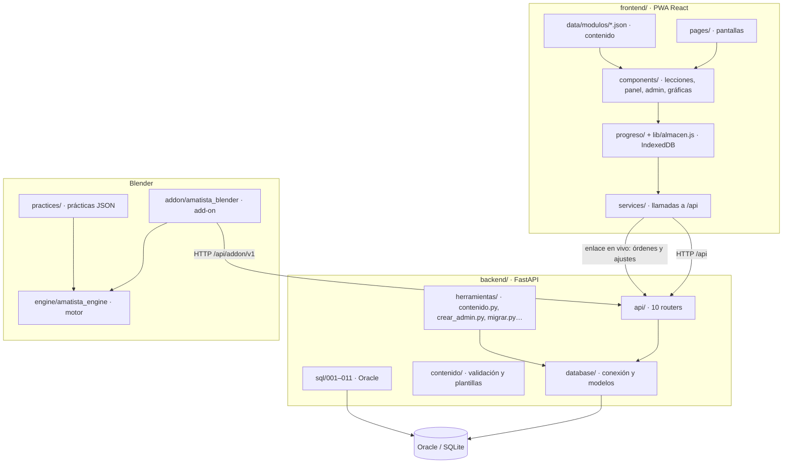

# Mapa del repositorio

Dónde está cada pieza de Amatista, cómo se conectan y por dónde empezar a leer. Para cualquiera que abre el repositorio por primera vez.

Actualizado: 10 de octubre de 2026 (main con los PR #25, #26 y #27; Amatista Motor 3.5.1).

## 1. Las piezas en una imagen

## 2. Carpetas de la raíz

| Carpeta / archivo | Qué es | Tamaño aprox. | Manual |
|---|---|---|---|
| `frontend/` | PWA React 19 + Vite + Tailwind 4. Todo lo que ve el alumno, el profesor y el administrador | 175 archivos en `src/`, ~25 900 líneas | [02 Frontend](02_frontend.md) |
| `backend/` | API FastAPI, modelos, scripts de Oracle, CLI de contenido y pruebas | 67 archivos, ~17 900 líneas | [03 Backend](03_backend.md) |
| `engine/` | Amatista Engine: motor de prácticas en Python puro | 80 archivos, ~12 800 líneas | [04 Motor](04_motor_addon_y_practicas.md) |
| `addon/` | Add-on «Amatista» para Blender 4.2+, constructor del `.zip` e instaladores | 49 archivos, ~9 900 líneas | [04 Motor](04_motor_addon_y_practicas.md) |
| `practices/` | Prácticas del plan de estudios (`amatista.practice/2`) en `blender/<curso>/m<n>-<nombre>/`, el mapa `blender/cursos.json` y las archivadas en `archivo/v2/` | 18 prácticas (cada una con su `example`) + 3 archivadas | [04 Motor](04_motor_addon_y_practicas.md) |
| `tablero/` | Generador del Kanban (`actualizar.py`), tareas (`tareas.yml`), pruebas e histórico de la v2 | 6 archivos | [Manual del desarrollador](../desarrollador/05_flujo_de_trabajo.md) |
| `despliegue/` | Unidad systemd, `Caddyfile` (HTTPS) y `actualizar.sh` para la VM | 3 archivos | [Despliegue en OCI](../despliegue/2026-10-04_despliegue_oci.md) |
| `herramientas/` | `crear-tags.sh` (tags de versión) | 1 archivo | [Manual del desarrollador](../desarrollador/02_herramientas_de_linea_de_comandos.md) |
| `ai_tutor/` | `prompts/` reservado para el tutor IA (vacío) | — | — |
| `docs/` | Toda la documentación | 128 archivos | [Índice](../README.md) |
| `.github/workflows/` | `ci.yml` (pruebas) y `tablero.yml` (Kanban) | 2 archivos | [Pruebas y CI](../desarrollador/04_pruebas_y_ci.md) |
| `README.md` | Presentación completa del proyecto | | |
| `PROYECTO.md` | Centro de dirección: prioridades y forma de trabajo | | |
| `KANBAN.md` | Tablero generado (no se edita a mano) | | |
| `CHANGELOG.md` | Qué trajo cada versión | | |
| `.env.example` | Variables del tutor IA (Ollama) | | |

## 3. Puntos de entrada

| Para entender… | Abre primero | Luego |
|---|---|---|
| La PWA | `frontend/src/main.jsx` → `frontend/src/App.jsx` | `pages/`, `components/leccion/` |
| Un módulo de contenido | `frontend/src/data/modulos/blender_principiante-modulo-1.json` | `backend/contenido/validacion.py` (reglas), `data/herramientas.js` (catálogo de bloques) |
| La API | `backend/main.py` (registra los routers) | `backend/api/dependencias.py` (sesión y roles), cada `api/*.py` |
| Los datos | `backend/database/modelos.py` | `backend/sql/LEEME.txt` y [esquema](../base-de-datos/esquema.md) |
| El motor | `engine/demo.py` | `engine/amatista_engine/engine.py`, `practice/`, `validators/`, `ejemplo/`, `figures/`, `guide/` |
| El add-on | `addon/amatista_blender/__init__.py` | `operadores.py`, `practicas.py`, `guia.py`, `enlace.py`, `ejemplo.py`, `interfaz/` |
| Una práctica | `practices/blender/principiante/m1-tren/practica.json` (con su `example`) | [formato de práctica](../motor/referencia/02_formato_de_practica.md) |

## 4. Routers de la API

Registrados en `backend/main.py` en este orden:

| Archivo | Para qué |
|---|---|
| `api/auth.py` | Cuentas: registro, inicio de sesión, confirmación de correo, recuperación y cambio de contraseña |
| `api/sesiones.py` | `/api/iniciar-sesion` heredado de la v1 (alumnos anónimos) |
| `api/progreso.py` | Guardar y leer el progreso; fusión del progreso offline (`api/fusion.py`) |
| `api/eventos.py` | Eventos de aprendizaje y métricas |
| `api/admin.py` | Panel de administración: usuarios, métricas, sistema |
| `api/contenido.py` | Catálogo, módulos, lecciones, plantillas, publicar y archivar |
| `api/niveles.py` | Niveles y mapa del curso (v3) |
| `api/blender.py` | Versiones de Blender y compatibilidad |
| `api/addon.py` | API del add-on `/api/addon/v1`: vínculo, prácticas, intentos, descargas |
| `api/enlace.py` | Enlace en vivo plataforma↔Blender: latido, órdenes (`abrir_practica`, `enfocar`, `ver_todo`, `actualizar`; `comprobar`, `pista`, `hazlo_conmigo`, `guardar`, `reiniciar`; `ver_ejemplo`, `volver_practica`) y ajustes de «Mi Blender» (sql/010; el detalle del instructor, sql/011) |

Apoyo: `api/comun.py`, `api/dependencias.py`, `api/limites.py` (límites por IP), `api/correo.py` (SMTP). Tabla completa de endpoints en [03 Backend](03_backend.md).

## 5. Pantallas de la PWA

| Página | Archivo | Quién |
|---|---|---|
| Cursos (inicio) | `pages/Inicio.jsx` | todos |
| Ruta del módulo | `pages/Curso.jsx` | alumno |
| Lección | `pages/Leccion.jsx` | alumno |
| Mi panel | `pages/Panel.jsx` | alumno con cuenta |
| Mi Blender / vincular | `pages/Blender.jsx`, `pages/Vincular.jsx` | alumno con cuenta |
| Entrar, registro, confirmar | `pages/cuenta/*` | todos |
| Admin | `pages/admin/*` (Resumen, Contenido «Módulos», EditorLeccion, Practicas, Herramientas, Usuarios, Usuario, Sistema «Estado») | profesor (lectura) y admin |
| Diagnóstico técnico | `pages/Laboratorio.jsx` | equipo, desde Admin › Estado |

Rutas exactas y roles en [02 Frontend](02_frontend.md).

## 6. Motor y add-on

| Paquete | Para qué |
|---|---|
| `engine/amatista_engine/practice/` | Cargar, validar (`schema.py`) y compilar prácticas |
| `engine/amatista_engine/validators/` | Los 42 validadores: escena, objetos, mallas, transformaciones, materiales, animación, figura y `example.matches` |
| `engine/amatista_engine/ejemplo/` | El ejemplo resuelto de cada práctica: `pasos.py` arma la escena esperada y describe cada paso; `revision.py` compara la escena del alumno aspecto por aspecto |
| `engine/amatista_engine/figures/` | Reconocer la figura por la forma de sus piezas (`reconocer.py`) y su silueta cuando está hecha en una sola malla (`silueta.py`) |
| `engine/amatista_engine/pedagogy/` | Pistas, habilidades, progreso y grafo de objetivos |
| `engine/amatista_engine/guide/` | Etapa 2: guía paso a paso (`coach.py`) y acompañante (`companion.py`) |
| `engine/amatista_engine/blender/` | Adaptador a `bpy` y etiquetado de objetos |
| `engine/amatista_engine/tools/` | Catálogo de herramientas de Blender que enseñan las prácticas |
| `addon/amatista_blender/` | Cuenta y red (`cuenta.py`, `red.py`), prácticas (`practicas.py`, una escena por práctica), guía (`guia.py`), enlace en vivo (`enlace.py`), modo enfocado y «Tus herramientas» (`enfoque.py`), «Ver el ejemplo» (`ejemplo.py`), escenas de inicio (`escenarios.py`), temáticas (`temas.py`), modo Author (`autor.py`, `desarrollo.py`), interfaz (`interfaz/`) |

## 7. Convenciones del código

- **Idioma**: nombres y comentarios en español en la plataforma (`almacen.js`, `modelos.py`); el núcleo del motor usa nombres en inglés (`engine.py`, `validators/`) porque nació como prototipo independiente.
- **Local primero**: nada de lo que el alumno ya descargó depende del servidor.
- **Migraciones aditivas**: un cambio de esquema es un script nuevo `00N_*.sql` idempotente; nunca se edita uno ya ejecutado en producción.
- **Comentarios con enlace a su documento**: muchos archivos citan `docs/...` en su encabezado; si mueves un documento, actualiza esas rutas (búscalas con `grep -rn "docs/" --include=*.py --include=*.js --include=*.jsx`).
- **Sin secretos en el repo**: solo archivos `.env.example`.
