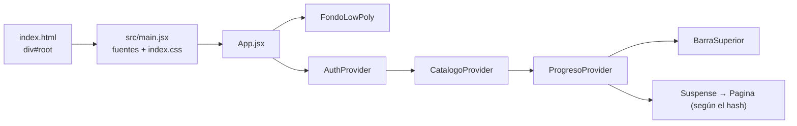
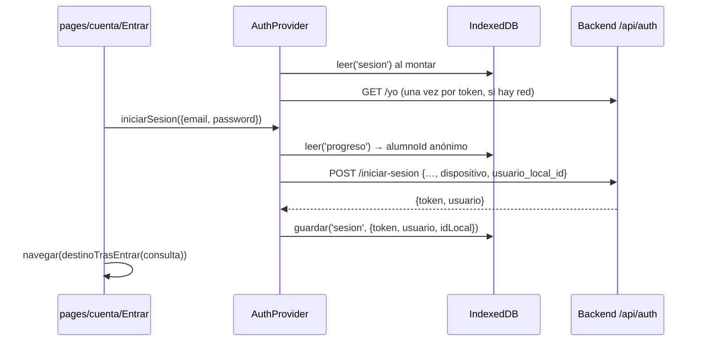

# 02 · Frontend (PWA)

Manual del código de la PWA de Amatista (`frontend/`) para desarrolladores que llegan nuevos: qué hace cada carpeta, cómo fluyen los datos y qué archivos tocar para cambiar algo.

Actualizado: 4 de octubre de 2026 (main en c730c0e)

**Índice**

1. [Qué es y cómo arranca](#1-qué-es-y-cómo-arranca)
2. [Mapa de carpetas de `frontend/src/`](#2-mapa-de-carpetas-de-frontendsrc)
3. [Flujos paso a paso](#3-flujos-paso-a-paso)
4. [Bloques de lección](#4-bloques-de-lección)
5. [Servicios y API del backend](#5-servicios-y-api-del-backend)
6. [PWA, offline, estilos, scripts y variables](#6-pwa-offline-estilos-scripts-y-variables)
7. [Pruebas](#7-pruebas)
8. [Recetas](#8-recetas)
9. [Detalles que conviene saber](#9-detalles-que-conviene-saber)

Documentos relacionados: [`frontend/README.md`](../../frontend/README.md) (resumen corto), [`docs/plataforma/`](../plataforma/README.md) (la plataforma por rol, etiquetas, herramientas y panel admin) y [`backend/README.md`](../../backend/README.md) (la API).

---

## 1. Qué es y cómo arranca

La PWA es una aplicación de una sola página hecha con **React 19 + Vite 8 + Tailwind CSS 4 + A-Frame 1.8** (versiones en [`package.json`](../../frontend/package.json)). Es *offline-first*: el catálogo de cursos viaja empaquetado dentro de la app, el progreso del alumno se guarda en IndexedDB y el backend FastAPI solo se usa para sincronizar, para las cuentas, para el panel de administración y para la integración con Blender.

### Cadena de arranque



| Paso | Archivo | Qué hace |
|---|---|---|
| 1 | [`index.html`](../../frontend/index.html) | HTML con `<div id="root">`, título, `theme-color` `#121212` e íconos; carga `/src/main.jsx` como módulo. |
| 2 | [`src/main.jsx`](../../frontend/src/main.jsx) | Importa las fuentes empaquetadas (`@fontsource-variable/outfit` y `jetbrains-mono`, funcionan sin conexión) y `index.css`; monta `<App />` dentro de `React.StrictMode`. |
| 3 | [`src/App.jsx`](../../frontend/src/App.jsx) | Anida los proveedores **en este orden**: `AuthProvider` → `CatalogoProvider` → `ProgresoProvider` (el progreso necesita la sesión y el catálogo). Dibuja la barra superior y la página que corresponde al hash. |

`CatalogoProvider` y `ProgresoProvider` devuelven `null` hasta terminar de leer IndexedDB (milisegundos), para no mostrar lecciones bloqueadas que en realidad ya están completadas ni un «lección no encontrada» en un enlace directo.

Las páginas, salvo `Inicio`, se cargan bajo demanda con `React.lazy` (`App.jsx:15-26`). Así la portada carga rápido, el panel de administración solo lo descarga quien entra en él y A-Frame (~1.3 MB) solo se descarga si se abre una vista 3D.

### Enrutado por hash

No hay React Router: la ruta es `window.location.hash` y funciona en cualquier hosting estático y sin conexión.

- [`src/rutas.js`](../../frontend/src/rutas.js) define el objeto `rutas` (constantes y funciones que arman cada hash), `analizarRuta(hash)` (hash → `{pagina, cursoId?, leccionId?, seccion?, params?, consulta}`), `rutaEntrar(volver)`, `destinoTrasEntrar(consulta)` y `navegar(destino)`.
- `useRuta()` en `App.jsx` escucha `hashchange`, sube la página al inicio y pasa la ruta a `Pagina`, un `switch` sobre `ruta.pagina`.
- Lo que va tras `?` en el hash llega como `consulta` (por ejemplo `#/entrar?volver=%23%2Fperfil` o `#/vincular?codigo=ABCD-2345`).

**Todas las rutas**

| Hash | `pagina` / `seccion` | Componente | Rol requerido |
|---|---|---|---|
| `#/` (o cualquier hash desconocido) | `inicio` | [`pages/Inicio.jsx`](../../frontend/src/pages/Inicio.jsx) | Ninguno |
| `#/curso/:cursoId` | `curso` | [`pages/Curso.jsx`](../../frontend/src/pages/Curso.jsx) | Ninguno |
| `#/curso/:cursoId/leccion/:leccionId` | `leccion` | [`pages/Leccion.jsx`](../../frontend/src/pages/Leccion.jsx) | Ninguno (la lección debe estar desbloqueada en el progreso) |
| `#/panel` | `panel` | [`pages/Panel.jsx`](../../frontend/src/pages/Panel.jsx) | Ninguno (usa el progreso local; con cuenta, además se sincroniza) |
| `#/blender` | `blender` | [`pages/Blender.jsx`](../../frontend/src/pages/Blender.jsx) («Mi Blender») | Ninguno para ver; la lista de Blender conectados y de prácticas necesita sesión |
| `#/vincular?codigo=…` | `vincular` | [`pages/Vincular.jsx`](../../frontend/src/pages/Vincular.jsx) | Sesión iniciada (sin sesión, enlaza a Entrar) |
| `#/entrar?volver=…` | `entrar` | [`pages/cuenta/Entrar.jsx`](../../frontend/src/pages/cuenta/Entrar.jsx) | Ninguno |
| `#/registro` | `registro` | [`pages/cuenta/Registro.jsx`](../../frontend/src/pages/cuenta/Registro.jsx) | Ninguno |
| `#/confirmar?email=…` | `confirmar` | [`pages/cuenta/Confirmar.jsx`](../../frontend/src/pages/cuenta/Confirmar.jsx) | Ninguno |
| `#/recuperar` | `recuperar` | [`pages/cuenta/Recuperar.jsx`](../../frontend/src/pages/cuenta/Recuperar.jsx) | Ninguno |
| `#/perfil` | `perfil` | [`pages/cuenta/Perfil.jsx`](../../frontend/src/pages/cuenta/Perfil.jsx) | Sesión iniciada |
| `#/laboratorio` | `laboratorio` | [`pages/Laboratorio.jsx`](../../frontend/src/pages/Laboratorio.jsx) | Profesor o admin (la comprobación está dentro de la página) |
| `#/admin` | `admin` / `resumen` | [`pages/admin/Admin.jsx`](../../frontend/src/pages/admin/Admin.jsx) → `Resumen.jsx` | Profesor o admin |
| `#/admin/usuarios` | `admin` / `usuarios` | `Usuarios.jsx` | Profesor o admin |
| `#/admin/usuarios/:id` | `admin` / `usuario` | `Usuario.jsx` | Profesor o admin (solo admin modifica) |
| `#/admin/contenido` | `admin` / `contenido` | `Contenido.jsx` (título «Módulos») | Profesor o admin (solo admin modifica) |
| `#/admin/contenido/:cursoId/:leccionId` | `admin` / `leccion` | `EditorLeccion.jsx` | Profesor o admin (solo admin guarda) |
| `#/admin/contenido/nueva/:moduloId` | `admin` / `nueva-leccion` | `EditorLeccion.jsx` | Profesor o admin (solo admin guarda) |
| `#/admin/practicas` | `admin` / `practicas` | `Practicas.jsx` | Profesor o admin (solo admin publica/archiva) |
| `#/admin/herramientas` | `admin` / `herramientas` | `Herramientas.jsx` | Profesor o admin |
| `#/admin/sistema` | `admin` / `sistema` | `Sistema.jsx` | **Solo admin** (al profesor se le muestra un aviso) |

Cómo se decide el rol en el cliente: `useAuth()` expone `esAdmin` (`rol === 'admin'`) y `esProfesor` (`rol` `profesor` o `admin`). `RutaAdmin` en `App.jsx` muestra «Área de profesores» a quien no tiene `esProfesor`. Es solo para no enseñar la pantalla: **el servidor valida el rol en cada petición**.

### Navegación fija

[`components/BarraSuperior.jsx`](../../frontend/src/components/BarraSuperior.jsx) dibuja la estructura fija de la v3.1: **Cursos** (activa en `inicio`, `curso` y `leccion`) · **Mi panel** · **Admin** (solo si `esProfesor`). Blender ya no es pestaña: «Mi Blender» (`#/blender`) y «Perfil» están en el menú de la cuenta, y `#/laboratorio` se abre desde Admin › Estado (`Sistema.jsx`). La barra también muestra el indicador de XP/nivel, el estado de conexión (`useConexion`) y el botón «Instalar» de la PWA (`useInstalarPWA`). Al cerrar sesión estando en `perfil` o `admin`, vuelve a `#/`.

---

## 2. Mapa de carpetas de `frontend/src/`

```text
src/
├── main.jsx, App.jsx, rutas.js, index.css
├── auth/            sesión y validaciones de cuenta
├── catalogo/        catálogo vigente (empaquetado + servidor)
├── progreso/        progreso v2 offline, XP, nivel, racha, sincronización
├── data/            cursos base, catálogo de herramientas y módulos JSON
├── modulos/         la práctica en Blender que cierra cada módulo
├── blender/         instalar el add-on y vincular la cuenta
├── lib/             IndexedDB y generador de ids
├── hooks/           conexión e instalación de la PWA
├── services/        clientes HTTP del backend
├── components/      piezas visuales (leccion, modulo, panel, admin, etiquetas, graficas)
└── pages/           una página por ruta (cuenta/ y admin/ aparte)
```

### Raíz de `src/`

| Archivo | Qué hace | Exporta / usa |
|---|---|---|
| `main.jsx` | Punto de entrada: fuentes, CSS y montaje de `App`. | Usa `App.jsx`. |
| `App.jsx` | Proveedores, `useRuta`, `RutaAdmin`, `Pagina` (switch de páginas) y carga diferida. | `default App`. Usa `rutas.js`, los tres proveedores, `BarraSuperior`, `FondoLowPoly`. |
| `rutas.js` | Todas las rutas por hash y su análisis. | `rutas`, `analizarRuta`, `rutaEntrar`, `destinoTrasEntrar`, `navegar`. |
| `rutas.test.js` | Pruebas de `analizarRuta` y de los destinos seguros tras entrar. | — |
| `index.css` | Tailwind 4 (`@import "tailwindcss"` + `@config`), capa base y clases de la identidad low poly. | Ver [§6](#estilos-tailwind-4-e-identidad-low-poly). |

### `auth/`

| Archivo | Qué hace | Exporta / usa |
|---|---|---|
| `AuthProvider.jsx` | Guarda la sesión `{token, usuario, idLocal}` en IndexedDB (clave `sesion`), la valida con `/api/auth/yo` y ofrece todas las acciones de cuenta. | `default AuthProvider`. Usa `services/api.js`, `lib/almacen.js`, `useConexion`, `CLAVE_ANONIMO` de `progreso/estado.js`. |
| `contexto.js` | Contexto y hook. El comentario documenta la forma completa del valor. | `ContextoAuth`, `useAuth()`. |
| `validacion.js` | Validaciones de los formularios de cuenta (las mismas reglas que `backend/api/auth.py`). | `validarCorreo`, `validarPasswordNueva`, `validarPassword`, `validarNombre`, `validarTelefono`, `limpiarCodigo`, `validarCodigo`, `validar(reglas, valores)`. |
| `validacion.test.js` | Pruebas de las validaciones. | — |

### `catalogo/`

| Archivo | Qué hace | Exporta / usa |
|---|---|---|
| `CatalogoProvider.jsx` | Catálogo vigente = empaquetado (`data/cursos.js`) + copia del servidor guardada en IndexedDB (clave `catalogo`). Pide `GET /api/contenido/catalogo` con `If-None-Match` al abrir y al recuperar la conexión. | `default CatalogoProvider`. Usa `combinar.js`, `services/api.js`, `lib/almacen.js`. |
| `contexto.js` | Contexto y hook. | `ContextoCatalogo`, `useCatalogo()` → `{cursos, version, origen: 'app'\|'servidor', generadoEn, buscarCurso(id), actualizar()}`. |
| `combinar.js` | Funciones puras que mezclan el catálogo de la app con el del servidor (reglas en el comentario del archivo). | `normalizarModulo`, `combinarModulos`, `combinarCatalogos`. |
| `combinar.test.js` | Pruebas de `armarCatalogo` y de la combinación. | — |

### `progreso/`

| Archivo | Qué hace | Exporta / usa |
|---|---|---|
| `ProgresoProvider.jsx` | Carga el progreso de la identidad actual (anónimo o cuenta), lo guarda en cada cambio, descarga lo de otros dispositivos y envía lo pendiente. | `default ProgresoProvider`. Usa `useAuth`, `useCatalogo`, `useConexion`, `lib/almacen.js`, `services/api.js`, `estado.js`, `reglas.js`. |
| `contexto.js` | Contexto y hook. | `ContextoProgreso`, `useProgreso()` → `{progreso, xp, nivel, racha, completarLeccion, registrarExamen, registrarActividad, otorgarInsignia, registrarSesionAprendizaje, sincronizacion, sincronizarAhora}`. |
| `estado.js` | Estado v2 y sus transformaciones puras (normalizar/migrar v1, combinar, aplicar lección/examen/actividad/insignia/sesión, preparar envío, confirmar). La forma del estado está en el comentario inicial. | `estadoVacio`, `normalizarEstado`, `combinarEstados`, `combinarConServidor`, `aplicar*`, `prepararEnvio`, `confirmarProgreso`, `confirmarEventos`, `crearEvento`, `CLAVE_ANONIMO`, `claveAlmacen`, constantes `LOTE_*`, `VERSION_APP`… |
| `reglas.js` | Reglas puras: completado (con `replaces`), desbloqueo (con «acople»), resumen de módulo/curso, insignias, XP, nivel, racha. | `estaCompletada`, `estaDesbloqueada`, `moduloCompletado`, `idInsignia`, `leccionEsNueva`, `resumenModulo`, `resumenCurso`, `insigniasPorOtorgar`, `calcularXP`, `calcularNivel`, `TITULOS_NIVEL`, `calcularRacha`, `fechaLocal`, `sumarDias`, `XP_POR_LECCION` (100), `XP_POR_ACTIVIDAD_PERFECTA` (10). |
| `estado.test.js`, `reglas.test.js` | Pruebas de las dos anteriores. | — |

### `data/` y `data/modulos/`

| Archivo | Qué hace | Exporta / usa |
|---|---|---|
| `cursos.js` | `CURSOS_BASE` (Blender y A-Frame con los títulos de sus módulos «Próximamente») y `armarCatalogo`, que reemplaza cada marcador por el JSON publicado con el mismo número. Carga `./modulos/*.json` con `import.meta.glob` (eager). | `cursos`, `armarCatalogo`, `cursoDelModulo`, `tituloCorto`, `buscarCurso`, `modulosPublicados`, `leccionesDelCurso`, `buscarLeccion`, `buscarModulo`, `buscarInsignia`, `TIPOS_LECCION`, `duracionTexto`. |
| `herramientas.js` | Catálogo de herramientas de enseñanza (bloques) por categoría, con «para qué», «cuándo» y pasos de la Fórmula. Lo usan el editor de lecciones y `#/admin/herramientas`. | `CATEGORIAS`, `HERRAMIENTAS`, `NOMBRES_FORMULA`, `nombreHerramienta`, `agruparHerramientas`. |
| `herramientas.test.js` | Pruebas del agrupado. | — |
| `modulos/aframe-modulo-1.json` | Módulo `mod_aframe_001` (curso `aframe`, `order` 1, `publicado`): 2 lecciones + examen. | `{module: {...}}` |
| `modulos/blender-modulo-1.json` | Módulo `mod_teoria_001` (curso `blender`, `order` 1, `publicado`): 3 lecciones + examen. | `{module: {...}}` |
| `modulos/blender-modulo-2.json` | Módulo `mod_blender_002` (curso `blender`, `order` 2, **`estado: "revision"`**): 3 lecciones; la última tiene el bloque `blender_practice` con `practica: "blender.n1.mesa"`. | `{module: {...}}` |

### `modulos/`

| Archivo | Qué hace | Exporta / usa |
|---|---|---|
| `practica.js` | Funciones puras de la práctica en Blender que cierra cada módulo: encontrarla, dividir el módulo en «antes / práctica / después» y calcular su estado. | `bloquePractica`, `esPracticaBlender`, `practicaDelModulo`, `partesDelModulo`, `estadoPractica`, `practicasDelCatalogo`. Usa `progreso/reglas.js`. |
| `practica.test.js` | Pruebas. | — |

### `blender/`

| Archivo | Qué hace | Exporta / usa |
|---|---|---|
| `PrepararBlender.jsx` | «Prepara tu Blender» dentro de la lección de práctica: detecta el sistema, descarga el paquete y permite escribir el código de vínculo. | `default PrepararBlender`. Usa `services/blender.js` (`descargarPaquete`, `listarDispositivos`), `FormularioCodigo`. |
| `FormularioCodigo.jsx` | Formulario del código de vínculo `ABCD-2345`. | `default FormularioCodigo`. Usa `confirmarVinculo`, `normalizarCodigo`, `Alerta`. |
| `logica.js` | Lógica pura: `SISTEMAS`, `BLENDER_MINIMO` (`'4.2'`), `detectarSistema`, `normalizarCodigo`, `compararVersiones`, `blenderCompatible`, `pasosConEstado`, `textoAutonomia`, `resumenPractica`. | — |
| `logica.test.js` | Pruebas. | — |

### `lib/`

| Archivo | Qué hace | Exporta / usa |
|---|---|---|
| `almacen.js` | Almacén clave-valor del dispositivo: base IndexedDB `amatista`, tienda `estado`; si IndexedDB falla (o tarda más de 4 s en abrir) recurre a `localStorage` con prefijo `amatista:`. | `leer(clave)`, `guardar(clave, valor)`, `pedirAlmacenamientoPersistente()`. |
| `identificador.js` | Ids con prefijo (`crypto.randomUUID` o respaldo si no hay contexto seguro). | `nuevoId(prefijo)`. |

Claves que se usan en el almacén: `sesion` (auth), `catalogo` (copia del servidor), `progreso` (anónimo) y `progreso:<cuentaId>` (cada cuenta).

### `hooks/`

| Archivo | Qué hace | Exporta |
|---|---|---|
| `useConexion.js` | `true`/`false` según `navigator.onLine` y los eventos `online`/`offline`. | `useConexion()` |
| `useInstalarPWA.js` | Guarda el evento `beforeinstallprompt` para mostrar el botón propio «Instalar»; `null` si no se puede instalar. | `useInstalarPWA()` |

### `services/`

| Archivo | Qué hace | Exporta |
|---|---|---|
| `api.js` | Cliente base (`pedirJSON`), mensajes de error en español, cuentas, progreso, eventos, catálogo y salud. | Ver [§5](#5-servicios-y-api-del-backend). |
| `admin.js` | Panel de administración (`/api/admin`) y gestor de contenido (`/api/contenido`). | Ver §5. |
| `blender.js` | Add-on, vínculos, descargas y prácticas del motor (`/api/addon/v1`). | Ver §5. |

### `components/` (raíz)

| Archivo | Qué hace | Exporta / usa |
|---|---|---|
| `BarraSuperior.jsx` | Navegación fija, menú de la cuenta, XP/nivel, conexión, instalar PWA. | `default`. Usa `useAuth`, `useProgreso`, `useConexion`, `useInstalarPWA`, `rutas`. |
| `EstadoGuardado.jsx` | Le dice al alumno dónde está su progreso (dispositivo y, si el servidor confirmó, cuenta). | `default`. Usa `useAuth`, `useProgreso`. |
| `FondoLowPoly.jsx` | Fondo de triángulos generado con semilla (siempre igual), memorizado. | `default memo(FondoLowPoly)`. |
| `Iconos.jsx` | Íconos low poly generales. | `CristalLogo`, `IconoBlender`, `IconoAFrame`, `IconoCandado`. |
| `TarjetaCurso.jsx` | Tarjeta de un curso en la portada, con su avance. | `default`. Usa `useProgreso`, `resumenCurso`, `resumenModulo`. |
| `estiloCurso.js` | Ícono y clases de acento por curso (`blender`, `neon`). | `ICONOS_CURSO`, `ACENTOS`. |

### `components/admin/`

| Archivo | Qué hace | Exporta / usa |
|---|---|---|
| `NavAdmin.jsx` | Navegación del panel: Resumen · Enseñanza (Módulos, Prácticas de Blender, Herramientas) · Personas (Usuarios) · Sistema (Estado, solo admin). | `default`. Usa `rutas`, `alSalirPorEnlace`. |
| `ui.jsx` | Piezas visuales del panel. | `Tarjeta`, `Kpi`, `EtiquetaEstado`, `Pastilla`, `Boton`, `Mensaje`, `CargandoAdmin`, `Vacio`, `ErrorAdmin` (401 → Entrar, 403 → permiso), `Confirmacion` (`<dialog>`), `CampoAdmin`. |
| `logica.js` | Funciones puras: roles, órdenes, periodos, pasos de la Fórmula, fechas (`aFecha`, `fechaTexto`, `haceCuanto`…), JSON de bloques (`leerJSON`, `leerBloque`, `idBloqueUnico`, `bloqueDesdeEjemplo`), armado de lecciones (`armarLeccion`, `separarLeccion`, `leccionDesdePlantilla`…), `nombreArchivoModulo`, `datosSerie`. | — |
| `logica.test.js` | Pruebas (también de `consultaURL` de `services/admin.js`). | — |
| `cambios.js` | Aviso de cambios sin guardar del editor (el `hashchange` no se puede cancelar: los enlaces preguntan antes). | `marcarCambiosPendientes`, `hayCambiosPendientes`, `confirmarSalida`, `alSalirPorEnlace`. |
| `estilos.js` | Clases compartidas de los controles. | `claseControl`. |
| `useConfirmacion.js` | Pregunta de confirmación con promesa (`await preguntar({...})`). | `useConfirmacion()`. |
| `useDatosAdmin.js` | Carga datos de una pantalla y conserva los anteriores mientras recarga; `useRetardado` para búsquedas al escribir. | `useDatosAdmin(pedir, clave)`, `useRetardado(valor, espera)`. |

### `components/etiquetas/`

| Archivo | Qué hace | Exporta |
|---|---|---|
| `catalogo.js` | Sistema de etiquetas v3.1: tonos, etiquetas por tipo de lección y de módulo/estado. Ver [docs/plataforma/03](../plataforma/03_etiquetas_y_graficos.md). | `TONOS`, `ETIQUETAS_LECCION`, `ETIQUETAS`, `textoNivel`, `etiquetaLeccion`, `etiquetasModulo`. |
| `Etiqueta.jsx` | Chip con corte diagonal; `tamano` `sm` o `md`. | `default Etiqueta`, `Etiquetas` (fila). |
| `IconosEtiqueta.jsx` | Íconos de 16 px de las etiquetas. | `IconoLectura`, `IconoInteractiva`, `IconoVideo`, `IconoCodigo`, `IconoExamen`, `IconoCubo`, `IconoGuia`, `IconoNuevo`, `IconoInsignia`, `IconoReloj`, `IconoNivel`… |

### `components/graficas/`

| Archivo | Qué hace | Exporta |
|---|---|---|
| `AnilloProgreso.jsx` | Anillo hexagonal (o círculo) accesible como `progressbar`. | `default` |
| `Barras.jsx` | Columnas de una serie, navegables con teclado y con tabla para lectores de pantalla. | `default` |
| `MapaCalor.jsx` | Mapa de calor diario de las últimas semanas. | `default` |
| `Medidor.jsx` | Barra horizontal con marca opcional (p. ej. puntaje para aprobar). | `default` |
| `colores.js` | Paleta de las gráficas. | `COLORES`, `ACENTOS_GRAFICA`, `RAMPA_AMATISTA`, `CELDA_VACIA` |
| `escalas.js` | Escalas puras. | `escalaBonita`, `nivelDeRampa`, `saltoEtiquetas`, `limitar`, `conUnidad` |
| `fechas.js` | Fechas locales por día y semana (lunes primero). | `diaSemana`, `inicioSemana`, `fechaCorta`, `MESES_CORTOS`, `DIAS_CORTOS`… |
| `useAncho.js` | Ancho real de un elemento con `ResizeObserver`. | `useAncho(ref)` |
| `graficas.test.js` | Pruebas de escalas y fechas. | — |

### `components/leccion/`

| Archivo | Qué hace | Exporta / usa |
|---|---|---|
| `BloqueContenido.jsx` | **Despachador de bloques**: elige el componente según `bloque.type` (tabla en [§4](#4-bloques-de-lección)). | `default`. |
| `Examen.jsx` | Examen de una lección `type: "exam"` (`quizData`: `questions`, `passingScore`; cada pregunta `questionText`, `options[{id, text, isCorrect}]`, `feedbackCorrect`, `feedbackIncorrect`). | `default`. |
| `Markdown.jsx` | Markdown mínimo (`###`, párrafos, listas `-`, `**`, `*`, `` ` ``) que construye elementos React: nunca inserta HTML. | `default Markdown`, `TextoEnLinea`. |
| `Figura.jsx` | Imagen con pie. | `default` |
| `TarjetasConcepto.jsx`, `LineaTiempo.jsx`, `Pipeline.jsx`, `Capas.jsx`, `Aviso.jsx`, `BloqueCodigo.jsx`, `PasoAPaso.jsx`, `Atajos.jsx`, `Comparar.jsx` | Un componente por bloque de contenido. | `default` |
| `Tecla.jsx` | Teclas dibujadas (usadas por Paso a paso y Atajos). | `Tecla`, `Teclas` |
| `atajos.js` | Lógica pura del modo «Pruébate» de Atajos. | `claveAtajo`, `claveDeEvento`, `practicables` |
| `atajos.test.js` | Pruebas. | — |
| `IconosLeccion.jsx` | Íconos low poly de 48×48 (Aviso, Línea de tiempo, Pipeline). | `default IconoLeccion` |
| `VistaAFrame.jsx` | Vista 3D del código del alumno: lo lee con `DOMParser` (inerte), copia solo etiquetas `<a-…>` sin atributos `on…`. Importa `aframe`; se carga bajo demanda desde `BloqueCodigo` y `RetoCodigo`. | `default` |

### `components/leccion/interactivos/`

Todos los interactivos reciben `{bloque, alCompletar, resuelta}` y llaman `alCompletar({correcto, intentos})` una sola vez (hook `useActividad`).

| Archivo | Qué hace | Exporta / usa |
|---|---|---|
| `QuizEnLinea.jsx`, `Ordenar.jsx`, `Emparejar.jsx`, `Completar.jsx`, `PuntosImagen.jsx`, `ExploradorEscena.jsx`, `RetoCodigo.jsx`, `PracticaBlender.jsx` | Un componente por bloque interactivo. | `default` |
| `EscenaAFrame.jsx` | Escena 3D del Explorador; importa `aframe` y se carga con `useModuloDiferido`. | `default` |
| `Marco.jsx` | Marco común: tipo, estado, XP ganada, enunciado y retroalimentación (`role="status"`). | `MarcoActividad`, `Retroalimentacion`, `BOTON_PRINCIPAL`, `BOTON_SECUNDARIO` |
| `hooks.js` | `useActividad(alCompletar)` (resolver una vez) y `useModuloDiferido(cargar, activo)` (carga A-Frame solo al verse; si falla sin conexión devuelve error en vez de romper la lección). | — |
| `logica.js` | Lógica pura: `TIPOS_INTERACTIVOS`, `esActividad`, `actividadesDe`, mezclas con semilla, corrección de cada actividad. | — |
| `logica.test.js` | Pruebas. | — |

### `components/modulo/`

| Archivo | Qué hace | Usa |
|---|---|---|
| `RutaModulo.jsx` | Línea con un nodo hexagonal por lección y la práctica al final; sin `progreso` (panel admin) muestra solo la estructura. | `estaCompletada`, `esPracticaBlender`, `etiquetaLeccion` |
| `EstacionBlender.jsx` | Tarjeta grande «Práctica en Blender · cierre del módulo» con estado `bloqueada`/`abierta`/`hecha`. | `estadoPractica` (lo recibe ya calculado), `rutas.leccion` |

### `components/panel/`

| Archivo | Qué hace |
|---|---|
| `EncabezadoPanel.jsx` | Saludo, nivel con anillo de XP, racha, mejor racha y lecciones. |
| `ContinuarPanel.jsx` | «Continúa donde te quedaste»: siguiente lección por curso. |
| `CuentaPanel.jsx` | Anónimo: invita a crear cuenta. Con cuenta: estado de sincronización y correo. |
| `CursosPanel.jsx` | Avance por curso contra el catálogo vigente y estado de cada módulo. |
| `RetosPanel.jsx` | Retos de la semana (se renuevan cada lunes) y logros. |
| `ActividadPanel.jsx` | Mapa de calor de 12 semanas y lecciones por semana. |
| `BlenderPanel.jsx` | Prácticas en Blender de los módulos; avance real del servidor (`listarPracticas`, `listarDispositivos`) o, sin cuenta/servidor, el progreso local. |
| `ExamenesPanel.jsx` | Exámenes finales: mejor puntaje, intentos, marca para aprobar. |
| `MuroInsignias.jsx` | Una insignia por módulo; las ganadas se conservan aunque el módulo salga del catálogo. |
| `Proximamente.jsx` | Lugares reservados, sin interacción. |
| `Seccion.jsx` | Tarjeta de sección (`default`) y `Cifra`. |
| `IconosPanel.jsx` | Íconos de la Fórmula (Gancho, Explora, Practica, Reto, Jefe), racha, etc. |
| `datos.js` | Funciones puras: `ultimaActividadCurso`, `cursosParaContinuar`, `estadoModulo`, `tieneAvance`, `cifrasCatalogo`… |
| `retos.js` | Retos semanales y logros, derivados del progreso (no se guarda nada aparte). |
| `formula.js` | `FORMULA`: los 5 pasos del «Ciclo del Cristal». |
| `useHoy.js` | Fecha local de hoy que cambia sola a medianoche y al volver a la pestaña. |
| `datos.test.js`, `retos.test.js` | Pruebas. |

### `pages/`

| Archivo | Qué hace | Usa (principal) |
|---|---|---|
| `Inicio.jsx` | Portada: propuesta de valor, acceso a la siguiente lección, catálogo de cursos, la Fórmula e invitación a crear cuenta. | `useCatalogo`, `useProgreso`, `TarjetaCurso`, `panel/datos` |
| `Curso.jsx` | Mapa del curso: por módulo, sus lecciones, la estación de práctica en Blender y el examen después. | `partesDelModulo`, `estadoPractica`, `RutaModulo`, `EstacionBlender`, etiquetas, `EstadoGuardado` |
| `Leccion.jsx` | Reproduce una lección o un examen y registra el progreso (ver [§3.3](#33-cargar-un-cursomódulo-y-reproducir-una-lección)). | `buscarLeccion`, `BloqueContenido`, `Examen`, `actividadesDe`, `useProgreso` |
| `Panel.jsx` | Panel del alumno (ver [§3.5](#35-panel-del-alumno)). | `components/panel/*` |
| `Blender.jsx` | «Mi Blender»: descarga del paquete, Blender conectados, prácticas. | `services/blender.js`, `blender/logica.js`, `FormularioCodigo` |
| `Vincular.jsx` | Página que abre Blender con `?codigo=` ya escrito. | `FormularioCodigo`, `normalizarCodigo` |
| `Laboratorio.jsx` | Diagnóstico técnico (backend, Oracle, cuenta, catálogo, sincronización) y una escena A-Frame de prueba. Importa `aframe`. | `consultarSalud`, `API_URL` |

### `pages/cuenta/`

| Archivo | Qué hace |
|---|---|
| `Formulario.jsx` | Piezas accesibles de los formularios: `PaginaCuenta`, `Campo`, `CampoPassword`, `CampoCodigo`, `BotonEnviar`, `Alerta`, `CodigoDesarrollo`, `CLASE_ENLACE`. |
| `useFormulario.js` | Estado del formulario: valores, errores por campo, error general, `enviando`. |
| `Entrar.jsx` | Iniciar sesión; al terminar navega a `destinoTrasEntrar(consulta)` (por defecto `#/panel`). |
| `Registro.jsx` | Crear cuenta; luego navega a `#/confirmar?email=…`. |
| `Confirmar.jsx` | Código de 6 dígitos para confirmar el correo; reenviar código. |
| `Recuperar.jsx` | Dos pasos: pedir código y restablecer contraseña. |
| `Perfil.jsx` | Editar nombre/teléfono, cambiar contraseña, estado de sincronización, cerrar todas las sesiones. |

### `pages/admin/`

| Archivo | Sección | Qué hace | Servicios |
|---|---|---|---|
| `Admin.jsx` | — | Contenedor: `NavAdmin` + la sección; aviso de solo lectura para profesores. | — |
| `Resumen.jsx` | `resumen` | Indicadores, serie diaria, embudo y avance por curso (periodo 7/14/30 días). | `obtenerResumen` |
| `Usuarios.jsx` | `usuarios` | Búsqueda, filtro por rol, orden, paginación. Exporta `EstadoCuenta`. | `listarUsuarios` |
| `Usuario.jsx` | `usuario` | Ficha, acciones del admin (rol, prueba, correo confirmado), progreso, insignias, eventos. | `obtenerUsuario`, `modificarUsuario` |
| `Contenido.jsx` | `contenido` | Árbol cursos → módulos → lecciones; crear módulo, publicar, archivar, mover lección, exportar JSON. | `obtenerArbol`, `crearModulo`, `publicarModulo`, `archivarModulo`, `exportarModulo`, `publicarLeccion`, `archivarLeccion`, `moverLeccion` |
| `EditorLeccion.jsx` | `leccion`, `nueva-leccion` | Metadatos, bloques en JSON con paleta de plantillas, vista previa con los mismos componentes del alumno, validación del servidor, guardar y publicar. | `obtenerArbol`, `obtenerPlantillas`, `obtenerLeccion`, `crearLeccion`, `guardarLeccion`, `validarLeccion`, `publicarLeccion` |
| `Practicas.jsx` | `practicas` | Prácticas del motor registradas en Oracle: sincronizar desde `practices/`, ver versiones, publicar, archivar. | `listarPracticas`, `sincronizarPracticas`, `versionesPractica`, `publicarPractica`, `archivarPractica` |
| `Herramientas.jsx` | `herramientas` | Catálogo de bloques agrupado, con vista previa real (ejemplo del servidor) y su JSON. | `obtenerPlantillas` |
| `Sistema.jsx` | `sistema` | Motor y filas por tabla; purga de sesiones y eventos viejos; enlace al Laboratorio. | `obtenerSaludDetallada`, `purgarDatos` |

---

## 3. Flujos paso a paso

### 3.1 Inicio de sesión y sesión (`auth/`)

Archivos: `auth/AuthProvider.jsx`, `auth/contexto.js`, `auth/validacion.js`, `services/api.js`, `pages/cuenta/*`, `rutas.js`.



1. **Al abrir la app** `AuthProvider` lee la clave `sesion`. Sin conexión la sesión se conserva tal cual (offline-first) y `listo` pasa a `true`.
2. **Validación**: con red y `sincronizacionDisponible()`, llama `GET /api/auth/yo` una vez por token. Si responde, actualiza `usuario`; si responde **401**, borra la sesión y marca `sesionVencida` (la sesión venció o se cerró en otro dispositivo). Un error de red se reintenta al recuperar la conexión.
3. **Entrar / Registrarse** (`entrarCon`): adjunta `usuario_local_id` = `alumnoId` del progreso anónimo, para que el servidor una ese progreso con la cuenta. Guarda `{token, usuario, idLocal}`.
   - `registrar`: si el correo no está confirmado, guarda `emailPendiente`; `Registro.jsx` navega a `#/confirmar?email=…`.
   - `iniciarSesion`: un **403** significa «confirma tu correo» y guarda `emailPendiente`.
   - `codigoDev`: solo en desarrollo (`AMATISTA_MOSTRAR_CODIGOS=1` en el backend) el servidor devuelve el código y `CodigoDesarrollo` lo muestra.
4. **Cerrar sesión** funciona sin conexión: borra la sesión local y avisa al servidor como cortesía (`POST /cerrar-sesion`, espera 4 s). `cerrarTodas` sí necesita al servidor.
5. **Restablecer contraseña** cierra todas las sesiones de esa cuenta en el servidor; si es la cuenta abierta, también la local.
6. **Volver tras entrar**: los enlaces usan `rutaEntrar(hashActual)` → `#/entrar?volver=…`; `destinoTrasEntrar` solo acepta hashes internos (`#/…`).

Cada acción devuelve `{ok, error?, datos?, status?}`; los formularios validan antes con `auth/validacion.js` y muestran `error` tal cual (ya viene en español desde `services/api.js`).

### 3.2 Progreso offline en IndexedDB y sincronización

Archivos: `lib/almacen.js`, `progreso/ProgresoProvider.jsx`, `progreso/estado.js`, `progreso/reglas.js`, `services/api.js`, `components/EstadoGuardado.jsx`.

**Dónde vive.** Un objeto de estado v2 por identidad: `progreso` (anónimo) o `progreso:<cuentaId>`. La forma completa está en el comentario de `progreso/estado.js:1-11`:
`{version: 2, alumnoId, cuentaId, lecciones: {"curso:leccion": {...}}, insignias, actividad: {"YYYY-MM-DD": n}, pendientes, insigniasPendientes, eventos (máx. 500), marcas}`. `normalizarEstado` también lee el formato v1 sin perder nada.

**Ciclo del proveedor** (`ProgresoProvider.jsx`, pasos numerados en el código):

1. **Cargar** (`cargarEstado`): sin cuenta, lee `progreso`. Con cuenta, lee `progreso:<id>` y, si el anónimo tiene contenido (o es el `idLocal` que se mandó al entrar), lo combina con `combinarEstados`, guarda la cuenta y **después** reinicia el anónimo con un id nuevo (idempotente si se interrumpe). Aplica `insigniasPorOtorgar`.
2. **Guardar** cada cambio en la clave de su identidad (no mientras cambia de identidad).
3. **Descargar** (solo con cuenta, una vez por sesión o por reintento manual): `GET /api/progreso` → `combinarConServidor`. Un 401 marca `requiereSesion` y llama `verificarSesion()`.
4. **Enviar** lo pendiente, 1,5 s después del último cambio (agrupa varios) o de inmediato con `sincronizarAhora()`:
   - `prepararEnvio(estado)` arma el lote → `POST /api/progreso` (`{eventos, insignias}`; con cuenta va el token, sin cuenta `usuario_id` = `alumnoId`).
   - Luego `POST /api/eventos` con hasta `LOTE_EVENTOS` (200) eventos de analítica. Como mucho una vez por hora se agrega `sync_succeeded`.
   - Solo lo que el servidor confirmó se quita de pendientes (`confirmarProgreso`, `confirmarEventos`). Un 401 bloquea los reintentos automáticos para esa identidad hasta que cambie (o hasta `sincronizarAhora`).

**Acciones** que usan las páginas: `completarLeccion(cursoId, leccionId)`, `registrarExamen(cursoId, leccionId, puntaje, aprobado)`, `registrarActividad(cursoId, leccionId, bloqueId, resultado)`, `otorgarInsignia(id)`, `registrarSesionAprendizaje(cursoId, leccionId)`. La hora y el id de sesión de aprendizaje se calculan fuera del `setState` para que las transformaciones sean puras.

**Derivados**: `xp = calcularXP` (100 por lección + 10 por actividad perfecta + puntaje de examen, según `reglas.js` y [`docs/plataforma`](../plataforma/README.md)), `nivel = calcularNivel(xp)`, `racha = calcularRacha(actividad, hoy)`, y `sincronizacion` = `{enviando, error, ultima, requiereSesion, pendientes, eventosPendientes, disponible}`, que `EstadoGuardado` y `Perfil` muestran. Nunca se dice «sincronizado» si el servidor no lo confirmó.

**Principio de las reglas** (`reglas.js:3-5`): lo completado, el XP y las insignias nunca se pierden aunque cambie el catálogo; el porcentaje se recalcula contra el catálogo vigente. `replaces` en una lección hace que cuente la versión vieja; el «acople» de `estaDesbloqueada` evita bloquear a quien ya completó una lección posterior.

### 3.3 Cargar un curso/módulo y reproducir una lección

Archivos: `data/cursos.js`, `data/modulos/*.json`, `catalogo/*`, `pages/Curso.jsx`, `pages/Leccion.jsx`, `components/leccion/*`.

**Catálogo empaquetado** (`data/cursos.js`):

1. `import.meta.glob('./modulos/*.json', { eager: true })` mete todos los JSON en el bundle.
2. `armarCatalogo(CURSOS_BASE, archivos)`: por cada JSON con `module.id` y `estado` `publicado` (o sin `estado`), deduce el curso (`curso`, si no `courseId`, si no el nombre `<curso>-modulo-N.json`) y lo coloca en el número `order`, reemplazando el marcador «Próximamente» de `CURSOS_BASE`. Un borrador o `revision` **no** entra.
3. Resultado por curso: `{id, numero, titulo, …, modulos: [{id, numero, titulo, insignia, contenido}]}` donde `contenido` es el `module` del JSON o `null`.

**Catálogo vigente** (`CatalogoProvider`): `combinarCatalogos(cursosApp, servidor.cursos)`. Reglas (`catalogo/combinar.js`): mismo id → gana el servidor (pero un «Próximamente» del servidor no borra un módulo con contenido); mismo número → el servidor reemplaza un marcador; números nuevos se agregan; todo ordenado por número. La última copia del servidor se guarda en IndexedDB, así las lecciones publicadas desde el panel también se abren sin conexión.

**Mapa del curso** (`pages/Curso.jsx`): `buscarCurso(cursoId)` → por módulo, `partesDelModulo` separa lecciones / práctica / examen; `RutaModulo` dibuja la ruta; `EstacionBlender` la práctica.

**Reproducir una lección** (`pages/Leccion.jsx`):

1. `buscarLeccion(curso, leccionId)` encuentra `{modulo, leccion, indice}` (también por `replaces`). Si no existe: «No encontramos esta lección».
2. `estaDesbloqueada(progreso, …)`; si no, «Lección bloqueada» con enlace a la anterior.
3. Registra `registrarSesionAprendizaje` (una vez por lección y día).
4. Si `leccion.type === 'exam'` → `<Examen quiz={leccion.quizData}>`; al terminar, `registrarExamen` y, si aprobó y es la última lección del módulo, `otorgarInsignia(idInsignia(curso, modulo))`.
5. Si no, `ContenidoLeccion` recorre `leccion.contentBlocks` y dibuja cada uno con `<BloqueContenido>`. `actividadesDe(bloques)` marca como actividad los interactivos y `concept_cards`; las que no tienen `required: false` son requeridas. Una actividad con `id` se registra con `registrarActividad` (y se recuerda como resuelta en visitas futuras).
6. El botón «Completar lección» se habilita cuando todas las requeridas están resueltas (en un repaso nunca se bloquea). Al pulsarlo: `completarLeccion` y navega a la siguiente lección o al curso.

Campos de la lección que lee la PWA: `id`, `title`, `type` (`theory_reading`, `theory_interactive`, `video_lesson`, `code_interactive`, `exam`, ver `TIPOS_LECCION`), `durationSeconds`, `isLocked`, `replaces`, `cover {src, alt}`, `contentBlocks` y, en exámenes, `quizData`. El formato está en [`docs/arquitectura/2026-09-29_formato-lecciones.txt`](../arquitectura/2026-09-29_formato-lecciones.txt) y el modelo en [`docs/reestructuracion/01_modelo_de_contenido.md`](../reestructuracion/01_modelo_de_contenido.md).

### 3.4 La práctica de Blender al final del módulo

Archivos: `modulos/practica.js`, `components/modulo/EstacionBlender.jsx`, `components/leccion/interactivos/PracticaBlender.jsx`, `blender/*`, `services/blender.js`, `pages/Blender.jsx`, `pages/Vincular.jsx`. Concepto: [docs/plataforma/02_modulos_y_practica.md](../plataforma/02_modulos_y_practica.md); motor: [docs/motor/README.md](../motor/README.md).

1. **Qué es la práctica**: una lección que contiene un bloque `blender_practice`. El servidor exige que vaya al final del módulo (solo el examen puede ir después). `practicaDelModulo` toma la primera.
2. **Estado en el mapa** (`estadoPractica`): `hecha` si la lección está completada; `abierta` si está desbloqueada y no falta ninguna lección anterior; si no, `bloqueada` con `faltan` = lecciones pendientes. `EstacionBlender` solo enlaza cuando no está bloqueada.
3. **Dentro de la lección** (`PracticaBlender`):
   - Sin sesión, invita a entrar; con sesión llama `GET /api/addon/v1/practicas/{practica}` (pasos con id y `mi_progreso`).
   - Incluye `PrepararBlender`: detecta el sistema (`detectarSistema`; `null` en celulares), descarga el paquete con instalador (`GET /descargas/{sistema}`; con sesión trae un vínculo de un solo uso) y ofrece `FormularioCodigo` para conectar con `POST /vinculos/confirmar`.
   - «Abrir en Blender»: `POST /practicas/{id}/abrir` con `{origen: "plataforma"}`. El alumno abre Blender (N › pestaña Amatista) y el add-on lo guía.
   - Mientras la pestaña está visible, consulta `GET /mi-progreso?practica_id=…` cada 6 s y pinta los pasos (`pasosConEstado`). Cuando el servidor dice `completada`, la actividad se resuelve (y con ella se puede completar la lección).
   - `allowManual: true` permite marcarla como hecha sin Blender.
4. **Mi Blender** (`#/blender`) reúne descarga, compatibilidad (`BLENDER_MINIMO` 4.2), Blender conectados (`listarDispositivos`, `desconectarDispositivo`) y prácticas (`listarPracticas`). **Vincular** (`#/vincular?codigo=…`) es la página que abre el add-on con el código escrito.

### 3.5 Panel del alumno

`pages/Panel.jsx` (`#/panel`) arma una rejilla con `components/panel/*`. Todo sale de `useProgreso`, `useCatalogo` y `useAuth`, así funciona igual sin conexión; solo `BlenderPanel` consulta al servidor (con token). `useHoy()` da el «hoy» común para racha, retos y mapa de calor. Orden: `EncabezadoPanel`, `ContinuarPanel`, `CuentaPanel`, `CursosPanel`, `RetosPanel`, `ActividadPanel`, `BlenderPanel`, `ExamenesPanel`, `MuroInsignias`, `Proximamente`. Las gráficas son SVG propios de `components/graficas/` (ver [docs/plataforma/03](../plataforma/03_etiquetas_y_graficos.md)).

### 3.6 Panel de administración

`App.jsx` → `RutaAdmin` (exige `esProfesor`) → `pages/admin/Admin.jsx` con `{seccion, params}` de `analizarRuta`. Profesores leen todo; solo `esAdmin` modifica (los botones se ocultan o se deshabilitan y el servidor lo vuelve a validar). Detalle funcional: [docs/plataforma/05_panel_de_administracion.md](../plataforma/05_panel_de_administracion.md).

Patrón de cada pantalla:

```jsx
const { token } = useAuth();
const { cargando, respuesta, datos, recargar, modificar } = useDatosAdmin(() => obtenerResumen(token, dias), `${token}|${dias}`);
// <CargandoAdmin/>, <ErrorAdmin respuesta={respuesta} alReintentar={recargar}/>, <Tarjeta>…, acciones con useConfirmacion()
```

(Esquema ilustrativo; `useDatosAdmin` está en [`components/admin/useDatosAdmin.js`](../../frontend/src/components/admin/useDatosAdmin.js): `datos` es `null` si la respuesta no fue `ok`.)

**Editor de lecciones** (`EditorLeccion.jsx`): cada bloque se edita como texto JSON (`leerBloque` da el error con línea); la paleta agrupa los tipos que devuelve `/api/contenido/plantillas` con `agruparHerramientas`; la vista previa usa `BloqueContenido`/`Examen`, los mismos componentes del alumno; «Validar» llama `POST /api/contenido/validar` y un 422 trae `datos.errores` con la ruta de cada problema (`bloqueDelError` lo ubica). Los cambios sin guardar se protegen con `components/admin/cambios.js` y `beforeunload`.

---

## 4. Bloques de lección

El despachador es [`components/leccion/BloqueContenido.jsx`](../../frontend/src/components/leccion/BloqueContenido.jsx): primero busca en `INTERACTIVOS` (props `{bloque, alCompletar, resuelta}`), si no, un `switch` que pasa campos sueltos al componente. Un `type` desconocido no dibuja nada (`return null`). La lista de tipos válidos la impone el backend en [`backend/contenido/validacion.py`](../../backend/contenido/validacion.py) (`BLOQUES_CONTENIDO`, `BLOQUES_INTERACTIVOS`) y los ejemplos en [`backend/contenido/plantillas.py`](../../backend/contenido/plantillas.py).

Para qué sirve cada uno, cuándo usarlo y los límites de cada campo: **[docs/plataforma/04_herramientas_de_ensenanza.md](../plataforma/04_herramientas_de_ensenanza.md)**. Abajo, la correspondencia con el código (obligatorios en negrita según ese documento).

**Bloques de contenido** (no cuentan como actividad, salvo `concept_cards`)

| `type` en el JSON | Componente | Campos |
|---|---|---|
| `markdown_text` | `leccion/Markdown.jsx` | **`body`** |
| `image` | `leccion/Figura.jsx` | **`src`**, **`alt`**, `caption` |
| `video_player` | `<video>` dentro de `BloqueContenido` | **`url`** |
| `callout` | `leccion/Aviso.jsx` | **`body`**, `title`, `variant` (`dato`/`reto`) |
| `code_snippet` | `leccion/BloqueCodigo.jsx` (+ `VistaAFrame` si `preview`) | **`code`**, `language` (por defecto `html`), `preview` |
| `concept_cards` | `leccion/TarjetasConcepto.jsx` (es actividad: se resuelve al descubrir todas) | **`items[]`**: **`term`**, **`definition`**, `image`+`alt` |
| `timeline` | `leccion/LineaTiempo.jsx` | `title`, **`items[]`**: **`title`**, **`text`**, `icon`, `year` |
| `pipeline` | `leccion/Pipeline.jsx` | `title`, **`steps[]`**: **`title`**, **`text`**, `icon` |
| `layers` | `leccion/Capas.jsx` | `title`, **`items[]`**: **`title`**, **`text`**, `icon`; `footer` |
| `step_by_step` | `leccion/PasoAPaso.jsx` | `title`, **`steps[]`**: **`title`**, `text`, `keys`, `then`, `image`+`alt` |
| `shortcuts` | `leccion/Atajos.jsx` (+ `atajos.js`) | `title`, **`items[]`**: **`keys`**, `then`, **`action`**; `practice` |
| `compare` | `leccion/Comparar.jsx` | `title`, **`before`**, **`after`** (`{label, image?, alt?, text?}`), `mode` (`columns`/`slider`), `caption` |

**Bloques interactivos** (en `components/leccion/interactivos/`; llevan `id` único y `required`, por defecto `true`)

| `type` en el JSON | Componente | Campos |
|---|---|---|
| `quiz_inline` | `QuizEnLinea.jsx` | **`id`**, **`question`**, **`options[]`** (**`id`**, **`text`**, **`isCorrect`**), `explanation` |
| `ordering` | `Ordenar.jsx` | **`id`**, **`prompt`**, **`items[]`** (**`id`**, **`text`**, en el orden correcto), `explanation` |
| `matching` | `Emparejar.jsx` | **`id`**, **`prompt`**, **`pairs[]`** (**`id`**, **`left`**, **`right`**), `explanation` |
| `fill_blanks` | `Completar.jsx` | **`id`**, **`prompt`**, **`template`** (huecos `[[respuesta\|otra]]`), `code`, `explanation` |
| `hotspots` | `PuntosImagen.jsx` | **`id`**, **`src`**, **`alt`**, **`points[]`** (**`id`**, **`x`**, **`y`** en %, **`title`**, **`text`**), `title` |
| `scene_explorer` | `ExploradorEscena.jsx` (+ `EscenaAFrame.jsx` diferido) | **`id`**, `title`, **`primitive`**, **`controls[]`** (`param`, `label`, `type`, `min`, `max`, `step`, `default`), `goal` |
| `code_challenge` | `RetoCodigo.jsx` (+ `VistaAFrame` diferido) | **`id`**, **`prompt`**, **`language`** (`html`), **`starter`**, **`checks[]`**, `solution`, `preview` |
| `blender_practice` | `PracticaBlender.jsx` | **`id`**, **`practica`** (id del motor, p. ej. `blender.n1.mesa`), **`title`**, `text`, `minutes`, `steps[]`, **`allowManual`** |

La lógica de corrección de cada interactivo está en `interactivos/logica.js` (con pruebas), no en los componentes.

---

## 5. Servicios y API del backend

Todos los clientes devuelven `{ok, status, datos, error}` y **nunca lanzan**. `pedirJSON` (`services/api.js`) agrega `Authorization: Bearer <token>` si se pasa `token`, corta la petición a los 8 s (20 s en las llamadas «largas» del panel), traduce errores (mensajes por código, `detail` del backend, errores 422 de Pydantic) y devuelve `status: 0` sin red. `sincronizacionDisponible()` es `false` si la página está en `https:` y `API_URL` es `http:` (el navegador bloquearía el *mixed content*); en ese caso no se hace ninguna petición.

### `services/api.js`

| Función | Método y ruta | Quién la usa |
|---|---|---|
| `consultarSalud()` | `GET /api/salud` | `Laboratorio.jsx` |
| `iniciarSesionBD(email)` | `POST /api/iniciar-sesion` (heredado) | Nadie en `src/` |
| `registrar(datos)` | `POST /api/auth/registro` | `AuthProvider` |
| `iniciarSesion(datos)` | `POST /api/auth/iniciar-sesion` | `AuthProvider` |
| `cerrarSesion(token)` | `POST /api/auth/cerrar-sesion` | `AuthProvider` |
| `cerrarTodas(token)` | `POST /api/auth/cerrar-todas` | `AuthProvider` |
| `obtenerYo(token)` | `GET /api/auth/yo` | `AuthProvider` |
| `actualizarYo(token, datos)` | `PATCH /api/auth/yo` | `AuthProvider` |
| `confirmarCorreo(email, codigo)` | `POST /api/auth/confirmar-correo` | `AuthProvider` |
| `reenviarCodigo(email)` | `POST /api/auth/reenviar-codigo` | `AuthProvider` |
| `recuperarCuenta(email)` | `POST /api/auth/recuperar` | `AuthProvider` |
| `restablecerPassword(datos)` | `POST /api/auth/restablecer` | `AuthProvider` |
| `cambiarPassword(token, datos)` | `POST /api/auth/cambiar-password` | `AuthProvider` |
| `enviarProgreso({token, usuarioId, eventos, insignias})` | `POST /api/progreso` | `ProgresoProvider` |
| `descargarProgreso(token)` | `GET /api/progreso` | `ProgresoProvider` |
| `enviarEventos({token, usuarioId, eventos})` | `POST /api/eventos` | `ProgresoProvider` |
| `descargarCatalogo(versionPrevia)` | `GET /api/contenido/catalogo` (con `If-None-Match`; 304 = sin cambios) | `CatalogoProvider` |

### `services/admin.js`

| Función | Método y ruta |
|---|---|
| `obtenerResumen(token, dias)` | `GET /api/admin/resumen?dias=` |
| `listarUsuarios(token, {buscar, rol, pagina, porPagina, orden, incluirFusionados})` | `GET /api/admin/usuarios?…` |
| `obtenerUsuario(token, id)` | `GET /api/admin/usuarios/{id}` |
| `modificarUsuario(token, id, cambios)` | `PATCH /api/admin/usuarios/{id}` |
| `purgarDatos(token, {diasSesiones, diasEventos})` | `POST /api/admin/mantenimiento/purgar` |
| `obtenerSaludDetallada(token)` | `GET /api/admin/salud-detallada` |
| `obtenerArbol(token)` | `GET /api/contenido/admin/arbol` |
| `obtenerPlantillas(token)` | `GET /api/contenido/plantillas` |
| `crearModulo(token, datos)` | `POST /api/contenido/modulos` |
| `editarModulo(token, id, cambios)` | `PUT /api/contenido/modulos/{id}` (no se usa en `src/`) |
| `publicarModulo` / `archivarModulo` | `POST /api/contenido/modulos/{id}/publicar` · `/archivar` |
| `exportarModulo(token, id, {borradores})` | `GET /api/contenido/modulos/{id}/exportar[?borradores=true]` |
| `obtenerLeccion(token, curso, leccion)` | `GET /api/contenido/lecciones/{curso}/{leccion}` |
| `crearLeccion(token, {cursoId, moduloId, leccion, posicion})` | `POST /api/contenido/lecciones` |
| `guardarLeccion(token, curso, leccion, datos)` | `PUT /api/contenido/lecciones/{curso}/{leccion}` |
| `publicarLeccion` / `archivarLeccion` | `POST /api/contenido/lecciones/{curso}/{leccion}/publicar` · `/archivar` |
| `moverLeccion(token, curso, leccion, orden)` | `POST /api/contenido/lecciones/{curso}/{leccion}/mover` |
| `validarLeccion(token, leccion)` | `POST /api/contenido/validar` |

### `services/blender.js` (base `/api/addon/v1`)

| Función | Método y ruta | Quién la usa |
|---|---|---|
| `estadoAddon()` | `GET /estado` | Nadie en `src/` |
| `confirmarVinculo(token, codigo)` | `POST /vinculos/confirmar` | `FormularioCodigo` |
| `listarDispositivos(token)` | `GET /dispositivos` | `Blender.jsx`, `PrepararBlender`, `BlenderPanel` |
| `desconectarDispositivo(token, id)` | `DELETE /dispositivos/{id}` | `Blender.jsx` |
| `descargarPaquete(token, sistema)` | `GET /descargas/{sistema}` (descarga un archivo con `fetch` + `<a download>`) | `Blender.jsx`, `PrepararBlender` |
| `urlExtension()` / `urlRepositorio()` | URLs de `/extension.zip` y `/extensiones/index.json` | Nadie en `src/` |
| `listarPracticas(token)` | `GET /practicas` | `Blender.jsx`, `BlenderPanel`, `admin/Practicas.jsx` |
| `obtenerPractica(token, id)` | `GET /practicas/{id}` | `PracticaBlender` |
| `abrirPractica(token, id)` | `POST /practicas/{id}/abrir` | `PracticaBlender` |
| `progresoPractica(token, id)` | `GET /mi-progreso?practica_id=` | `PracticaBlender` |
| `sincronizarPracticas(token, {publicar})` | `POST /practicas/sincronizar[?publicar=true]` | `admin/Practicas.jsx` |
| `publicarPractica(token, id, version)` | `POST /practicas/{id}/publicar` | `admin/Practicas.jsx` |
| `archivarPractica(token, id)` | `POST /practicas/{id}/archivar` | `admin/Practicas.jsx` |
| `versionesPractica(token, id)` | `GET /practicas/{id}/versiones` | `admin/Practicas.jsx` |

Todas estas rutas existen en `backend/api/{auth,progreso,eventos,sesiones,admin,contenido,addon}.py` y `backend/main.py` (`/api/salud`). La PWA no llama a `/api/blender/*` ni a `/api/contenido/niveles` o `/mapa/*`.

---

## 6. PWA, offline, estilos, scripts y variables

### PWA y service worker ([`vite.config.js`](../../frontend/vite.config.js))

- Plugin `vite-plugin-pwa` con `registerType: 'autoUpdate'` e `injectRegister: 'script-defer'`: el service worker se registra solo y se actualiza sin preguntar. En `npm run dev` **no hay service worker**; para probar la PWA y el modo sin conexión hay que usar `npm run build` + `npm run preview`.
- Manifest: nombre «Amatista · Aprende 3D para la web», `short_name` «Amatista», `lang: es`, `display: standalone`, colores `#121212`, íconos de `public/icons/` (192, 512, maskable 512 y SVG).
- **Precache** (Workbox): `**/*.{js,css,html,svg,png,woff2}` = la app completa, fuentes, íconos e ilustraciones.
- **A-Frame fuera del precache**: `globIgnores` excluye `**/aframe-master*.js` (~1.3 MB) y los alfabetos de fuentes que no se usan (cirílico, griego, vietnamita). A-Frame se guarda la primera vez que se usa con `runtimeCaching` `CacheFirst` en la caché `amatista-aframe` (máx. 2 entradas); desde ahí funciona sin conexión. `chunkSizeWarningLimit: 1400` silencia el aviso por ese chunk.
- `navigateFallback: '/index.html'` con `navigateFallbackDenylist: [/^\/api\//]`: abrir una URL de la API en el mismo dominio no devuelve la app. **Las respuestas de la API nunca se guardan en el service worker**: catálogo y progreso offline viven en IndexedDB.
- Quién importa A-Frame: `pages/Laboratorio.jsx`, `components/leccion/VistaAFrame.jsx` y `interactivos/EscenaAFrame.jsx`, siempre detrás de un `import()` diferido.

### Estilos (Tailwind 4) e identidad low poly

- [`src/index.css`](../../frontend/src/index.css): `@import "tailwindcss";` y `@config "../tailwind.config.js";`. PostCSS usa `@tailwindcss/postcss` y `autoprefixer` ([`postcss.config.js`](../../frontend/postcss.config.js)).
- [`tailwind.config.js`](../../frontend/tailwind.config.js) define los colores (`base` `#121212`, `superficie` `#1E1E1E`, `amatista` `#9B59B6`, `amatista-claro`, `amatista-oscuro`, `neon` `#00E5FF`, `texto` `#E0E0E0`, `blender` `#F5792A`) y las fuentes (`Outfit Variable`, `JetBrains Mono Variable`).
- Clases propias en `index.css`: `.corte-poly` y `.corte-poly-sm` (esquinas cortadas en diagonal, la firma visual), `.hexagono`, animaciones `animar-flotar`, `animar-pulso`, `animar-entrar`, `animar-sacudir`, `animar-acierto`, y un bloque `prefers-reduced-motion`. Foco visible en neón.
- Tailwind solo incluye clases que ve escritas completas: por eso `TONOS`, `ACENTOS` y similares guardan cadenas completas, nunca concatenadas.
- La guía visual está en [`docs/arquitectura/2026-09-28_identidad_visual_interfaz.txt`](../arquitectura/2026-09-28_identidad_visual_interfaz.txt).

### Scripts npm ([`package.json`](../../frontend/package.json))

| Comando | Hace |
|---|---|
| `npm run dev` | `vite`: servidor de desarrollo (sin service worker). |
| `npm run build` | `vite build`: genera `dist/` con manifest y service worker. |
| `npm run preview` | `vite preview`: sirve `dist/` para probar la PWA y el modo offline. |
| `npm run lint` | `eslint .` (config en [`eslint.config.js`](../../frontend/eslint.config.js): recomendadas de JS, `react-hooks`, `react-refresh`; ignora `dist`). |
| `npm test` | `vitest run`. |
| `npm run ilustraciones` | `node scripts/ilustraciones.mjs`: regenera los SVG low poly de `public/ilustraciones/` (`aframe-webxr`, `blender-historia`, `concepto-malla`, `concepto-materiales`, `concepto-render`). |

CI ([`.github/workflows/ci.yml`](../../.github/workflows/ci.yml), job `frontend`, Node 22) corre `npm ci`, `npm run lint`, `npm test` y `npm run build`. El job `backend` además valida los módulos JSON con `python herramientas/contenido.py validar`.

### Variables

[`frontend/.env.example`](../../frontend/.env.example) tiene una sola variable:

| Variable | Uso |
|---|---|
| `VITE_API_URL` | URL del backend FastAPI, sin barra final (ejemplo: `http://localhost:8000`). Si el frontend se publica con https, el backend también debe tener https. |

Si no se define, `services/api.js:4` usa por defecto `http://158.101.118.222:8000` (no `localhost`). Copia `.env.example` a `.env` para desarrollo local.

---

## 7. Pruebas

Vitest con `include: ['src/**/*.test.js']` y `environment: 'node'` (`vite.config.js`): **solo funciones puras**, sin DOM ni componentes React. Cada archivo de prueba está junto al módulo que prueba.

| Archivo | Cubre | Casos `it` |
|---|---|---|
| `src/rutas.test.js` | `analizarRuta`, rutas admin, `rutaEntrar`, `destinoTrasEntrar` | 3 |
| `src/auth/validacion.test.js` | Validaciones de cuenta | 5 |
| `src/catalogo/combinar.test.js` | `armarCatalogo` (de `data/cursos.js`) y `combinarCatalogos`/`combinarModulos` | 13 |
| `src/progreso/estado.test.js` | Estado v2: normalizar, combinar, aplicar, preparar y confirmar envíos | 20 |
| `src/progreso/reglas.test.js` | Completado, desbloqueo, insignias, XP, nivel, racha | 27 |
| `src/data/herramientas.test.js` | Agrupado del catálogo de herramientas | 2 |
| `src/modulos/practica.test.js` | Práctica de Blender del módulo | 5 |
| `src/blender/logica.test.js` | Sistema, código de vínculo, versiones, pasos | 13 |
| `src/components/admin/logica.test.js` | Lógica del panel y `consultaURL` | 18 |
| `src/components/graficas/graficas.test.js` | Escalas y fechas | 7 |
| `src/components/leccion/atajos.test.js` | Modo «Pruébate» | 3 |
| `src/components/leccion/interactivos/logica.test.js` | Corrección de los interactivos | 18 |
| `src/components/panel/datos.test.js` | Datos del panel | 12 |
| `src/components/panel/retos.test.js` | Retos semanales y logros | 14 |

Cómo correrlas (desde `frontend/`, con dependencias instaladas):

```bash
npm test                                         # todas
npx vitest run src/progreso/reglas.test.js       # un archivo
npx vitest run src/progreso/reglas.test.js -t "racha"   # solo los casos cuyo nombre contiene «racha»
npx vitest                                       # modo observación
```

Para probar algo nuevo, saca la lógica a un archivo `.js` puro (como `logica.js`, `reglas.js`) y escribe su `*.test.js` al lado.

---

## 8. Recetas

### Agregar una página

1. Crea `frontend/src/pages/MiPagina.jsx` con `export default function MiPagina() {…}`. Usa `useAuth`, `useCatalogo` o `useProgreso` si necesita datos.
2. En [`src/rutas.js`](../../frontend/src/rutas.js): agrega la constante (`miPagina: '#/mi-pagina'`) y:
   - si es una ruta simple, agrega `'mi-pagina'` a `PAGINAS_SIMPLES`;
   - si lleva parámetros, añade una rama en `analizarRuta` (y una función en `rutas`).
3. En [`src/App.jsx`](../../frontend/src/App.jsx): `const MiPagina = lazy(() => import('./pages/MiPagina'));` y un `case 'mi-pagina':` en `Pagina`. Si requiere rol, compruébalo como `RutaAdmin` o como `Laboratorio.jsx`.
4. Si va en la navegación: `enlacesDe` en [`components/BarraSuperior.jsx`](../../frontend/src/components/BarraSuperior.jsx) (o el menú de la cuenta). La estructura fija de la v3.1 es Cursos · Mi panel · Admin: piensa si de verdad merece una pestaña.
5. Agrega el caso a [`src/rutas.test.js`](../../frontend/src/rutas.test.js).

**Sección nueva del panel de administración**: rama en `rutaAdmin` de `rutas.js` + constante `adminX`; `case` en `Seccion` y entrada en `TITULOS` de [`pages/admin/Admin.jsx`](../../frontend/src/pages/admin/Admin.jsx); entrada en `SECCIONES` de [`components/admin/NavAdmin.jsx`](../../frontend/src/components/admin/NavAdmin.jsx) (con `soloAdmin` si aplica); el cliente en `services/admin.js`.

### Agregar un bloque de lección

Un tipo nuevo necesita **frontend y backend**, porque el servidor rechaza tipos que no conoce.

1. **Backend**: agrega el tipo a `BLOQUES_CONTENIDO` o `BLOQUES_INTERACTIVOS` y su función de revisión en el diccionario `REVISORES` de [`backend/contenido/validacion.py`](../../backend/contenido/validacion.py); agrega el ejemplo en [`backend/contenido/plantillas.py`](../../backend/contenido/plantillas.py) (lo usan la paleta del editor y `#/admin/herramientas`). Pruebas en `backend/tests/test_contenido.py`.
2. **Componente**: `frontend/src/components/leccion/MiBloque.jsx` (contenido) o `components/leccion/interactivos/MiBloque.jsx` (interactivo, con `useActividad` de `hooks.js` y `MarcoActividad` de `Marco.jsx`, y la corrección en `interactivos/logica.js` con su prueba).
3. **Despachador**: en [`BloqueContenido.jsx`](../../frontend/src/components/leccion/BloqueContenido.jsx), un `case` del `switch` (contenido) o una entrada en `INTERACTIVOS` (interactivo).
4. **Si es interactivo**: agrégalo también a `TIPOS_INTERACTIVOS` en [`interactivos/logica.js`](../../frontend/src/components/leccion/interactivos/logica.js), así cuenta como actividad requerida.
5. **Catálogo**: entrada en `HERRAMIENTAS` de [`data/herramientas.js`](../../frontend/src/data/herramientas.js) (`nombre`, `categoria`, `paraQue`, `cuando`, `formula`, `nueva`). Si lo marcas `nueva`, actualiza `data/herramientas.test.js`.
6. **Documentación**: [docs/plataforma/04_herramientas_de_ensenanza.md](../plataforma/04_herramientas_de_ensenanza.md).
7. Si carga algo pesado (A-Frame), usa `import()` diferido como `ExploradorEscena` (`useModuloDiferido`).

### Agregar un módulo de contenido

Opción A, **archivo empaquetado** (funciona offline desde la instalación):

1. Crea el esqueleto desde `backend/`: `python herramientas/contenido.py nuevo-modulo blender 3 "Modelado low poly" --insignia "…" [--nivel blender-n1]`. Escribe `frontend/src/data/modulos/blender-modulo-3.json` en borrador con las 5 lecciones de la Fórmula ([`backend/herramientas/contenido.py`](../../backend/herramientas/contenido.py)). También puedes copiar un JSON existente.
2. Edita el contenido. Claves del `module`: `id`, `curso` (o `courseId`), `order` (el número del módulo), `title`, `insignia`, `nivel`, `estado`, `estimatedTimeMinutes`, `lessons[]`.
3. Valida: `python herramientas/contenido.py validar` (CI lo exige).
4. Cambia `estado` a `"publicado"`. Con otro estado `armarCatalogo` lo ignora y el módulo sigue como «Próximamente».
5. No hace falta registrar nada: `import.meta.glob` lo recoge solo. Si el `order` coincide con un marcador de `CURSOS_BASE`, lo reemplaza y conserva su título e insignia; si es un número nuevo, se agrega.
6. Si el módulo cierra con práctica en Blender, la última lección (antes del examen) lleva un bloque `blender_practice` cuya `practica` debe estar publicada en Admin › Prácticas de Blender.

Opción B, **desde el servidor**: `#/admin/contenido` → nuevo módulo → editar lecciones → publicar. La PWA lo recibe por `GET /api/contenido/catalogo` y lo combina sin publicar una versión nueva de la app. Para pasarlo a archivo: «Exportar» en `Contenido.jsx` descarga el mismo formato de `data/modulos/*.json`.

Para un **curso nuevo**: agrégalo a `CURSOS_BASE` en [`data/cursos.js`](../../frontend/src/data/cursos.js) (`id`, `numero`, `titulo`, `subtitulo`, `descripcion`, `estado`, `nivel`, `acento`, `recurso`, `modulos`), su ícono y acento en [`components/estiloCurso.js`](../../frontend/src/components/estiloCurso.js) y en `ACENTOS_GRAFICA` de `components/graficas/colores.js` si usa un acento nuevo. El backend también tiene su copia de los cursos base (`CURSOS_BASE` en `backend/contenido/plantillas.py`). Guía de diseño de módulos: [`docs/arquitectura/2026-10-02_formula_modulos.txt`](../arquitectura/2026-10-02_formula_modulos.txt).

### Agregar una etiqueta

1. Si necesita ícono nuevo, agrégalo a [`components/etiquetas/IconosEtiqueta.jsx`](../../frontend/src/components/etiquetas/IconosEtiqueta.jsx) (caras planas en `currentColor`, 16 px).
2. Agrega la entrada `{texto, Icono, tono}` en [`components/etiquetas/catalogo.js`](../../frontend/src/components/etiquetas/catalogo.js): en `ETIQUETAS_LECCION` (por tipo de lección) o en `ETIQUETAS` (módulo/estado). Si necesita un tono nuevo, agrégalo a `TONOS` con la cadena de clases completa.
3. Si debe aparecer automáticamente, ajusta `etiquetasModulo` o `etiquetaLeccion`; si no, úsala directamente: `<Etiqueta {...ETIQUETAS.miEtiqueta} />` o en una lista para `<Etiquetas lista={[…]} />` ([`Etiqueta.jsx`](../../frontend/src/components/etiquetas/Etiqueta.jsx)).
4. Documenta la etiqueta en [docs/plataforma/03_etiquetas_y_graficos.md](../plataforma/03_etiquetas_y_graficos.md).

---

## 9. Detalles que conviene saber

- **`blender-modulo-2.json` está en `estado: "revision"`**: la app empaquetada lo ignora y el curso Blender muestra el módulo 2 como «Próximamente» salvo que el servidor lo publique. Es el único JSON con `blender_practice`.
- **`API_URL` por defecto** es una IP fija (`http://158.101.118.222:8000`), no el `localhost` de `.env.example`. Sin `.env`, el desarrollo local apunta a ese servidor.
- **Funciones de servicio sin uso** en `src/`: `iniciarSesionBD` (heredada), `editarModulo`, `estadoAddon`, `urlExtension`, `urlRepositorio`.
- **`#/laboratorio` no pasa por `RutaAdmin`**: la comprobación de rol está dentro de `Laboratorio.jsx` (y como la página importa `aframe` al cargarse, cualquiera que abra el hash descarga A-Frame aunque luego vea el aviso).
- **Tailwind 4 con archivo de configuración estilo v3**: `tailwind.config.js` se carga con `@config` desde `index.css`; no hay tema en CSS (`@theme`).
- **Las pruebas no cubren componentes React**: el entorno de Vitest es `node` y solo incluye `*.test.js`.
