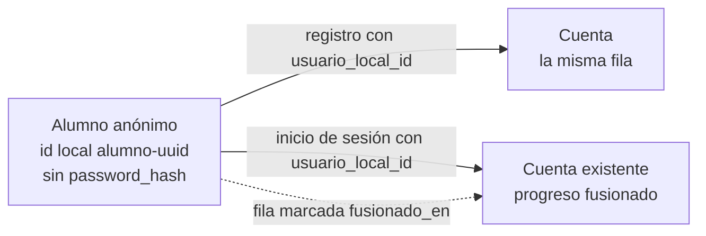
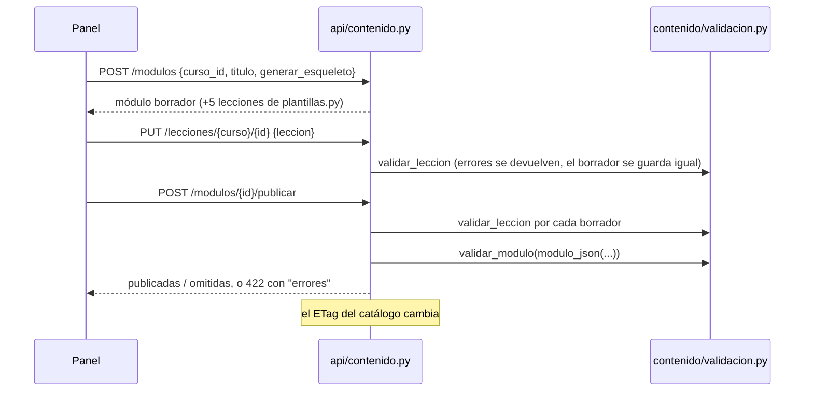

# Manual del código · Backend (FastAPI)

Cómo está hecho y cómo se usa el código de `backend/`: arranque, configuración, mapa de archivos, todos los endpoints, autenticación, flujos principales, pruebas y recetas para cambiarlo. Para quien va a leer o modificar la API.

Actualizado: 4 de octubre de 2026 (main en c730c0e)

**Índice**

1. [Arranque y configuración](#1-arranque-y-configuración)
2. [Mapa de `backend/`](#2-mapa-de-backend)
3. [Tabla completa de endpoints](#3-tabla-completa-de-endpoints)
4. [Autenticación y roles](#4-autenticación-y-roles)
5. [Flujos paso a paso](#5-flujos-paso-a-paso)
6. [Pruebas](#6-pruebas)
7. [Recetas](#7-recetas)

Documentos relacionados (no se repiten aquí):

- [`backend/README.md`](../../backend/README.md): instalación local con SQLite, puesta en marcha en el servidor ARM, servicio systemd y errores de Oracle frecuentes.
- [`docs/motor/referencia/05_api.md`](../motor/referencia/05_api.md): contrato detallado de `/api/addon/v1`.
- [`docs/arquitectura/2026-10-02_contrato_tecnico_plataforma.md`](../arquitectura/2026-10-02_contrato_tecnico_plataforma.md): contrato de cada ruta de la plataforma.
- [`backend/sql/LEEME.txt`](../../backend/sql/LEEME.txt) y [`docs/reestructuracion/02_manual_oracle.md`](../reestructuracion/02_manual_oracle.md): scripts de Oracle y su orden.
- [`docs/plataforma/05_panel_de_administracion.md`](../plataforma/05_panel_de_administracion.md): el panel que consume `/api/admin` y `/api/contenido`.

---

## 1. Arranque y configuración

### 1.1 `main.py`

[`backend/main.py`](../../backend/main.py) crea la aplicación y no tiene más lógica que esta:

| Pieza | Qué hace |
|---|---|
| `app = FastAPI(title="Amatista API", version="0.3.0", lifespan=ciclo_de_vida)` | La aplicación. `version` sale en `/docs` y en `GET /api/admin/salud-detallada` (`version_api`). |
| `ciclo_de_vida` (startup) | Si el motor es SQLite ejecuta `Base.metadata.create_all(...)`: las tablas se crean solas. **Con Oracle no crea nada**: las tablas vienen de los scripts numerados de `backend/sql/`. |
| `CORSMiddleware` | `allow_origins` = lista de `CORS_ORIGINS` (separada por comas); `allow_origin_regex` acepta `localhost` y `127.0.0.1` en cualquier puerto (Vite usa 5173, 5174…). Métodos `GET POST PUT PATCH DELETE`; cabeceras `Content-Type`, `Authorization`, `X-Sesion-Id`, `If-None-Match`; expone `ETag` (lo usa el catálogo). |
| `app.include_router(...)` | En este orden: `auth`, `sesiones`, `progreso`, `eventos`, `admin`, `contenido`, `niveles`, `blender`, `addon`. |
| `GET /` y `GET /api/salud` | Definidos en el propio `main.py` (ver la tabla de endpoints). |

`logging.basicConfig(level=INFO)` deja los registros en la consola de uvicorn (`journalctl` en el servidor).

Arrancar:

```bash
cd backend
# Desarrollo sin Oracle
DATABASE_URL=sqlite:///./amatista_local.db uvicorn main:app --reload
# Servidor (backend/.env con Oracle)
uvicorn main:app --host 0.0.0.0 --port 8000
```

La documentación interactiva de FastAPI queda en `/docs` (y el esquema en `/openapi.json`).

> El backend necesita el resto del repositorio: [`backend/contenido/motor.py`](../../backend/contenido/motor.py) agrega `engine/` y `addon/herramientas/` al `sys.path` e importa `amatista_engine` y `construir` al cargar `api/addon.py`. No se puede copiar `backend/` solo a otra máquina.

Dependencias: [`requirements.txt`](../../backend/requirements.txt) (`fastapi`, `uvicorn`, `sqlalchemy>=2`, `oracledb`, `python-dotenv`) y [`requirements-dev.txt`](../../backend/requirements-dev.txt) (agrega `pytest` y `httpx`). CI usa Python 3.12.

### 1.2 Variables de entorno (`backend/.env`)

`database/conexion.py` llama a `load_dotenv()` al importarse, así que basta con copiar [`backend/.env.example`](../../backend/.env.example) a `backend/.env`. `.env` está en `.gitignore`. Lista completa de las variables que lee el código (no hay otras: se comprobó con `grep getenv`):

**Base de datos** (`database/conexion.py`)

| Variable | Por defecto | Efecto |
|---|---|---|
| `DATABASE_URL` | vacía | Si existe, se usa esa URL de SQLAlchemy y **se ignora todo lo de Oracle**. Con `sqlite...` añade `check_same_thread=False`. Es lo que usan el desarrollo local y las pruebas. |
| `DB_USER` | — (obligatoria con Oracle) | Usuario de Oracle (`ADMIN` o `AMATISTA_APP` de `sql/004`). Sin ella: `RuntimeError`. |
| `DB_PASSWORD` | — (obligatoria con Oracle) | Contraseña. |
| `DB_DSN` | vacía | Cadena TLS completa de la consola de OCI. Si está, manda sobre `DB_HOST/PORT/SERVICE`. |
| `DB_HOST` | vacía (`.env.example` trae `adb.us-ashburn-1.oraclecloud.com`) | Con `DB_SERVICE`, arma `tcps://host:puerto/servicio` si falta `DB_DSN`. |
| `DB_PORT` | `1522` | Puerto de esa conexión `tcps`. |
| `DB_SERVICE` | vacía | Nombre del servicio. Sin `DB_DSN` y sin host+servicio: `RuntimeError`. |
| `DB_ESQUEMA` | vacía | Esquema dueño de las tablas cuando `DB_USER` no lo es. Cada conexión nueva ejecuta `ALTER SESSION SET CURRENT_SCHEMA = <esquema>` (`fijar_esquema`). Se valida con `PATRON_ESQUEMA` y se pasa a mayúsculas. |
| `DB_POOL` | `5` (mínimo 1) | `pool_size` del motor Oracle por proceso de uvicorn. |
| `DB_POOL_EXTRA` | `5` (mínimo 0) | `max_overflow`. Máximo de conexiones por proceso = `DB_POOL + DB_POOL_EXTRA`. |

El motor Oracle usa además `pool_timeout=30`, `pool_pre_ping=True` y `pool_recycle=1800` (fijos en el código).

**Cuentas y seguridad**

| Variable | Por defecto | Leída en | Efecto |
|---|---|---|---|
| `AMATISTA_ADMINS` | vacía | `api/auth.py` (`correos_admin`) | Correos separados por comas que reciben `rol="admin"` al registrarse o al iniciar sesión. |
| `AMATISTA_PBKDF2_ITER` | `600000` (mínimo 1000) | `seguridad.py` (`iteraciones`) | Iteraciones de PBKDF2. Subirlas no invalida hashes viejos: se rehacen al iniciar sesión (`requiere_rehash`). Un valor no numérico vuelve al defecto. |
| `AMATISTA_MOSTRAR_CODIGOS` | `0` | `api/correo.py` (`mostrar_codigos`) | `1` = el código de 6 dígitos se escribe en la consola y la API lo devuelve como `codigo_dev`. **Solo desarrollo.** |
| `AMATISTA_REQUIERE_CONFIRMACION` | `0` | `api/auth.py` | `1` = el registro no abre sesión (`token: null`, `requiere_confirmacion: true`) y el inicio de sesión responde 403 hasta confirmar el correo. |
| `AMATISTA_SIN_LIMITES` | `0` | `api/limites.py` | `1` = desactiva los límites por IP (429). Lo activan las pruebas y CI. |
| `AMATISTA_PROXY_CONFIABLE` | `0` | `api/limites.py` (`ip_cliente`) | `1` = la IP se toma de la **última** entrada de `X-Forwarded-For`. Solo detrás de Caddy. |

**Correo** (`api/correo.py`)

| Variable | Por defecto | Efecto |
|---|---|---|
| `SMTP_HOST` | vacía | Sin ella no se envía nada: se registra un aviso **sin** el código. |
| `SMTP_PORT` | `587` | 587 = STARTTLS; `465` = TLS directo (`SMTP_SSL`). Un valor no numérico vuelve a 587. |
| `SMTP_USER` / `SMTP_PASSWORD` | vacías | Si hay usuario se hace `login`. |
| `SMTP_FROM` | `SMTP_USER`, o `no-responder@<SMTP_HOST>` | Remitente. |

**CORS y add-on**

| Variable | Por defecto | Leída en | Efecto |
|---|---|---|---|
| `CORS_ORIGINS` | vacía | `main.py`, `api/addon.py` | Orígenes extra permitidos (p. ej. Cloudflare Pages). `api/addon.py` también la usa para aceptar el `Origin` como URL de la PWA. |
| `AMATISTA_URL_API` | URL base de la petición | `api/addon.py` (`url_api`) | Dirección pública de la API que el instalador escribe en el add-on y que sale en `GET /estado`. |
| `AMATISTA_URL_PWA` | el `Origin` de la petición si está permitido; si no, vacía | `api/addon.py` (`url_pwa`) | Dirección de la PWA (enlace `#/vincular?codigo=...` y paquetes). |

### 1.3 SQLite en desarrollo, Oracle en producción

[`database/conexion.py`](../../backend/database/conexion.py) decide el motor en `crear_motor()`:

```mermaid
flowchart TD
  A[motor&#40;&#41; con lru_cache] --> B{¿DATABASE_URL?}
  B -- sí --> C[create_engine&#40;DATABASE_URL&#41;<br/>SQLite: tablas con create_all al arrancar]
  B -- no --> D[DB_USER + DB_PASSWORD + dsn_oracle&#40;&#41;]
  D --> E[oracle+oracledb, pool DB_POOL / DB_POOL_EXTRA]
  E --> F{¿DB_ESQUEMA?}
  F -- sí --> G[ALTER SESSION SET CURRENT_SCHEMA en cada conexión]
```



- `motor()` está memorizado con `@lru_cache(maxsize=1)`: un solo `Engine` por proceso. Las pruebas lo vacían con `conexion.motor.cache_clear()`.
- `obtener_db()` es la dependencia de FastAPI que abre una `Session` por petición y la cierra al final. **Los routers hacen `db.commit()` ellos mismos**; ante `SQLAlchemyError` hacen `rollback()` y lanzan `error_bd(...)` (`api/comun.py`), que registra el error completo y responde con la primera línea (incluye el código `ORA-xxxxx`).
- Con SQLite, `create_all` crea las 18 tablas en el arranque. Con Oracle las crean los scripts `backend/sql/001` a `007` (orden y estado de producción en [`sql/LEEME.txt`](../../backend/sql/LEEME.txt)); si falta una tabla, las rutas que la usan responden 500/503 con el `ORA-00942`.
- `database/modelos.py` define `TextoJSON`: `python-oracledb` devuelve ya convertidas a `dict` las columnas con `CHECK (... IS JSON)` y SQLite devuelve texto; el tipo propio hace que el código siempre vea texto JSON.
- `ahora()` (en `modelos.py`) devuelve la hora UTC **sin zona**, que es como se guarda todo `TIMESTAMP`.

---

## 2. Mapa de `backend/`

```
backend/
├── main.py                 app, CORS, routers, startup, / y /api/salud
├── seguridad.py            hash de contraseñas, tokens, códigos (solo stdlib)
├── diagnostico_oracle.py   compara Oracle con los modelos (solo lectura)
├── api/                    routers y dependencias
├── database/               conexión y modelos SQLAlchemy
├── contenido/              validación de lecciones, plantillas, puente al motor
├── herramientas/           CLI: contenido.py, crear_admin.py
├── sql/                    scripts Oracle 001–007 + LEEME.txt
├── tests/                  pytest con SQLite temporal
├── .env.example, pytest.ini, requirements*.txt, README.md
```

### 2.1 `api/`: routers

| Archivo | Prefijo | Propósito |
|---|---|---|
| [`auth.py`](../../backend/api/auth.py) | `/api/auth` | Registro, inicio y cierre de sesión, perfil, confirmación de correo, recuperación y cambio de contraseña. |
| [`sesiones.py`](../../backend/api/sesiones.py) | `/api` | `POST /api/iniciar-sesion` **heredado**: registra alumnos anónimos para versiones viejas de la PWA. No crea sesiones válidas (guarda `activa=0`). |
| [`progreso.py`](../../backend/api/progreso.py) | `/api` | Guardar y leer el progreso por lección y las insignias. |
| [`eventos.py`](../../backend/api/eventos.py) | `/api` | Eventos de aprendizaje deduplicados (métricas). |
| [`admin.py`](../../backend/api/admin.py) | `/api/admin` | Métricas del lanzamiento, usuarios, purga y salud detallada. |
| [`contenido.py`](../../backend/api/contenido.py) | `/api/contenido` | Catálogo público (con ETag) y edición de cursos, módulos y lecciones. También `importar_modulo`/`exportar_modulo` para la CLI. |
| [`niveles.py`](../../backend/api/niveles.py) | `/api/contenido` | Niveles del curso (reestructuración v3) y mapa curso > nivel > módulo > lección. |
| [`blender.py`](../../backend/api/blender.py) | `/api/blender` | Versiones de Blender y matriz de compatibilidad. |
| [`addon.py`](../../backend/api/addon.py) | `/api/addon/v1` | Add-on de Blender: vínculo, prácticas del motor, intentos, descargas. |

Módulos de apoyo (sin rutas):

| Archivo | Qué contiene |
|---|---|
| [`dependencias.py`](../../backend/api/dependencias.py) | `extraer_token`, `usuario_opcional`, `usuario_requerido`, `requiere_rol(*roles)`, `resolver_alumno`, `puede_ver_alumno`, `es_cuenta_registrada`. Restricción de las sesiones del add-on. |
| [`limites.py`](../../backend/api/limites.py) | `limitar(maximo, ventana=60)`: límite por IP + ruta en memoria (ventana deslizante); `reiniciar_limites()` para pruebas. |
| [`fusion.py`](../../backend/api/fusion.py) | `fusionar_alumno(db, origen_id, destino_id)` y `es_anonimo_fusionable`. |
| [`correo.py`](../../backend/api/correo.py) | `enviar_codigo(email, codigo, proposito)` por SMTP; nunca tumba la petición. |
| [`comun.py`](../../backend/api/comun.py) | `asegurar_usuario`, `usuario_publico` (lo que se puede mandar al navegador) y `error_bd`. |

### 2.2 `database/`

- [`conexion.py`](../../backend/database/conexion.py): ver [1.3](#13-sqlite-en-desarrollo-oracle-en-producción).
- [`modelos.py`](../../backend/database/modelos.py): **fuente de verdad** de tablas y columnas. También define las constantes que deben coincidir con los `CHECK` de Oracle: `ROLES`, `ESTADOS_CONTENIDO`, `TIPOS_EVENTO`, `ESTADOS_HABILIDAD`, `CRITERIOS_RUBRICA`, `LOGROS_RUBRICA`, `CATEGORIAS_BLENDER`, `RESULTADOS_VERIFICACION`, `ESTADOS_VINCULO`, `ORIGENES_PRACTICA`.

| Modelo | Tabla Oracle | Script que la crea | Uso principal |
|---|---|---|---|
| `Usuario` | `USUARIOS` | 001 (ampliada en 002) | Alumnos anónimos (sin `password_hash`) y cuentas. |
| `Sesion` | `SESIONES` | 001 (`ID` ampliado a 64 en 002) | Sesiones; `id` = SHA-256 del token. |
| `ProgresoLeccion` | `PROGRESO_LECCIONES` | 001 (columnas nuevas en 002) | Una fila por alumno y lección. |
| `Logro` | `LOGROS` | 002 | Insignias. |
| `EventoAprendizaje` | `EVENTOS_APRENDIZAJE` | 002 | Eventos para métricas (particionada por mes en Oracle). |
| `Curso` | `CURSOS` | 002 | Cursos. |
| `Modulo` | `MODULOS` | 002 (+`NIVEL_ID` en 005) | Módulos. |
| `Leccion` | `LECCIONES` | 002 | Lecciones; `contenido` es el JSON de la lección. PK `(curso_id, id)`. |
| `Nivel` | `NIVELES` | 005 | Niveles 1–5 (el 5 admite ramas). |
| `Habilidad` | `HABILIDADES` | 005 | Catálogo de habilidades; sin API de edición (se siembra en 007 y con el paquete de 006). |
| `HabilidadAlumno` | `HABILIDADES_ALUMNO` | 005 | Estado de cada habilidad por alumno (lo sube `POST /intentos`). |
| `EvaluacionRubrica` | `EVALUACIONES_RUBRICA` | 005 | Rúbrica A–E por nivel. **Ningún endpoint la usa todavía.** |
| `VersionBlender` | `VERSIONES_BLENDER` | 005 | Versiones y categoría. |
| `VerificacionBlender` | `VERIFICACIONES_BLENDER` | 005 | Pruebas de lección × versión × sistema. |
| `AddonVinculo` | `ADDON_VINCULOS` | 007 | Códigos para conectar Blender. |
| `Practica` | `PRACTICAS` | 007 | Práctica vigente y versión publicada. |
| `PracticaVersion` | `PRACTICA_VERSIONES` | 007 | Historial de versiones. |
| `ProgresoPractica` | `PROGRESO_PRACTICAS` | 007 | Avance por alumno y práctica. |

Según `sql/LEEME.txt`, producción tiene aplicados 002, 003, 005 y 006; **007 está pendiente** (T-055), así que en producción las rutas de `/api/addon/v1` que tocan esas tablas fallarían hasta ejecutarlo.

### 2.3 `contenido/`

No depende de la base de datos.

| Archivo | Qué hace |
|---|---|
| [`validacion.py`](../../backend/contenido/validacion.py) | Valida lecciones y módulos en el formato de `frontend/src/data/modulos/*.json`: `validar_leccion`, `validar_modulo`, `pendientes_ficha` (lo que falta en la ficha v3), `es_practica_blender`, `modulo_de`, excepción `ContenidoInvalido`. Constantes `TIPOS_LECCION`, `BLOQUES_CONTENIDO`, `BLOQUES_INTERACTIVOS`, `PATRON_ID`, `MAX_ID`… Los errores dicen la ruta exacta (`lessons[2].contentBlocks[4] (ordering): ...`). |
| [`plantillas.py`](../../backend/contenido/plantillas.py) | La Fórmula Amatista (`FORMULA`, `RITMO`), ejemplos de bloques, `generar_esqueleto` (5 lecciones borrador de un módulo nuevo), `siguiente_numeracion`, `CURSOS_BASE`, `NIVELES_BLENDER`, `leccion_estructurada` (lección de 10 pasos con ficha). |
| [`motor.py`](../../backend/contenido/motor.py) | Puente con Amatista Engine (`engine/`) y el constructor del add-on (`addon/herramientas/construir.py`): `compilar`, `huella`, `canonico`, `evaluar`, `practicas_del_repositorio`, `VERSION_ADDON`, `VERSION_MOTOR`, `BLENDER_MINIMO`. |

### 2.4 `seguridad.py`

[`backend/seguridad.py`](../../backend/seguridad.py), solo biblioteca estándar:

- `hash_password` / `verificar_password` / `requiere_rehash`: PBKDF2-HMAC-SHA256, sal de 16 bytes, formato `pbkdf2_sha256$<iteraciones>$<sal hex>$<hash hex>`, comparación con `hmac.compare_digest`.
- `verificar_password_señuelo`: gasta el mismo tiempo cuando el correo no existe.
- `nuevo_token` (32 bytes URL-safe) y `hash_token` (SHA-256: lo que se guarda en `SESIONES.ID`).
- `nuevo_codigo` (6 dígitos) y `hash_codigo(email, codigo)` (el hash va ligado al correo).
- Constantes: `DURACION_SESION = 30 días`, `DURACION_CODIGO = 15 min`, `MAX_INTENTOS_CODIGO = 5`.

### 2.5 `diagnostico_oracle.py`

[`backend/diagnostico_oracle.py`](../../backend/diagnostico_oracle.py) se ejecuta con `python diagnostico_oracle.py` desde `backend/` (sin argumentos). No modifica nada: se conecta con `crear_motor()`, muestra usuario y esquema, compara `ALL_TAB_COLUMNS` con el diccionario `ESPERADO` (tabla → columna → tipo), revisa `LONGITUDES_MINIMAS`, el `UNIQUE` del correo, tablas obsoletas (`SESIONES_WEB`), cuenta filas, muestra el espacio usado frente a los 20 GB y dice qué script falta (`solucion()`). Con SQLite avisa que es para Oracle. `PISTAS` traduce errores comunes (`ORA-01017`, `ORA-12506`, `DPY-6005`…).

`ESPERADO` se mantiene **a mano**; `tests/test_esquema.py` falla si se desalinea de `modelos.py`.

### 2.6 `herramientas/`

Solo se nombran aquí; el manual del desarrollador las documenta a fondo.

- [`herramientas/contenido.py`](../../backend/herramientas/contenido.py): CLI `validar | importar | exportar | nuevo-modulo | nueva-leccion | mapa | sembrar-niveles | practicas`. Reutiliza `importar_modulo`, `exportar_modulo`, `sembrar_niveles_blender` y `sincronizar_practicas` de la API.
- [`herramientas/crear_admin.py`](../../backend/herramientas/crear_admin.py): da el rol `admin` (o `--rol profesor`) a una cuenta; `--crear` la crea.

### 2.7 `tests/`

Ver la [sección 6](#6-pruebas).

---

## 3. Tabla completa de endpoints

Sacada de los decoradores `@router.*` / `@app.*` del código. 72 rutas propias, más las que agrega FastAPI (`/docs`, `/redoc`, `/openapi.json`).

Leyenda de autenticación:

- **público**: sin token.
- **opcional**: funciona sin token; con token usa la cuenta (`usuario_opcional`). Un token inválido o vencido da 401, no «anónimo».
- **sesión**: `usuario_requerido` (401 sin token).
- **profesor/admin** y **admin**: `requiere_rol(...)` (401 sin sesión, 403 sin el rol).
- **Límite N/min**: `limitar(N)` por IP y ruta (429 con `Retry-After`).

### Raíz (`main.py`)

| Método | Ruta | Auth | Qué hace |
|---|---|---|---|
| GET | `/` | público | `{"estado": "Backend activo"}`. |
| GET | `/api/salud` | público | `SELECT 1`; `{"estado":"ok","motor":"sqlite"\|"oracle"}` o 503. |

### Cuentas (`api/auth.py`, prefijo `/api/auth`)

| Método | Ruta | Auth | Qué hace |
|---|---|---|---|
| POST | `/api/auth/registro` | público · límite 20/min | Crea la cuenta (o convierte la fila del alumno anónimo `usuario_local_id`), genera código de correo, abre sesión salvo `AMATISTA_REQUIERE_CONFIRMACION=1`, anota `account_created`. 201. 409 si el correo existe. |
| POST | `/api/auth/iniciar-sesion` | público · 30/min | Verifica contraseña, bloquea tras 5 fallos (423), rehace el hash si hace falta, fusiona el progreso anónimo de `usuario_local_id` y devuelve `token`. |
| POST | `/api/auth/cerrar-sesion` | sesión | Desactiva la sesión actual. |
| POST | `/api/auth/cerrar-todas` | sesión | Desactiva todas las sesiones de la cuenta (`{"cerradas": n}`). |
| GET | `/api/auth/yo` | sesión | Datos públicos de la cuenta. |
| PATCH | `/api/auth/yo` | sesión | Cambia `nombre` y `telefono` (vacío/null lo borra). |
| POST | `/api/auth/confirmar-correo` | público · 20/min | Valida el código de propósito `correo` y marca `correo_confirmado`. |
| POST | `/api/auth/reenviar-codigo` | público · 10/min | Nuevo código si la cuenta existe y no está confirmada. Siempre `{"ok": true}`. |
| POST | `/api/auth/recuperar` | público · 10/min | Envía código de propósito `password`. Siempre `{"ok": true}`. |
| POST | `/api/auth/restablecer` | público · 20/min | Con el código, fija contraseña nueva, confirma el correo, desbloquea y **cierra todas las sesiones**. |
| POST | `/api/auth/cambiar-password` | sesión · 10/min | Pide la actual; cierra las demás sesiones (no la actual). |

### Sesión heredada (`api/sesiones.py`)

| Método | Ruta | Auth | Qué hace |
|---|---|---|---|
| POST | `/api/iniciar-sesion` | público · 30/min | Registra un alumno anónimo; 409 si el id o correo es de una cuenta. Devuelve un `sesion_id` informativo que **no sirve** como token. |

### Progreso y eventos (`api/progreso.py`, `api/eventos.py`)

| Método | Ruta | Auth | Qué hace |
|---|---|---|---|
| POST | `/api/progreso` | opcional | Upsert monotónico de hasta 500 eventos de lección y 100 insignias. Sin sesión, solo para alumnos anónimos (`resolver_alumno`). |
| GET | `/api/progreso` | sesión | Progreso e insignias de la cuenta de la sesión. |
| GET | `/api/progreso/{usuario_id}` | opcional | El propio alumno, profesor o admin; un anónimo se lee sin sesión. 401/403 si no. |
| POST | `/api/eventos` | opcional | 1–200 eventos con id del dispositivo; inserta solo los nuevos (`{"recibidos","nuevos"}`). |

### Administración (`api/admin.py`, prefijo `/api/admin`)

| Método | Ruta | Auth | Qué hace |
|---|---|---|---|
| GET | `/api/admin/resumen?dias=7` | profesor/admin | Métricas: usuarios, registros, activación, activos semanales, retención de segunda semana, serie de 30 días, por curso. |
| GET | `/api/admin/usuarios` | profesor/admin | Lista paginada (`buscar`, `rol`, `pagina`, `por_pagina`≤100, `orden` = `reciente`/`nombre`/`actividad`, `incluir_fusionados`). |
| GET | `/api/admin/usuarios/{usuario_id}` | profesor/admin | Ficha, progreso, insignias, sesiones activas y 20 eventos recientes. |
| PATCH | `/api/admin/usuarios/{usuario_id}` | admin | Cambia `rol`, `es_prueba`, `correo_confirmado`. No puedes cambiar tu propio rol; profesor/admin exige cuenta con contraseña. |
| POST | `/api/admin/mantenimiento/purgar` | admin | Borra sesiones inactivas/vencidas/viejas (`dias_sesiones`=90) y eventos viejos (`dias_eventos`=400). |
| GET | `/api/admin/salud-detallada` | admin | Motor, filas por tabla (`null` si falta la tabla) y `version_api`. |

### Contenido (`api/contenido.py`, prefijo `/api/contenido`)

| Método | Ruta | Auth | Qué hace |
|---|---|---|---|
| GET | `/api/contenido/catalogo` | público | Cursos publicados con niveles, módulos y lecciones publicadas. `ETag` + `Cache-Control: no-cache`; 304 si `If-None-Match` coincide. |
| GET | `/api/contenido/admin/arbol` | profesor/admin | Árbol completo con estados y `practica_blender` por lección (sin el JSON). |
| GET | `/api/contenido/plantillas` | profesor/admin | Fórmula, ritmo, ejemplos de bloques, lecciones plantilla y tipos válidos. |
| POST | `/api/contenido/validar` | profesor/admin | Valida sin guardar `{"leccion"}` o `{"modulo"}`. |
| GET | `/api/contenido/modulos/{modulo_id}/exportar` | profesor/admin | Módulo en formato de archivo (`?borradores=true` incluye borradores). |
| GET | `/api/contenido/lecciones/{curso_id}/{leccion_id}` | profesor/admin | Metadatos y JSON de una lección. |
| POST | `/api/contenido/cursos` | admin | Crea un curso (nace `borrador`). 201. |
| PUT | `/api/contenido/cursos/{curso_id}` | admin | Edita textos, orden y estado del curso. |
| POST | `/api/contenido/modulos` | admin | Crea un módulo borrador (id `mod_<curso>_<NNN>` si no se envía); `generar_esqueleto` crea sus 5 lecciones. 201. |
| PUT | `/api/contenido/modulos/{modulo_id}` | admin | Edita el módulo (incluido `nivel_id`); sube `version`. |
| POST | `/api/contenido/modulos/{modulo_id}/publicar` | admin | Publica el módulo y sus lecciones borrador que validan (ver [5.3](#53-contenido-administrable-publicar-un-módulo)). |
| POST | `/api/contenido/modulos/{modulo_id}/archivar` | admin | Oculta el módulo del catálogo. |
| POST | `/api/contenido/lecciones` | admin | Crea una lección borrador en una posición del módulo (id automático si falta). 201. |
| PUT | `/api/contenido/lecciones/{curso_id}/{leccion_id}` | admin | Reemplaza el JSON; si está publicada, el cambio debe validar. |
| POST | `/api/contenido/lecciones/{curso_id}/{leccion_id}/publicar` | admin | Publica una lección que valida. |
| POST | `/api/contenido/lecciones/{curso_id}/{leccion_id}/archivar` | admin | La saca del catálogo (no la borra). |
| POST | `/api/contenido/lecciones/{curso_id}/{leccion_id}/mover` | admin | Cambia su posición en el módulo y renumera. |

### Niveles (`api/niveles.py`, prefijo `/api/contenido`)

| Método | Ruta | Auth | Qué hace |
|---|---|---|---|
| GET | `/api/contenido/niveles?curso_id=` | profesor/admin | Lista niveles. |
| POST | `/api/contenido/niveles` | admin | Crea un nivel borrador con id `<curso>-n<numero>[-<rama>]` (rama solo en el 5). 201. |
| PUT | `/api/contenido/niveles/{nivel_id}` | admin | Edita textos y estado. |
| POST | `/api/contenido/niveles/sembrar` | admin | Crea los niveles de `NIVELES_BLENDER` que falten (409 si no existe el curso `blender`). |
| GET | `/api/contenido/mapa/{curso_id}` | profesor/admin | Curso > nivel > módulo > lección con lo que falta en cada ficha (equivale a la vista `V_AMATISTA_MAPA` de `sql/006`). |

### Blender (`api/blender.py`, prefijo `/api/blender`)

| Método | Ruta | Auth | Qué hace |
|---|---|---|---|
| GET | `/api/blender/versiones` | público | Versiones ordenadas numéricamente y cuál es la `principal`. |
| PUT | `/api/blender/versiones/{version}` | admin | Crea o cambia una versión (`4.2` o `4.2.3`); marcar otra `principal` pasa la anterior a `compatible`. |
| POST | `/api/blender/verificaciones` | profesor/admin | Anota una prueba de lección × versión × sistema (409 si la versión no está registrada). 201. |
| GET | `/api/blender/compatibilidad?curso_id=blender` | profesor/admin | Matriz lección × versión vigente: `sin verificar`, `repetir` (la lección cambió) o `vigente`. |

### Add-on de Blender (`api/addon.py`, prefijo `/api/addon/v1`)

Contrato detallado en [`05_api.md`](../motor/referencia/05_api.md).

| Método | Ruta | Auth | Qué hace |
|---|---|---|---|
| GET | `/estado` | público | Versiones del add-on y del motor, Blender mínimo, URL de descargas y del repositorio de extensiones. |
| POST | `/vinculos` | público · 20/min | Crea un código `XXXX-XXXX` (10 min) y un secreto para el add-on. 201. |
| POST | `/vinculos/confirmar` | sesión · 10/min | El alumno confirma el código desde la PWA. |
| POST | `/vinculos/{vinculo_id}/estado` | público (con `secreto`) · 60/min | `pendiente`/`vencido`/`canjeado`, o una sola vez `listo` con un token de sesión del add-on. |
| GET | `/yo` | sesión | Cuenta y conteo de prácticas iniciadas/completadas. |
| POST | `/salir` | sesión | Cierra la sesión actual. |
| GET | `/dispositivos` | sesión | Blenders conectados a la cuenta. |
| DELETE | `/dispositivos/{dispositivo_id}` | sesión | Desconecta uno (id = 16 primeros caracteres del hash de la sesión). |
| GET | `/practicas?curso_id=` | opcional | Catálogo: alumnos y anónimos solo ven publicadas; profesor/admin también borradores y estadísticas. |
| GET | `/practicas/{practica_id}?version=` | opcional | Definición (versión elegible solo para el equipo). |
| POST | `/practicas` | profesor/admin | Compila y registra una versión nueva; nunca publica. 201. |
| POST | `/practicas/{practica_id}/publicar` | admin | Publica la última versión o `{version}`. |
| POST | `/practicas/{practica_id}/archivar` | admin | Archiva. |
| GET | `/practicas/{practica_id}/versiones` | profesor/admin | Historial de versiones. |
| POST | `/practicas/sincronizar?publicar=` | admin | Registra las prácticas de `practices/blender/`. |
| POST | `/practicas/{practica_id}/abrir` | sesión | Marca la práctica como la actual del alumno. |
| GET | `/practica-actual` | sesión | Última práctica sin terminar, con su definición. |
| POST | `/intentos` | sesión · 120/min | Evalúa la escena con el motor y guarda el mejor resultado. |
| GET | `/mi-progreso?practica_id=` | sesión | Progreso del alumno en sus prácticas. |
| GET | `/descargas/{sistema}` | opcional · 20/min | ZIP con instalador (`windows`, `macos`, `linux`); con sesión incluye un vínculo de un uso (7 días). |
| GET | `/extension.zip` | público | Solo la extensión. |
| GET | `/extensiones/index.json` | público | Índice de repositorio de extensiones de Blender. |

---

## 4. Autenticación y roles

### 4.1 Identidades



- **Alumno anónimo**: fila de `USUARIOS` sin `password_hash` (la PWA genera el id). Puede escribir progreso y eventos **sin token** mientras no sea cuenta registrada ni esté fusionado (`resolver_alumno`, `es_cuenta_registrada`).
- **Cuenta**: correo + contraseña, `rol` ∈ `ROLES = ("alumno", "profesor", "admin")`.
- **Sesión del add-on**: sesión normal cuyo `dispositivo` empieza con `blender-addon` (`PREFIJO_ADDON`). `usuario_opcional` responde 403 si se usa fuera de `/api/addon/` o `/api/blender/`.

### 4.2 Token y sesiones

1. `abrir_sesion` (`api/auth.py`) genera `nuevo_token()`, guarda `SESIONES.ID = hash_token(token)` con `expira_en = ahora + 30 días` y devuelve el token **solo** al cliente.
2. El cliente lo manda en `Authorization: Bearer <token>` (también se acepta `X-Sesion-Id`) — `extraer_token`.
3. `usuario_opcional` busca la sesión por hash, comprueba `activa` y `expira_en`, y como mucho cada 10 minutos (`REFRESCO_ACCESO`) actualiza `ultimo_acceso` y **desliza** la expiración otros 30 días. Guarda el id en `request.state.sesion_id` (lo usan `cerrar-sesion`, `cambiar-password` y `/salir`).
4. El rol se lee en cada petición: cambiarlo en el panel no requiere cerrar sesiones.

### 4.3 Registro, login, confirmación y recuperación

| Paso | Función | Detalle |
|---|---|---|
| Validación de entrada | tipos `Correo`, `PasswordNueva`, `Nombre`, `Telefono`, `Codigo`… (`AfterValidator`) | Contraseña nueva: 8–128 caracteres con al menos una letra y un número (`problema_password`). En login solo se exige que no esté vacía y ≤1024. |
| Registro | `registro` | Si `usuario_local_id` es un id adoptable (`PATRON_ID_LOCAL`) y anónimo fusionable, **esa fila se convierte en la cuenta**; si no, se crea `usr-<uuid>` y se fusiona el anónimo. El correo sale con `BackgroundTasks` después de responder. |
| Login | `iniciar_sesion` | Correo inexistente → contraseña señuelo y 401 genérico. 5 fallos (`MAX_FALLOS`) → `bloqueado_hasta` 15 min y 423 con `Retry-After`. Éxito → reinicia contadores, `requiere_rehash`, `aplicar_admin_inicial`, fusión y token. |
| Código de 6 dígitos | `generar_codigo` / `codigo_correcto` | Se guarda `hash_codigo(email, codigo)` con `codigo_proposito` (`correo` o `password`) y caduca en 15 min. Cada fallo suma; al 5.º se invalida. |
| Reenviar / recuperar | `reenviar_codigo`, `recuperar` | Respuesta idéntica exista o no el correo. |
| Restablecer | `restablecer` | Nueva contraseña, `correo_confirmado=1`, desbloqueo y cierre de todas las sesiones. |
| Modo desarrollo | `con_codigo_dev` | Con `AMATISTA_MOSTRAR_CODIGOS=1` la respuesta trae `codigo_dev`. |

### 4.4 Límites de intentos

- **Por IP** (`api/limites.py`): `limitar(N)` crea un `Limitador` en memoria por ruta; clave = `IP|ruta`, ventana de 60 s. Es por proceso (pensado para un solo uvicorn) y se reinicia al reiniciar la API. `AMATISTA_SIN_LIMITES=1` lo desactiva (pruebas). Valores: registro 20, login 30, correos 10, códigos 20, cambio de contraseña 10, `/api/iniciar-sesion` 30 y los del add-on (20/10/60/120/20).
- **Por cuenta**: bloqueo de 15 minutos tras 5 contraseñas incorrectas (no depende de `AMATISTA_SIN_LIMITES`).
- **Por código**: 5 intentos por código.

### 4.5 Dependencias que exigen rol

```python
from api.dependencias import requiere_rol, usuario_requerido, usuario_opcional

lector = requiere_rol("profesor", "admin")   # nombre usado en contenido, niveles, blender
editor = requiere_rol("admin")

@router.get("/algo")
def algo(_: Usuario = Depends(lector)): ...
```

Alias por archivo: `admin.py` → `lectores` / `administradores`; `contenido.py`, `niveles.py`, `blender.py` → `lector` / `editor`; `addon.py` → `desarrollador` (profesor/admin) / `editor` (admin). Hay dos comprobaciones de rol escritas a mano (no con `requiere_rol`): `puede_ver_alumno` en `dependencias.py` y `es_equipo` en `addon.py`.

Primer administrador: `AMATISTA_ADMINS` o `python herramientas/crear_admin.py correo@x`. Después, `PATCH /api/admin/usuarios/{id}`.

---

## 5. Flujos paso a paso

### 5.1 Guardar y fusionar progreso

**`POST /api/progreso`** (`api/progreso.py`):

1. `SolicitudProgreso` valida `usuario_id?`, `eventos` (≤500) e `insignias` (≤100); exige al menos uno de los dos.
2. `avance_de` normaliza cada evento: fechas a UTC sin zona, `completada_en` nunca en el futuro, `datos_ligeros` solo si es objeto JSON que cabe en 250 caracteres (si no, se ignora sin 422).
3. Los eventos de la misma lección se combinan (`combinar`): OR de `completada`, máximo de `puntaje` e `intentos`, `completada_en` más antigua, unión de datos.
4. `resolver_alumno`: con sesión, la cuenta de la sesión (se ignora el `usuario_id` del cuerpo); sin sesión, el `usuario_id` solo si es anónimo (si no, 401).
5. `guardar`: `asegurar_usuario`, una consulta para todas las filas del lote y upsert **monotónico** (el progreso nunca retrocede). Insignias nuevas a `LOGROS`.
6. Commit con hasta dos intentos: un `IntegrityError` por una petición simultánea se reintenta una vez.

**Fusión** (`api/fusion.py`, `fusionar_alumno`), llamada desde `registro` e `iniciar_sesion`:

1. Solo si el origen es anónimo fusionable y distinto del destino.
2. Para cada lección del anónimo: crea la fila en la cuenta o la combina con las mismas reglas monotónicas.
3. Copia logros que falten; `flush`; **después** borra las filas del anónimo (si algo falla, la transacción no pierde nada).
4. Reasigna `EVENTOS_APRENDIZAJE` a la cuenta (con su `es_prueba`), desactiva sesiones heredadas del anónimo y marca `origen.fusionado_en = destino_id`.
5. No hace commit: lo hace quien la llama.

### 5.2 Eventos y métricas

1. **`POST /api/eventos`** (`api/eventos.py`): `tipo` debe estar en `TIPOS_EVENTO` (`account_created`, `learning_session_started`, `lesson_completed`, `activity_submitted`, `sync_succeeded`). Se deduplican por `id` dentro del lote y contra la base; la fecha es la del dispositivo salvo que venga más de 5 minutos en el futuro. Cada fila copia `es_prueba` del usuario.
2. Otros productores de eventos: `registro` (`account_created`) y `POST /api/addon/v1/intentos` (`activity_submitted`).
3. **`GET /api/admin/resumen`** (`api/admin.py`) calcula en Python, con días cortados en hora de Ciudad de México (`zona_metricas`), sobre «alumnos reales» (`alumnos_reales()`: rol alumno, no de prueba, no fusionado): registros, activación (7 días), activos semanales (2+ días con actividad y al menos un logro), retención de segunda semana y la serie de 30 días. Las definiciones están en el docstring del archivo.
4. **Retención**: `POST /api/admin/mantenimiento/purgar` hace lo mismo que el procedimiento `AMATISTA_PURGAR` de `sql/003` (con `DELETE`).

### 5.3 Contenido administrable: publicar un módulo



`publicar_modulo` paso a paso:

1. Lee las lecciones no archivadas del módulo en orden.
2. Cada lección en `borrador` se valida; si tiene errores va a `omitidas` y no se publica; si no, pasa a `publicado` (con `publicado_en` la primera vez).
3. Si no queda ninguna lección válida → `rollback` y 422 (`rechazo`, con la lista `errores`).
4. Valida el módulo completo con `validar_modulo`; si falla → `rollback` y 422.
5. Módulo a `publicado`, `version += 1`, `actualizado_en`; commit con `confirmar` (409 si otro cambio usó el mismo id a la vez).
6. `GET /api/contenido/catalogo` calcula una huella (`version_catalogo`) a partir de ids, versiones y fechas de lo publicado; como cambió, el ETag cambia y la PWA descarga el catálogo nuevo.

Reglas generales: los ids son inmutables (el progreso los usa); lo publicado no se borra, se archiva; una lección publicada solo se edita con contenido que valida; un borrador sí se guarda con errores. `importar_modulo` (CLI) es idempotente, nunca despublica y, si el módulo trae bloques `blender_practice`, llama a `enlazar_lecciones` de `api/addon.py`.

### 5.4 API del add-on `/api/addon/v1`

Detalle de contrato en [`05_api.md`](../motor/referencia/05_api.md). Aquí, cómo lo hace el código.

**Vínculo por código** (como en un televisor):

1. El add-on llama `POST /vinculos`: `crear_vinculo` purga vínculos vencidos hace más de un día, genera un código de 8 caracteres del `ALFABETO` sin I/L/O/0/1 y un `secreto` (solo se guarda `hash_token(secreto)`), estado `pendiente`, 10 minutos.
2. El alumno abre la PWA en `#/vincular?codigo=...` y la PWA llama `POST /vinculos/confirmar` con su sesión: `normalizar_codigo` acepta minúsculas, espacios y sin guion; estado `listo` con su `usuario_id`.
3. El add-on sondea `POST /vinculos/{id}/estado` con el secreto (comparado con `hmac.compare_digest`). Cuando está `listo`, se abre una sesión con `abrir_sesion` y `dispositivo` con prefijo `blender-addon`, y el vínculo pasa a `canjeado` (un solo uso).
4. **Descarga con sesión**: `GET /descargas/{sistema}` crea un vínculo ya `listo` de 7 días y lo mete en el paquete (`motor.construir.construir_paquete(..., vinculo=...)`); al abrir Blender el add-on hace el paso 3 sin código. Sin sesión, el paquete público se cachea en memoria (`_paquete_publico`, `lru_cache`) y con `Cache-Control: public, max-age=300`.

**Prácticas**:

1. `POST /practicas` (profesor/admin) → `registrar_version`: JSON canónico ≤200 KB, `motor.compilar` (422 con `errores` si no compila), `motor.huella`. Si la huella es igual a la última versión, responde `sin_cambios: true`. Si no, `version + 1`, actualiza `PRACTICAS` y agrega fila a `PRACTICA_VERSIONES`. Nunca publica; una archivada vuelve a borrador.
2. `POST /practicas/{id}/publicar` (admin) fija `version_publicada`. Los alumnos usan siempre `version_publicada`; el equipo, la última (`version_para`).
3. `POST /practicas/sincronizar` (admin) recorre `practices/blender/**/*.json` (`motor.practicas_del_repositorio`) con origen `repositorio` y enlaza cada práctica con la lección que contiene su bloque `blender_practice` (`enlazar_lecciones`).

**Intentos** (`POST /intentos`):

1. Elige la versión (la publicada, o una anterior que el alumno tenga en caché si existe).
2. `motor.evaluar(definicion, escena, pistas, correcciones)` → reporte y autonomía (`pedagogy.classify`). Una escena inválida da 422.
3. Actualiza `PROGRESO_PRACTICAS`: `intentos + 1`, progreso máximo; los objetivos y el paso actual solo se reemplazan si el resultado no empeora.
4. Si se completa: `completada`, `autonomia` (solo sube), `subir_habilidades` hasta `con_pistas` como máximo (`TOPE_HABILIDAD`), y si es la primera vez y la práctica tiene lección enlazada, marca la lección completada reutilizando `api.progreso.guardar`.
5. Siempre agrega un evento `activity_submitted` con un resumen compacto en `datos`.

### 5.5 Niveles y versiones de Blender

- **Niveles** (`api/niveles.py`): `POST /niveles` calcula el id con `id_nivel(curso, numero, rama)` (`blender-n1`, `blender-n5-web`); solo el nivel 5 admite rama. `POST /niveles/sembrar` crea en borrador los de `NIVELES_BLENDER` que falten. Un módulo se asigna a un nivel con `PUT /api/contenido/modulos/{id}` `{"nivel_id": ...}` (`nivel_del_curso` comprueba que sea del mismo curso). El catálogo público solo muestra niveles `publicado`. `GET /mapa/{curso_id}` usa `pendientes_ficha` de `contenido/validacion.py`.
- **Versiones de Blender** (`api/blender.py`): categorías `principal`, `compatible`, `sin_verificar`, `retirada`; solo una `principal`. `clave_version` ordena numéricamente (4.2.10 después de 4.2.9). `POST /verificaciones` guarda la `version_leccion` vigente; `GET /compatibilidad` marca `repetir` cuando la lección cambió después de la prueba. La tabla nace vacía: el código no inventa la versión principal.

---

## 6. Pruebas

Organización (`backend/tests/`, configuración en [`pytest.ini`](../../backend/pytest.ini): `pythonpath = .`, `testpaths = tests`):

| Archivo | Qué cubre | Pruebas (`def test_`) |
|---|---|---|
| [`conftest.py`](../../backend/tests/conftest.py) | Fixtures compartidas | — |
| `test_auth.py` | Registro, login, bloqueo, códigos, recuperación, sesiones | 46 |
| `test_progreso.py` | Progreso monotónico, anónimos, permisos de lectura | 23 |
| `test_admin.py` | Métricas, usuarios, purga, salud | 23 |
| `test_contenido.py` | Catálogo/ETag, edición, publicación, import/export | 25 |
| `test_esquema.py` | Modelos = scripts SQL = `ESPERADO` del diagnóstico; reglas de los scripts; `DB_ESQUEMA` y pool | 17 |
| `test_diagnostico.py` | Recomendaciones de `diagnostico_oracle.py` | 15 |
| `test_niveles.py` | Niveles, fichas v3, mapa, versiones de Blender y CLI de niveles | 14 |
| `test_api.py` | Salud, sesión heredada, progreso básico, errores de BD, CORS, `dsn_oracle` | 13 |
| `test_addon.py` | Vínculo, prácticas, intentos, descargas | 12 |
| `test_eventos.py` | Eventos y deduplicación | 10 |

(Las cifras cuentan funciones; las parametrizadas generan más casos.)

Fixtures de `conftest.py`:

- `entorno_pruebas` (autouse): `AMATISTA_PBKDF2_ITER=1000` (hash rápido), `AMATISTA_SIN_LIMITES=1`, y borra `AMATISTA_ADMINS` y `SMTP_HOST`.
- `cliente`: pone `DATABASE_URL=sqlite:///<tmp_path>/prueba.db`, vacía `conexion.motor.cache_clear()`, importa `main.app` y abre `TestClient` (el arranque crea las tablas con `create_all`). Cada prueba tiene su base nueva.
- `crear_cuenta`: crea directamente en la base una cuenta con sesión y devuelve `(usuario_id, {"Authorization": "Bearer ..."})`. Uso: `uid, cab = crear_cuenta(rol="admin")`.

Nunca se conecta a Oracle: los scripts SQL se leen como texto en `test_esquema.py`.

Cómo correrlas (desde `backend/`, con `pip install -r requirements-dev.txt`):

```bash
python -m pytest                       # todas (CI: python -m pytest -q)
python -m pytest tests/test_auth.py    # un archivo
python -m pytest tests/test_progreso.py::test_anonimo_escribe_y_lee_su_progreso   # una prueba
python -m pytest -k bloqueo            # por nombre
```

CI ([`.github/workflows/ci.yml`](../../.github/workflows/ci.yml), job `backend`) instala `requirements-dev.txt pyyaml`, corre `python -m pytest -q`, `python herramientas/contenido.py validar` y, desde la raíz, las pruebas de `tablero`, `engine/tests` y `addon/tests`.

---

## 7. Recetas

### 7.1 Agregar un endpoint

1. **Elige el router** por prefijo (tabla de [2.1](#21-api-routers)). Si es un grupo nuevo, crea `api/<nombre>.py` con `router = APIRouter(prefix="/api/<grupo>", tags=["<grupo>"])` y agrégalo en `main.py` con `app.include_router(<nombre>.router)`.
2. **Escribe la ruta** siguiendo el patrón de los demás:

   ```python
   from fastapi import APIRouter, Depends, HTTPException
   from pydantic import BaseModel, Field
   from sqlalchemy.exc import SQLAlchemyError
   from sqlalchemy.orm import Session

   from api.comun import error_bd
   from api.dependencias import requiere_rol
   from api.limites import limitar
   from database.conexion import obtener_db
   from database.modelos import Usuario

   editor = requiere_rol("admin")

   class Cuerpo(BaseModel):
       nombre: str = Field(min_length=1, max_length=100)   # largos = los de la columna

   @router.post("/cosa", status_code=201, dependencies=[Depends(limitar(20))])
   def crear_cosa(cuerpo: Cuerpo, db: Session = Depends(obtener_db), _: Usuario = Depends(editor)):
       try:
           ...
           db.commit()
       except SQLAlchemyError as error:
           db.rollback()
           raise error_bd(error, "/api/<grupo>/cosa")
       return {...}
   ```

   - Autenticación: nada (público), `usuario_opcional`, `usuario_requerido` o `requiere_rol(...)` (ver [4.5](#45-dependencias-que-exigen-rol)).
   - En los routers de contenido/blender/addon hay un ayudante `confirmar(db, ruta)` (`api/contenido.py`) que además convierte `IntegrityError` en 409.
   - Mensajes de error en español en `detail`. Para listas de errores usa `rechazo(422, mensaje, errores)`.
   - Si la ruta es para el add-on, debe vivir bajo `/api/addon/` o `/api/blender/`: las sesiones del add-on reciben 403 en cualquier otra (`RUTAS_ADDON`).
   - Si el navegador debe mandar una cabecera nueva, agrégala a `allow_headers` del CORS en `main.py`.
3. **Prueba** en `tests/test_<grupo>.py` con las fixtures `cliente` y `crear_cuenta` (incluye casos 401/403).
4. **Documenta**: la tabla de `backend/README.md`, este manual y, si aplica, `docs/motor/referencia/05_api.md` o el contrato técnico.

### 7.2 Agregar una columna o una tabla

El orden importa: en producción **primero Oracle, después el código** (ver [`02_manual_oracle.md`](../reestructuracion/02_manual_oracle.md), sección 2).

1. **Script Oracle nuevo y aditivo**: `backend/sql/008_<tema>.sql` (y 009, 010… después). **Nunca edites 001–007**: ya se ejecutaron (o se ejecutarán tal cual) en la base real; 001 además es destructivo. Copia la estructura de `005` o `007`: bloque PL/SQL idempotente con los procedimientos `ejecutar`, `crear_tabla`, `agregar_columna`, `agregar_restriccion`, `crear_indice` que consultan el diccionario antes de cada cambio, cada bloque terminado en una línea `/`, sin `DROP`, `DELETE FROM` ni `TRUNCATE`. Nombres de restricciones `CK_...`/`FK_...` como en los existentes. Usa `VARCHAR2` para ids y el mismo tipo en ambos lados de una FK.
2. **Modelo SQLAlchemy** en `database/modelos.py` con el mismo nombre, tipo y largo (`String(n)` ↔ `VARCHAR2(n)`, `Integer` ↔ `NUMBER`, `TIMESTAMP`, `Text`/`TextoJSON` ↔ `CLOB`). Si la columna tiene un `CHECK` con valores, pon los valores en una constante del módulo.
3. **`diagnostico_oracle.py`**: agrega la tabla/columna a `ESPERADO`; si es una tabla nueva, considera una tupla `TABLAS_008` y su caso en `solucion()` como existen `TABLAS_005`/`TABLAS_007`, y las constantes `SCRIPT_00x`.
4. **Actualiza las pruebas de esquema** que hoy nombran scripts concretos (`tests/test_esquema.py`):
   - `test_la_verificacion_del_ultimo_script_espera_el_numero_correcto_de_columnas` lee la verificación de columnas de `script("007")`; el script nuevo debe traer su propia verificación y la prueba debe apuntar a él.
   - `test_003_o_su_script_cuentan_filas_y_004_da_permisos...` busca el `COUNT(*) FROM <tabla>` solo en 003, 005 y 007, y exige que la lista de `sql/004` incluya todas las tablas: una tabla nueva obliga a ajustar esta prueba y a decidir cómo se dan permisos a `AMATISTA_APP` (004 todavía no se ha ejecutado en producción, según `sql/LEEME.txt`).
   - `test_los_scripts_incrementales_no_borran_datos` está parametrizada con `["002", "005", "006", "007"]`: agrega `"008"`.
   - `test_email_unico_y_checks_con_las_constantes_de_los_modelos` compara cada `CK_...` con su constante.
5. **Código que la usa** (router, `usuario_publico`, etc.) y sus pruebas. Con SQLite no hace falta nada: `create_all` crea la columna en una base nueva (una base SQLite local vieja no se altera: bórrala).
6. **Documenta** en `sql/LEEME.txt` (qué hace 008 y el orden) y en `backend/README.md`. Tras ejecutarlo en Oracle: `python diagnostico_oracle.py` debe decir que las tablas coinciden.

### 7.3 Agregar un rol o un permiso

**Usar los roles que ya existen en una ruta** (lo normal): `Depends(requiere_rol("profesor", "admin"))` o `Depends(requiere_rol("admin"))`. No hace falta tocar nada más.

**Agregar un rol nuevo** (p. ej. `"autor"`) toca varias capas:

1. `ROLES` en `database/modelos.py`. De ahí lo toman `admin.py` (validación de `PATCH /usuarios`, filtro `rol`, `por_rol` del resumen) y `herramientas/crear_admin.py` (`--rol` usa `choices=ROLES`).
2. El `CHECK (rol IN ('alumno','profesor','admin'))` de `USUARIOS` (creado en `sql/002`, restricción `CK_USUARIOS_ROL`): un script nuevo `008+` que la reemplace de forma idempotente. `test_email_unico_y_checks...` exige que coincida con `ROLES`, así que habrá que adaptar cómo la prueba lee la restricción vigente.
3. Las rutas que deban aceptarlo: añade el rol a cada `requiere_rol(...)` que corresponda, y a las comprobaciones escritas a mano: `puede_ver_alumno` (`api/dependencias.py`) y `es_equipo` (`api/addon.py`).
4. Métricas: `alumnos_reales()` en `admin.py` cuenta solo `rol == "alumno"`; un rol nuevo quedará fuera de las métricas de alumnos (revisa si es lo que quieres).
5. Mensajes que enumeran roles (`"Rol inválido: usa alumno, profesor o admin."` en `admin.py`).
6. Frontend: los archivos que nombran el rol `profesor` son `frontend/src/auth/AuthProvider.jsx`, `components/admin/logica.js`, `pages/admin/Admin.jsx`, `pages/admin/Usuarios.jsx` y `pages/cuenta/Perfil.jsx` (busca también `'admin'` en `rutas.js` y `App.jsx`).
7. Pruebas de permisos con `crear_cuenta(rol="<nuevo>")`.

**Restringir una ruta a otro conjunto de roles**: crea el alias al principio del router (`revisores = requiere_rol("profesor", "admin")`) y úsalo en la firma; añade una prueba de 403 para un rol sin permiso.
