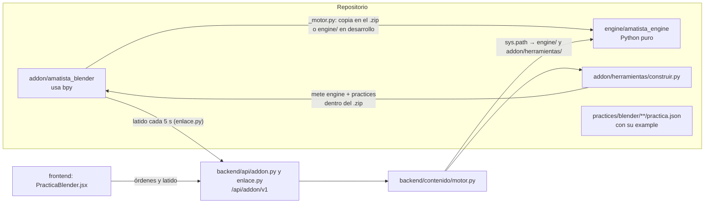
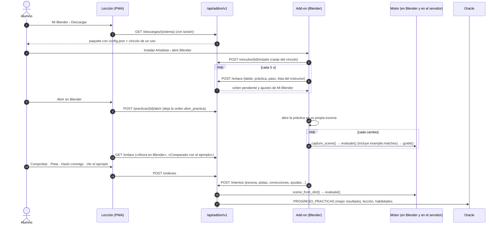

# 04 · Motor, add-on de Blender y prácticas (vista desde el código)

Manual de uso del código de **Amatista Engine** (`engine/`), del add-on **Amatista Motor** para Blender (`addon/`) y de las prácticas (`practices/`), para quien va a leerlo, probarlo o cambiarlo. Qué hace cada archivo, cómo se conectan y cómo se agregan piezas nuevas.

Actualizado: 10 de octubre de 2026. Describe el motor y el add-on **3.5.1**, que están en `main` (PR #25, Motor 3.5, y PR #26, correcciones 3.5.1).

> **Qué no está aquí.** La referencia funcional está en [`docs/motor/`](../motor/README.md) y no se repite: arquitectura ([01](../motor/referencia/01_arquitectura.md)), formato de práctica campo por campo ([02](../motor/referencia/02_formato_de_practica.md)), paneles del add-on ([03](../motor/referencia/03_addon.md)), instalación del alumno ([04](../motor/referencia/04_instalacion_alumno.md)), API ([05](../motor/referencia/05_api.md)), modo desarrollador ([06](../motor/referencia/06_modo_desarrollador.md)), guía y acompañante ([07](../motor/referencia/07_guia_y_acompanamiento.md)), prácticas v3 y herramientas de autor ([08](../motor/referencia/08_practicas_v3_y_herramientas.md)), los 42 validadores ([09](../motor/referencia/09_validadores.md)), modelo de referencia ([10](../motor/referencia/10_modelo_de_referencia.md)), reconocer figuras ([11](../motor/referencia/11_reconocer_figuras.md)), la plataforma maneja Blender ([12](../motor/referencia/12_plataforma_y_blender.md)), instructor y silueta ([13](../motor/referencia/13_instructor_y_silueta.md)) y **el ejemplo y la revisión** ([14](../motor/referencia/14_ejemplo_y_revision.md)). Este documento enlaza a ellos cuando hace falta.

## Índice

1. [Versiones y piezas](#1-versiones-y-piezas)
2. [El motor: `engine/amatista_engine/`](#2-el-motor-engineamatista_engine)
3. [El add-on: `addon/amatista_blender/` y `addon/herramientas/`](#3-el-add-on-addonamatista_blender-y-addonherramientas)
4. [Una práctica de punta a punta](#4-una-práctica-de-punta-a-punta)
5. [El formato de práctica en el código y los validadores](#5-el-formato-de-práctica-en-el-código-y-los-validadores)
6. [`practices/`](#6-practices)
7. [Pruebas](#7-pruebas)
8. [Recetas](#8-recetas)
9. [Inconsistencias conocidas](#9-inconsistencias-conocidas)

---

## 1. Versiones y piezas

| Pieza | Dónde se declara la versión | Valor |
|---|---|---|
| Motor `amatista_engine` | `engine/amatista_engine/__init__.py` (`__version__`) | `3.5.1` |
| Add-on «Amatista Motor» | `addon/amatista_blender/blender_manifest.toml` (`version`), `addon/amatista_blender/__init__.py` (`bl_info["version"]`) y `addon/amatista_blender/ajustes.py` (`VERSION_ADDON`) | `3.5.1` en los tres |
| Versión que muestra la plataforma | `frontend/src/blender/logica.js` (`MOTOR`) | `3.5.1` |
| Formato de práctica | `engine/amatista_engine/practice/schema.py` (`SUPPORTED_SCHEMAS`; las herramientas nuevas escriben `SUPPORTED_SCHEMA`) | `amatista.practice/1` y `amatista.practice/2` |
| Blender mínimo | `blender_manifest.toml` (`blender_version_min`) e `instalador/instalar_en_blender.py` (`MINIMA`) | `4.2.0` |

El nombre que ve el alumno es «Amatista Motor 3.5»: `construir.py` lo arma con el `name` del manifiesto y la versión mayor.menor.

Quién importa a quién:



El backend no tiene copia propia: `backend/contenido/motor.py` agrega `engine/` y `addon/herramientas/` al `sys.path`, crea `MOTOR = create_default_engine()` y toma `VERSION_ADDON` de `construir.VERSION` (que lee el manifiesto). Por eso un cambio en `engine/` o en el manifiesto llega al servidor con el despliegue normal.

---

## 2. El motor: `engine/amatista_engine/`

Python 3.11+ sin dependencias. Solo `blender/` importa `bpy` (y lo hace dentro de las funciones, así que el paquete se puede importar sin Blender).

**La idea del motor 3.5: el ejemplo manda.** Cada práctica trae su ejemplo resuelto en código (`example.steps`). El motor arma con él la escena esperada y revisa la escena del alumno contra ella, aspecto por aspecto, con el validador `example.matches`. El cargador agrega ese objetivo al final de toda práctica con ejemplo, así que nadie tiene que escribir a mano qué revisar. Los demás objetivos de la práctica siguen sirviendo para guiar paso a paso. Referencia completa: [14_ejemplo_y_revision.md](../motor/referencia/14_ejemplo_y_revision.md).

### 2.1 Módulos sueltos

| Archivo | Qué hace | Clases y funciones principales |
|---|---|---|
| `__init__.py` | Punto de entrada y versión. | `AmatistaEngine`, `create_default_engine`, `create_default_registry`, `__version__` |
| `bootstrap.py` | Arma el motor con los 42 validadores incluidos y el catálogo de herramientas. | `create_default_registry()`, `create_default_engine()` |
| `engine.py` | Núcleo: evalúa cada objetivo, captura errores de validadores (nunca rompe Blender), aplica `messages`, calcula progreso, estados, vigilantes, píldoras y avisos de herramientas. | `AmatistaEngine.evaluate()`, `.guide()`, `.pills()`, `.evaluate_target()` (depurador del modo autor), `.targets_for_event()` |
| `models.py` | Dataclasses inmutables: escena, práctica, resultados. | `SceneObject` (con `caja()`), `SceneState`, `PracticeDefinition`, `TargetDefinition`, `ExampleDefinition`, `ValidationResult`, `EvaluationReport` y las constantes de estado |
| `registry.py` | Registro de validadores con su descripción (parámetros, etiqueta, categoría, eventos que lo invalidan). | `ValidatorRegistry` (`register`, `get`, `spec`, `specs`, `ids`), `ValidatorSpec`, `ParamSpec`, `EVENTOS` |
| `snapshot.py` | La «foto» de la escena en JSON compacto y su lectura con límites (500 objetos, listas y nombres acotados, solo números finitos). Es lo que viaja al servidor. | `scene_to_dict()`, `scene_from_dict()` |
| `curriculum.py` | El plan de estudios (`practices/blender/cursos.json`, `amatista.curriculum/1`): cursos, módulos y sus prácticas de exploración y de cierre, y qué se desbloquea. | `load_curriculum()`, `unlock_state()`, `next_practice()` |
| `testing.py` | Kit de pruebas para autores: escenas de prueba en pocas líneas y la escena que deja una lista de pasos. | `Escena`, `escena_desde_pasos()`, `escena_de_caso()` |
| `cli.py` | Las herramientas de autor que expone `engine/herramientas/practicas.py`: `nueva`, `revisar`, `probar`, `simular`, `validadores` y `plan`. `probar` corre los casos de `pruebas.json` y comprueba además que el ejemplo complete su propia práctica. | `main()`, `probar()`, `revisar()` |
| `errors.py` | Excepciones. `InvalidPracticeError.errors` trae **todos** los problemas, no solo el primero. | `AmatistaEngineError`, `InvalidPracticeError` |
| `progress.py` | Compatibilidad con el prototipo v0.1: reexporta `calculate_progress`. | — |

### 2.2 Subpaquetes

| Subpaquete | Archivo | Qué hace | Principales |
|---|---|---|---|
| `practice/` | `schema.py` | Constantes del formato: esquemas, patrones de ids, campos admitidos (también los del `example`, `reference` y las píldoras) y límites. | `SUPPORTED_SCHEMA`, `SUPPORTED_SCHEMAS`, `CAMPOS_EJEMPLO`, `EXIGENCIAS`, `MAX_OBJETIVOS` (40), `MAX_PISTAS` (6), `MAX_PILDORAS` (24), `NIVEL_MAXIMO` (5) |
| | `loader.py` | Lee el JSON y revisa la **estructura**; junta todos los errores antes de fallar. Valida el `example` (pasos conocidos, objetos que existen) y agrega al final de la ruta el objetivo `ejemplo` con `example.matches` (peso 15). También exporta de vuelta a JSON canónico, sin ese objetivo agregado. | `parse_practice()`, `load_practice()`, `dump_practice()`, `dumps_practice()` |
| | `compiler.py` | Revisa lo que depende del motor instalado: validador existente, parámetros obligatorios, roles, `requires` sin ciclos, herramientas del catálogo. Separa errores de avisos. | `compile_practice()`, `CompileResult` (`ok`, `errors`, `warnings`, `summary()`) |
| | `plano.py` | El plano SVG del modelo de referencia en tres vistas (frente, lado y arriba). | `plano_svg()`, `medidas_generales()` |
| | `templates.py` | Plantillas de `practicas.py nueva`. | `nueva_practica()`, `nuevas_pruebas()` |
| `ejemplo/` | `pasos.py` | El ejemplo resuelto: arma la escena esperada con los pasos (`cubo`, `esfera`, `referencia`, `material`, `animar`, `coleccion`, `guardado`…), describe cada paso como instrucción con sus teclas y dice qué pide el ejemplo. | `escena_esperada()`, `describir()`, `describir_paso()`, `revisar_pasos()`, `lo_que_pide()` |
| | `revision.py` | La revisión autónoma: compara la escena del alumno con la esperada solo en los aspectos que tiene el ejemplo (figura, malla, modificadores, materiales, colecciones, luces, cámara, animación, render y archivo), con la exigencia del nivel. | `revisar_ejemplo()`, `aspectos_del_ejemplo()`, `RevisionEjemplo`, `Aspecto` |
| `figures/` | `reconocer.py` | Reconoce la figura por la forma y el lugar de sus piezas (el alumno ya no pone roles), revisa que tenga sentido y exige según el nivel. | `reconocer()`, `inferir_roles()`, `perfil_para()`, `Perfil`, `biblioteca()` |
| | `silueta.py` | La silueta de una figura hecha en una sola malla: la corta en rebanadas y la compara parte por parte con el modelo (pomo, mango, guarda, hoja, punta). | `silueta_de_malla()`, `comparar_siluetas()`, `lista_de_revision()` |
| | `biblioteca.json` | Figuras conocidas para decir «parece una mesa». | — |
| `validators/` | `builtin.py` | **El catálogo**: registra los 42 validadores con su etiqueta en español, parámetros, categoría y eventos. Conserva alias del prototipo. | `register_builtin_validators()` |
| | `base.py` | Ayudantes comunes: selector de objetos, reglas de cantidad y rango, mensajes generados. | `select()`, `selector()`, `describe()`, `count_rule()`, `count_message()`, `number()`, `axis()`, `result()` |
| | `objects.py`, `transforms.py`, `mesh.py`, `scene.py`, `shape.py`, `spatial.py`, `materials.py`, `lighting.py`, `animation.py`, `logic.py`, `figure.py`, `recognize.py`, `silhouette.py`, `example.py` | Un archivo por familia de validadores (tabla en la [sección 5.2](#52-validadores-disponibles)). | — |
| `pedagogy/` | `progress.py`, `graph.py`, `hints.py`, `skills.py` | Progreso ponderado, dependencias y estado de cada paso, pistas por niveles, autonomía al completar. | `calculate_progress()`, `statuses()`, `next_hint()`, `classify()` |
| | `pills.py`, `spaced.py` | Píldoras de teoría (cuál toca y cuándo) y repaso espaciado con cajas de Leitner. | `pills_for()`, `introduce()`, `answer()`, `due()` |
| `guide/` | `models.py` | Lo que produce la guía y el acompañante. | `Guidance`, `GuideInstruction`, `Highlight`, `VisualCue`, `GuideAction`, `Intervention`, `guidance_to_dict()` |
| | `coach.py`, `coach_v3.py` | Un entrenador por validador (31 en `ENTRENADORES`) más el genérico; `example.matches` guía con el primer punto pendiente de la lista. | `ENTRENADORES`, `build_guidance()`, `guide_target()`, `coach_generico()` |
| | `companion.py` | Decide cuándo hablar (paso logrado, nuevo paso, mejora, retroceso, ofrecer ayuda, práctica completa). | `Companion` (`observe()`, `reset()`), `distance()` |
| `tools/` | `catalogo.json`, `registry.py` | Catálogo de herramientas de Blender (nombre, teclas, cómo se usa, error típico, nivel) que usan los avisos de nivel y el panel «Tus herramientas». | `ToolRegistry` (`default()`, `detect_used()`, `warnings()`), `Tool` |
| `blender/` | `adapter.py` | **Único lugar con `bpy`**: convierte la escena de Blender en `SceneState`. Ignora objetos con `amatista_ignore`. | `capture_scene()`, `capture_object()` |
| | `tagger.py` | Roles, etiquetas e «ignorar» guardados como propiedades del objeto; datos del Inspector. | `assign_role()`, `get_role()`, `add_tag()`, `is_ignored()`, `inspect_object()` |

### 2.3 El bloque `example` en el código

Así se ve en `practica.json` (la pelota, `practices/blender/principiante-intermedio/m3-pelota/`):

```json
"example": {
  "title": "Pelota que rebota",
  "description": "La pelota cae, toca el piso en el fotograma 12, se aplasta y vuelve a subir en el 24.",
  "steps": [
    {"esfera": {"nombre": "Pelota", "loc": [0, 0, 4]}},
    {"plano": {"nombre": "Piso"}},
    {"animar": {"objeto": "Pelota", "propiedad": "location", "eje": "z", "claves": [[1, 4], [12, 0.85], [24, 4]]}},
    {"animar": {"objeto": "Pelota", "propiedad": "scale", "eje": "z", "claves": [[1, 1], [12, 0.75], [24, 1]]}},
    {"guardado": {"archivo": "mi_pelota.blend"}}
  ],
  "check": ["animacion", "archivo"]
}
```

Lo que pasa con él en el código:

1. `practice/loader.py` lo lee como `ExampleDefinition` (hasta 120 pasos, `ejemplo/pasos.py › revisar_pasos`) y agrega el objetivo «Tu práctica coincide con el ejemplo» (`ejemplo`, validador `example.matches`, peso 15). Si la práctica ya tiene un `example.matches` sin `aspects`, no agrega otro.
2. `validators/example.py` arma la escena esperada con `escena_esperada()` y llama a `revisar_ejemplo()`. El resultado trae en `details` la lista `checklist` (`{texto, ok, estado, consejo, aspecto}`) y los `aspects` revisados.
3. El add-on muestra esa lista como «Comparado con el ejemplo» y arma el ejemplo en su propia escena con «Ver el ejemplo» (`addon/amatista_blender/ejemplo.py`).
4. El backend devuelve el ejemplo en `GET /api/addon/v1/practicas/{id}` (`ejemplo`: `titulo`, `descripcion`, `pasos`, `revisa`, `codigo`) y la lección lo muestra en la tarjeta «El ejemplo resuelto».
5. `python engine/herramientas/practicas.py probar` y `engine/tests/test_ejemplo.py` comprueban que el ejemplo de cada práctica la complete y que una escena vacía no coincida.

### 2.4 Usar el motor desde Python puro

`engine/demo.py` es el ejemplo mínimo: carga la práctica del tren (`practices/blender/principiante/m1-tren/practica.json`), arma con `escena_esperada` la escena de su ejemplo resuelto sin el último objeto y la evalúa (`python engine/demo.py`: «Progreso: 77.78%», «Paso actual: 3 de 12»).

Con una práctica del plan de estudios y su ejemplo (todas estas llamadas existen tal cual en el código):

```python
import json, sys
sys.path.insert(0, "engine")          # desde la raíz del repositorio

from amatista_engine import create_default_engine
from amatista_engine.practice import compile_practice
from amatista_engine.ejemplo.pasos import describir, escena_esperada
from amatista_engine.models import SceneState
from amatista_engine.snapshot import scene_to_dict, scene_from_dict

r = compile_practice(json.load(open("practices/blender/principiante-intermedio/m3-pelota/practica.json")))
assert r.ok, r.errors                      # r.warnings: avisos que no bloquean
practica = r.practice                      # el último objetivo es «ejemplo» (example.matches)

motor = create_default_engine()
esperada = escena_esperada(practica.example.steps)
motor.evaluate(practica, esperada).completed           # True: el ejemplo completa su práctica
describir(practica.example.steps)[0]                    # 'Agrega una esfera «Pelota» (Shift + A › Malla › Esfera UV).'

vacia = SceneState("5.0", "", False, ())
reporte = motor.evaluate(practica, vacia)               # progress 0.0
reporte.result("ejemplo").message                       # 'Animación: Selecciona «Pelota»…'
guia = motor.guide(practica, vacia, reporte)            # Guidance con teclas y «Hazlo conmigo»

foto = scene_to_dict(vacia)                              # lo que viaja al servidor
mismo = motor.evaluate(practica, scene_from_dict(foto))
```

`load_practice` solo revisa estructura; `compile_practice` hace además las comprobaciones contra el registro (es lo que usan el add-on al abrir una práctica y el backend al subirla).

### 2.5 Usar el motor dentro de Blender

1. **Con el add-on instalado** (lo normal): el add-on ya trae el motor (ver [3.1](#31-addonamatista_blender)) y `amatista_blender._motor` lo expone como `MOTOR`, `adapter`, `tagger`, `practica`, `pedagogia`, `foto`, `herramientas`, `guia`, `curriculo` y `repaso`.
2. **Script suelto** `engine/herramientas/run_in_blender.py`: viene del prototipo y espera que `amatista_engine/` y `practices/` cuelguen de la misma carpeta (`PROJECT_ROOT`). En este repositorio no es así; para usarlo hay que agregar `<repo>/engine` al `sys.path` y cargar la práctica desde `<repo>/practices/...`.
3. **Las imágenes de referencia**: `engine/herramientas/referencias.py` construye en Blender (bpy) el modelo de referencia de cada práctica y escribe su `referencia.jpg` y su `plano.svg`.

---

## 3. El add-on: `addon/amatista_blender/` y `addon/herramientas/`

Extensión de Blender 4.2+ (licencia GPL-3.0-or-later, solo `addon/`). Qué ve el alumno y qué hace cada panel: [03_addon.md](../motor/referencia/03_addon.md).

### 3.1 `addon/amatista_blender/`

| Archivo | Qué hace | Principales |
|---|---|---|
| `blender_manifest.toml` | Manifiesto de extensión: id `amatista`, nombre «Amatista Motor», versión, Blender mínimo, licencia, permisos (`network`, `files`). | — |
| `__init__.py` | Registro: `bl_info`, tupla `CLASES`, `register()`/`unregister()` y `_primer_arranque()` (temporizador de 1.5 s: canjea el vínculo y muestra la bienvenida una vez). Al desregistrar devuelve el mundo y el Blender completo como estaban. | `register()`, `unregister()`, `CLASES` |
| `_motor.py` | Carga el motor: primero la copia que mete `construir.py`; si no existe, `<repo>/engine` (desarrollo). | `MOTOR`, `VERSION_MOTOR`, `adapter`, `practica`, `guia`, `curriculo`, `repaso` |
| `config.json` | Servidor, plataforma y canal. En el repositorio apunta a `localhost`; `construir.py` lo reescribe en cada paquete (con el `vinculo` de un uso si la descarga es personal). | — |
| `ajustes.py` | Preferencias del add-on y lectura de `config.json`. Son el respaldo sin conexión de lo que se elige en «Mi Blender». | `PreferenciasAmatista`, `prefs()`, `servidor()`, `plataforma()`, `VERSION_ADDON` |
| `estado.py` | Propiedades de escena (práctica abierta, JSON, pistas; se guardan en el `.blend`), del modo autor y de la ventana (modo, pestaña Aprender · Practicar · Mi curso). | `EstadoEscena`, `EstadoAutor`, `EstadoSesion`, `MODOS` |
| `red.py` | Cliente de la API en hilos con tiempo límite; el resultado vuelve al hilo principal con `bpy.app.timers`. Respeta `bpy.app.online_access`. Cola sin conexión en `pendientes.json`. | `pedir()`, `encolar()`, `vaciar_cola()` |
| `cuenta.py` | Vínculo con la cuenta: canje del vínculo del paquete, código de dispositivo, refresco de la cuenta y desvincular. | `al_iniciar()`, `iniciar_vinculo()`, `desvincular()` |
| `practicas.py` | *Student Runtime*: catálogo (paquete → caché → servidor), **cada práctica en su propia escena** («Empezar de nuevo» deja lo anterior en una escena «(anterior)»), captura y evaluación, lista del instructor, pistas, intento y sincronización, manejadores de Blender y el vigilante. | `catalogo()`, `activar()`, `reiniciar()`, `abrir_por_id()`, `cargar_practica_actual()`, `evaluar()`, `lista_instructor()`, `pedir_pista()`, `sincronizar()` |
| `ejemplo.py` | **«Ver el ejemplo»**: arma el ejemplo resuelto en su propia escena («Ejemplo · <título>») con bmesh y `bpy.data`, sin operadores; el motor no evalúa esa escena. «Volver a mi práctica» regresa. | `ver_ejemplo()`, `volver()`, `es_ejemplo()`, `instrucciones()` |
| `enlace.py` | **Enlace en vivo**: late cada 5 s (`POST /enlace`) con la práctica, el paso, el progreso, el modo enfocado y lo que muestra el instructor, y cumple las órdenes de la plataforma (abrir práctica, enfocar, ver todo, comprobar, pista, «Hazlo conmigo», guardar, empezar de nuevo, ver el ejemplo y volver). Aplica los ajustes de «Mi Blender». | `latir()`, `cumplir()`, `aplicar_ajustes()`, `detalle_vivo()` |
| `enfoque.py` | **Modo enfocado** (niveles 1 y 2 por defecto): oculta la barra T y los menús que la práctica no usa y deja «Agregar» solo con las piezas del modelo. «Ver todo Blender» lo devuelve como estaba. | `activar()`, `desactivar()`, `ver_todo()`, `debe_enfocar()` |
| `escenarios.py` | Escenas de inicio de las prácticas (`starter`): escena vacía o una escena preparada. | — |
| `temas.py` | La temática de cada módulo (colores, mascota y jefe) desde `practices/blender/temas.json`, la misma que usa la plataforma. Python puro. | `TEMA_POR_DEFECTO` |
| `aprendizaje.py` | Mapa del curso, píldoras vistas y repaso espaciado (`avance.json` en la carpeta del usuario). | — |
| `integridad.py` | Comprueba `integridad.json` del paquete (copia oficial, modificada o del repositorio). | — |
| `guia.py` | Guarda la `Guidance` actual, corre el `Companion`, convierte intervenciones en avisos o diálogos según el acompañamiento, ejecuta «Hazlo conmigo» y cuenta ayudas. | `actualizar()`, `ejecutar_accion()` |
| `operadores.py` | **Operadores del modo Alumno** (`amatista.*`): `vincular`, `cancelar_vinculo`, `desvincular`, `permitir_internet`, `abrir_plataforma`, `ver_referencia`, `abrir_practica`, `practica_actual`, `elegir_practica`, `empezar_de_nuevo`, `ver_ejemplo`, `volver_practica`, `actualizar_catalogo`, `comprobar`, `sincronizar`, `asignar_rol`, `quitar_rol`, `hazlo_conmigo`, `mostrarme`, `mascota_siguiente`. | `CLASES` |
| `autor.py`, `desarrollo.py` | Lógica y operadores del modo Desarrollador: el borrador vive en el bloque de texto `amatista_practica.json` del `.blend`. | `compilar()`, `probar_borrador()`, `publicar()` |

#### `interfaz/`

| Archivo | Qué hace |
|---|---|
| `estilo.py` | Piezas reutilizables (Blender no tiene CSS): iconos propios, tarjetas, barras, párrafos, teclas dibujadas. |
| `paneles.py` | Paneles de *Vista 3D › N › Amatista*. Alumno: `AMATISTA_PT_principal`, `_practica` (bloque «Ahora», «El ejemplo resuelto» y «Comparado con el ejemplo»), `_objetivos`, `_figura`, `_herramientas` («Tus herramientas»), `_roles`, `_aprender`, `_curso`. Desarrollador: `_autor_borrador`, `_tagger`, `_inspector`, `_objetivos`, `_depurador`, `_teoria`, `_publicar`. |
| `aprender.py` | Píldoras de teoría, repaso y la ventana de pausa cuando un vigilante detiene el progreso. |
| `herramientas.py` | «Tus herramientas»: «Usar», «¿Cómo se usa?», «Ver todo Blender» y «Enfocar». |
| `dialogos.py` | Ventanas emergentes: pista, felicitar, aviso de herramienta, bienvenida, explicar paso, ofrecer ayuda. |
| `hud.py`, `visor3d.py` | La tarjeta del paso sobre la vista 3D y la guía dibujada en la escena (contornos, reglas, fantasmas, flechas). No modifican la escena. |

#### Qué pasa al registrar

1. `estado.register()` crea las propiedades de escena y ventana.
2. `estilo.cargar_iconos()`.
3. Se registran las clases de `CLASES`.
4. `practicas.register()` engancha los manejadores de cambio, guardado y apertura de archivo, y el vigilante que reevalúa tras un momento de calma.
5. `enlace.register()` arranca el latido.
6. `hud.register()`.
7. A los 1.5 s, `_primer_arranque()` → `cuenta.al_iniciar()`.

### 3.2 `addon/herramientas/`

| Archivo | Qué hace | Cómo se usa |
|---|---|---|
| `construir.py` | Arma la extensión `.zip` (add-on + `amatista_engine/` + `practicas/` con `cursos.json`, `temas.json`, cada `practica.json` con su ejemplo e imágenes de referencia, sin los `pruebas.json` + `config.json` reescrito + `integridad.json`) con fechas fijas, así dos construcciones iguales dan los mismos bytes. Arma también el paquete con instalador por sistema y el `index.json` del repositorio de extensiones. El backend lo importa para las descargas al vuelo. | `python addon/herramientas/construir.py [--sistema windows\|macos\|linux] [--servidor URL] [--plataforma URL] [--salida dist/]` |
| `generar_iconos.py` | Dibuja los iconos PNG sin dependencias. | `python addon/herramientas/generar_iconos.py` |
| `instalador/` | `instalar_en_blender.py` (corre dentro de Blender, comprueba la versión e instala la extensión), los lanzadores `Instalar Amatista.bat`, `Instalar Amatista.command` e `instalar-amatista.sh`, y `LEEME.txt`. | Doble clic en el lanzador ([04_instalacion_alumno.md](../motor/referencia/04_instalacion_alumno.md)). |

Desde la terminal la extensión se llama `dist/amatista-3.5.1.zip` y el paquete `dist/amatista-3.5.1-<sistema>.zip`; la API entrega `Amatista-Motor-3.5-<sistema>.zip` y dentro todo va en la carpeta «Amatista Motor 3.5».

---

## 4. Una práctica de punta a punta



| # | Qué pasa | Dónde está el código |
|---|---|---|
| 1 | **Descarga e instalación.** «Mi Blender» detecta el sistema y pide el paquete; con sesión, el servidor crea un vínculo de un uso y llama a `construir.construir_paquete(sistema, vinculo=…)`. El lanzador busca Blender y ejecuta `instalar_en_blender.py`. | `frontend/src/pages/Blender.jsx`, `backend/api/addon.py`, `addon/herramientas/` |
| 2 | **Vincular la cuenta.** `_primer_arranque()` → `cuenta.al_iniciar()` canjea el vínculo del paquete; sin vínculo, el botón Vincular muestra un código que el alumno confirma en `#/vincular`. | `addon/amatista_blender/cuenta.py`, `frontend/src/pages/Vincular.jsx` |
| 3 | **El latido.** `enlace.latir()` llama a `POST /enlace` cada 5 s; la respuesta trae la orden pendiente y los ajustes de «Mi Blender» (`aplicar_ajustes()`). Lo que muestra el instructor viaja en el latido y se guarda en `ADDON_ENLACES.DETALLE` (Oracle 011). Sin Oracle 010 el servidor responde «sin enlace en vivo» y el add-on sigue igual. | `addon/amatista_blender/enlace.py`, `backend/api/enlace.py` |
| 4 | **Abrir la práctica.** En la lección, «Abrir en Blender» llama a `POST /practicas/{id}/abrir`; si hay un Blender conectado, el servidor le deja la orden `abrir_practica` (`ordenar_abrir`). El add-on la cumple con `practicas.activar()`: compila la definición, crea la escena de la práctica y evalúa. Sin Blender abierto, la práctica queda como actual y se abre al conectarse (`GET /practica-actual`). | `frontend/src/components/leccion/interactivos/PracticaBlender.jsx`, `backend/api/addon.py`, `backend/api/enlace.py`, `addon/amatista_blender/practicas.py` |
| 5 | **El motor evalúa.** Cada cambio en la escena dispara `evaluar()`: `capture_scene()` → `MOTOR.evaluate()`, con `example.matches` al final. La lista del instructor sale de los `details` de la revisión. | `practicas.py`, `engine/amatista_engine/engine.py`, `engine/amatista_engine/ejemplo/` |
| 6 | **Guía y acompañante.** `guia.actualizar()` llama a `build_guidance()` y `Companion.observe()`. «Hazlo conmigo» ejecuta la `GuideAction`; la tarjeta de la vista 3D y `visor3d` dibujan la misma `Guidance`. | `guia.py`, `interfaz/hud.py`, `interfaz/visor3d.py`, `engine/amatista_engine/guide/` |
| 7 | **La lección maneja la práctica.** La tarjeta «Ahora en Blender» lee `GET /enlace` y muestra el paso, lo que dice el instructor y «Comparado con el ejemplo». Sus botones dejan órdenes con `POST /ordenes` (`comprobar`, `pista`, `hazlo_conmigo`, `guardar`, `reiniciar`, `ver_ejemplo`, `volver_practica`) que `enlace.cumplir()` ejecuta en el siguiente latido. | `PracticaBlender.jsx`, `frontend/src/blender/logica.js`, `enlace.py`, `ejemplo.py` |
| 8 | **Enviar el intento.** Al cambiar el progreso (o con «Enviar mi progreso»), `sincronizar()` manda `POST /intentos` con la foto de la escena; sin red, queda en la cola. | `practicas.py`, `red.py` |
| 9 | **El servidor reevalúa** con la misma foto y la versión de la práctica, guarda el mejor resultado en `PROGRESO_PRACTICAS` y, al completar, marca la lección enlazada. | `backend/api/addon.py`, `backend/contenido/motor.py` ([05_api.md](../motor/referencia/05_api.md)) |
| 10 | **Progreso en la plataforma.** La lección consulta `GET /mi-progreso?practica_id=` cada 6 s mientras la práctica está empezada; el panel y «Mi Blender» leen lo mismo. | `PracticaBlender.jsx`, [docs/plataforma/02](../plataforma/02_modulos_y_practica.md) |

---

## 5. El formato de práctica en el código y los validadores

Referencia campo por campo: [02_formato_de_practica.md](../motor/referencia/02_formato_de_practica.md); lo nuevo de `amatista.practice/2` (píldoras, vigilantes, escena de inicio, curso, repaso): [08](../motor/referencia/08_practicas_v3_y_herramientas.md); el bloque `example`: [14](../motor/referencia/14_ejemplo_y_revision.md).

### 5.1 Dónde se valida

| Etapa | Archivo | Qué comprueba | Qué devuelve |
|---|---|---|---|
| Estructura | `practice/loader.py` → `parse_practice()` | Esquema admitido, `id`, `title`, `level` 1–5 (obligatorio), `version`, `targets` (1 a 40) con ids únicos, pesos, mensajes, pistas y `guide`; `pills`, `starter`, `reference` y `example` (pasos conocidos, hasta 120). Agrega el objetivo `ejemplo`. | `PracticeDefinition` o `InvalidPracticeError` con **todos** los errores |
| Contra el motor | `practice/compiler.py` → `compile_practice()` | Validador registrado, parámetros obligatorios, roles declarados, `requires` sin ciclos, herramientas del catálogo; avisos por objetivos sin pistas o roles sin usar. | `CompileResult(practice, errors, warnings)` |

En tiempo de evaluación hay una tercera red: si un validador lanza una excepción, `AmatistaEngine` devuelve `passed=None` con `details.reason = "validator_error"`; si el validador no existe, `reason = "unknown_validator"` y `EvaluationReport.needs_update = True` (el add-on muestra «necesita actualizar»).

Quién llama a cada uno: el add-on usa `compile_practice` al abrir y en el modo autor; el backend usa `compile_practice` al subir y `parse_practice` al reevaluar intentos.

### 5.2 Validadores disponibles

Son 41 y los registra `validators/builtin.py`. La tabla completa, con parámetros y eventos, se genera desde el registro: [09_validadores.md](../motor/referencia/09_validadores.md) (`python engine/herramientas/practicas.py validadores --md docs/motor/referencia/09_validadores.md`).

| Categoría | Archivo | Validadores |
|---|---|---|
| Objetos y roles | `objects.py` | `object.exists`, `object.count`, `role.exists`, `role.count` |
| Transformaciones | `transforms.py`, `figure.py` | `dimension.range`, `object.position`, `object.rotation`, `transform.scale_applied`, `dimension.approx` |
| Relaciones | `transforms.py`, `spatial.py` | `spatial.below`, `spatial.grounded`, `spatial.on_top`, `spatial.touching` |
| Forma | `shape.py`, `figure.py`, `recognize.py`, `silhouette.py` | `shape.proportion`, `shape.thinnest_axis`, `figure.resembles`, `figure.recognize`, `figure.silhouette` |
| Malla | `mesh.py` | `mesh.vertex_count`, `mesh.face_count`, `mesh.no_duplicates`, `mesh.one_side`, `modifier.exists`, `modifier.configured` |
| Materiales | `mesh.py`, `materials.py` | `material.exists`, `material.distinct`, `material.matches` |
| Escena | `scene.py`, `lighting.py` | `scene.camera_exists`, `scene.light_exists`, `camera.active`, `camera.frames`, `light.three_point`, `render.engine`, `render.done` |
| Animación | `animation.py` | `animation.keyframes`, `animation.varies` |
| Organización y archivo | `scene.py` | `collection.contains`, `file.saved`, `file.named` |
| Lógica | `logic.py` | `logic.any` |
| Ejemplo | `example.py` | `example.matches` |

Los eventos de cada validador están en `registry.EVENTOS` y los usa `AmatistaEngine.targets_for_event()`; el add-on hoy reevalúa la práctica completa en cada cambio. Los entrenadores de la guía están en `guide/coach.py` y `guide/coach_v3.py` (31 en `ENTRENADORES`); los demás validadores usan `coach_generico`.

---

## 6. `practices/`

```
practices/
├─ README.md                    qué hay y cómo se registra
├─ blender/
│  ├─ cursos.json               plan de estudios (amatista.curriculum/1)
│  ├─ temas.json                temáticas por módulo (las comparten el add-on y la plataforma)
│  ├─ referencias.json          modelos de referencia para generar las imágenes
│  ├─ principiante/             m1-explora, m1-tren, m2-explora, m2-espada, m3-explora, m3-nave
│  ├─ principiante-intermedio/  m1-explora, m1-pinta-nave, m2-explora, m2-tres-puntos, m3-explora, m3-pelota
│  └─ intermedio/               m1-explora, m1-puente, m2-explora, m2-aldea, m3-explora, m3-diorama
└─ archivo/v2/                  mesa.json, podio.json y table.json (la v2 y el prototipo)
```

- **`blender/`**: las 18 prácticas oficiales, una carpeta por práctica con `practica.json` (con su `example`), `pruebas.json` (casos que deben aprobar o no), `referencia.jpg` y `plano.svg`. Las recogen `construir.py` (las copia al `.zip`), el servidor al arrancar (`backend/contenido/motor.py › practicas_del_repositorio()`: las registra y publica solo) y las pruebas del motor.
- **`archivo/`**: no se empaqueta ni se registra en Oracle. En desarrollo, el catálogo del add-on la muestra solo con el modo desarrollador. `engine/tests/ayudantes.py` usa la mesa; `engine/demo.py` usa el tren.

Cada id sigue el patrón `blender.<curso>.m<n>.<tema>`, por ejemplo `blender.bp.m1.tren`. Detalle de cada práctica y de cómo se probó: [practices/README.md](../../practices/README.md) y [08](../motor/referencia/08_practicas_v3_y_herramientas.md).

---

## 7. Pruebas

| Dónde | Qué cubre | Cuántas |
|---|---|---|
| `engine/tests/` (13 archivos) | Motor: la mesa y el podio, guía, cargador, figura y reconocimiento, silueta, herramientas y modo enfocado, prácticas y pedagogía v3 y el ejemplo (`test_ejemplo.py`: en las 18 prácticas el ejemplo completa su práctica, una escena vacía no coincide, cada aspecto por separado y ejemplos mal escritos). | 293 casos (`pytest --collect-only`) |
| `addon/tests/test_construir.py`, `test_integridad.py`, `test_temas.py` | Sin Blender: contenido de la extensión, bytes reproducibles, paquetes por sistema, integridad y temáticas. | 36 casos |
| `addon/tests/en_blender.py` | **Dentro de Blender** (script, no pytest; sale con código 1 si algo falla): activa el add-on desde `addon/`, recorre prácticas, la guía, el modo autor, los paneles, la escena por práctica, «Ver el ejemplo» en 8 prácticas, el latido y las órdenes de la plataforma. | comprobaciones `revisar()` |
| `python engine/herramientas/practicas.py probar` | Los casos de `pruebas.json` de las 18 prácticas y que cada ejemplo complete su práctica. | 96 casos |

Cómo correrlas (desde la raíz):

```bash
python -m pytest -q engine/tests addon/tests     # necesita pytest; sin Blender
python engine/herramientas/practicas.py probar    # casos de las prácticas y sus ejemplos

python addon/tests/en_blender.py                  # con el módulo bpy de PyPI (Python 3.11):
                                                   #   pip install bpy==5.0.1
blender --background --factory-startup --python addon/tests/en_blender.py   # con un Blender instalado
```

En CI (`.github/workflows/ci.yml`): el job `backend` corre `python -m pytest -q engine/tests addon/tests`; el job **`addon-blender`** usa Python 3.11, instala las bibliotecas de sistema que pide `bpy`, `pip install bpy==5.0.1` y ejecuta `python addon/tests/en_blender.py`.

Las pruebas de la API del add-on y del enlace están en `backend/tests/test_addon.py`, `test_enlace.py` y `test_ejemplo.py`.

---

## 8. Recetas

### 8.1 Crear una práctica nueva

1. **Esqueleto**: `python engine/herramientas/practicas.py nueva blender.bp.m4.mi-practica --plantilla materiales --titulo "Mi práctica" --curso blender_principiante --modulo 4` crea la carpeta con `practica.json` y `pruebas.json` ([08](../motor/referencia/08_practicas_v3_y_herramientas.md)). Cada plantilla trae un `example` que completa su propia práctica y un caso «Solución (el ejemplo resuelto)» en `pruebas.json`: cámbialos por la solución de tu práctica.
2. **Escribe la solución como caso de `pruebas.json`** que aprueba, con los mismos pasos que usa el ejemplo (`cubo`, `material`, `animar`, `guardado`…).
3. **Cópiala a `example.steps`** y escribe `title` y `description`. Si la figura sale del modelo de referencia, usa el paso `{"referencia": {}}`. Si solo quieres revisar algunos aspectos, pon `check`.
4. **Prueba**: `python engine/herramientas/practicas.py revisar <carpeta>` (compila y revisa la pedagogía) y `python engine/herramientas/practicas.py probar <carpeta>` (los casos y que el ejemplo complete la práctica). `engine/tests/test_ejemplo.py` la incluye sola.
5. **En Blender**: abre la práctica y pulsa «Ver el ejemplo» para ver que se arme como esperas.
6. **Enlázala** con una lección mediante un bloque `blender_practice` (exploración entre la teoría o práctica de cierre del módulo; regla en [docs/plataforma/02](../plataforma/02_modulos_y_practica.md)) y agrégala a `practices/blender/cursos.json`.
7. **Regístrala**: el servidor registra y publica solo las de `practices/blender/` al arrancar; `python herramientas/contenido.py practicas --revisar` (desde `backend/`) dice cuáles faltan.
8. Para cambiar una práctica publicada, sube `version`. Los paquetes nuevos del add-on la traen dentro y los instalados la reciben del servidor (`GET /practicas/{id}`).

### 8.2 Agregar un validador

1. **Función** en el archivo de su familia en `engine/amatista_engine/validators/` (o uno nuevo): firma `(target: TargetDefinition, scene: SceneState) -> ValidationResult`. Usa los ayudantes de `base.py` y devuelve con `base.result(target, passed, mensaje, details)`. Lanza `ValueError` con un mensaje claro si falta un parámetro: el motor lo convierte en «Error interno del validador» sin romper Blender.
2. **`details` útiles**: si incluyes `found`/`expected` o `failed`, `guide.companion.distance()` mide «¡vas mejor!» sin código extra. Una lista `checklist` aparece como lista del instructor en Blender y en la lección.
3. **Registro** en `validators/builtin.py` con su etiqueta, descripción, categoría, parámetros y eventos.
4. **Entrenador** (opcional) en `guide/coach.py` o `guide/coach_v3.py` y su entrada en `ENTRENADORES`.
5. **Si el ejemplo debe revisarlo**, agrega el aspecto en `ejemplo/revision.py` y, si hace falta un paso nuevo, en `ejemplo/pasos.py` (y en `addon/amatista_blender/ejemplo.py` para armarlo en Blender).
6. **Pruebas** en `engine/tests/`.
7. **Documentación y versiones**: regenera `09_validadores.md` con `practicas.py validadores --md`, sube `__version__` y publica un add-on nuevo (8.4). Un add-on viejo que reciba una práctica con el validador nuevo muestra «necesita una versión más reciente» (`needs_update`).

### 8.3 Agregar un paso de guía

- **Explicar mejor un paso** (sin código): agrega `guide` al objetivo en el JSON, `{"why": "…", "steps": ["texto", {"text": "…", "keys": ["S", "Z"]}]}` (≤ 8 pasos, ≤ 6 teclas).
- **Cambiar lo que el motor genera para un validador**: edita su entrenador y agrega el caso a `engine/tests/test_guia.py`.
- **Una acción nueva de «Hazlo conmigo»**: nuevo `kind` en `GuideAction` (`guide/models.py`) y su rama en `addon/amatista_blender/guia.py::ejecutar_accion()`, con su comprobación en `addon/tests/en_blender.py`.
- **Una señal nueva en la vista 3D**: nuevo `kind` de `VisualCue` y su dibujo en `addon/amatista_blender/interfaz/visor3d.py`.
- **Una orden nueva desde la plataforma**: agrégala al `Literal` de `Orden` en `backend/api/enlace.py`, a `cumplir()` en `addon/amatista_blender/enlace.py` y, si tiene botón, a `CONTROLES_BLENDER` en `frontend/src/blender/logica.js`.

### 8.4 Publicar una versión nueva del add-on

1. Sube la versión en los tres lugares del add-on: `blender_manifest.toml` (`version`), `__init__.py` (`bl_info["version"]`) y `ajustes.py` (`VERSION_ADDON`, la que viaja en las cabeceras y en cada intento). La prueba `test_manifiesto_y_bl_info_coinciden` solo compara los dos primeros. Si cambió el motor, sube también `engine/amatista_engine/__init__.py::__version__`, y actualiza `MOTOR` en `frontend/src/blender/logica.js`.
2. Si cambiaste iconos: `python addon/herramientas/generar_iconos.py`.
3. Pruebas: `python -m pytest -q engine/tests addon/tests`, `python engine/herramientas/practicas.py probar` y `python addon/tests/en_blender.py` (o deja que lo haga el job `addon-blender`).
4. Construye para revisar a mano: `python addon/herramientas/construir.py` (deja `dist/amatista-<versión>.zip`). `dist/` no se versiona.
5. Fusiona en `main` y despliega el backend: las descargas se arman desde el código desplegado. Los alumnos reinstalan desde «Mi Blender»; la plataforma avisa si el servidor entrega una versión más vieja que la que espera.
6. Si la versión mínima de Blender cambia, actualiza `blender_version_min` en el manifiesto **y** `MINIMA` en `instalador/instalar_en_blender.py`, y los mensajes de los lanzadores.

---

## 9. Inconsistencias conocidas

| Dónde | Qué pasa |
|---|---|
| `engine/herramientas/run_in_blender.py` | `PROJECT_ROOT` espera `amatista_engine/` y `practices/` en la misma carpeta, como en el prototipo. En el repositorio el paquete está en `engine/`; el script no funciona sin editarlo. |
| Versión del add-on | Está en tres archivos del add-on (y en `MOTOR` de la plataforma) y la prueba solo compara manifiesto y `bl_info`; `ajustes.VERSION_ADDON` podría quedar desfasada sin que nada falle. Hoy los tres dicen 3.5.1. |
