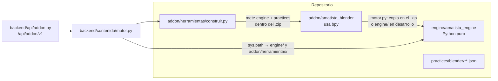
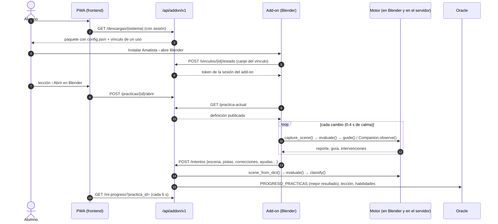

# 04 · Motor, add-on de Blender y prácticas (vista desde el código)

Manual de uso del código de **Amatista Engine** (`engine/`), del add-on **Amatista para Blender** (`addon/`) y de las prácticas (`practices/`), para quien va a leerlo, probarlo o cambiarlo. Qué hace cada archivo, cómo se conectan y cómo se agregan piezas nuevas.

Actualizado: 4 de octubre de 2026 (main en c730c0e)

> **Qué no está aquí.** La referencia funcional ya existe en [`docs/motor/`](../motor/README.md) y no se repite: arquitectura y decisiones ([01](../motor/referencia/01_arquitectura.md)), formato de práctica campo por campo ([02](../motor/referencia/02_formato_de_practica.md)), paneles y preferencias del add-on ([03](../motor/referencia/03_addon.md)), instalación del alumno ([04](../motor/referencia/04_instalacion_alumno.md)), endpoints de la API ([05](../motor/referencia/05_api.md)), modo desarrollador ([06](../motor/referencia/06_modo_desarrollador.md)), guía y acompañante ([07](../motor/referencia/07_guia_y_acompanamiento.md)) y la historia por etapas ([etapa 1](../motor/etapas/etapa-1.md), [etapa 2](../motor/etapas/etapa-2.md)). Este documento enlaza a ellos cuando hace falta.

## Índice

1. [Versiones y piezas](#1-versiones-y-piezas)
2. [El motor: `engine/amatista_engine/`](#2-el-motor-engineamatista_engine)
3. [El add-on: `addon/amatista_blender/` y `addon/herramientas/`](#3-el-add-on-addonamatista_blender-y-addonherramientas)
4. [Una práctica de punta a punta](#4-una-práctica-de-punta-a-punta)
5. [El formato `amatista.practice/1` en el código y los validadores](#5-el-formato-amatistapractice1-en-el-código-y-los-validadores)
6. [`practices/`](#6-practices)
7. [Pruebas](#7-pruebas)
8. [Recetas](#8-recetas)
9. [Inconsistencias conocidas](#9-inconsistencias-conocidas)

---

## 1. Versiones y piezas

| Pieza | Dónde se declara la versión | Valor en `c730c0e` |
|---|---|---|
| Motor `amatista_engine` | `engine/amatista_engine/__init__.py` (`__version__`) | `0.3.0` |
| Add-on «Amatista» | `addon/amatista_blender/blender_manifest.toml` (`version`), `addon/amatista_blender/__init__.py` (`bl_info["version"]`) y `addon/amatista_blender/ajustes.py` (`VERSION_ADDON`) | `0.3.0` en los tres |
| Formato de práctica | `engine/amatista_engine/practice/schema.py` (`SUPPORTED_SCHEMA`) | `amatista.practice/1` |
| Blender mínimo | `blender_manifest.toml` (`blender_version_min`) e `instalador/instalar_en_blender.py` (`MINIMA`) | `4.2.0` |

Quién importa a quién:



El backend no tiene copia propia: `backend/contenido/motor.py` agrega `engine/` y `addon/herramientas/` al `sys.path`, crea `MOTOR = create_default_engine()` y toma `VERSION_ADDON` de `construir.VERSION` (que lee el manifiesto). Por eso un cambio en `engine/` o en el manifiesto llega al servidor con el despliegue normal.

---

## 2. El motor: `engine/amatista_engine/`

Python 3.11+ sin dependencias. Solo `blender/` importa `bpy` (y lo hace dentro de las funciones, así que el paquete se puede importar sin Blender).

### 2.1 Módulos sueltos

| Archivo | Qué hace | Clases y funciones principales |
|---|---|---|
| `__init__.py` | Punto de entrada y versión. | `AmatistaEngine`, `create_default_engine`, `create_default_registry`, `__version__` |
| `bootstrap.py` | Arma el motor con los 18 validadores incluidos y el catálogo de herramientas. | `create_default_registry()`, `create_default_engine()` |
| `engine.py` | Núcleo: evalúa cada objetivo, captura errores de validadores (nunca rompe Blender), aplica `messages`, calcula progreso, estados y avisos de herramientas. | `AmatistaEngine.evaluate()`, `.guide()`, `.evaluate_target()` (depurador del modo autor), `.targets_for_event()` |
| `models.py` | Dataclasses inmutables: escena, práctica, resultados. | `SceneObject` (con `caja()`), `SceneState`, `PracticeDefinition`, `TargetDefinition`, `TargetGuide`, `GuideStepDefinition`, `Hint`, `RoleDefinition`, `ValidationResult`, `TargetStatus`, `ToolWarning`, `EvaluationReport` (con `step_number`); constantes de estado `COMPLETADO`, `ACTUAL`, `PENDIENTE`, `BLOQUEADO`, `DESCONOCIDO` |
| `registry.py` | Registro de validadores con su descripción (parámetros, etiqueta, eventos que lo invalidan). | `ValidatorRegistry` (`register`, `get`, `spec`, `specs`, `ids`), `ValidatorSpec`, `ParamSpec`, `EVENTOS` |
| `snapshot.py` | La «foto» de la escena en JSON compacto (claves cortas `n`, `t`, `l`, `d`, `r`…) y su lectura con límites (500 objetos, 32 elementos por lista, 120 caracteres por nombre, solo números finitos). | `scene_to_dict()`, `scene_from_dict()` |
| `errors.py` | Excepciones. `InvalidPracticeError.errors` trae **todos** los problemas, no solo el primero. | `AmatistaEngineError`, `InvalidPracticeError` |
| `progress.py` | Compatibilidad con el prototipo v0.1: reexporta `calculate_progress`. | — |

### 2.2 Subpaquetes

| Subpaquete | Archivo | Qué hace | Principales |
|---|---|---|---|
| `practice/` | `schema.py` | Solo constantes del formato: esquema, patrones de ids, campos admitidos y límites. | `SUPPORTED_SCHEMA`, `PATRON_PRACTICA`, `PATRON_ID`, `PATRON_VERSION`, `CAMPOS_OBJETIVO`, `CAMPOS_PRACTICA`, `MAX_OBJETIVOS` (40), `MAX_PISTAS` (6), `MAX_PASOS_GUIA` (8), `MAX_TECLAS` (6), `MAX_TEXTO` (600), `NIVEL_MAXIMO` (5) |
| | `loader.py` | Lee el JSON y revisa la **estructura** (tipos, ids, pesos, pistas, `guide`); junta todos los errores antes de fallar. También exporta de vuelta a JSON canónico. | `parse_practice()`, `load_practice()`, `dump_practice()`, `dumps_practice()` |
| | `compiler.py` | Revisa lo que depende del motor instalado: validador existente, parámetros obligatorios, roles declarados, `requires` reales y sin ciclos, herramientas del catálogo. Separa errores de avisos. | `compile_practice()`, `CompileResult` (`ok`, `errors`, `warnings`, `summary()`) |
| `validators/` | `base.py` | Ayudantes comunes: selector de objetos, reglas de cantidad y rango, mensajes generados. | `SELECTORES`, `select()`, `selector()`, `describe()`, `count_rule()`, `count_ok()`, `count_message()`, `number()`, `axis()`, `result()` |
| | `builtin.py` | **El catálogo**: registra los 18 validadores con su etiqueta en español, parámetros y eventos. Conserva alias del prototipo (`file_saved`, `object_exists`, `role_count`, `dimension_range`). | `register_builtin_validators()` |
| | `objects.py` | Existencia y cantidad de objetos y roles. | `object_exists`, `object_count`, `role_exists`, `role_count` |
| | `transforms.py` | Dimensión, posición, rotación, escala aplicada y «debajo de». | `dimension_range`, `object_position`, `object_rotation`, `scale_applied`, `below` |
| | `mesh.py` | Vértices, caras, modificadores y materiales. | `vertex_count`, `face_count`, `modifier_exists`, `material_exists` |
| | `scene.py` | Archivo, colecciones, cámara y luces. | `file_saved`, `file_named`, `collection_contains`, `camera_exists`, `light_exists` |
| `pedagogy/` | `progress.py` | Progreso ponderado (los opcionales no cuentan). | `calculate_progress()` |
| | `graph.py` | Dependencias entre objetivos: detección de ciclos, orden y estado de cada paso (completado, actual, pendiente, bloqueado). | `find_cycle()`, `ordered()`, `statuses()` |
| | `hints.py` | Pistas por niveles; el estado es `{target_id: nivel}`. El nivel 3 cuenta como «con guía». | `NIVEL_GUIA`, `HintReveal`, `next_hint()`, `revealed()`, `hints_used()`, `max_level()` |
| | `skills.py` | Autonomía al completar y resumen de evidencia. | `classify()` (`autonoma` / `con_pistas` / `con_guia`), `evidence()` |
| `guide/` (etapa 2) | `models.py` | Lo que produce la guía y el acompañante. | `Guidance`, `GuideInstruction`, `Highlight`, `VisualCue`, `GuideAction`, `Intervention`, `guidance_to_dict()`; constantes de resaltado, tono e intervención |
| | `coach.py` | Un entrenador por validador (11) más el genérico; números redondos para proponer. | `ENTRENADORES`, `build_guidance()`, `guide_target()`, `objetivo_amable()`, `factor_amable()`, `delta_amable()`, `coach_generico()` |
| | `companion.py` | Decide cuándo hablar (paso logrado, nuevo paso, mejora, retroceso, ofrecer ayuda, práctica completa); estado serializable. | `Companion` (`observe()`, `reset()`), `distance()`, `MEJORA_MINIMA` (0.15) |
| `tools/` | `catalogo.json` | 24 herramientas de Blender (`amatista.tools/1`): nombre, atajo, nivel mínimo y, algunas, cómo detectarlas en la escena (`detect`: modificador, modo, tipo de objeto, material). | — |
| | `registry.py` | Carga el catálogo, detecta herramientas usadas y genera avisos de nivel (advierte, no bloquea). | `ToolRegistry` (`default()`, `detect_used()`, `policy()`, `warnings()`), `Tool` |
| `blender/` | `adapter.py` | **Único lugar con `bpy`**: convierte la escena de Blender en `SceneState` (incluye caja envolvente en coordenadas del mundo). Ignora objetos con `amatista_ignore`. | `capture_scene()`, `capture_object()` |
| | `tagger.py` | Roles, etiquetas e «ignorar» guardados como propiedades del objeto (`amatista_role`, `amatista_tags`, `amatista_ignore`); datos del Inspector. | `assign_role()`, `get_role()`, `remove_role()`, `add_tag()`, `remove_tag()`, `get_tags()`, `is_ignored()`, `set_ignored()`, `inspect_object()` |

Las secciones citadas en los docstrings («sección 16», «sección 21»…) son las de la [especificación del Motor de Desarrollo v0.1](../motor/especificaciones/2026-10-03_motor_de_desarrollo_v0.1.md).

### 2.3 Usar el motor desde Python puro

`engine/demo.py` es el ejemplo mínimo: agrega `engine/` al `sys.path`, carga `practices/blender/level_1/mesa.json`, arma una escena con una cubierta y tres patas y la evalúa.

```bash
python engine/demo.py
# Práctica: Construir una mesa
# Progreso: 70.0%
# Paso actual: 3 de 7
# ▶ Agrega cuatro patas: Tienes 3/4 «pata». Falta 1.
```

Lo mismo en tu propio script (todas estas llamadas existen tal cual en el código):

```python
import json, sys
sys.path.insert(0, "engine")          # desde la raíz del repositorio

from amatista_engine import create_default_engine
from amatista_engine.practice import compile_practice, load_practice
from amatista_engine.models import SceneObject, SceneState
from amatista_engine.guide import Companion, guidance_to_dict
from amatista_engine.snapshot import scene_to_dict, scene_from_dict

resultado = compile_practice(json.load(open("practices/blender/level_1/mesa.json")))
assert resultado.ok, resultado.errors           # resultado.warnings: avisos que no bloquean
practica = resultado.practice                    # o load_practice(ruta): solo estructura

escena = SceneState("5.0", "", False, (SceneObject("Cube", "MESH", dimensions=(2, 2, 2)),))
motor = create_default_engine()
reporte = motor.evaluate(practica, escena)      # progress, completed, steps, current_target_id…
guia = motor.guide(practica, escena, reporte)   # Guidance: acción assign_role sobre «Cube»
avisos = Companion().observe(practica, reporte, now=0.0)   # [Intervention(nuevo_paso…)]

foto = scene_to_dict(escena)                     # lo que viaja al servidor
mismo = motor.evaluate(practica, scene_from_dict(foto))
```

`load_practice` solo revisa estructura; `compile_practice` hace además las comprobaciones contra el registro (es lo que usan el add-on al abrir una práctica y el backend al subirla).

### 2.4 Usar el motor dentro de Blender

Hay dos caminos:

1. **Con el add-on instalado** (lo normal): el add-on ya trae el motor (ver [3.1](#31-addonamatista_blender)) y `amatista_blender._motor` lo expone como `MOTOR`, `adapter`, `tagger`, `practica`, `pedagogia`, `foto`, `herramientas` y `guia`.
2. **Script suelto** `engine/herramientas/run_in_blender.py`: se abre en *Blender › Scripting* y se ejecuta con *Run Script*. Agrega `PROJECT_ROOT` al `sys.path`, carga `practices/sandbox/table.json`, captura la escena con `capture_scene()` y escribe el resultado de cada objetivo en la consola (`[OK]`, `[FAIL]`, `[?]`).

   Ojo: el script viene del prototipo y espera que `amatista_engine/` y `practices/` cuelguen de la misma carpeta (`PROJECT_ROOT = Path(r"C:\ruta\a\amatista_engine_starter")`). En este repositorio no es así: el paquete está en `engine/amatista_engine` y las prácticas en `practices/`. Para usarlo hay que editar dos líneas: agregar `<repo>/engine` al `sys.path` y cargar la práctica desde `<repo>/practices/...`.

---

## 3. El add-on: `addon/amatista_blender/` y `addon/herramientas/`

Extensión de Blender 4.2+ (licencia GPL-3.0-or-later, solo `addon/`). Qué ve el alumno y qué hace cada panel: [03_addon.md](../motor/referencia/03_addon.md).

### 3.1 `addon/amatista_blender/`

| Archivo | Qué hace | Principales |
|---|---|---|
| `blender_manifest.toml` | Manifiesto de extensión: id `amatista`, versión, Blender mínimo, licencia, permisos (`network`, `files`) y exclusiones del build. | — |
| `__init__.py` | Registro. `bl_info` (solo para instalarlo como add-on clásico), tupla `CLASES` en orden (preferencias → operadores → desarrollo → diálogos → paneles), `register()`/`unregister()` y `_primer_arranque()` (temporizador de 1.5 s: canjea el vínculo, muestra la bienvenida una vez). | `register()`, `unregister()`, `CLASES` |
| `_motor.py` | Carga el motor: primero `amatista_blender.amatista_engine` (la copia que mete `construir.py`); si no existe, `<repo>/engine` (desarrollo). | `MOTOR`, `VERSION_MOTOR`, `adapter`, `tagger`, `modelos`, `practica`, `pedagogia`, `foto`, `herramientas`, `guia` |
| `config.json` | Servidor, plataforma y canal. En el repositorio apunta a `localhost`; `construir.py` lo **reescribe** en cada paquete (y le agrega el `vinculo` de un uso si la descarga es personal). | — |
| `ajustes.py` | Preferencias del add-on y lectura de `config.json`. | `PreferenciasAmatista` (servidor, plataforma, token oculto, cuenta, rol, modo desarrollador, comprobar mientras trabajo, enviar solo, HUD, acompañamiento, umbrales de ayuda, avisar herramientas), `prefs()`, `servidor()`, `plataforma()`, `carpeta_usuario()`, `guardar_preferencias()`, `es_desarrollador()`, `VERSION_ADDON` |
| `estado.py` | Propiedades: `Scene.amatista` (práctica abierta, JSON, pistas, correcciones, progreso enviado; se guarda en el `.blend`), `Scene.amatista_autor` (formulario del modo autor) y `WindowManager.amatista` (modo `alumno`/`autor`, práctica elegida, vista previa; no se guarda). | `EstadoEscena`, `EstadoAutor`, `EstadoSesion`, `MODOS` |
| `red.py` | **Cliente de la API**. Cada petición corre en un hilo con tiempo límite (12 s por defecto) y el resultado vuelve al hilo principal con `bpy.app.timers`. Respeta `bpy.app.online_access`. Cabeceras `Authorization: Bearer`, `X-Amatista-Addon`, `X-Blender-Version`. Cola sin conexión en `pendientes.json` (últimos 50). | `pedir()`, `esperar()`, `encolar()`, `vaciar_cola()`, `leer_cola()`, `en_linea_permitido()`, `sistema()` |
| `cuenta.py` | Vínculo con la cuenta: canje del vínculo del paquete, código de dispositivo (consulta cada 3 s), refresco de la cuenta y desvincular. | `al_iniciar()`, `canjear_vinculo_del_paquete()`, `iniciar_vinculo()`, `consultar_vinculo()`, `cancelar_vinculo()`, `refrescar_cuenta()`, `desvincular()`, `abrir_plataforma()` |
| `practicas.py` | *Student Runtime*: catálogo (paquete → caché → servidor), abrir/cerrar práctica, captura y evaluación, pistas, avisos de herramientas, intento y sincronización, manejadores de Blender y el vigilante de 0.5 s. | `catalogo()`, `refrescar_catalogo()`, `activar()`, `cerrar()`, `abrir_por_id()`, `cargar_practica_actual()`, `capturar()`, `evaluar()`, `pedir_pista()`, `datos_intento()`, `sincronizar()`, `programar_sincronizacion()`, `register()` |
| `guia.py` | Etapa 2: guarda la `Guidance` actual, corre el `Companion`, convierte intervenciones en avisos o diálogos según el nivel (`acompanado`, `tarjeta`, `silencioso`), ejecuta «Hazlo conmigo» y cuenta ayudas. | `actualizar()`, `guia_actual()`, `avisar()`, `ejecutar_accion()`, `registrar_ayuda()`, `seleccionar()`, `encuadrar()`, `ESTADO["ayudas"]` |
| `operadores.py` | **Operadores del modo Alumno** (`amatista.*`): `vincular`, `cancelar_vinculo`, `desvincular`, `permitir_internet`, `abrir_plataforma`, `abrir_practica`, `practica_actual`, `elegir_practica`, `actualizar_catalogo`, `comprobar`, `sincronizar`, `asignar_rol`, `quitar_rol`, `hazlo_conmigo`, `mostrarme`. | `CLASES` |
| `autor.py` | Lógica del modo Desarrollador sin interfaz: el borrador vive en el bloque de texto `amatista_practica.json` del `.blend`. | `leer_borrador()`, `escribir_borrador()`, `nuevo_borrador()`, `asegurar_rol()`, `parametros_desde_formulario()`, `agregar_objetivo()`, `agregar_pista()`, `compilar()`, `probar_borrador()`, `publicar()` (`POST /api/addon/v1/practicas`), `registrar_verificacion()` (`POST /api/blender/verificaciones`), `exportar()` |
| `desarrollo.py` | **Operadores del modo Desarrollador**: `autor_nuevo`, `autor_desde_activa`, `autor_importar`, `autor_exportar`, `autor_probar`, `autor_vista_previa`, `declarar_rol`, `agregar_etiqueta`, `quitar_etiqueta`, `autor_rango_desde_objeto`, `autor_agregar_objetivo`, `autor_quitar_objetivo`, `autor_mover_objetivo`, `autor_agregar_pista`, `autor_quitar_pista`, `autor_publicar`, `autor_verificacion`. | `CLASES` |

#### `interfaz/`

| Archivo | Qué hace | Principales |
|---|---|---|
| `estilo.py` | Piezas reutilizables (Blender no tiene CSS): iconos propios, tarjetas, barra, chips, párrafos con ajuste de línea, teclas dibujadas. | `cargar_iconos()`, `liberar_iconos()`, `icono()`, `tarjeta()`, `barra()`, `parrafo()`, `teclas()`, `instrucciones()`, `boton_principal()`, `seccion()`, `TONOS`, `NIVELES` |
| `paneles.py` | **Paneles** de *Vista 3D › N › Amatista*. Alumno: `AMATISTA_PT_principal`, `AMATISTA_PT_practica` (bloque «Ahora»), `AMATISTA_PT_roles`, `AMATISTA_PT_objetivos` («Todos los pasos»). Desarrollador: `AMATISTA_PT_autor_borrador`, `_tagger`, `_inspector`, `_objetivos` (constructor), `_depurador`, `_publicar`. | `CLASES`, `modo_alumno()`, `modo_autor()` |
| `dialogos.py` | Ventanas emergentes como operadores: `amatista.pista`, `amatista.felicitar`, `amatista.aviso_herramienta`, `amatista.bienvenida`, `amatista.explicar_paso`, `amatista.ofrecer_ayuda`. | `CLASES`, `botones_guia()` |
| `hud.py` | Tarjeta del acompañante sobre la vista 3D (`POST_PIXEL`) y registro de los manejadores de dibujo, incluidos los de `visor3d`. | `dibujar()`, `activar()`, `register()`, `unregister()` |
| `visor3d.py` | Guía dibujada en la escena: contornos (`bien`/`corregir`/`candidato`), `ruler`, `plane`, `ghosts`, `arrow` (`POST_VIEW`) y pastillas de texto (`POST_PIXEL`). No modifica la escena. | `dibujar_escena()`, `dibujar_etiquetas()`, `caja_mundo()` |

#### `iconos/`

Nueve PNG de 64×64: `logo`, `completado`, `actual`, `pendiente`, `bloqueado`, `pista`, `autor`, `celebrar`, `sincronizado`. Los genera `addon/herramientas/generar_iconos.py` y los carga `interfaz/estilo.py` con `bpy.utils.previews`.

#### Qué pasa al registrar

1. `estado.register()` crea las propiedades de escena y ventana.
2. `estilo.cargar_iconos()`.
3. Se registran las clases de `CLASES`.
4. `practicas.register()` engancha `depsgraph_update_post` (`_al_cambiar`), `save_post` (`_al_guardar`) y `load_post` (`_al_abrir`), y el temporizador `_vigilante` (cada 0.5 s reevalúa si hubo cambios y pasaron 0.4 s de calma y la preferencia *Comprobar mientras trabajo* está activa).
5. `hud.register()`.
6. A los 1.5 s, `_primer_arranque()` → `cuenta.al_iniciar()`.

### 3.2 `addon/herramientas/`

| Archivo | Qué hace | Cómo se usa |
|---|---|---|
| `construir.py` | Arma la extensión `.zip` (add-on + `amatista_engine/` + `practicas/` desde `practices/blender/` + `config.json` reescrito) con fechas fijas (`2026-01-01`), así dos construcciones iguales dan los mismos bytes. Arma también el paquete con instalador por sistema y el `index.json` de repositorio de extensiones. El backend lo importa para las descargas al vuelo. | `python addon/herramientas/construir.py [--sistema windows\|macos\|linux] [--servidor URL] [--plataforma URL] [--canal estable] [--salida dist/]` |
| `generar_iconos.py` | Dibuja los iconos PNG sin dependencias (zlib y polígonos con supermuestreo), con los colores de [`docs/arquitectura/2026-09-28_identidad_visual_interfaz.txt`](../arquitectura/2026-09-28_identidad_visual_interfaz.txt). Sobrescribe `addon/amatista_blender/iconos/`. | `python addon/herramientas/generar_iconos.py` |
| `instalador/instalar_en_blender.py` | Corre **dentro** de Blender (`--background`): comprueba la versión (≥ 4.2), instala la extensión en `user_default` con `bpy.ops.extensions.package_install_files(..., enable_on_install=True, overwrite=True)`, activa el acceso en línea y guarda preferencias. Sale con 0 (ok), 3 (incompatible) o 4 (error); el lanzador usa `--python-exit-code 9` para los errores de Python. | La lanza el lanzador del sistema. |
| `instalador/Instalar Amatista.bat` | Windows: `AMATISTA_BLENDER` → `Archivos de programa\Blender Foundation\Blender*` → Steam → `where blender` → pide arrastrar `blender.exe`. `construir.py` lo convierte a CRLF. | Doble clic. |
| `instalador/Instalar Amatista.command` | macOS: `AMATISTA_BLENDER` → `/Applications/Blender.app`, `~/Applications/Blender.app` y `Blender*.app` (la más nueva) → pide la ruta. Se empaqueta con permiso 755. | Doble clic (o clic derecho › Abrir). |
| `instalador/instalar-amatista.sh` | Linux: `AMATISTA_BLENDER` → `PATH` → `/snap/bin/blender` → descargas sueltas en `~/blender-*`, `~/Descargas/blender-*`, `~/Downloads/blender-*`, `/opt/blender*` → Flatpak `org.blender.Blender`. Si no encuentra Blender, sale con 1 (no pregunta). | `bash instalar-amatista.sh` |
| `instalador/LEEME.txt` | Instrucciones para el alumno; `construir.py` reemplaza `{{VERSION}}` y `{{LANZADOR}}`. | — |

Contenido del paquete por sistema (`construir_paquete()`):

```
Amatista/
├─ Instalar Amatista.bat | Instalar Amatista.command | instalar-amatista.sh
├─ instalar_en_blender.py
├─ amatista-<versión>.zip     la extensión
└─ LEEME.txt
```

Desde la terminal el archivo se llama `dist/amatista-<versión>-<sistema>.zip`; la API lo entrega como `Amatista-<versión>-<sistema>.zip` (`backend/api/addon.py`).

---

## 4. Una práctica de punta a punta



Paso a paso, con los archivos que intervienen:

| # | Qué pasa | Dónde está el código |
|---|---|---|
| 1 | **Descarga.** La página Blender detecta el sistema y pide el paquete; con sesión, el servidor crea un vínculo pre-confirmado y llama a `construir.construir_paquete(sistema, vinculo=…)`. | `frontend/src/pages/Blender.jsx`, `frontend/src/services/blender.js` (`descargarPaquete`), `backend/api/addon.py` (`GET /descargas/{sistema}`), `addon/herramientas/construir.py` |
| 2 | **Instalación.** El lanzador busca Blender y ejecuta `instalar_en_blender.py`. | `addon/herramientas/instalador/` ([04_instalacion_alumno.md](../motor/referencia/04_instalacion_alumno.md)) |
| 3 | **Vincular la cuenta.** Al abrir Blender, `_primer_arranque()` → `cuenta.al_iniciar()` → `canjear_vinculo_del_paquete()` lee `config.json["vinculo"]` y llama `POST /api/addon/v1/vinculos/{id}/estado`; la respuesta `listo` guarda el token en las preferencias (`_guardar_cuenta`). Sin vínculo en el paquete, el botón **Vincular** (`amatista.vincular` → `cuenta.iniciar_vinculo()`) pide `POST /vinculos`, muestra el código y consulta cada 3 s; el alumno lo confirma en `#/vincular` (`frontend/src/pages/Vincular.jsx` → `POST /vinculos/confirmar`). | `addon/amatista_blender/__init__.py`, `cuenta.py`, `ajustes.py` |
| 4 | **Obtener la práctica.** Con token, `al_iniciar()` también llama `practicas.refrescar_catalogo()` (`GET /practicas`), `cargar_practica_actual()` (`GET /practica-actual`, la que el alumno abrió con **Abrir en Blender** en la lección: `POST /practicas/{id}/abrir` desde `PracticaBlender.jsx`) y `red.vaciar_cola()`. El catálogo mezcla, en este orden de prioridad creciente, las prácticas del paquete (`amatista_blender/practicas/`, o `practices/` del repo en desarrollo; `sandbox` solo para desarrolladores), la caché del usuario (`<carpeta de la extensión>/practicas/`) y lo que dijo el servidor. Una práctica que solo está en el servidor se baja con `GET /practicas/{id}` (`abrir_por_id`). | `practicas.py`, `operadores.py` (`practica_actual`, `elegir_practica`, `abrir_practica`), `frontend/src/components/leccion/interactivos/PracticaBlender.jsx` |
| 5 | **Abrirla en Blender.** `practicas.activar()` compila la definición con `compile_practice`, la guarda en `Scene.amatista.practica_json` (viaja con el `.blend`), reinicia pistas y guía si es otra práctica, la cachea y evalúa con motivo `abrir`. | `practicas.py`, `estado.py` |
| 6 | **El motor evalúa.** `_al_cambiar` marca la escena sucia solo si cambiaron objetos, mallas, materiales o colecciones; `_vigilante` llama `evaluar()`: `capturar()` (usa `adapter.capture_scene` y considera guardado el archivo si no hubo cambios del alumno desde el último guardado) → `MOTOR.evaluate()` → cuenta correcciones → avisos de herramienta (`amatista.aviso_herramienta`) → felicitación (`amatista.felicitar`) al completar → si cambió el progreso, `programar_sincronizacion()`. Guardar (`_al_guardar`) y abrir un `.blend` (`_al_abrir`) también reevalúan. | `practicas.py`, `engine/amatista_engine/engine.py`, `blender/adapter.py` |
| 7 | **Guía y acompañante (etapa 2).** Dentro de `evaluar()`, `guia.actualizar()` llama `build_guidance()` y `Companion.observe()` (con los umbrales de las preferencias). Según el nivel: avisos que se desvanecen en 5 s (máximo 3), el diálogo `amatista.explicar_paso` al empezar un paso o `amatista.ofrecer_ayuda`. **Hazlo conmigo** (`amatista.hazlo_conmigo`) ejecuta la `GuideAction` con `guia.ejecutar_accion()` y registra la ayuda como pista de nivel 3; **Muéstrame** (`amatista.mostrarme`) selecciona y encuadra, cuenta como pista de nivel 1. El HUD y `visor3d` dibujan la misma `Guidance`. Un error en la guía se imprime y la evaluación sigue. | `guia.py`, `operadores.py`, `interfaz/hud.py`, `interfaz/visor3d.py`, `interfaz/dialogos.py`, `engine/amatista_engine/guide/` |
| 8 | **Enviar el intento.** Con *Enviar mi progreso automáticamente* (`sincronizar_solo`), 3 s después de un cambio de progreso; o con **Enviar mi progreso** (`amatista.sincronizar`, forzado). `sincronizar()` no envía borradores del modo autor ni si no hay token, ni si el progreso no mejoró lo ya enviado. Cuerpo (`datos_intento()`): `practica_id`, `version`, `escena` (`scene_to_dict`), `pistas`, `correcciones`, `version_addon`, `version_motor`, `sistema`, `modo`, `ayudas`. Respuesta: 2xx → «guardado» y vacía la cola; 401 → borra el token y pide volver a vincular; otro 4xx → error visible; red caída o 5xx → `red.encolar()` y estado «pendiente». | `practicas.py`, `red.py` |
| 9 | **El servidor reevalúa.** `registrar_intento()` llama `contenido/motor.evaluar()` (`parse_practice` + `scene_from_dict` + `MOTOR.evaluate` + `pedagogy.classify`) con la versión de la práctica; guarda el mejor resultado en `PROGRESO_PRACTICAS`; al completar marca la lección enlazada (`api_progreso.guardar`), sube habilidades como mucho a `con_pistas` y anota el evento. `ayudas` se recibe pero hoy no se guarda. | `backend/api/addon.py`, `backend/contenido/motor.py` ([05_api.md](../motor/referencia/05_api.md)) |
| 10 | **Progreso en la plataforma.** El bloque `blender_practice` consulta `GET /mi-progreso?practica_id=` cada 6 s (`INTERVALO_MS = 6000`) y muestra los pasos al día; el panel y «Mi Blender» leen lo mismo. | `frontend/src/components/leccion/interactivos/PracticaBlender.jsx`, `frontend/src/services/blender.js`, [docs/plataforma/02](../plataforma/02_modulos_y_practica.md) |

---

## 5. El formato `amatista.practice/1` en el código y los validadores

Referencia campo por campo y ejemplo mínimo: [02_formato_de_practica.md](../motor/referencia/02_formato_de_practica.md). Aquí, dónde vive cada regla.

### 5.1 Dónde se valida

La validación ocurre en **dos etapas**; `practice/schema.py` solo guarda las constantes que ambas usan.

| Etapa | Archivo | Qué comprueba | Qué devuelve |
|---|---|---|---|
| Estructura | `practice/loader.py` → `parse_practice()` | `schema` igual a `SUPPORTED_SCHEMA` (si no, falla de inmediato); `id` con `PATRON_PRACTICA`; `title` no vacío; `level` entero 1–5; `version` entero ≥ 1; `estimatedMinutes` 1–600; `blender.min` con `PATRON_VERSION`; `targets` entre 1 y 40; en cada objetivo: `id` único con `PATRON_ID`, `validator`, `params` objeto, `weight` ≥ 0, `messages` `{pass, fail}`, `optional` booleano, `hints` (≤ 6, niveles sin repetir), `guide` (≤ 8 pasos, ≤ 6 teclas); suma de pesos obligatorios > 0; `roles` como objeto o lista sin ids repetidos. Los campos de un objetivo que no están en `CAMPOS_OBJETIVO` se pasan a `params` (atajo `{"validator": "role.count", "role": "pata", "equals": 4}`). | `PracticeDefinition` o `InvalidPracticeError` con **todos** los errores en `.errors` |
| Contra el motor | `practice/compiler.py` → `compile_practice()` | Validador registrado; parámetros `required` del `ParamSpec`; parámetros desconocidos (aviso); roles citados en `role`/`reference_role` declarados en `roles`; `axis` x/y/z; `type` común de Blender (aviso); `min` ≤ `max`; los validadores con selector necesitan uno (salvo `object.count`, `transform.scale_applied` y `material.exists`); `requires` a objetivos existentes, no a sí mismo y sin ciclos (`pedagogy/graph.find_cycle`); herramientas en el catálogo (aviso); avisos por objetivo sin título o sin pistas y por roles sin usar o sin declarar. | `CompileResult(practice, errors, warnings)`; `.ok` solo si no hay errores |

En tiempo de evaluación hay una tercera red: si un validador lanza una excepción (por ejemplo, falta un parámetro que el compilador no exige), `AmatistaEngine._validar` devuelve `passed=None` con `details.reason = "validator_error"`; si el validador no existe, `reason = "unknown_validator"` y `EvaluationReport.needs_update = True` (el add-on muestra «necesita actualizar»).

Quién llama a cada uno: el add-on usa `compile_practice` al abrir (`practicas.activar`) y en el modo autor (`autor.compilar`); el backend usa `compile_practice` al subir (`motor.compilar`) y `parse_practice` al reevaluar intentos.

### 5.2 Validadores disponibles

Los 18 que registra `validators/builtin.py`. «Selector» = `role`, `name`, `name_prefix`, `type` (los que ofrece el constructor del modo autor); `select()` además acepta `tag` y `collection`, y el compilador los admite. «Cantidad» = `equals` o `min`/`max` (enteros). «Rango» = `axis` (por defecto `z`), `min`, `max`.

| Validador | Función | Qué comprueba | Parámetros | Eventos que lo reevalúan |
|---|---|---|---|---|
| `object.exists` | `objects.object_exists` | Al menos un objeto cumple el selector. | selector (obligatorio alguno) | `OBJECT_ADDED`, `ROLE_CHANGED` |
| `object.count` | `objects.object_count` | Cuántos objetos cumplen el selector (sin selector: todos). | selector + cantidad (mínimo 1 si no se indica) | `OBJECT_ADDED`, `ROLE_CHANGED` |
| `role.exists` | `objects.role_exists` | Algún objeto tiene el rol. | `role` (oblig.) | `OBJECT_ADDED`, `ROLE_CHANGED` |
| `role.count` | `objects.role_count` | Cantidad de objetos con el rol. | `role` (oblig.) + cantidad (sin cantidad: exactamente 1) | `OBJECT_ADDED`, `ROLE_CHANGED` |
| `dimension.range` | `transforms.dimension_range` | La dimensión en el eje de **todos** los seleccionados está en el rango. | selector (oblig.) + rango | transformación + `OBJECT_DATA` |
| `object.position` | `transforms.object_position` | La ubicación en el eje está en el rango. | selector (oblig.) + rango | transformación |
| `object.rotation` | `transforms.object_rotation` | El giro en grados (0–360) está en el rango. | selector (oblig.) + rango | transformación |
| `transform.scale_applied` | `transforms.scale_applied` | Escala 1 en los tres ejes. | selector, `tolerance` (0.0001) | transformación |
| `spatial.below` | `transforms.below` | La caja de cada seleccionado no sobresale por encima de la base de la referencia y, con `inside` (por defecto `true`), su centro cae en la huella X/Y. | selector (oblig.) + `reference_role` **o** `reference` (nombre), `tolerance` (0.02), `inside` | transformación + `OBJECT_DATA` |
| `mesh.vertex_count` | `mesh.vertex_count` | Vértices de cada malla seleccionada. | selector + cantidad (mínimo 1) | `OBJECT_DATA` |
| `mesh.face_count` | `mesh.face_count` | Caras de cada malla seleccionada. | selector + cantidad (mínimo 1) | `OBJECT_DATA` |
| `modifier.exists` | `mesh.modifier_exists` | Todos los seleccionados tienen el modificador. | selector + `modifier` (oblig., `BEVEL`, `MIRROR`…) | `OBJECT_MODIFIER` |
| `material.exists` | `mesh.material_exists` | Los seleccionados con geometría (MESH, CURVE, SURFACE, META, FONT) tienen material; con `material`, uno cuyo nombre lo contenga. | selector, `material` | `OBJECT_DATA` |
| `collection.contains` | `scene.collection_contains` | Objetos (opcionalmente de un rol) dentro de la colección. | `collection` (oblig.), `role`, cantidad (mínimo 1) | `OBJECT_ADDED`, `OBJECT_DATA`, `ROLE_CHANGED` |
| `scene.camera_exists` | `scene.camera_exists` | Objetos `CAMERA`. | cantidad (mínimo 1) | `OBJECT_ADDED` |
| `scene.light_exists` | `scene.light_exists` | Objetos `LIGHT`. | cantidad (mínimo 1) | `OBJECT_ADDED` |
| `file.saved` | `scene.file_saved` | `.blend` guardado y sin cambios. | — | `FILE_SAVED`, `OBJECT_DATA` |
| `file.named` | `scene.file_named` | El nombre del `.blend` contiene un texto (sin mayúsculas). | `contains` (oblig.) | `FILE_SAVED` |

«transformación» = `OBJECT_TRANSFORM`, `OBJECT_ADDED`, `ROLE_CHANGED`. Los eventos están declarados en `registry.EVENTOS` y los usa `AmatistaEngine.targets_for_event()`; el add-on hoy reevalúa la práctica completa en cada cambio.

Entrenadores de la guía (`guide/coach.py`, `ENTRENADORES`): `role.count`, `role.exists`, `dimension.range`, `object.position`, `object.rotation`, `spatial.below`, `transform.scale_applied`, `file.saved`, `file.named`, `material.exists`, `modifier.exists`. Los otros siete usan `coach_generico`.

---

## 6. `practices/`

```
practices/
├─ README.md                  qué hay y cómo se registra
├─ blender/
│  └─ level_1/
│     └─ mesa.json            blender.n1.mesa (versión 2)
└─ sandbox/
   └─ table.json              sandbox.table, el ejemplo del prototipo v0.1
```

- **`blender/level_<n>/`**: prácticas oficiales. Las recogen tres lectores: `construir.py` (las copia a `practicas/` dentro del `.zip`), `backend/contenido/motor.py` (`practicas_del_repositorio()`, para `python herramientas/contenido.py practicas [--publicar]` desde `backend/` y para *Admin › Prácticas › Registrar las del repositorio*) y la prueba `test_todas_las_practicas_del_repositorio_compilan`.
- **`sandbox/`**: no se empaqueta (`construir.py` solo copia `practices/blender/`) ni se registra en Oracle. En desarrollo, el catálogo del add-on la muestra solo con el modo desarrollador. `engine/herramientas/run_in_blender.py` la usa.

### La mesa: `blender/level_1/mesa.json`

`blender.n1.mesa`, versión 2, nivel 1, 20 min, Blender ≥ 4.2, roles `cubierta` y `pata`, habilidades `bl-transformar`, `bl-duplicar`, `bl-proporciones`, `bl-guardar-archivo`; herramientas permitidas `object.add`, `transform.move`, `transform.scale`, `object.duplicate`, `file.save`, `material.basic` y avisos para `modifier.boolean`, `geometry_nodes`, `sculpt`.

| Id | Validador | Parámetros | Requiere | Peso | Pistas |
|---|---|---|---|---|---|
| `cubierta` | `role.count` | `role: cubierta`, `equals: 1` | — | 15 | 3 |
| `grosor` | `dimension.range` | `role: cubierta`, `z` 0.05–0.3 | `cubierta` | 15 | 3 |
| `patas` | `role.count` | `role: pata`, `equals: 4` | `cubierta` | 30 | 4 |
| `debajo` | `spatial.below` | `role: pata`, `reference_role: cubierta`, `tolerance: 0.02` | `patas`, `grosor` | 20 | 3 |
| `altura` | `dimension.range` | `role: pata`, `z` 0.4–1.2 | `patas` | 10 | 2 |
| `guardar` | `file.saved` | — | `debajo` | 10 | 2 |
| `color` (opcional) | `material.exists` | `role: cubierta` | — | 0 | 1 |

Todos los objetivos traen `guide` (etapa 2). Se enlaza con la lección `les_103` del módulo 2 mediante el bloque `blender_practice` en `frontend/src/data/modulos/blender-modulo-2.json` (ver [docs/plataforma/02](../plataforma/02_modulos_y_practica.md)). Compila sin errores ni avisos.

### El ejemplo del prototipo: `sandbox/table.json`

`sandbox.table`, cuatro objetivos sin `version` (vale 1), sin `roles` ni pistas: `cubierta` (`role.count` = 1, peso 25), `patas` (`role.count` = 4, peso 50), `grosor` (`dimension.range` Z 0.05–0.3, peso 15), `guardar` (`file.saved`, peso 10). Sirve para comprobar que el formato original sigue cargando: compila con cinco avisos (sin pistas y roles sin declarar).

---

## 7. Pruebas

| Dónde | Qué cubre | Cuántas |
|---|---|---|
| `engine/tests/conftest.py` | Agrega `engine/` al `sys.path`. | — |
| `engine/tests/ayudantes.py` | Escenas de ejemplo: `pata()`, `cubierta()`, `mesa_completa()` y la ruta `MESA`. | — |
| `engine/tests/test_engine.py` | Progreso ponderado (unittest). | 1 |
| `engine/tests/test_loader.py` | Rechaza un esquema desconocido (unittest). | 1 |
| `engine/tests/test_motor_mesa.py` | La mesa: 100 %, escena vacía, 3 de 4 patas, pata que atraviesa, mensaje propio, archivo sin guardar, extra opcional, herramienta fuera de nivel, pistas y autonomía, foto ida y vuelta, **todas las prácticas del repositorio compilan**, exportar y releer, eventos, y cinco errores del compilador (parametrizada). | 18 |
| `engine/tests/test_guia.py` | Etapa 2: números redondos, candidatos, escena vacía, teclas, fantasmas, distancia, pasos del autor, JSON, acompañante. | 14 |
| `addon/tests/test_construir.py` | Sin Blender: contenido de la extensión, bytes reproducibles, `config.json` con vínculo, paquete por sistema (parametrizada ×3), sistema desconocido, índice del repositorio, `bl_info` igual al manifiesto. | 9 |
| `addon/tests/en_blender.py` | **Dentro de Blender** (script, no pytest; sale con código 1 si algo falla). Activa `amatista_blender` con `addon_utils.enable` desde `addon/` (el `_motor.py` cae en `engine/` del repositorio), abre la mesa del catálogo, recorre la etapa 2 con «Hazlo conmigo» y «Muéstrame», construye la mesa con `bpy`, pide una pista, duplica una pata, guarda y llega al 100 %, compara con la reevaluación de la foto, provoca el aviso de Booleano, recorre el modo autor (borrador «banco», rol, objetivos, pista, compilar, validar al 60 %, exportar), dibuja todos los paneles con un layout falso y la vista 3D con un `gpu` simulado, y desregistra. | ~35 comprobaciones `revisar()` |

Cómo correrlas (desde la raíz):

```bash
python -m pytest -q engine/tests addon/tests     # necesita pytest; sin Blender

python addon/tests/en_blender.py                  # con el módulo bpy de PyPI (Python 3.11):
                                                   #   pip install bpy==5.0.1
blender --background --factory-startup --python addon/tests/en_blender.py   # con un Blender instalado
```

En CI (`.github/workflows/ci.yml`): el job `backend` corre `python -m pytest -q engine/tests addon/tests`; el job **`addon-blender`** usa Python 3.11, instala las bibliotecas de sistema que pide `bpy` (`libxi6`, `libxxf86vm1`, `libxfixes3`, `libxrender1`, `libxkbcommon0`, `libsm6`, `libgl1`, `libegl1`), `pip install bpy==5.0.1` y ejecuta `python addon/tests/en_blender.py`.

Las pruebas de la API del add-on están en `backend/tests/test_addon.py` (ver [05_api.md](../motor/referencia/05_api.md)).

---

## 8. Recetas

### 8.1 Crear una práctica nueva

**Con Blender (recomendado):** modo Desarrollador del add-on, paso a paso en [06_modo_desarrollador.md](../motor/referencia/06_modo_desarrollador.md). El constructor no edita `guide`: el porqué y los pasos propios se agregan a mano en el bloque de texto `amatista_practica.json` o en el archivo exportado.

**A mano:**

1. Crea `practices/blender/level_<n>/<tema>.json` con `schema`, `id` (`blender.n<nivel>.<tema>`), `version: 1`, `title`, **`level`** (el lector lo exige aunque la referencia lo marque opcional), `roles` y `targets`. Parte de `mesa.json` o del ejemplo mínimo de [02](../motor/referencia/02_formato_de_practica.md#ejemplo-mínimo).
2. Compílala:

   ```bash
   python -c "import json,sys; sys.path.insert(0,'engine'); from amatista_engine.practice import compile_practice; \
   r=compile_practice(json.load(open('practices/blender/level_1/<tema>.json'))); print(r.summary())"
   ```

   Corrige los `errors`; revisa los `warnings` (pistas faltantes, roles sin declarar).
3. Pruébala sin Blender con un `SceneState` hecho a mano (como `engine/demo.py`) o agrega casos en `engine/tests/` con los ayudantes. `test_todas_las_practicas_del_repositorio_compilan` la incluye sola.
4. Enlázala con la **última lección del módulo** con un bloque `blender_practice` (plantilla en `backend/contenido/plantillas.py`, validación en `backend/contenido/validacion.py`, regla de posición en [docs/plataforma/02](../plataforma/02_modulos_y_practica.md)). Conviene que `steps` repita los títulos de los objetivos obligatorios.
5. Regístrala desde `backend/`: `python herramientas/contenido.py practicas` (borrador) o `--publicar`; o *Admin › Prácticas de Blender › Registrar las del repositorio*. Publicar es decisión del admin.
6. Para cambiar una práctica publicada: sube `version`, vuelve a registrar y publica. Los paquetes nuevos del add-on la traen dentro; los ya instalados la reciben del servidor (`GET /practicas/{id}`).

### 8.2 Agregar un validador

1. **Función** en el módulo que corresponda de `engine/amatista_engine/validators/` (o uno nuevo): firma `(target: TargetDefinition, scene: SceneState) -> ValidationResult`. Usa `base.selector()`/`select()`/`describe()`, `count_rule()`/`count_message()`, `number()`, `axis()` y devuelve con `base.result(target, passed, mensaje, details)`. Lanza `ValueError` con un mensaje claro si falta un parámetro: el motor lo convierte en «Error interno del validador» sin romper Blender.
2. **`details` útiles**: si incluyes `found`/`expected` o `failed: [{object, value}]` con `min`/`max`, `guide.companion.distance()` puede medir «¡vas mejor!» sin código extra, y `coach_generico` resalta los objetos de `failed`/`missing`.
3. **Registro** en `validators/builtin.py` con `r("area.nombre", funcion, label=…, description=…, category=…, params=(P(…),…), watch=(…), selects=…)`. Los `ParamSpec` con `required=True` los exige el compilador; `label` es lo que ve el autor como plantilla.
4. **Entrenador** (opcional): función `coach_xxx(ctx: Contexto) -> Parcial` en `guide/coach.py` y entrada en `ENTRENADORES`. Sin entrenador se usa el genérico.
5. **Constructor del modo autor**: si el validador usa nombres de parámetro que el formulario no conoce, agrégalos en `addon/amatista_blender/autor.py` (`parametros_desde_formulario`), en `estado.py` (`EstadoAutor`) y en `interfaz/paneles.py` (`AMATISTA_PT_autor_objetivos`). Hoy entiende `role`, `reference_role`, `name`, `equals`, `axis`/`min`/`max`, `modifier`, `collection`, `contains` y `material`.
6. **Pruebas** en `engine/tests/` (y en `test_guia.py` si hay entrenador).
7. **Versiones**: sube `engine/amatista_engine/__init__.py::__version__` y publica un add-on nuevo (8.4). El servidor usa el motor nuevo con el despliegue; un add-on viejo que reciba una práctica con el validador nuevo mostrará «necesita una versión más reciente» (`needs_update`), nunca un fallo silencioso. La tabla de [02](../motor/referencia/02_formato_de_practica.md#validadores-incluidos) y la de este documento deben actualizarse.

### 8.3 Agregar un paso de guía

Según lo que se quiera:

- **Explicar mejor un paso de una práctica** (sin código): agrega `guide` al objetivo en el JSON, `{"why": "…", "steps": ["texto", {"text": "…", "keys": ["S", "Z"]}]}` (≤ 8 pasos, ≤ 6 teclas). `guide_target()` reemplaza las instrucciones generadas por las del autor solo mientras el objetivo no se cumple; la acción, los resaltados y las señales siguen siendo los calculados. Lo valida `loader._guia()`.
- **Cambiar lo que el motor genera para un validador**: edita su entrenador en `guide/coach.py` (instrucciones con `GuideInstruction(text, keys)`, `Highlight`, `VisualCue`, `GuideAction`; usa `objetivo_amable`, `factor_amable`, `delta_amable` para números redondos) y agrega el caso a `engine/tests/test_guia.py`.
- **Una acción nueva de «Hazlo conmigo»**: nuevo `kind` en `GuideAction` (documentado en `guide/models.py`), y su rama en `addon/amatista_blender/guia.py::ejecutar_accion()` (con comportamiento interactivo y, para pruebas sin interfaz, aplicando el valor directo). Agrega la comprobación en `addon/tests/en_blender.py`.
- **Una señal nueva en la vista 3D**: nuevo `kind` de `VisualCue` en el entrenador y su dibujo en `addon/amatista_blender/interfaz/visor3d.py` (`dibujar_escena` y, si lleva etiqueta, `_ancla`/`dibujar_etiquetas`).
- **Una intervención nueva del acompañante**: constante en `guide/models.py`, lógica en `Companion.observe()` y su tratamiento en `guia.actualizar()` (aviso o diálogo; color en `TONO_INTERVENCION`).

### 8.4 Publicar una versión nueva del add-on

1. Sube la versión en los **tres** lugares: `addon/amatista_blender/blender_manifest.toml` (`version`), `addon/amatista_blender/__init__.py` (`bl_info["version"]`) y `addon/amatista_blender/ajustes.py` (`VERSION_ADDON`, la que viaja en las cabeceras y en cada intento). La prueba `test_manifiesto_y_bl_info_coinciden` solo compara los dos primeros. Si cambió el motor, sube también `engine/amatista_engine/__init__.py::__version__`.
2. Si cambiaste iconos: `python addon/herramientas/generar_iconos.py`.
3. Pruebas: `python -m pytest -q engine/tests addon/tests` y `python addon/tests/en_blender.py` (o deja que lo haga el job `addon-blender`).
4. Construye para revisar a mano: `python addon/herramientas/construir.py` (deja `dist/amatista-<versión>.zip`) o con `--sistema` y las URL reales. `dist/` no se versiona: no hay binarios en el repositorio.
5. Fusiona en `main` y despliega el backend: `GET /descargas/{sistema}`, `GET /extension.zip` y `GET /extensiones/index.json` se arman desde el código desplegado (los paquetes públicos se guardan en memoria del proceso, así que el reinicio del despliegue los renueva). Los alumnos con el repositorio remoto agregado en Blender ven la actualización; el resto descarga el paquete otra vez desde `#/blender`.
6. Si la versión mínima de Blender cambia, actualiza `blender_version_min` en el manifiesto **y** `MINIMA` en `instalador/instalar_en_blender.py`, y los mensajes de los lanzadores.

---

## 9. Inconsistencias conocidas

Encontradas al escribir este documento; no se corrigieron aquí.

| Dónde | Qué dice | Qué hace el código |
|---|---|---|
| [03_addon.md](../motor/referencia/03_addon.md) («Pruebas»), [etapa-1.md](../motor/etapas/etapa-1.md) («Pruebas al cierre») | `en_blender.py` «instala el `.zip` real como extensión». | `en_blender.py` agrega `addon/` al `sys.path` y activa `amatista_blender` con `addon_utils.enable`; no construye ni instala el `.zip`. |
| [etapa-2.md](../motor/etapas/etapa-2.md) | «Estado: en la rama `claude/motor-etapa-2-8z6xd8` (PR abierto, sin fusionar)». | Fusionada en `main` con el PR #14 (`d004071`). |
| [02_formato_de_practica.md](../motor/referencia/02_formato_de_practica.md) | `level` es opcional. | `parse_practice` da error «'level' debe ser entero entre 1 y 5» si falta. |
| [02_formato_de_practica.md](../motor/referencia/02_formato_de_practica.md) | `spatial.below`: `reference_role`, `tolerance`. | También acepta `reference` (por nombre) e `inside` (por defecto `true`); `transform.scale_applied` acepta `tolerance`; el selector admite `tag` y `collection`. |
| [04_instalacion_alumno.md](../motor/referencia/04_instalacion_alumno.md) | Árbol del paquete `Amatista-0.2.0-windows/…` y Linux «→ pregunta». | La carpeta dentro del zip es `Amatista/` y la versión actual es 0.3.0; el `.sh` busca además descargas sueltas en la carpeta personal y `/opt`, y si no encuentra Blender sale con 1 sin preguntar. |
| `engine/herramientas/run_in_blender.py` | `PROJECT_ROOT` con `amatista_engine/` y `practices/` en la misma carpeta. | En el repositorio el paquete está en `engine/`; el script no funciona sin editarlo. |
| Versión del add-on | — | Está repetida en tres archivos y la prueba solo compara manifiesto y `bl_info`; `ajustes.VERSION_ADDON` puede quedar desfasada sin que nada falle. |
