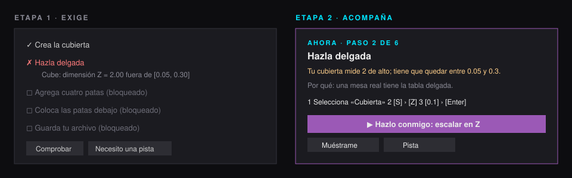
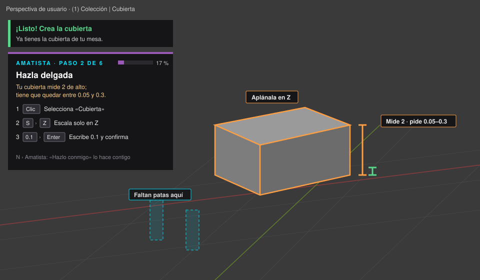

# Etapa 2 · El motor que acompaña (4 de octubre de 2026)

**Estado:** en `main` desde el PR #14 (`d004071`, 3 de octubre de 2026, hora de México).
**Versiones:** motor `amatista_engine` 0.3.0 · add-on «Amatista» 0.3.0 · formato `amatista.practice/1` (sin cambio de versión: todo lo nuevo es opcional) · **sin cambios en Oracle**.

> «Que no solamente te diga “estás menos Z mal” hasta que logres ponerlo, sino que realmente sea intuitivo y te vaya mostrando diálogos en los cuales estás mal, diálogos en los cuales te pueda ayudar, que sea un acompañamiento más que una exigencia. Que te vaya explicando paso a paso qué es lo que tienes que hacer sin necesidad de que estés viendo la tabla.» (Maximiliano, 4 oct 2026)



## Qué cambia para el alumno

| Antes (etapa 1) | Ahora (etapa 2) |
|---|---|
| «Cube: dimensión Z = 2.00 fuera de [0.05, 0.30]». | «Tu cubierta mide 2 de alto; tiene que quedar entre 0.05 y 0.3.» y debajo: Selecciona «Cubierta» · `S` › `Z` · escribe `0.1` › `Enter`. |
| La lista de objetivos era el centro del panel. | El panel muestra **Ahora**: un solo paso, explicado. La lista queda plegada en «Todos los pasos». |
| Nada en la escena. | La vista 3D resalta lo que está bien (verde), lo que hay que cambiar (naranja) y lo que podría servir (neón); dibuja reglas, planos, flechas y **piezas fantasma** donde falta algo. |
| Pistas de texto fijo. | **Hazlo conmigo**: arranca la herramienta correcta sobre el objeto correcto, restringida al eje; el alumno la termina. **Muéstrame**: selecciona, encuadra y resalta. |
| Silencio hasta pulsar Comprobar. | Un **acompañante** felicita cada paso logrado, dice «¡Vas mejor!» cuando se acerca, avisa si algo se rompió y, si el alumno lleva rato, pregunta «¿Te ayudo con este paso?». |
| Un solo modo. | Tres niveles de acompañamiento: **Acompañado**, **Solo tarjeta** y **Silencioso** (igual que la etapa 1). |



## Cómo está hecho

Todo el razonamiento vive en el motor (Python puro, probado sin Blender); el add-on solo dibuja y ejecuta.

```
EvaluationReport ──► build_guidance()  ──► Guidance (qué hacer, teclas, resaltados, señales, acción)
                 └─► Companion.observe() ─► Intervention (paso logrado, nuevo paso, vas mejor, retroceso, ¿te ayudo?)
                                              │
add-on: guia.actualizar() ◄───────────────────┘
   ├─ hud.py       tarjeta del acompañante + avisos que se desvanecen
   ├─ visor3d.py   contornos, regla, plano, fantasmas, flechas y etiquetas
   ├─ dialogos.py  «Así se hace este paso» y «¿Te ayudo con este paso?»
   └─ guia.ejecutar_accion()  «Hazlo conmigo»
```

Referencia completa: [07 · Guía paso a paso y acompañamiento](../referencia/07_guia_y_acompanamiento.md).

### Piezas nuevas

| Archivo | Qué hace |
|---|---|
| `engine/amatista_engine/guide/models.py` | `Guidance`, `GuideInstruction`, `Highlight`, `VisualCue`, `GuideAction`, `Intervention`, `guidance_to_dict`. |
| `engine/amatista_engine/guide/coach.py` | Un entrenador por validador (11) más uno genérico; números redondos (`objetivo_amable`, `factor_amable`, `delta_amable`). |
| `engine/amatista_engine/guide/companion.py` | `Companion` (cuándo hablar) y `distance` (cuánto falta). |
| `engine/amatista_engine/engine.py` | `motor.guide(practica, escena, reporte=None)`. |
| `engine/amatista_engine/models.py`, `practice/` | Campo opcional `guide: {why, steps}` en cada objetivo (hasta 8 pasos, 6 teclas por paso). |
| `practices/blender/level_1/mesa.json` | Versión 2: cada objetivo trae su `guide.why`. |
| `addon/amatista_blender/guia.py` | Estado de la guía en la sesión, avisos, diálogos automáticos, «Hazlo conmigo», registro de ayudas. |
| `addon/amatista_blender/interfaz/hud.py` | La tarjeta pasa a ser el acompañante (paso N de M, teclas dibujadas, avisos). |
| `addon/amatista_blender/interfaz/visor3d.py` | Guía dibujada en la escena (POST_VIEW y POST_PIXEL). |
| `addon/amatista_blender/interfaz/{paneles,dialogos,estilo}.py`, `operadores.py`, `ajustes.py` | Bloque «Ahora», diálogos, teclas, operadores `hazlo_conmigo` y `mostrarme`, preferencias de acompañamiento. |

### Decisiones

- **La guía no evalúa.** Se calcula del mismo reporte; el progreso, los intentos y lo que guarda Oracle no cambian. El servidor sigue reevaluando la foto como en la etapa 1.
- **Hazlo conmigo no lo hace por ti.** Arranca la herramienta en modo interactivo; el alumno mueve el ratón o escribe el número. Así aprende el gesto. Aun así cuenta como guía paso a paso para la autonomía (nivel 3 de pistas); Muéstrame cuenta como una pista.
- **Números amables.** La guía propone valores redondos dentro del rango («escribe 0.1»), nunca el mínimo exacto ni decimales largos.
- **El autor puede escribir la guía, pero no está obligado.** Sin `guide`, el motor genera las instrucciones; con `guide.steps`, se usan las del autor.
- **Una guía nunca rompe la práctica.** Si un entrenador falla, se usa la guía genérica; si la guía falla en el add-on, la evaluación sigue.
- **Sin Oracle nuevo.** Las ayudas usadas viajan en el intento (`ayudas`) como dato informativo; el servidor hoy las ignora. Guardarlas sería una tarea futura con un script 008 aditivo.
- **Respeta a quien no quiere ayuda.** El modo Silencioso deja el add-on como en la etapa 1, y cada parte (diálogos, vista 3D) se apaga por separado.

## Pruebas

- `engine/tests/test_guia.py`: 14 pruebas (números redondos, candidato a cubierta, escena vacía, escalar con `S` `Z` `0.1`, fantasmas de las patas, cuánto bajar una pata, guardar y completar, pasos del autor, JSON, errores de formato, distancia, acompañante por intentos, por tiempo, retroceso y final).
- Motor y add-on con pytest: 43 pruebas.
- `addon/tests/en_blender.py` dentro de `bpy` 5.0.1: además del recorrido de la etapa 1, agrega un cubo con «Hazlo conmigo», le asigna el rol, lo escala a 0.1, comprueba que el paso queda como «con guía», que se cuentan las ayudas y que salen los avisos, y dibuja la guía 3D con un `gpu` simulado (Blender sin interfaz no tiene GPU).

## Cómo probarlo

```bash
python -m pytest engine/tests addon/tests -q
python addon/tests/en_blender.py   # con pip install bpy==5.0.1 (Python 3.11)
```

En un Blender real: instala el `.zip` que arma `addon/herramientas/construir.py`, abre la práctica de la mesa y deja el acompañamiento en «Acompañado».

## Para producción

- La práctica de la mesa sube a la versión 2 (solo agrega `guide`). Después del piloto, registrarla desde `backend/` con `python herramientas/contenido.py practicas --publicar` (o Admin › Prácticas › Registrar y publicar).
- Los alumnos necesitan el add-on 0.3.0: la plataforma arma los paquetes con la versión del repositorio desplegado.
- No hay que ejecutar nada en Oracle.

## Qué sigue (ideas para una etapa 3)

- Guardar las ayudas usadas en Oracle (008 aditivo) y mostrarlas al profesor.
- Entrenadores para los validadores que hoy usan la guía genérica (`mesh.*`, `collection.contains`, cámara y luz).
- Vista web de la guía en el bloque `blender_practice` (la misma `Guidance` en JSON).
- Narración por voz opcional y capturas reales de la guía en un Blender con GPU.
