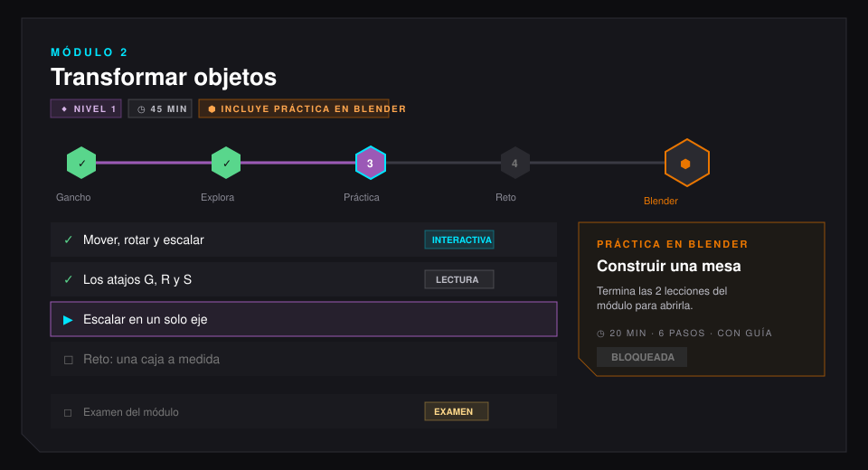

# 02 · Módulos con práctica en Blender

## La regla (v3.2: teoría y Blender intercalados)

**Teoría y Blender se alternan, y el módulo cierra en Blender.** Desde la v3.2 cada módulo de Blender tiene dos estaciones en Blender: una **exploración** corta justo después del gancho, para tocar la herramienta antes de estudiarla, y la **práctica de cierre** al final, que pone en juego todo el módulo. Después de la práctica de cierre solo va el examen (el jefe final).

```
Gancho → [ En Blender: exploración ] → Explora → [ En Blender: práctica de cierre ] → Jefe final
teoría      estación corta, se registra    teoría     proyecto del módulo, se registra     insignia
```

- Las dos estaciones son **lecciones normales** con un bloque `blender_practice` (ver [04](04_herramientas_de_ensenanza.md#práctica-en-blender-blender_practice)). No hay tabla nueva ni campo nuevo en Oracle.
- Ninguna se puede marcar a mano (`allowManual: false`): la plataforma no supone que el alumno está en Blender; solo cuenta lo que registra el add-on conectado.
- El servidor ya no exige que la práctica sea la última lección (eso impedía intercalar). Ahora rechaza que **la misma práctica** aparezca dos veces en un módulo: «la práctica «X» ya está en lessons[i]: cada práctica va una sola vez por módulo». Lo valida `validar_modulo` en `backend/contenido/validacion.py`, así que aplica igual al importar un JSON, al reordenar en el panel y en la CLI.
- En el motor, cada módulo de `practices/blender/cursos.json` declara `explore` y `practice`; `ModuleEntry.sequence` los recorre en ese orden para el desbloqueo y para la pestaña «Mi curso» del add-on.
- El desbloqueo no cambió: las lecciones se abren en orden, así que la práctica se abre cuando el alumno termina la lección anterior.
- Un módulo **sin** práctica sigue siendo válido (los cursos de A-Frame, por ejemplo). En el panel de administración se marca con la etiqueta «Sin práctica en Blender» para que se note.

## Cómo lo ve el alumno



En el mapa del curso (`#/curso/<curso>`), cada módulo muestra:

1. **Encabezado con etiquetas**: nivel, duración, «Incluye práctica en Blender» y «Nuevo · N» si hay lecciones nuevas ([03](03_etiquetas_y_graficos.md)).
2. **La ruta del módulo** (`components/modulo/RutaModulo.jsx`): un nodo por lección con el ícono de su tipo (verde hecha, neón con pulso la actual, gris pendiente) y, al final, un nodo más grande con el cubo de Blender en naranja. Sin progreso (en el panel de administración) muestra solo la estructura.
3. **Las lecciones**, cada una con su etiqueta de tipo (Lectura, Interactiva, Video, Código, Examen).
4. **La estación de Blender** (`components/modulo/EstacionBlender.jsx`) después de las lecciones, con tres estados:

| Estado | Cuándo | Qué dice |
|---|---|---|
| Bloqueada | Faltan lecciones del módulo. | «Termina las N lecciones del módulo para abrirla.» |
| Abierta | Todas las lecciones previas hechas. | «Ya terminaste las lecciones: ahora llévalo a Blender. Amatista te guía paso a paso.» Botón **Practicar ▶** con pulso. |
| Hecha | La práctica está completada. | «¡Práctica completada en Blender!» Botón **Repasar**. |

5. **El examen** (si existe), después de la estación.

### Dentro de la práctica

La lección de práctica muestra la tarjeta del bloque `blender_practice` (`components/leccion/interactivos/PracticaBlender.jsx`):

- Título, duración, los pasos que pide la práctica y un recuadro **Con guía paso a paso** que explica que Amatista acompaña dentro de Blender (etapa 2 del motor).
- **Prepara tu Blender** (`blender/PrepararBlender.jsx`), solo si la cuenta no tiene ninguna computadora conectada:
  1. **Instala Amatista**: descarga el paquete del sistema detectado (Windows, macOS o Linux).
  2. **Abre Blender**: el instalador ya dejó el add-on activo.
  3. **¿Te muestra un código?**: escribirlo ahí mismo conecta la computadora.

  Con una computadora conectada, todo esto se pliega en «Tu Blender está conectado».
- **El ejemplo resuelto**: un desplegable con los pasos de la solución, qué compara Amatista y, con «Ver en código», el bloque `example` de la práctica.
- **Abrir en Blender** (o **Continuar en Blender** si ya se empezó): la plataforma le deja a Blender la orden de abrir la práctica, que se abre en su propia escena. Si Blender está cerrado, la práctica queda como la actual y se abre al conectarse.
- Una línea de estado dice dónde está Blender: «Tu Blender está cerrado…», que está en otra práctica (con el botón «Cambiar a esta práctica») o «Tu Blender está en esta práctica (N %)», con «Enfocar Blender» o «Ver todo Blender» para el modo enfocado.
- Con Blender en esta práctica aparece la tarjeta **Ahora en Blender**: el paso, lo que dice el instructor y la lista «Comparado con el ejemplo · N de M». Sus botones manejan Blender desde la lección: **Comprobar**, **Pista**, **Hazlo conmigo**, **Guardar**, **Empezar de nuevo** (pide confirmación; lo anterior queda en una escena «(anterior)») y **Ver el ejemplo**, que arma el ejemplo resuelto en otra escena. Mientras se ve el ejemplo solo queda **Volver a mi práctica**. Cada botón es una orden de `POST /api/addon/v1/ordenes` (`comprobar`, `pista`, `hazlo_conmigo`, `guardar`, `reiniciar`, `ver_ejemplo`, `volver_practica`) que Blender cumple en su siguiente latido.
- La lección pregunta por Blender cada 3 s cuando está en esta práctica, cada 6 s cuando está en otra y cada 30 s cuando está cerrado. Sin el script Oracle 010 en el servidor no hay estado en vivo y la práctica funciona como antes: el avance se actualiza solo mientras el alumno trabaja en Blender.

### En el panel del alumno

La tarjeta **Tus prácticas en Blender** (`components/panel/BlenderPanel.jsx`) lista la práctica de cada módulo publicado con su estado y un enlace a la lección; abajo, el acceso a **Mi Blender**.

## Cómo se arma un módulo con práctica

1. Crear el módulo con la Fórmula en **Admin › Módulos** (genera Gancho, Explora, Práctica, Reto y Jefe final).
2. Escribir las lecciones con las herramientas de [04](04_herramientas_de_ensenanza.md). Antes de la práctica conviene un **Paso a paso** y unos **Atajos de teclado** con las teclas que pedirá Blender.
3. Crear o elegir la práctica del motor (`practices/…json`, o desde Amatista Author) y publicarla en **Admin › Prácticas de Blender**.
4. Agregar una lección con el bloque **Práctica en Blender** (`blender_practice`) para la exploración (después del gancho) y otra para la práctica de cierre (antes del examen), cada una con el id de su práctica (por ejemplo `blender.bp.m1.explora` y `blender.bp.m1.tren`).
5. Validar y publicar. Si una práctica se repite, el validador dice en qué lección.

Ejemplo real: [`frontend/src/data/modulos/blender_principiante-modulo-1.json`](../../frontend/src/data/modulos/blender_principiante-modulo-1.json): gancho, «En Blender: date una vuelta por la vista 3D», teoría, «Práctica: arma un tren de juguete» y jefe final.

## Código

| Archivo | Qué hace |
|---|---|
| `frontend/src/modulos/practica.js` | Funciones puras: `esPracticaBlender`, `practicaDelModulo`, `partesDelModulo` (antes / práctica / después), `estadoPractica`, `practicasDelCatalogo`. Pruebas en `practica.test.js`. |
| `frontend/src/pages/Curso.jsx` | El mapa del módulo: etiquetas, ruta, lecciones, estación y examen. |
| `frontend/src/components/modulo/` | `RutaModulo.jsx`, `EstacionBlender.jsx`. |
| `frontend/src/blender/PrepararBlender.jsx` | Los tres pasos para conectar Blender dentro de la práctica. |
| `backend/contenido/validacion.py` | `es_practica_blender` y la regla de orden en `validar_modulo`. |
| `backend/api/contenido.py` | El árbol del panel marca cada lección con `practica_blender`. |
