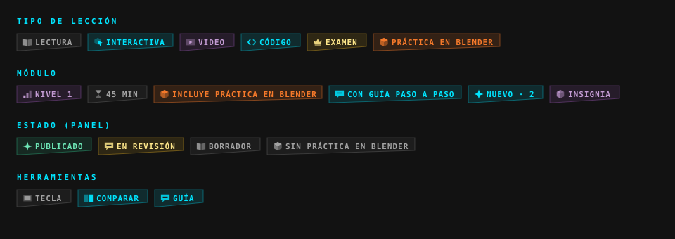

# 03 · Etiquetas y gráficos

Un solo idioma visual para alumnos, profesores y administradores: la misma etiqueta significa lo mismo en el mapa del curso, en la lección, en el panel del alumno y en el panel de administración.



## La etiqueta

Texto corto en mayúsculas monoespaciadas + ícono low poly de 16 px + tono. Lleva el corte diagonal de la identidad de Amatista (`corte-poly-sm`) y un borde interior suave del color del tono.

```jsx
import Etiqueta, { Etiquetas } from '../components/etiquetas/Etiqueta';
import { ETIQUETAS, etiquetaLeccion, etiquetasModulo } from '../components/etiquetas/catalogo';

<Etiqueta {...ETIQUETAS.practica} />                         // una
<Etiquetas lista={etiquetasModulo(contenido, { conPractica: true, nuevas: 2 })} tamano="md" />  // fila
<Etiqueta {...etiquetaLeccion(leccion, esPractica)} />       // tipo de lección
```

Tamaños: `sm` (listas) y `md` (encabezados).

## Tonos

| Tono | Color | Para qué |
|---|---|---|
| `neon` | `#00E5FF` | Lo interactivo y la guía: Interactiva, Código, Con guía paso a paso, Nuevo. |
| `amatista` | `#9B59B6` / `#C39BD3` | Identidad y logros: Nivel, Insignia, Video. |
| `blender` | `#F5792A` | Todo lo que pasa en Blender: Práctica en Blender, Incluye práctica. |
| `exito` | esmeralda | Publicado, completado. |
| `aviso` | ámbar | Examen, En revisión. |
| `gris` | blanco 5 % | Lo neutro: Lectura, duración, Borrador, Sin práctica en Blender. |

## Catálogo

| Grupo | Etiqueta | Ícono | Tono | Dónde se ve |
|---|---|---|---|---|
| Tipo de lección | Lectura | libro abierto | gris | mapa, panel admin |
| | Interactiva | puntero sobre hexágono | neón | mapa, panel admin |
| | Video | pantalla con triángulo | amatista | mapa, panel admin |
| | Código | llaves angulares | neón | mapa, panel admin |
| | Examen | corona del jefe | aviso | mapa, panel admin |
| | Práctica en Blender | cubo de tres caras | blender | mapa, panel admin (gana sobre el tipo) |
| Módulo | Nivel N | tres barras | amatista | encabezado del módulo |
| | N min | reloj de arena | gris | encabezado del módulo |
| | Incluye práctica en Blender | cubo | blender | encabezado del módulo, panel admin |
| | Con guía paso a paso | burbuja de diálogo | neón | tarjeta de práctica |
| | Nuevo · N | destello | neón | encabezado del módulo |
| | Insignia | cristal hexagonal | amatista | encabezado del módulo |
| Estado | Publicado / En revisión / Borrador | destello / burbuja / libro | éxito / aviso / gris | panel admin |
| | Sin práctica en Blender | cubo | gris | panel admin (módulos sin práctica) |
| Herramientas | Tecla, Comparar | tecla / dos mitades | gris / neón | bloques nuevos |

Para agregar una etiqueta: un ícono en `IconosEtiqueta.jsx` (caras planas con `currentColor` y distintas opacidades, `viewBox 0 0 16 16`) y una entrada en `ETIQUETAS` de `catalogo.js`. El SVG de arriba se genera desde esos mismos íconos.

## Gráficos del módulo

| Gráfico | Archivo | Qué muestra |
|---|---|---|
| **Ruta del módulo** | `components/modulo/RutaModulo.jsx` | Un nodo low poly por lección con el ícono de su tipo, unidos por una línea: verde lo hecho, neón con pulso la lección actual, gris lo pendiente. La práctica en Blender es un nodo mayor con el cubo, en naranja. Sin progreso muestra solo la estructura. |
| **Estación de Blender** | `components/modulo/EstacionBlender.jsx` | La tarjeta de la práctica al final del módulo, con estado bloqueada / abierta / hecha, número de pasos, duración y «Guía paso a paso». |
| **Fila de lección** | `pages/Curso.jsx` | Marca de estado (✓, ▶, ◻), título y etiqueta del tipo. La actual va con borde amatista. |
| **Teclas** | `components/leccion/Tecla.jsx` | Teclas con relieve (`Shift` + `D`) y secuencias (`S` › `Z`), usadas por Paso a paso y Atajos. Las mismas que dibuja el add-on en la vista 3D. |

## Gráficos del motor en Blender

La tarjeta del acompañante, las teclas dibujadas y la guía en la escena (contornos verde/naranja/neón, regla, plano, fantasmas, flechas) están documentadas en [docs/motor/referencia/07](../motor/referencia/07_guia_y_acompanamiento.md). Usan los mismos colores: neón para la guía, amatista para la identidad, naranja para «hay que cambiarlo», verde para «ya está».
