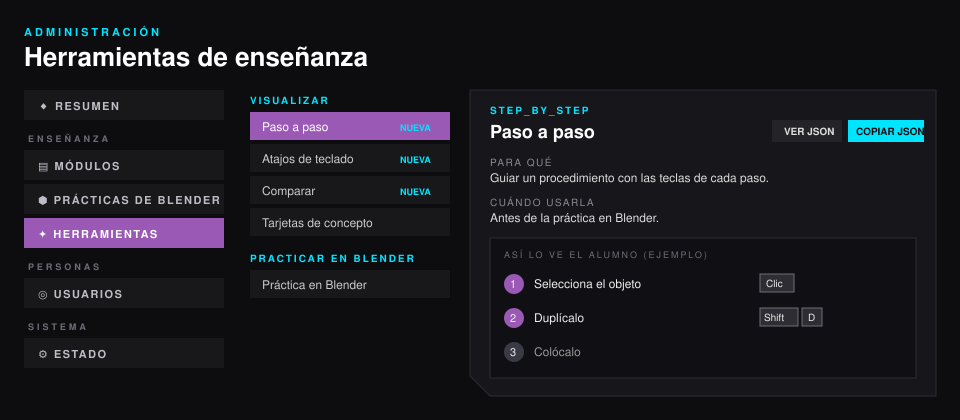

# 04 · Herramientas de enseñanza

Una lección de Amatista se arma con **bloques** (`contentBlocks`). Cada bloque es una herramienta: explica, visualiza, hace practicar o lleva a Blender. Hay **22**; dos son nuevas en la v3.6 (Visor de malla y Diagrama de nodos, ver [07 Herramientas gráficas](07_herramientas_graficas.md) §8). El examen del módulo es un tipo de lección aparte (`type: "exam"` con `quizData`).

- **En el panel**: *Admin › Enseñanza › Herramientas* (`#/admin/herramientas`) muestra cada una con para qué sirve, cuándo usarla, en qué paso de la Fórmula encaja, la vista previa tal como la ve el alumno y su JSON para copiar. En el editor de lecciones, **Agregar bloque** las agrupa con las mismas categorías.
- **La forma exacta** la valida el servidor (`backend/contenido/validacion.py`); los ejemplos son los de `backend/contenido/plantillas.py` (`GET /api/contenido/plantillas`). Si un campo está mal, el error dice dónde: «contentBlocks[2] (shortcuts): «items[0].keys» debe ser una lista de 1 a 6 teclas».
- **El catálogo del frontend** (nombres, categorías, textos de ayuda) está en `frontend/src/data/herramientas.js`.



## Resumen

| Categoría | Herramienta | `type` | Para qué | Fórmula |
|---|---|---|---|---|
| Explicar | Texto | `markdown_text` | Explicar con párrafos cortos, listas y negritas. | Explora |
| | Imagen | `image` | Mostrar una captura o ilustración con su pie. | Gancho, Explora |
| | Video | `video_player` | Ver una herramienta en movimiento (menos de 3 min). | Explora |
| | Aviso | `callout` | Un consejo, dato o error típico (una vez por lección). | Reto |
| | Código | `code_snippet` | Código con colores y botón de copiar. | Explora |
| Visualizar | **Paso a paso** *(nueva)* | `step_by_step` | Un procedimiento paso por paso, con las teclas de cada paso. | Explora, Práctica |
| | Atajos de teclado | `shortcuts` | Los atajos del módulo y un modo «Pruébate» para practicarlos. | Práctica |
| | Comparar | `compare` | Dos cosas lado a lado (bien/mal, antes/después). | Explora, Reto |
| | **Visor de malla** *(nueva)* | `mesh_viewer` | Girar una malla y seleccionar vértices, aristas o caras (1, 2, 3) como en el Modo Edición. | Gancho, Explora |
| | **Diagrama de nodos** *(nueva)* | `node_graph` | Un árbol de nodos de Blender que se recorre nodo por nodo. | Explora |
| | Tarjetas de concepto | `concept_cards` | Descubrir 3 a 6 términos volteando tarjetas. | Explora |
| | Línea de tiempo | `timeline` | Hechos o etapas en el tiempo. | Explora |
| | Pipeline | `pipeline` | Un proceso como cadena de etapas. | Explora |
| | Capas | `layers` | Algo que se construye por capas. | Explora |
| Practicar en el navegador | Pregunta rápida | `quiz_inline` | Comprobar una idea y explicar la respuesta. | Gancho, Práctica |
| | Ordenar | `ordering` | Poner pasos en orden. | Práctica, Reto |
| | Emparejar | `matching` | Unir conceptos con definición, tecla o imagen. | Explora |
| | Completar | `fill_blanks` | Completar huecos en texto o código. | Práctica |
| | Puntos en imagen | `hotspots` | Encontrar zonas en una captura de la interfaz. | Gancho |
| | Explorador 3D | `scene_explorer` | Girar y modificar una figura 3D en el navegador. | Explora |
| | Reto de código | `code_challenge` | Escribir código que se comprueba solo. | Práctica, Reto |
| Practicar en Blender | Práctica en Blender | `blender_practice` | La práctica del motor, guiada dentro de Blender. Cierra el módulo. | Reto |

Los bloques de **Practicar** cuentan como actividades: la lección se da por resuelta cuando el alumno las completa.

## Cómo combinarlas

- Una idea por lección y como máximo 10 minutos; una interacción cada dos bloques de texto (ritmo de la Fórmula).
- **Antes de la práctica en Blender**, el camino recomendado es: Paso a paso (el procedimiento) → Atajos de teclado con «Pruébate» (las teclas) → Comparar (el error típico) → Práctica en Blender. Así el alumno llega a Blender sabiendo qué hará y con qué teclas, y el motor lo acompaña con las mismas teclas dibujadas.
- Si un texto pasa de 6 líneas, conviene convertirlo en un gráfico (Paso a paso, Pipeline, Capas, Comparar).

## Teclas: `keys` y `then`

Paso a paso y Atajos de teclado comparten la forma de escribir teclas:

- `keys`: lo que se pulsa **a la vez**, de 1 a 6 teclas: `["Shift", "D"]`.
- `then` (opcional): lo que se pulsa **después**: escalar solo en Z es `{"keys": ["S"], "then": ["Z"]}` y se dibuja `S` › `Z`.

Los nombres son libres (hasta 20 caracteres): `Ctrl`, `Shift`, `Alt`, `Tab`, `Enter`, `Supr`, `Clic`, `Rueda`, letras y números. En el modo «Pruébate» solo se practican los atajos sin `then` (las secuencias se muestran pero no se piden).

## Herramientas nuevas en detalle

### Visor de malla (`mesh_viewer`)

Una malla low poly en SVG (sin WebGL). El alumno la gira arrastrando o con las flechas y selecciona vértices, aristas o caras con 1, 2 y 3 (como en el Modo Edición); Z cambia entre sólido y alambre. El panel de la esquina cuenta como el de Estadísticas de Blender.

| Campo | Obligatorio | Qué es |
|---|---|---|
| `title` | no | Título. |
| `shape` | sí | `cube`, `plane`, `cylinder`, `cone`, `uv_sphere`, `ico_sphere`, `torus` o `custom`. |
| `segments` | no | Lados del cilindro y del cono (16), segmentos de la esfera UV (16) y del toroide (24); de 3 a 64. |
| `rings` | no | Anillos de la esfera UV (8) y del toroide (8); de 3 a 24. Nunca pasa de 600 caras. |
| `subdivisions` | no | Subdivisiones de la icoesfera (2), de 1 a 3, como en Blender. |
| `mode` | no | Modo inicial: `vertex` (por defecto), `edge` o `face`. |
| `wireframe` | no | `true` para empezar en alambre. |
| `mesh` | con `custom` | `{vertices: [[x, y, z], …], faces: [[0, 1, 2, 3], …]}`, Z hacia arriba, hasta 400 vértices y 600 caras. |
| `caption` | no | Qué hacer con la malla. |

```json
{"type": "mesh_viewer", "title": "Vértices, aristas y caras", "shape": "cube", "mode": "vertex",
 "caption": "Gira el cubo y cuenta: 8 vértices, 12 aristas y 6 caras."}
```

### Diagrama de nodos (`node_graph`)

Un árbol de nodos con los colores de Blender. Los nodos se acomodan solos en columnas siguiendo los enlaces (`col` fija una columna a mano). Al tocar un nodo se lee su `note`; «Recorrer el flujo» los explica en orden.

| Campo | Obligatorio | Qué es |
|---|---|---|
| `title`, `caption` | no | Título y nota al pie. |
| `nodes` | sí | De 1 a 12: `{id, title, kind, inputs?, outputs?, note?, col?}`. `kind`: `input`, `output`, `shader`, `texture`, `color`, `vector`, `converter`, `geometry`, `group` o `layout` (da el color del encabezado). `title` hasta 28 caracteres. |
| `inputs`, `outputs` | no | Hasta 8 conectores `{id, label, socket, value?}`. `socket`: `float`, `int`, `boolean`, `vector`, `color`, `shader`, `geometry`, `string`, `object` o `material`. `value` (solo entradas) se muestra en el campo, como `0.5`. |
| `links` | no | Hasta 24 `{from: "nodo.salida", to: "nodo.entrada"}`. Una entrada recibe un solo enlace y no puede haber ciclos. |

```json
{"type": "node_graph", "title": "Un material con textura",
 "nodes": [
  {"id": "ruido", "kind": "texture", "title": "Noise Texture", "outputs": [{"id": "color", "label": "Color", "socket": "color"}]},
  {"id": "bsdf", "kind": "shader", "title": "Principled BSDF", "outputs": [{"id": "bsdf", "label": "BSDF", "socket": "shader"}],
   "inputs": [{"id": "base", "label": "Base Color", "socket": "color"}, {"id": "rough", "label": "Roughness", "socket": "float", "value": 0.5}]},
  {"id": "salida", "kind": "output", "title": "Material Output", "inputs": [{"id": "surface", "label": "Surface", "socket": "shader"}]}],
 "links": [{"from": "ruido.color", "to": "bsdf.base"}, {"from": "bsdf.bsdf", "to": "salida.surface"}]}
```


### Paso a paso (`step_by_step`)

Una lista numerada de pasos con título, explicación, teclas e imagen opcional. El alumno avanza a su ritmo con **Siguiente**, de a un paso (la misma idea que la guía del add-on).

| Campo | Obligatorio | Qué es |
|---|---|---|
| `title` | no | Título del procedimiento. |
| `steps` | sí | 1 a 12 pasos. |
| `steps[].title` | sí | El paso en pocas palabras. |
| `steps[].text` | no | La explicación. |
| `steps[].keys`, `steps[].then` | no | Las teclas del paso. |
| `steps[].image`, `steps[].alt` | no | Captura del paso (con `image`, `alt` es obligatorio). |

```json
{"type": "step_by_step", "title": "Duplicar un objeto", "steps": [
  {"title": "Selecciona el objeto", "text": "Haz clic sobre él en la vista 3D.", "keys": ["Clic"]},
  {"title": "Duplícalo", "text": "La copia queda pegada al ratón.", "keys": ["Shift", "D"]},
  {"title": "Colócalo", "text": "Mueve el ratón y haz clic para dejarlo.", "keys": ["Clic"]}
]}
```

### Atajos de teclado (`shortcuts`)

Tabla de atajos con su acción. Con `practice: true` aparece **Pruébate**: la pantalla pide una acción («Escalar») y el alumno pulsa el atajo en su teclado; la tarjeta cuenta cuántos lleva seguidos.

| Campo | Obligatorio | Qué es |
|---|---|---|
| `title` | no | Título. |
| `items` | sí | 1 a 24 atajos. |
| `items[].keys` | sí | Teclas (y `then` para secuencias). |
| `items[].action` | sí | Qué hace. |
| `practice` | no | `true` para mostrar «Pruébate». |

```json
{"type": "shortcuts", "title": "Atajos para transformar", "practice": true, "items": [
  {"keys": ["G"], "action": "Mover"}, {"keys": ["R"], "action": "Rotar"},
  {"keys": ["S"], "action": "Escalar"}, {"keys": ["S"], "then": ["Z"], "action": "Escalar solo en Z"}
]}
```

### Comparar (`compare`)

Dos lados con etiqueta, imagen o texto. En `columns` van lado a lado (en el celular, uno sobre otro); en `slider` se superponen dos imágenes y un deslizador descubre una u otra.

| Campo | Obligatorio | Qué es |
|---|---|---|
| `title` | no | Título. |
| `before`, `after` | sí | `{label, image?, alt?, text?}`; cada lado necesita `image` o `text` (con `image`, `alt` es obligatorio). |
| `mode` | no | `columns` (por defecto) o `slider` (necesita `image` en los dos lados). |
| `caption` | no | Nota al pie. |

```json
{"type": "compare", "title": "Antes y después", "mode": "columns",
 "before": {"label": "Antes", "text": "Un cubo de 2 × 2 × 2."},
 "after": {"label": "Después", "text": "La cubierta: ancha y delgada (2 × 1 × 0.1)."}}
```

### Práctica en Blender (`blender_practice`)

No es nueva, pero cambió su lugar: cada módulo lleva dos, una exploración corta después del gancho y la práctica de cierre antes del examen ([02](02_modulos_y_practica.md)). La tarjeta muestra el ejemplo resuelto de la práctica y, con Blender abierto, la maneja desde la lección («Ahora en Blender»).

| Campo | Obligatorio | Qué es |
|---|---|---|
| `id` | sí | Id del bloque dentro de la lección. |
| `practica` | sí | Id de la práctica del motor (por ejemplo `blender.bp.m1.tren`). Debe estar publicada en Admin › Prácticas de Blender. |
| `title` | sí | Título de la tarjeta. |
| `text` | no | Presentación (hasta 2000 caracteres). |
| `minutes` | no | Duración estimada (1 a 240). |
| `steps` | no | Hasta 30 textos con los pasos que se verán. |
| `allowManual` | sí | `true` deja marcarla como hecha sin Blender (para quien no puede instalarlo); por defecto `false`. |

## Las demás herramientas (campos)

| `type` | Campos (obligatorios en **negrita**) |
|---|---|
| `markdown_text` | **`body`** (Markdown) |
| `image` | **`src`**, **`alt`**, `caption` |
| `video_player` | **`url`** |
| `callout` | **`body`**, `title`, `variant` (`dato` o `reto`) |
| `code_snippet` | **`code`**, `language`, `preview` |
| `concept_cards` | **`items`** (1 a 12: **`term`**, **`definition`**, `image` + `alt`); términos sin repetir |
| `timeline` | `title`, **`items`** (1 a 20: **`title`**, **`text`**, `icon`, `year`) |
| `pipeline` | `title`, **`steps`** (1 a 20: **`title`**, **`text`**, `icon`) |
| `layers` | `title`, **`items`** (1 a 20: **`title`**, **`text`**, `icon`), `footer` |
| `quiz_inline` | **`id`**, **`question`**, **`options`** (2 a 6: **`id`**, **`text`**, **`isCorrect`**), `explanation` |
| `ordering` | **`id`**, **`prompt`**, **`items`** (3 a 8: **`id`**, **`text`**, en el orden correcto), `explanation` |
| `matching` | **`id`**, **`prompt`**, **`pairs`** (2 a 8: **`id`**, **`left`**, **`right`**), `explanation` |
| `fill_blanks` | **`id`**, **`prompt`**, **`template`** (huecos `[[respuesta\|otra]]`), `code`, `explanation` |
| `hotspots` | **`id`**, **`src`**, **`alt`**, **`points`** (1 a 10: **`id`**, **`x`**, **`y`** en %, **`title`**, **`text`**) |
| `scene_explorer` | **`id`**, `title`, **`primitive`** (`sphere`, `box`, `cylinder`, `cone`, `torus`, `icosahedron`), **`controls`** (`param`, `label`, `type` range/color/toggle, `min`, `max`, `step`, `default`), `goal` |
| `code_challenge` | **`id`**, **`prompt`**, **`language`** (`html`), **`starter`**, **`checks`** (1 a 20: **`selector`**, `attr`, `contains`, `min`, `equals`, **`text`**), `solution`, `preview` |

Para agregar una herramienta nueva: validador en `validacion.py` (`REVISORES`), ejemplo en `plantillas.py` (`EJEMPLOS_BLOQUES`), componente en `frontend/src/components/leccion/` registrado en `BloqueContenido.jsx`, entrada en `frontend/src/data/herramientas.js` y una fila en este documento.
